<!--
author:   CK-12

email:    LiaScript@web.de

version:  0.0.1

language: en

narrator: US English Female

comment:  CK-12 Algebra Explorations is a hands-on series of activities that guides students from Pre-K to Grade 7 through algebraic concepts.

logo:     ../cover.jpg

tags:      algebra activities, algebra, mathematics

-->

# Algebra Explorations Concepts, Pre-K through Grade 7

> This document was automatically translated to LiaScript from
>
> https://www.ck12.org/book/algebra-explorations-concepts-pre-k-through-grade-7/

## 1.0 CK-12 Algebra Explorations Concepts, Pre-Kindergarten

<article>

Introduction
------------

In these concepts, you will be introduced to the basic concepts of algebra and will practice your problem solving skills. There are five concepts, and each one focuses on a key algebraic thinking strategy. You will focus on describing, solving, and checking your thinking.

</article>

### 1.1 Picture Graphs

<article>

What do you see in the picture graph below? Can you say who has more or less? In this Concept, we will practice looking at picture graphs and describing what we see by counting and using comparison words like **more** and **less**.

When looking at a picture graph like the one above we see different stacks of objects. In order to describe what we see we can say what object it is. We can also count how many objects are in each stack. We can also compare the stacks and say which one has more or less.

#### Looking at Picture Graphs 

1. Look at this picture graph:

You should see some red balloons and some yellow balloons. The red balloons belong to Bob. It says Bob under the stack of red balloons. The yellow balloons are Ann's. It says Ann under the stack of yellow balloons.

_Who has more balloons?_

You should see that there are more red balloons. Bob has more balloons because Bob has the red balloons.

_Who has less balloons?_

You should see that there are less yellow balloons. Ann has less balloons because Ann has the yellow balloons.

_How many red balloons does Bob have?_

Try counting starting from the top balloon. Put your finger on each balloon as you count. You should count 3 red balloons.

_How many yellow balloons does Ann have?_

Try counting starting from the top balloon. Put your finger on each balloon as you count. You should count 1 yellow balloon.

2. Look at this picture graph:

You should see two stacks of yoyos. One stack has red yoyos. The other stack has blue yoyos. The red yoyos belong to Rich. The blue yoyos belong to Nan.

_How many red yoyos belong to Rich?_

Try counting starting from the top yoyo. Put your finger on each yoyo as you count. You should count 4 red yoyos.

_How many blue yoyos belong to Nan?_

Try counting starting from the top yoyo. Put your finger on each yoyo as you count. You should count 4 blue yoyos.

_Rich and Nan have the same number of yoyos. How can you tell by looking at the stacks?_

You should notice that the two stacks are the same height. That's why Rich and Nan have the same number of yoyos.

#### Earlier Problem Revisited

### Vocabulary

To have **_more_** means to have a greater amount. To have **_less_** means to have a smaller amount. In the picture below, there are **_more_** red balloons. There are **_less_** yellow balloons.

#### Example 1

What do you see? Who has the most crayons? Who has the least crayons? How many crayons does each person have?

\[Figure 6\] 

There are three stacks of crayons. One stack has purple crayons. One stack has red crayons. One stack has brown crayons. Al has the most crayons. He has 5 red crayons. Larry has the least crayons. Larry has 1 brown crayon. Sue has 3 purple crayons.

#### Example 2

What do you see? Who has the most beach balls? How many beach balls does each person have? Do any stacks have the same number of beach balls? How do you know?

\[Figure 7\] 

There are three stacks of beach balls. One stack has pink beach balls. One stack has blue beach balls. One stack has yellow beach balls. Nina has the most beach balls. Nina has 5 yellow beach balls. Ron and Sonia have the same number of beach balls. Ron has pink beach balls and Sonia has blue beach balls. They each have 2 beach balls. Their stacks are the same height.

#### Example 3

What do you see? Who has the most puzzles? Who has the least puzzles? How many puzzles does each person have?

\[Figure 8\] 

There are three names, but only two stacks of puzzles. Sandy has the most puzzles. She has 4 puzzles. Eric has the least puzzles, he has 0 puzzles. The other stack of puzzles belongs to Greg. Greg has 2 puzzles.

### Review 

For problems 1, 2, and 3: Look at the picture. What do you see? Who has the most? Who has the least? Do any people have the same number?

1.  \[Figure 9\]
2.  \[Figure 10\]
3.  \[Figure 11\]
4.  Mike and Lisa have squares. Mike has red squares and Lisa has blue squares. Mike has more squares than Lisa. Draw a picture graph that matches this description.
5.  Mark, Samantha, and Rose have stuffed animals. Mark has less stuffed animals than Rose. Samantha has the same number of stuffed animals as Rose. Draw a picture graph that matches this description.

</article>

### 1.2 Train Cars

<article>

Do you notice a pattern in the train cars below? Can you fill in the missing cars? In this section , we will practice describing the patterns we see in pictures and completing the patterns.

When looking at a picture like the picture of the train cars above, sometimes we can look for a pattern. When looking for a pattern, read the colors aloud and see if you notice any set of colors happening more than once. After you figure out the pattern, you can fill in the blank cars so that they match the pattern.

#### Patterns 

1. Look at the train cars below and describe what you see. Do you notice a pattern?

_What colors should the blank train cars be?_

In order to fit with the pattern, the blank train cars should be Red, Blue, and then Yellow. Check that the pattern sounds right by naming all the colors of the cars aloud.

2. Look at the train cars below and describe what you see. Do you notice a pattern?

_What colors should the blank train cars be?_

In order to fit with the pattern, the blank train cars should be Yellow, Yellow, and then Red. Check that the pattern sounds right by naming all the colors of the cars aloud.

#### Earlier Problem Revisited

### Vocabulary

One type of **_pattern_** is when certain characteristics (like color) get repeated many times in the same order. The train cars below have a pattern in their colors. The colors Red, Blue, and then Yellow repeat three times.

For each set of train cars below, describe the pattern. Then, fill in the colors for the blank cars. Finally, read the colors of all the cars aloud to check that your solution sounds right.

#### Example 1

\[Figure 6\] 

In this set of train cars, the colors Yellow, Yellow, Blue, Blue are repeated. In order to fit with the pattern, the blank cars should be Yellow, Yellow, Blue.

#### Example 2

\[Figure 7\] 

In this set of train cars, the colors Red, Blue, Blue, Yellow are repeated. In order to fit with the pattern, the blank cars should be Red, Blue, Blue.

#### Example 3

### Review 

For each set of train cars below, describe the pattern. Then, fill in the colors for the blank cars. Finally, read the colors of all the cars aloud to check that your solution sounds right.

1.  \[Figure 9\]
2.  \[Figure 10\]
3.  \[Figure 11\]
4.  \[Figure 12\]
5.  \[Figure 13\]

</article>

### 1.3 Teeter Tottering

<article>

Can you tell which animal is heavier in the picture below? Can you tell which animal is lighter? In this section, we will practice describing what we see and identifying what is heavier and what is lighter.

When looking at a picture of a teeter totter like the picture above, we will often see that one side is on the ground and one side is not. This tells us which object on the teeter totter is heavier and which object is lighter. The side of the teeter totter that is on the ground will have the heavier object on it. The side of the teeter totter that is not on the ground will have the lighter object on it.

#### Describing Pictures 

1. Look at the picture below and describe what you see:

_Who is heavier?_

You should notice that Robbie is heavier.

_How can you tell from the picture?_

You can tell because the rabbit’s side is lower because he weighs more.

2. Look at the picture below and describe what you see:

_These two animals weigh the same. How can you tell from the picture?_

You can tell because the teeter totter is level. Neither of the sides are lower than the other.

#### Earlier Problem Revisited

### Vocabulary

One object is **_heavier_** than another object if it weighs more. One object is **_lighter_** than another object if it weighs less. We can compare the weights of objects by looking at them on a teeter totter.

### Examples 

For each teeter totter below, describe what you see. Then, identify which animal is heavier, which animal is lighter, or if the two animals weigh the same amount. Explain how you can tell from the picture.

#### Example 1

#### Example 2

#### Example 3

### Review 

For each teeter totter below, describe what you see. Then, identify which animal is heavier, which animal is lighter, or if the two animals weigh the same amount. Explain how you can tell from the picture.

1.  \[Figure 8\]
2.  \[Figure 9\]
3.  \[Figure 10\]
4.  \[Figure 11\]
5.  Draw your own picture of a teeter totter that shows two animals weighing the same amount.
6.  Draw your own picture of a teeter totter that shows one animal weighing more than another animal. Circle the animal that is heavier.

</article>

### 1.4 Packing Bags

<article>

Can you describe what you see in the picture below? What if you put the same shapes that are in the filled bag into the empty bags? How many of each shape would you now have? In this section, we will practice describing what we see and counting shapes.

When looking at bags like in the picture above, we can see that one bag is filled and the other bags are empty. We can fill the empty bags the same way as the filled bag. Then, we can count to see how many of each shape we have in total.

1. Look _at the picture below. What do you see?_

_The bag with shapes in it is Ann’s bag. Use your shape tiles. Put 1 triangle into the empty bag. Put 2 circles into the empty bag. Now, count the shapes. How many circles in all? How many triangles in all?_

You should have 4 circles in all and 2 triangles in all.

2. Look _at the picture below. What do you see?_

_The bag with the shapes in it is Ted’s bag. Use your shape tiles. Put 2 triangles into the empty bag. Put 1 circle into the empty bag. Put 1 square into the empty bag. Count the shapes. How many triangles in all? How many circles in all? How many squares in all?_

You should have 4 triangles in all, 2 circles in all, and 2 squares in all.

#### Earlier Problem Revisited

### Vocabulary

This is a **_circle:_** ")

\[Figure 6\]

This is a **_triangle:_** 

For each set of bags below, describe what you see. Then, fill the empty bag(s) with the same shapes that are in the filled bag. Last, count how many of each shape you have in all.

#### Example 1

You should notice 3 bags. One bag has 2 square, 2 triangles, and 1 circle. The other 2 bags are empty. If you put 2 squares, 2 triangles, and 1 circle in each empty bag, you will have 6 squares in all, 6 triangles in all, and 3 circles in all.

\[Figure 8\] 

#### Example 2

You should notice 3 bags. One bag has 3 circles, 1 triangle, and 1 square. The other 2 bags are empty. If you put 3 circles, 1 triangle, and 1 square into each empty bag, you will have 9 circles in all, 3 triangles in all, and 3 squares in all.

You should notice 4 bags. One bag has 2 triangles, 1 circle, and 2 squares. The other 3 bags are empty. If you put 2 triangles, 1 circle, and 2 squares into each empty bag, you will have 8 triangles in all, 4 circles in all, and 8 squares in all.

\[Figure 10\] 

### Review 

For each set of bags below, describe what you see. Then, fill the empty bag(s) with the same shapes that are in the filled bag. Last, count how many of each shape you have in all.

1.  \[Figure 11\]
2.  \[Figure 12\]
3.  \[Figure 13\]
4.  \[Figure 14\]
5.  What if there had been two empty bags in #1 instead of just one empty bag? If you filled all of the empty bags, how many of each shape would there be?
6.  What if there had been three empty bags in #1 instead of just one empty bag? If you filled all of the empty bags, how many of each shape would there be?
7.  What if there had been four empty bags in #1 instead of just one empty bag? If you filled all of the empty bags, how many of each shape would there be?

</article>

### 1.5 Using Clues

<article>

Can you match a description or a clue with a picture? If you know that Mr. Rippledandy is one of the pictures below and Mr. Rippledandy has a hat, can you say who Mr. Rippledandy might be? In this section, we will practice using clues to identify characters.

When looking at a set of similar pictures like the faces above, we need clues to figure out which picture is correct. For each clue, see which pictures match the clue. The correct picture will be the one that matches all of the clues.

1. Look at the pictures below. Peter Palooka's pumpkin has a triangle nose. Which pumpkins match this clue?

Peter’s pumpkin has a mouth. Which pumpkin is Peter Palooka’s pumpkin?

Pumpkin B must be Peter Palooka's pumpkin because pumpkin B is the only pumpkin with both a triangle nose and a mouth.

2. Look at the pictures below. Mr. Liketysplitity’s Umbrella has 2 circles. Which umbrellas might be Mr. Liketysplitity’s?

Mr. Liketysplitity’s umbrella has one triangle. Which umbrella is Mr. Liketysplitity’s umbrella?

Umbrella A must be Mr. Liketysplitity’s umbrella because umbrella A is the only umbrella with both 2 circles and one triangle.

#### Earlier Problem Revisited

### Vocabulary

A **clue** is a piece of information that helps us to solve a puzzle or mystery. When we use clues, we are using deductive reasoning.

### Examples 

#### Example 1

Mr. Bobbity’s Book has 1 snake on the cover. His book has 3 spiders on the cover. Which book is Mr. Bobbity’s book?

#### Example 2

Anna’s Balloon has one dot. Her balloon has 4 stars. Which balloon is Anna’s balloon?

#### Example 3

Mrs. Starglitter’s Purse has 2 stripes. Her purse has 5 squares. Which purse is Mrs. Starglitter’s purse?

### Review 

1. Mrs. Sillysue’s Mask has a yellow nose. Her mask has a green mouth. Which mask is Mrs. Sillysue's mask?

\[Figure 12\]

</article>

## 2.0 CK-12 Algebra Explorations Concepts, Kindergarten

<article>

Introduction
------------

In these concepts, you will continue to develop the basic concepts of algebra and will practice your problem solving skills. There are six concepts, and each one focuses on a key algebraic thinking strategy. You will focus on describing, solving, and checking your thinking.

</article>

### 2.1 Number Towers

<article>

What do you notice in the number tower below? What if you wanted to move the numbers in the cloud to the number tower so that the numbers were in order? In this section, we will practice using deductive reasoning to fill in missing numbers.

When looking at a number tower and cloud like the ones above, we can fill in the number tower by moving numbers from the cloud to the tower. We want the numbers in order so the least number is on the top and the greatest number is on the bottom. We can start at the top and find the smallest number and put it at the top of the number tower under the 3. Continue until we have filled in the whole number tower.

1. Use the numbers in the clouds. Fill in cubes with numbers. The least number is on the top and the greatest is on the bottom.

")

\[Figure 3\]

2. Use the numbers in the clouds. Fill in cubes with numbers. The least number is on the top and the greatest is on the bottom.

")

\[Figure 5\]

3. Use the numbers in the clouds. Fill in cubes with numbers. The least number is on the top and the greatest is on the bottom.

")

\[Figure 7\]

#### Earlier Problem Revisited

The **_least number_** is the smallest number. The **_greatest number_** is the biggest number. In the set of numbers {1, 6, 3, 9, 7}, 1 is the least number and 9 is the greatest number.

### Examples 

Use the numbers in the clouds. Fill in cubes with numbers. The least number is on the top and the greatest is on the bottom.

#### Example 1

")

\[Figure 11\]

#### Example 2

")

\[Figure 13\]

#### Example 3

Use the numbers in the clouds. Fill in cubes with numbers. The least number is on the top and the greatest is on the bottom.

1.  \[Figure 16\]
2.  \[Figure 17\]
3.  \[Figure 18\]
4.  \[Figure 19\]
5.  \[Figure 20\]

</article>

### 2.2 Straws and Glasses

<article>

Can you draw 5  in each glass? Then can you count to figure out how many straws in all? Can you count by 5s? In this section, we will practice drawing straws and then counting by 2s or 5s to figure out how many we have.

### Straws and Glasses 

Once you have drawn in straws like in the problem above, there are many ways to count how many we have. Since there are 5 straws in each glass, one way to count all of the straws is to count by 5s. If we put 2 straws in each glass, we could count all of the straws by counting by 2s.

1. Look at the picture below:

_Draw 2_ _in the glass._

Your picture should look like this: 

_Count the straws. How many straws in all?_

You should see that there are 2 straws in all.

2. Look at the picture below:

_Draw 2_ _in each glass._

Your picture should look like this: 

_Count the straws. How many straws in all?_

You should see that there are 4 straws in all. We can count by 2s ("2, 4") to get our answer.

3. Look at the picture below:

_Draw 2_ _in each glass._

Your picture should look like this: 

_Count the straws. How many straws in all?_

You should see that there are 8 straws in all. We can count by 2s ("2, 4, 6, 8") to get our answer.

#### Earlier Concept Problem Revisited

Once we draw 5 straws in each glass, our glasses look like this.

We can count by 5s to figure out how many straws there are in all. When we count like 5s it sounds like "5, 10, 15." There are 15 straws in all.

### Vocabulary

**_Counting by 2s_** is when you count objects in groups of 2. When you count this way, it sounds like "2, 4, 6, 8, 10, ...". **_Counting by 5s_** is when you count objects in groups of 5. When you count this way, it sounds like "5, 10, 15, 20, 25, ...".

### Examples 

Draw 5  in each glass. Count the straws. How many straws in all?

#### Example 1

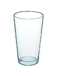

\_\_\_\_\_\_\_\_\_\_\_\_\_\_\_\_ **straws in all**

There are 5 straws in all.

****

#### **Example 2**

\_\_\_\_\_\_\_\_\_\_\_\_\_\_\_\_ **straws in all**

There are 10 straws in all.

#### Example 3

\_\_\_\_\_\_\_\_\_\_\_\_\_\_\_\_ **straws in all**

There are 20 straws in all.

### Review 

Draw 2  in each glass. Count the straws. How many straws in all?

1.  
2.  
3.  

Draw 5  in each glass. Count the straws. How many straws in all?

4.  
5.  

</article>

### 2.3 Teeter Totter

<article>

Can you tell which animals weigh the same? Can you tell which animal weighs the least? In this section, we will look at sets of teeter totters with animals on them and compare the weights of the animals.

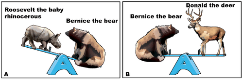

When looking at a set of teeter totters like the one above, we learn different things from each picture. If the teeter totter is level, then we know that those two animals weigh the same. If the teeter totter is not level, then we know that the side lower to the ground has the animal that weighs more. We can combine this information to compare the weights of all three animals.

1. Look at the picture below. What do you see?

_Which two animals weigh the same?_

You should see that the teeter totter is level in Picture A, so Cynthia and Bob weigh the same.

_Which animal weighs more in Picture B? How can you tell from the picture?_

You should notice that Leonard the lion weighs more because the lion side of the teeter totter is lower.

_Who weighs the most?_

Leonard the lion because the squirrel and the bat weigh the same. The lion weighs more than the squirrel, so he also weighs more than the bat. The lion weighs the most.

2. Look at the picture below. What do you see?

_Which picture shows that Kit the cat weighs less than Donald the dog? How can you tell from the picture?_

We can see that Kit weighs less than Donald from picture B. This is because Donald the dog is on the bottom of the teeter totter and Kit the cat is on the higher side.

_Which picture shows that Rafael the Raccoon weighs the same as Donald the Dog? How can you tell from the picture?_

We can see that Rafael weighs the same as Donald from picture A because the teeter totter is not tipped.

_Who weighs the least? How did you decide?_

Kit the cat because the cat weighs less than the dog. Since the raccoon and the dog weigh the same, the cat also weighs less than the raccoon.

#### Earlier Problem Revisited

You should see Roosevelt the rhinoceros, Donald the deer and Bernice the bear on teeter totters. We can see the Roosevelt the rhinoceros weighs less than Bernice the bear from picture A. We can see that Roosevelt the rhinoceros weighs the same as Donald the deer from picture B. Roosevelt the rhinoceros weighs the least because he weighs less than Bernice the bear and Bernice the bear weighs the same as Donald the deer. So Roosevelt the rhinoceros weighs less than Donald the deer. Roosevelt weighs the least.

### Vocabulary

To **_weigh more_** means to be **_heavier_**. To **_weigh less_** means to be **_lighter_**. We can compare the weights of objects by looking at them on a teeter totter.

### Examples

Describe what you see in the picture.

We see Horace the hippo, Ollie the otter and Wally the walrus on teeter totters. 

#### Example 2

Which two animals weigh the same? Which picture shows that they weigh the same?

Wally the walrus and Horace the hippo, which we see in picture B. 

#### Example 3

Which animal weighs less than Horace the hippo? How can you tell from the picture?

Ollie the otter because Ollie's side of the teeter totter is higher.

#### Example 4

Who weighs the least? How can you tell?

Ollie the otter since the walrus weighs the same as the hippo, and the hippo weighs more than the otter, then the walrus weighs more than the otter. So the otter weighs the least.

### Review 

2.  Which two animals weigh the same? Which picture shows that they weigh the same?
3.  Which animal weighs more than Orly the Otter? How can you tell from the picture?
4.  Who weighs the most? How can you tell?

6.  Which two animals weigh the same? Which picture shows that they weigh the same?
7.  Which animal weighs less than Robbie the Rabbit? How can you tell from the picture?
8.  Who weighs the least? How can you tell?

</article>

### 2.4 T-Shirt Mystery

<article>

Can you use clues to solve a mystery? If we know the following clues about Pansy Pelican’s t-shirt, can we figure out which t-shirt is Pansy Pelican's?

Pansy Pelican's t-shirt has:

* **Three shapes with exactly 4 sides**
* **Two shapes with 6 corners**
* **One circle**

Here are the possible t-shirts:

\[Figure 1\]\[Figure 2\]\[Figure 3\]\[Figure 4\]

### T-Shirt Mystery 

In order to solve a mystery like the one above, we can use clues. First, read the first clue. See which t-shirts match the first clue. Then, read the second clue. See which t-shirts match the second clue. Continue as you go through all clues. The correct t-shirt will be the only one that works with all the clues.

1. Look at the t-shirts below. We want to figure out which t-shirt belongs to Lucy Goosie.

\[Figure 5\]\[Figure 6\]\[Figure 7\]\[Figure 8\]

_Our first clue is that Lucy Goosie's t-shirt has one square. Which t-shirts could be Lucy Goosie's?_

You should notice that t-shirts A, C, and D all have one square. Any of those t-shirts could be Lucy Goosie's.

_Our second clue is that Lucy Goosie's t-shirt has a shape with 3 sides on it. Which of the remaining t-shirts could be Lucy Goosie's?_

You should notice that t-shirts A and D have shapes with 3 sides on them. Either of those t-shirts could be Lucy Goosie's.

_Our last clue is that Lucy Goosie's t-shirt has one shape with exactly 5 corners on it. Which t-shirt is Lucy Goosie's?_

You should notice that t-shirt D must be Lucy Goosie's. It is the only one between t-shirt A and D with a shape with exactly 5 corners on it.

2. Look at the t-shirts below. We want to figure out which t-shirt belongs to Edna Elephant.

\[Figure 9\]\[Figure 10\]\[Figure 11\]\[Figure 12\]

_Our first clue is that Edna Elephant's t-shirt has one shape with exactly 4 sides on it. Which t-shirts could be Edna Elephant's?_

You should notice that t-shirts B, and C all have one shape with exactly 4 sides on it. Either of those t-shirts could be Edna Elephant's.

_Our second clue is that Edna Elephant's t-shirt has two shapes with 3 corners on it. Which of the remaining t-shirts could be Edna Elephant's?_

You should notice that both t-shirts B and C have shapes with 3 corners on them. Either of those t-shirts could be Edna Elephant's.

_Our last clue is that Edna Elephant's t-shirt has exactly one circle. Which t-shirt is Edna Elephant's_

You should notice that t-shirt B must be Edna Elephant's. It is the only one between t-shirt B and C with exactly one circle on it.

#### Earlier Problem Revisited

**Which T-shirt belongs to Pansy Pelican?**

\[Figure 13\]\[Figure 14\]\[Figure 15\]\[Figure 16\]

**Clues: Pansy Pelican’s T-shirt has:**

* **Three shapes with exactly 4 sides**
* **Two shapes with 6 corners**
* **One circle**

From the first clue we know that Pansy Pelican's t-shirt must be either B, C, or D. From the second clue we know that her t-shirt must be either B or C. From the third clue we know that her t-shirt must be t-shirt C. Pansy Pelican's t-shirt is C.

### Vocabulary

A **_clue_** is a piece of information that helps us to solve a puzzle or mystery. When we use clues, we are using **_deductive reasoning_**.

### Example

#### Example 1

**Which T-shirt belongs to Sam Snake?**

\[Figure 17\]\[Figure 18\]\[Figure 19\]\[Figure 20\]

**Clues: Sam Snake’s T-shirt has:**

* **Only one shape with exactly 5 corners**
* **Only one shape with 4 sides**
* **No triangles**

From the first clue we know that Sam Snake's t-shirt must be either A or B. From the second clue we still know that his t-shirt must be either A or B. From the third clue we know that his t-shirt must be t-shirt A. Sam Snake's t-shirt is A.

### Review 

1. Which T-shirt belongs to Katey Kitty?

\[Figure 21\]\[Figure 22\]\[Figure 23\]\[Figure 24\]

Clues: Katey Kitty’s T-shirt has:

* Only one shape with exactly 4 sides
* Exactly two triangles
* Exactly one circle

2. Which T-shirt belongs to Orly Otter?

\[Figure 25\]\[Figure 26\]\[Figure 27\]\[Figure 28\]

Clues: Orly Otter’s T-shirt has:

* Exactly 5 shapes
* Only one shape with exactly 4 sides
* Exactly two triangles

3. Which T-shirt belongs to Andrea Aardvark?

\[Figure 29\]\[Figure 30\]\[Figure 31\]\[Figure 32\]

Clues: Andrea Aardvark’s T-shirt has:

* Exactly one triangle
* Exactly three shapes
* Only one shape with exactly 4 sides

4. Which T-shirt belongs to Bernice Bear?

\[Figure 33\]\[Figure 34\]\[Figure 35\]\[Figure 36\]

Clues: Bernice Bear’s T-shirt has:

* Only one shape with exactly 4 sides
* Only one shape with exactly 5 sides
* Exactly one triangle

5. Which T-shirt belongs to Lester Lion?

\[Figure 37\]\[Figure 38\]\[Figure 39\]\[Figure 40\]

Clues: Lester Lion’s T-shirt has:

* Two shapes with 6 sides
* No triangles
* Exactly three shapes with 4 sides

</article>

### 2.5 Sports Balls

<article>

The graph below shows the number of tennis balls that four different people have. Can you tell who has the most tennis balls? Can you tell who has the least tennis balls? Can you use the graph to figure out how many tennis balls each person has? In this earlier, we will learn how to interpret picture graphs.

In order to answer questions like the ones above about who has greatest number of sports balls and who has the least number of sports balls we can use the picture graph. The person with the greatest number of sports balls will have the highest stack. The person with the least number of sports balls will have the shortest stack. In order to figure out exactly how many sports balls each person has, we can count the number of sports balls in their stack.

1. Look at the picture graph below. This picture graph shows four students and the ping pong balls they have. The circles stand for ping pong balls. The students are Todd, Dina, Matt, Carol.

You should see that Matt has 1 ping pong ball by counting the number of balls in his stack.

_How can you tell from the graph that Matt has the least number of ping pong balls?_

You can tell because his stack is the shortest.

_Todd and Carol have the same number of ping pong balls. How many ping pong balls do they each have? Color their ping pong balls yellow._

You should see that Todd and Carol each have 3 ping pong balls.

_How can you tell from the graph that Todd and Carol have the same number of ping pong balls?_

You can tell because their stacks are the same height.

_Dina has the greatest number of ping pong balls. How many ping pong balls does she have? Color Dina’s ping pong balls red._

You should see that Dina has 5 ping pong balls.

_How can you tell from the graph that Dina has the greatest number of ping pong balls?_

You can tell because her stack is the highest. Here is a graph that has been colored.

Roz has zero basketballs. You can tell because there are no circles above her name.

_Who has the greatest number of basketballs? How many basketballs does that person have? Color this person's basketballs red_

Jeff has the greatest number of basketballs. He has 6 basketballs.

_Pedro has 2 less basketballs than Jeff. How many basketballs does Pedro have? Color Pedro’s basketballs green._

Pedro has 4 basketballs.

_Cindy has 2 more basketballs than Roz. How many basketballs does Cindy have? Color Cindy’s basketballs yellow._

Cindy has 2 basketballs. Here is a graph that has been colored.

From looking at the graph we can see that Bob has the greatest number of tennis balls because his stack is the highest. Bob has 6 tennis balls. We will color Bob’s tennis balls green.

We can also tell from looking at the graph that Ann has the least number of tennis balls because her stack is the shortest. Ann has 2 tennis balls. We will color Ann's tennis balls yellow.

Sam has one more tennis ball than Ann, so Sam has 3 tennis balls. We will color Sam's tennis balls blue.

Ella has 5 tennis balls. We will color Ella's tennis balls red.

Here is what the graph looks like once it has been colored.

To have **_more_** means to have a greater amount. The person with the **_most_** has the greatest amount. To have **_less_** means to have a smaller amount. To have the **_least_** means to have the smallest amount. In the picture below, Bob has the most tennis balls and Ann has the least tennis balls.

This picture graph shows four students and the golf balls they have. The circles stand for golf balls. The students are Ang, Beth, Don, Eric.

Who has the greatest number of golf balls? How many golf balls does this person have? Color this person's golf balls red.

Eric has the greatest number of golf balls. Eric has 8 golf balls.

#### Example 2

Don has 6 less golf balls than Eric. How many golf balls does Don have? Color Don’s golf balls yellow.

Don has 2 golf balls. 

#### Example 3

Beth has twice as many golf balls as Don. How many golf balls does Beth have? Color Beth’s golf balls blue.

Beth has 4 golf balls.

#### Example 4

Ang has 3 more golf balls than Beth. How many golf balls does Ang have? Color Ang’s golf balls green.

Ang has 7 golf balls.

This picture graph shows four students and the baseballs they have. The circles stand for baseballs. The students are Rochelle, Beth, Dan, and Rose.

2.  Beth has 3 less baseballs than Rose. How many baseballs does Beth have? Color Beth’s baseballs yellow.
3.  Dan has 2 less baseballs than Beth. How many baseballs does Dan have? Color Dan’s baseballs blue.
4.  Rochelle has one more baseball than Beth. How many baseballs does Rochelle have? Color Rochelle’s baseballs green.

This picture graph shows four students and the kickballs they have. The circles stand for kickballs. The students are Amanda, Tyler, Dan, and Nicole.

6.  Amanda and Tyler have the same number of kickballs. How many do they each have? Color Amanda's kickballs blue and Tyler's kickballs yellow.
7.  Dan has 2 less kickballs than Tyler. How many kickballs does Dan have? Color Dan’s kickballs green.

</article>

### 2.6 Peculiar Patterns

<article>

Can you describe the pattern with the letters below? Can you write the next two rows of the pattern? In this concept, we will practice identifying patterns and extending them.

**T M T**

**T N N T**

**T O O O T**

### Peculiar Patterns

When identifying a letter pattern like the one above, the first thing we should do is describe anything we notice. For example, each line in the pattern has one more letter. Also, each line has a T at the beginning and at the end. Then, try to figure out what is changing from one line to the next.

1. Complete the next two rows.

Write the letters.

**K**

**K L**

**K L M**

**K** \_\_\_\_\_\_\_\_\_\_\_\_\_\_\_\_

**K** \_\_\_\_\_\_\_\_\_\_\_\_\_\_\_\_

Each row in the pattern has one more letter. The letters are in the sequence of the alphabet. The fourth row should be KLMN. The fifth row should be KLMNO.

2. Complete the next two rows.

Write the letters.

**C D**

**C D E**

**C D E F**

\_\_\_\_\_\_\_\_\_\_\_\_\_\_\_\_

\_\_\_\_\_\_\_\_\_\_\_\_\_\_\_\_

Each row in the pattern has one more letter. The rows always start with C, and then the letters are in the order of the alphabet. The fourth row should be CDEFG. The fifth row should be CDEFGH. 

3. Complete the next two rows.

Write the letters.

**F G H**

**F G H I**

**F G H I J**

\_\_\_\_\_\_\_\_\_\_\_\_\_\_\_\_

\_\_\_\_\_\_\_\_\_\_\_\_\_\_\_\_

Each row in the pattern has one more letter. The rows always start with F, and then the letters are in the order of the alphabet. The fourth row should be FGHIJK. The fifth row should be FGHIJKL.

#### Earlier Problem Revisited

We saw the following pattern in the Concept section.

**T M T**

**T N N T**

**T O O O T**

In this pattern, each row has one more letter. Also, each row begins and ends with a T. In the middle of the T's, the number of letters goes up by 1 for each row. The letters in the middle of the T's are the next letter in the alphabet, starting with M.

The fourth row should be TPPPPT. The fifth row should be TQQQQQT.

### Vocabulary

One type of **_pattern_** is when a characteristic (like letters) appear in a certain order. In the letter pattern below, each row has the next letter of the alphabet at the end.

**C D**

**C D E**

**C D E F**

### Examples 

#### Example 1

Complete the next two rows. Write the letters.

__**A B**__

**E** \_\_\_\_\_\_\_\_\_\_\_\_\_\_\_\_\_\_\_

DEEEE; EFFFF

#### Example 2

Complete the next two rows. Write the letters.

__**E E F**__

\_\_\_\_\_\_\_\_\_\_\_\_\_\_\_\_\_\_\_

KKL; MMN

#### Example 3

Complete the next two rows.Write the letters.

__**S O D**__

\_\_\_\_\_\_\_\_\_\_\_\_\_\_\_\_\_\_\_

SOOOOD; SOOOOOD

### Review 

1. Complete the next two rows. Write the letters.

__**X Y Z Z**__

**X** \_\_\_\_\_\_\_\_\_\_\_\_\_\_\_\_\_\_\_

2. Complete the next two rows. Write the letters.

__**M O O N**__

**M**\_\_\_\_\_\_\_\_\_\_\_\_\_\_\_\_\_\_\_

3. Complete the next two rows. Write the letters.

__**R A R**__

**R** \_\_\_\_\_\_\_\_\_\_\_\_\_\_\_\_

4. Complete the next two rows. Write the letters.

__**A B B**__

\_\_\_\_\_\_\_\_\_\_\_\_\_\_\_\_\_\_\_

5. Complete the next two rows. Write the letters.

__**C A T**__

\_\_\_\_\_\_\_\_\_\_\_\_\_\_\_\_\_\_\_

</article>

## 3.0 CK-12 Algebra Explorations Concepts, Grade 1

<article>

Introduction
------------

In these concepts, you will be introduced to six key concepts of algebra and will practice your problem solving skills. There are six concepts, and each one focuses on a key algebraic thinking strategy. You will focus on describing, identifying your job, planning, solving, and checking your thinking.

</article>

### 3.1 Balance the Pans

<article>

You have lots of these boxes. If you wanted to make the pans balance, which boxes will you use? Can you solve this problem in more than one way?

In order to balance pans like the one above, use the problem solving steps to help you.

* First, **describe** what you see and what information you are given.
* Next, identify what **your job** is and what you are trying to solve. In all of these problems, your job will be to figure out which boxes to put in the pan. You want to make sure that the weight of each pan is the same.
* Third, make a **plan** for how you will solve.
* Fourth, **solve** the problem.
* Last, **check** your answer by making sure that the combinations of boxes you found add up to the amount that you needed.

For the problem above, since the right side weighs 9 pounds, you want to make sure the left side will also weigh 9 pounds.

1. You have lots of these boxes.

Make the pans balance.

Which boxes will you use?

Can you do it another way?

We will use the problem solving steps to solve this problem.

$$
\begin{align*}
& \mathbf{Describe:} && \text{There are 2 pans.}\\
&&& \text{One pan holds a box. The box weighs 8 pounds.}\\
&&& \text{The other pan is empty.}\\
&&& \text{Box}\ A \ \text{weighs 4 pounds.}\\
&&& \text{Box}\ B \ \text{weighs 2 pounds.}\\
&&& \text{There are lots of boxes.}\\
& \mathbf{My \ Job:} && \text{Figure out which boxes to put in the pan.}\\
&&& \text{The boxes have to weigh 8 pounds in all.}\\
& \mathbf{Plan:} && \text{Try to make 8 pounds using}\ \text{A} \ \text{boxes only.}\\
&&& \text{Try using}\  B \ \text{boxes only.}\\
&&& \text{Try using both}\  A \ \text{and}\ B \ \text{boxes.}\\
&\mathbf{Solve:} && \text{These will make the pans balance:}\\
&&& 2 \ A \ \text{boxes weigh 8 pounds.}\\
&&& 4 \ B \ \text{boxes weigh 8 pounds.}\\
&&& \text{One}\ A \ \text{box and}\ 2 \ B \ \text{boxes weigh 8 pounds.}\\
& \mathbf{Check:} && 4 + 4 = 8\\
&&& 2 + 2 + 2 + 2 = 8\\
&&& 4 + 2 + 2 = 8
\end{align*}
$$

2. You have lots of these boxes.

Make the pans balance.

Which boxes will you use?

Can you do it another way?

We will use the problem solving steps to solve this problem.

$$
\begin{align*}
& \mathbf{Describe:} && \text{There are 2 pans.}\\
&&& \text{One pan holds a box. The box weighs 6 pounds.}\\
&&& \text{The other pan is empty.}\\
&&& \text{Box}\ C \ \text{weighs 3 pounds.}\\
&&& \text{Box}\ D \ \text{weighs 1 pound.}\\
&&& \text{There are lots of boxes.}\\
& \mathbf{My \ Job:} && \text{Figure out which boxes to put in the pan.}\\
&&& \text{The boxes have to weigh 6 pounds in all.}\\
& \mathbf{Plan:} && \text{Try to make 6 pounds using}\ \text{C} \ \text{boxes only.}\\
&&& \text{Try using}\  D \ \text{boxes only.}\\
&&& \text{Try using both}\  C \ \text{and}\ D \ \text{boxes.}\\
&\mathbf{Solve:} && \text{These will make the pans balance:}\\
&&& 2 \ C \ \text{boxes weigh 6 pounds.}\\
&&& 6 \ D \ \text{boxes weigh 6 pounds.}\\
&&& \text{One}\ C \ \text{box and}\ 3 \ D \ \text{boxes weigh 6 pounds.}\\
& \mathbf{Check:} && 3 + 3 = 6\\
&&& 1 + 1 + 1 + 1 + 1 + 1 = 6\\
&&& 3 + 1 + 1 + 1 = 6
\end{align*}
$$

#### Earlier Problem Revisited

$$
\begin{align*}
& \mathbf{Describe:} && \text{There are 2 pans.}\\
&&& \text{One pan holds a box. The box weighs 9 pounds.}\\
&&& \text{The other pan is empty.}\\
&&& \text{Box}\ E \ \text{weighs 2 pounds.}\\
&&& \text{Box}\ F \ \text{weighs 3 pounds.}\\
&&& \text{There are lots of boxes.}\\
& \mathbf{My \ Job:} && \text{Figure out which boxes to put in the pan.}\\
&&& \text{The boxes have to weigh 9 pounds in all.}\\
& \mathbf{Plan:} && \text{Try to make 9 pounds using}\ \text{E} \ \text{boxes only.}\\
&&& \text{Try using}\  F \ \text{boxes only.}\\
&&& \text{Try using both}\  E \ \text{and}\ F \ \text{boxes.}\\
&\mathbf{Solve:} && \text{These will make the pans balance:}\\
&&& \text{No number of E boxes weigh 9 pounds.}\\
&&& 3 \ F \ \text{boxes weigh 9 pounds.}\\
&&& \text{One}\ F \ \text{box and}\ 3 \ E \ \text{boxes weigh 9 pounds.}\\
& \mathbf{Check:} && 3 + 3 +3 = 9\\
&&& 3 + 2 + 2 + 2 = 9
\end{align*}
$$

### Vocabulary

To be **_equal_** means to be the same. In this concept, we are trying to make weights equal. This means we are trying to make each side of the pan balance have the same weight.

### Examples

For each problem below, use the problem solving steps. Your job is to put boxes in the empty pan to make the pans balance. Can you solve the problem in more than one way?

#### Example 1

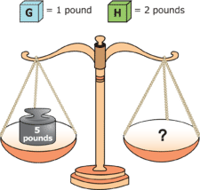
\begin{align*}
& \mathbf{Describe:} && \text{There are 2 pans.}\\
&&& \text{One pan holds a box. The box weighs 5 pounds.}\\
&&& \text{The other pan is empty.}\\
&&& \text{Box}\ G \ \text{weighs 1 pounds.}\\
&&& \text{Box}\ H \ \text{weighs 2 pounds.}\\
&&& \text{There are lots of boxes.}\\
& \mathbf{My \ Job:} && \text{Figure out which boxes to put in the pan.}\\
&&& \text{The boxes have to weigh 5 pounds in all.}\\
& \mathbf{Plan:} && \text{Try to make 5 pounds using}\ \text{G} \ \text{boxes only.}\\
&&& \text{Try using}\  H \ \text{boxes only.}\\
&&& \text{Try using both}\  G \ \text{and}\ H \ \text{boxes.}\\
&\mathbf{Solve:} && \text{These will make the pans balance:}\\
&&& 5 \ G \ \text{boxes weigh 5 pounds.}\\
&&& \text{no number of H boxes weigh 5 pounds.}\\
&&& \text{3}\ G \ \text{boxes and}\ 1 \ H \ \text{box weighs 5 pounds.}\\
&&& \text{1}\ G \ \text{box and}\ 2 \ H \ \text{boxes weighs 5 pounds.}\\
& \mathbf{Check:} && 1 + 1 + 1 + 1 + 1 = 5\\
&&& 1 + 2 + 2 = 5\\
&&& 1 + 1 + 1 + 2 = 5
\end{align*}
$$

#### Example 2

\begin{align*}
& \mathbf{Describe:} && \text{There are 2 pans.}\\
&&& \text{One pan holds a box. The box weighs 10 pounds.}\\
&&& \text{The other pan is empty.}\\
&&& \text{Box}\ I \ \text{weighs 4 pounds.}\\
&&& \text{Box}\ J \ \text{weighs 2 pounds.}\\
&&& \text{There are lots of boxes.}\\
& \mathbf{My \ Job:} && \text{Figure out which boxes to put in the pan.}\\
&&& \text{The boxes have to weigh 10 pounds in all.}\\
& \mathbf{Plan:} && \text{Try to make 10 pounds using}\ \text{I} \ \text{boxes only.}\\
&&& \text{Try using}\  J \ \text{boxes only.}\\
&&& \text{Try using both}\  I \ \text{and}\ J \ \text{boxes.}\\
&\mathbf{Solve:} && \text{These will make the pans balance:}\\
&&& \text{no number of I boxes boxes weigh 10 pounds.}\\
&&& 5 \ J \ \text{boxes weigh 10 pounds.}\\
&&& \text{One}\ I \ \text{box and}\ 3 \ J \ \text{boxes weigh 10 pounds.}\\
&&& \text{Two}\ I \ \text{boxes and}\ 1 \ J \ \text{box weigh 10 pounds.}\\
& \mathbf{Check:} && 2 + 2 + 2 + 2 + 2 = 10\\
&&& 4 + 2 + 2 + 2 = 10\\
&&& 4 + 4 + 2 = 10
\end{align*}
$$

#### Example 2

\begin{align*}
& \mathbf{Describe:} && \text{There are 2 pans.}\\
&&& \text{One pan holds a box. The box weighs 15 pounds.}\\
&&& \text{The other pan is empty.}\\
&&& \text{Box}\ P \ \text{weighs 3 pounds.}\\
&&& \text{Box}\ Q \ \text{weighs 6 pounds.}\\
&&& \text{There are lots of boxes.}\\
& \mathbf{My \ Job:} && \text{Figure out which boxes to put in the pan.}\\
&&& \text{The boxes have to weigh 15 pounds in all.}\\
& \mathbf{Plan:} && \text{Try to make 15 pounds using}\ \text{P} \ \text{boxes only.}\\
&&& \text{Try using}\  Q \ \text{boxes only.}\\
&&& \text{Try using both}\  P \ \text{and}\ Q \ \text{boxes.}\\
&\mathbf{Solve:} && \text{These will make the pans balance:}\\
&&& \text{no number of Q boxes boxes weigh 15 pounds.}\\
&&& 5 \ P \ \text{boxes weigh 15 pounds.}\\
&&& \text{1}\ P \ \text{box and}\ 2 \ Q \ \text{boxes weigh 15 pounds.}\\
&&& \text{3}\ P \ \text{boxes and}\ 1 \ Q \ \text{box weigh 15 pounds.}\\
& \mathbf{Check:} && 3 + 3 + 3 + 3 + 3= 15\\
&&& 3 + 6 + 6 = 15\\
&&& 3 + 3 + 3 + 6 = 15
\end{align*}
$$

### Review 

For each problem below, use the problem solving steps. Your job is to put boxes in the empty pan to make the pans balance. Can you solve the problem in more than one way?

1.  \[Figure 8\]
2.  \[Figure 9\]
3.  \[Figure 10\]
4.  \[Figure 11\]
5.  \[Figure 12\]

</article>

### 3.2 How Many Pounds

<article>

Look at the pictures below.

")

\[Figure 2\]

Can you figure out the total number of pounds for the scale in the third picture (C)? In this section, we will practice finding the total weight of collections of blocks.

### How Many Pounds 

In order to solve the problem above, use the problem solving steps.

* Start by **describing** what information is given.
* Then, identify what **your job** is. In these problems, your job will be to figure out the total weight of the blocks in the third scale.
* Next, make a **plan** for how you will solve. In these problems, write the weight of each block on the block and then add the weights together to find the total weight.
* Then, **solve** the problem.
* Finally, **check** your solution.

1. Figure out the total number of pounds. Write the number on the scale.

")

\[Figure 4\]

We can use the problem solving steps to help us with this problem.

$$
\begin{align*}
& \mathbf{Describe:} && \text{Three scales with blocks.}\\
&&& \mathbf{1st:} \ \text{the orange shape is} \ 5 \ \text{pounds.}\\
&&& \mathbf{2nd:} \ \text{the green shape is} \ 2 \ \text{pounds.}\\
&&& \mathbf{3rd:} \ \text{one orange shape and} \ 1 \ \text{green shape. No number of pounds.}\\
& \mathbf{My \ Job:} && \text{Figure out the total number of pounds for the third scale.}\\
& \mathbf{Plan:} && \text{Write the numbers of pounds on the blocks on the third scale}.\\
&&& \text{Add to figure out the total number of pounds.}\\
& \mathbf{Solve:} && \text{There are 5 pounds for the orange shape and 2 pounds for the green shape}.\\
& \mathbf{Check: } && \ 5 + 2 = 7
\end{align*}
$$

2. Figure out the total number of pounds. Write the number on the scale.

")

\[Figure 6\]

We can use the problem solving steps to help us with this problem.

$$
\begin{align*}
& \mathbf{Describe:} && \text{Three scales with blocks.}\\
&&& \mathbf{1st:} \ \text{the orange shape is} \ 5 \ \text{pounds.}\\
&&& \mathbf{2nd:} \ \text{the green shape is} \ 2 \ \text{pounds.}\\
&&& \mathbf{3rd:} \ \text{one orange shape and} \ 3 \ \text{green shapes. No number of pounds.}\\
& \mathbf{My \ Job:} && \text{Figure out the total number of pounds for the third scale.}\\
& \mathbf{Plan:} && \text{Write the numbers of pounds on the blocks on the third scale}.\\
&&& \text{Add to figure out the total number of pounds.}\\
& \mathbf{Solve:} && \text{There are 5 pounds for the orange shape and 2 pounds for the green shapes}.\\
& \mathbf{Check: } && \ 5 + 2 + 2 + 2 = 11
\end{align*}
$$

3. Figure out the total number of pounds. Write the number on the scale.

")

\[Figure 8\]

We can use the problem solving steps to help us with this problem.

$$
\begin{align*}
& \mathbf{Describe:} && \text{Three scales with blocks.}\\
&&& \mathbf{1st:} \ \text{the orange shape is} \ 5 \ \text{pounds.}\\
&&& \mathbf{2nd:} \ \text{the green shape is} \ 2 \ \text{pounds.}\\
&&& \mathbf{3rd:} \ \text{2 orange shapes and} \ 2 \ \text{green shapes. No number of pounds.}\\
& \mathbf{My \ Job:} && \text{Figure out the total number of pounds for the third scale.}\\
& \mathbf{Plan:} && \text{Write the numbers of pounds on the blocks on the third scale}.\\
&&& \text{Add to figure out the total number of pounds.}\\
& \mathbf{Solve:} && \text{There are 5 pounds for the orange shapes and 2 pounds for the green shapes}.\\
& \mathbf{Check: } && \ 5 + 5 + 2 + 2 = 14
\end{align*}
$$

#### Earlier Problem Revisited

")

\[Figure 10\]

We can use the problem solving steps to help us with this problem.

$$
\begin{align*}
& \mathbf{Describe:} && \text{Three scales with blocks.}\\
&&& \mathbf{A:} \ \text{one cube is} \ 4 \ \text{pounds.}\\
&&& \mathbf{B:} \ \text{one cylinder is} \ 2 \ \text{pounds.}\\
&&& \mathbf{C:} \ \text{one cube and} \ 2 \ \text{cylinders. No number of pounds.}\\
& \mathbf{My \ Job:} && \text{Figure out the total number of pounds for scale} \ C.\\
& \mathbf{Plan:} && \text{Write the numbers of pounds on the blocks on} \ C.\\
&&& \text{Add to figure out the total number of pounds.}\\
& \mathbf{Solve:}
\end{align*}
$$

### Vocabulary

**_Substitution_** is when you replace one object or value with an equal object or value. In this concept, we used substitution when we recorded the weight of each block on the actual block.

### Examples 

#### Example 1

#### \[Figure 13\]

20 pounds

#### Example 2

#### \[Figure 14\]

18 pounds

#### Example 3

#### \[Figure 15\]

22 pounds

### Review 

Use the following picture for problems 1-3.

1.  \[Figure 17\]
2.  \[Figure 18\]
3.  \[Figure 19\]

Use the following picture for problems 4-6.

4.  \[Figure 21\]
5.  \[Figure 22\]
6.  \[Figure 23\]

Use the following picture for problems 7-9.

7.  \[Figure 25\]
8.  \[Figure 26\]
9.  \[Figure 27\]

Use the following picture for problems 10-12.

10. \[Figure 29\]
11. \[Figure 30\]
12. \[Figure 31\]

</article>

### 3.3 Circles and Arrows 1

<article>

Can you figure out the value of each letter in the diagram below? In this section, we will use problem solving steps to help us find the value of letters in circles and arrows diagrams.

In order to solve the problem above, use the problem solving steps.

* Start by **describing** what you see in the diagram.
* Next, figure out what **your job** is in the problem. In all of these problems your job will be to figure out the value of the two letters in the diagram.
* Then, make a **plan** for how you will solve. There is usually more than one way to solve the problem. You will want to figure out one letter first and then the next letter.
* Next, **solve** the problem.
* Finally, **check** to make sure that the values you found work for all four of the arrows.

1. Figure out the value of each letter.

$$
\begin{align*}
& \mathbf{Describe:} && \text{Two rows and two columns with numbers and letters.}\\
&&& \text{Arrows point to sums.}\\
& \mathbf{My \ Job:} && \text{Figure out the values of letters} \ C \ \text{and} \ D.\\
& \mathbf{Plan:} && \text{Start with the first column. Solve for} \ C.\\
&&& \text{Then figure out} \ D.\\
& \mathbf{Solve:} && C+C=6, \ \text{so} \ C=3,\\
&&& \text{In the first row,} \ C+D=4\\
&&& \text{Replace} \ C \ \text{with} \ 3.\\
&&& \text{Then} \ 3+D=4. \ D=4-3, \ \text{or} \ 1.\\
& \mathbf{Check:} && \text{Replace all} \ C\text{s with} \ 3.\\
&&& \text{Replace all} \ D\text{s with} \ 1.\\
&&& \text{Add rows and columns. Check the sums.}\\
&&& \text{Row} \ 1: 3+1=4 \qquad \text{Column} \ 1: 3+3=6\\
&&& \text{Row} \ 2: 3+2=5 \qquad \text{Column} \ 2: 1+2=3
\end{align*}
$$

2. Figure out the value of each letter.

$$
\begin{align*}
& \mathbf{Describe:} && \text{Two rows and two columns with numbers and letters.}\\
&&& \text{Arrows point to sums.}\\
& \mathbf{My \ Job:} && \text{Figure out the values of letters} \ E \ \text{and} \ F.\\
& \mathbf{Plan:} && \text{Start with the second row. Solve for} \ F.\\
&&& \text{Then figure out} \ E.\\
& \mathbf{Solve:} && F+F=4, \ \text{so} \ F=2,\\
&&& \text{In the first column,} \ E+F=7\\
&&& \text{Replace} \ F \ \text{with} \ 2.\\
&&& \text{Then} \ E+2=7. \ E=7-2, \ \text{or} \ 5.\\
& \mathbf{Check:} && \text{Replace all} \ E\text{s with} \ 5.\\
&&& \text{Replace all} \ F\text{s with} \ 2.\\
&&& \text{Add rows and columns. Check the sums.}\\
&&& \text{Row} \ 1: 5+1=6 \qquad \text{Column} \ 1: 5+2=7\\
&&& \text{Row} \ 2: 2+2=4 \qquad \text{Column} \ 2: 1+2=3
\end{align*}
$$

3. Figure out the value of each letter.

$$
\begin{align*}
& \mathbf{Describe:} && \text{Two rows and two columns with numbers and letters.}\\
&&& \text{Arrows point to sums.}\\
& \mathbf{My \ Job:} && \text{Figure out the values of letters} \ G \ \text{and} \ H.\\
& \mathbf{Plan:} && \text{Start with the second column. Solve for} \ G.\\
&&& \text{Then figure out} \ H.\\
& \mathbf{Solve:} && G+G=8, \ \text{so} \ G=4,\\
&&& \text{In the first column,} \ 3+H=4\\
&&& \text{Then} \ H=4-3, \ \text{or} \ 1.\\
& \mathbf{Check:} && \text{Replace all} \ H\text{s with} \ 1.\\
&&& \text{Replace all} \ G\text{s with} \ 4.\\
&&& \text{Add rows and columns. Check the sums.}\\
&&& \text{Row} \ 1: 3+4=7 \qquad \text{Column} \ 1: 3+1=4\\
&&& \text{Row} \ 2: 1+4=5 \qquad \text{Column} \ 2: 4+4=8
\end{align*}
$$

#### Earlier Problem Revisited

$$
\begin{align*}
& \mathbf{Describe:} && \text{Two rows and two columns with numbers and letters.}\\
&&& \text{Arrows point to sums.}\\
& \mathbf{My \ Job:} && \text{Figure out the values of letters} \ A \ \text{and} \ B.\\
& \mathbf{Plan:} && \text{Start with the first row. Solve for} \ A.\\
&&& \text{Then figure out} \ B.\\
& \mathbf{Solve:} && A+A=4, \ \text{so} \ A=2,\\
&&& \text{In the first column,} \ A+B=5\\
&&& \text{Replace} \ A \ \text{with} \ 2.\\
&&& \text{Then} \ 2+B=5. \ B=5-2, \ \text{or} \ 3.\\
& \mathbf{Check:} && \text{Replace all} \ A\text{s with} \ 2.\\
&&& \text{Replace all} \ B\text{s with} \ 3.\\
&&& \text{Add rows and columns. Check the sums.}\\
&&& \text{Row} \ 1: 2+2=4 \qquad \text{Column} \ 1: 2+3=5\\
&&& \text{Row} \ 2: 3+6=9 \qquad \text{Column} \ 2: 2+6=8
\end{align*}
$$

### Vocabulary

In math, an **_unknown_** is a letter that stands for a number that we do not yet know the value of. In this concept, when you figured out the value of the letters in the circles and arrows diagrams you were solving for **_unknowns_**.

### Examples 

Figure out the value of each letter in each circles and arrows diagram.

#### Example 1

#### Example 2

#### Example 3

### Review 

Figure out the value of each letter in each circles and arrows diagram.

1.  \[Figure 9\]
2.  \[Figure 10\]
3.  \[Figure 11\]
4.  \[Figure 12\]
5.  \[Figure 13\]
6.  \[Figure 14\]
7.  \[Figure 15\]
8.  \[Figure 16\]
9.  \[Figure 17\]
10. \[Figure 18\]
11. \[Figure 19\]
12. \[Figure 20\]

</article>

### 3.4 Function Machines 1

<article>

Can you use the rule described in the picture below to finish the table? In this section, we will use rules, addition, and subtraction to complete function tables.

In order to complete function tables like the one above, we can use the problem solving steps to help.

* First, **describe** what you see in the table.
* Second, identify what **your job** is. In these problems, your job will be to complete the table.
* Third, make a **plan**. In these problems, your plan should be to use the rule to help you to complete the table.
* Fourth, **solve**. In these problems you will solve by completing the table.
* Fifth, **check**. In these problems you will check by counting up or down to make sure that you completed the table correctly.

1. Follow the rule. Complete the table.

$$
\begin{align*}
& \mathbf{Describe:} && \text{The table has} \ \mathbf{IN} \ \text{numbers and} \ \mathbf{OUT}\\
&&& \text{numbers. Some OUT numbers are missing.  The rule says add 1.}\\
& \mathbf{My \ Job:} && \text{Fill in the other OUT numbers.}\\
& \mathbf{Plan:} && \text{Add} \ 1 \ \text{to each} \ \mathbf{IN} \ \text{number to get the} \ \mathbf{OUT} \ \text{number.}\\
& \mathbf{Solve:}
\end{align*}
$$

| **_In_** | **_Out_** |
| --- | --- |
| 2   | 3   |
| 6   | 7   |
| 0   | 1   |
| 8   | 9   |
| 4   | 5   |

$$
\begin{align*}
& \mathbf{Check:} && \text{Start with the IN number. Count up:} \ 6, 7\\
&&& \qquad \qquad \qquad \qquad \qquad \qquad \qquad \qquad \ \ 0, 1\\
&&& \qquad \qquad \qquad \qquad \qquad \qquad \qquad \qquad \ \ 8, 9\\
&&& \qquad \qquad \qquad \qquad \qquad \qquad \qquad \qquad \ \ 4, 5
\end{align*}
$$

2. Follow the rule. Complete the table.

$$
\begin{align*}
& \mathbf{Describe:} && \text{The table has} \ \mathbf{IN} \ \text{numbers and} \ \mathbf{OUT}\\
&&& \text{numbers. Some OUT numbers are missing.  The rule says add 3.}\\
& \mathbf{My \ Job:} && \text{Fill in the other OUT numbers.}\\
& \mathbf{Plan:} && \text{Add} \ 3 \ \text{to each} \ \mathbf{IN} \ \text{number to get the} \ \mathbf{OUT} \ \text{number.}\\
& \mathbf{Solve:}
\end{align*}
$$

| **_In_** | **_Out_** |
| --- | --- |
| 4   | 7   |
| 5   | 8   |
| 1   | 4   |
| 2   | 5   |
| 7   | 10  |

$$
\begin{align*}
& \mathbf{Check:} && \text{Start with the IN number. Count up:} \ 5, 6, 7, 8\\
&&& \qquad \qquad \qquad \qquad \qquad \qquad \qquad \qquad \ \ 1, 2, 3, 4\\
&&& \qquad \qquad \qquad \qquad \qquad \qquad \qquad \qquad \ \ 2, 3, 4, 5\\
&&& \qquad \qquad \qquad \qquad \qquad \qquad \qquad \qquad \ \ 7, 8, 9, 10
\end{align*}
$$

3. Follow the rule. Complete the table.

$$
\begin{align*}
& \mathbf{Describe:} && \text{The table has} \ \mathbf{IN} \ \text{numbers and} \ \mathbf{OUT}\\
&&& \text{numbers. Some OUT numbers are missing.  The rule says add 5.}\\
& \mathbf{My \ Job:} && \text{Fill in the other OUT numbers.}\\
& \mathbf{Plan:} && \text{Add} \ 5 \ \text{to each} \ \mathbf{IN} \ \text{number to get the} \ \mathbf{OUT} \ \text{number.}\\
& \mathbf{Solve:}
\end{align*}
$$

| **_In_** | **_Out_** |
| --- | --- |
| 1   | 6   |
| 4   | 9   |
| 5   | 10  |
| 3   | 8   |
| 2   | 7   |

$$
\begin{align*}
& \mathbf{Check:} && \text{Start with the IN number. Count up:} \ 1, 2, 3, 4, 5, 6\\
&&& \qquad \qquad \qquad \qquad \qquad \qquad \qquad \qquad \ \ 4, 5, 6, 7, 8, 9\\
&&& \qquad \qquad \qquad \qquad \qquad \qquad \qquad \qquad \ \ 5, 6, 7, 8, 9, 10\\
&&& \qquad \qquad \qquad \qquad \qquad \qquad \qquad \qquad \ \ 3, 4, 5, 6, 7, 8\\
&&& \qquad \qquad \qquad \qquad \qquad \qquad \qquad \qquad \ \ 2, 3, 4, 5, 6, 7
\end{align*}
$$

#### Earlier Problem Revisited

$$
\begin{align*}
& \mathbf{Describe:} && \text{The box is an} \ \mathbf{Add \ 2} \ \text{machine. The table has} \ \mathbf{IN} \ \text{numbers and} \ \mathbf{OUT}\\
&&& \text{numbers. Some OUT numbers are missing.}\\
& \mathbf{My \ Job:} && \text{Fill in the other OUT numbers.}\\
& \mathbf{Plan:} && \text{Add} \ 2 \ \text{to each} \ \mathbf{IN} \ \text{number to get the} \ \mathbf{OUT} \ \text{number.}\\
& \mathbf{Solve:}
\end{align*}
$$

| **_In_** | **_Out_** |
| --- | --- |
| 1   | 3   |
| 4   | 6   |
| 3   | 5   |
| 0   | 2   |
| 5   | 7   |

$$
\begin{align*}
& \mathbf{Check:} && \text{Start with the IN number. Count up:} \ 4, 5, 6\\
&&& \qquad \qquad \qquad \qquad \qquad \qquad \qquad \qquad \ \ 3, 4, 5\\
&&& \qquad \qquad \qquad \qquad \qquad \qquad \qquad \qquad \ \ 0, 1, 2\\
&&& \qquad \qquad \qquad \qquad \qquad \qquad \qquad \qquad \ \ 5, 6, 7
\end{align*}
$$

### Vocabulary

A **_function_** is an example of a **_rule_** that states a relationship between two quantities. In this concept, our **_rule_** told us how to go from the in number to the out number in each 

### Examples 

Follow the rules. Complete the tables.

#### Example 1

| --- | --- |
| 6   | 10  |
| 0   | 4   |
| 3   | 7   |
| 4   | 8   |
| 5   | 9   |

#### Example 2

| --- | --- |
| 7   | 9   |
| 5   | 7   |
| 8   | 10  |
| 3   | 5   |
| 6   | 8   |

#### Example 3

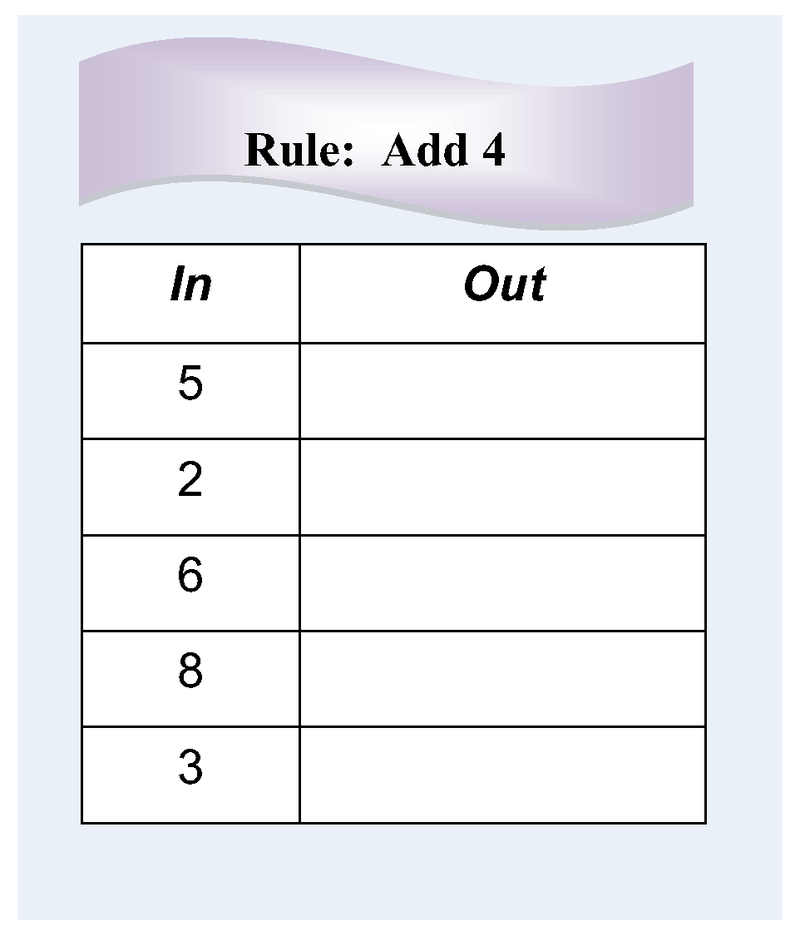
| --- | --- |
| 5   | 9   |
| 2   | 1   |
| 6   | 10  |
| 8   | 12  |
| 3   | 7   |

#### Example 4

| **_In_** | **_Out_** |
| --- | --- |
| 0   | 6   |
| 6   | 12  |
| 2   | 8   |
| 3   | 9   |
| 4   | 10  |

### Review 

Follow the rules. Complete the tables.

1.  \[Figure 10\]
2.  \[Figure 11\]
3.  \[Figure 12\]
4.  \[Figure 13\]
5.  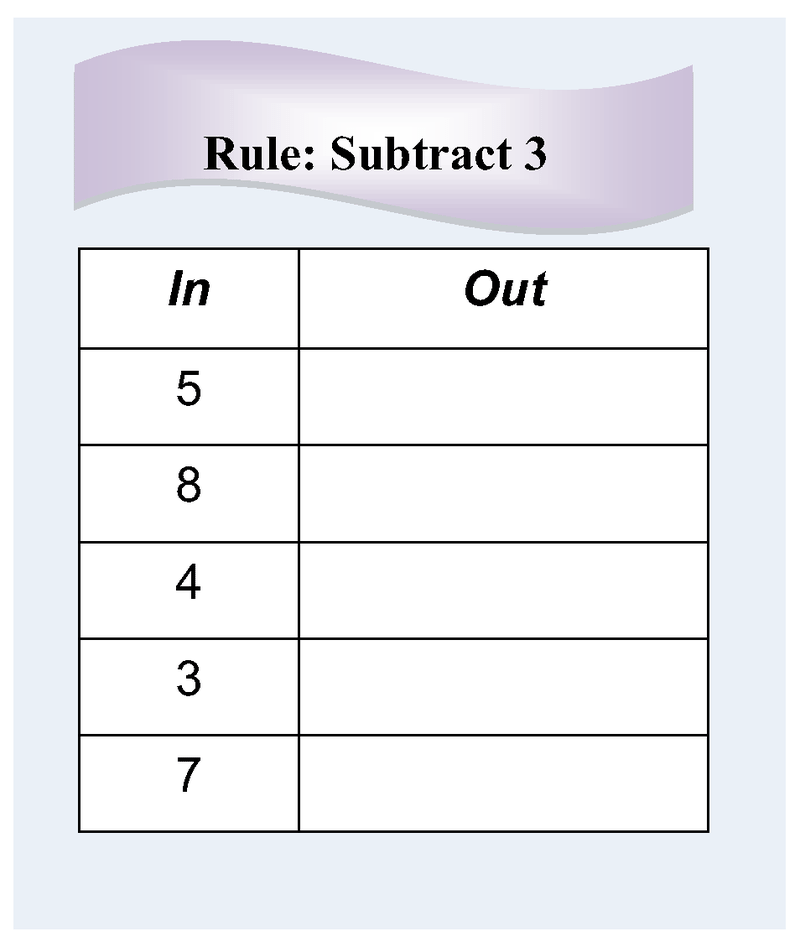\[Figure 14\]
6.  \[Figure 15\]
7.  \[Figure 16\]
8.  \[Figure 17\]
9.  \[Figure 18\]
10. \[Figure 19\]
11. \[Figure 20\]
12. \[Figure 21\]
13. \[Figure 22\]

|     |     |
| --- | --- |
| 3   | 7   |

</article>

### 3.5 Silly Stickers

<article>

We know that one of these stickers costs $5 \cancel{\text{c}}$.

In order to determine the price of a set of stickers like the one above, we can use the problem solving steps to help us focus.

* First, **describe** what you know.
* Second, identify what **your job** is. In these problems, your job will be to figure out the price of the set of stickers.
* Third, make a **plan**. In these problems, your plan will be to count by the cost of one sticker in order to figure out the total cost.
* Fourth, **solve**. Do your plan.
* Fifth, **check**. In these problems, you can check your work by adding together the cost of each sticker.

1. Look at the picture below:

$$
\begin{align*}
& \mathbf{Describe:} && \text{One silly sticker is} \ 5 \cancel{\text{c}}\\
&&& \text{There are} \ 3 \ \text{stickers.}\\
&&& \text{The} \ 3 \ \text{stickers don't have a price.}\\
& \mathbf{My \ Job:} && \text{Figure out how many cents for} \ 3 \ \text{stickers.}\\
& \mathbf{Plan:} && \text{Write} \ 5 \cancel{\text{c}} \ \text{on each sticker.}\\
&&& \text{Count by} \ 5 \text{s to get the number of cents.}\\
& \mathbf{Solve:}
\end{align*}
$$

\begin{align*}
&&& 3 \ \text{stickers cost} \ 15 \cancel{\text{c}}\\
& \mathbf{Check:} && \text{Add the row:}\\
&&& 5+5+5 = 15 \cancel{\text{c}}
\end{align*}
$$

2. Look at the picture below:

\[Figure 7\] 

We can use the problem solving steps to help us figure out the price for the stickers.

$$
\begin{align*}
& \mathbf{Describe:} && \text{One silly sticker is} \ 5 \cancel{\text{c}}\\
&&& \text{There are} \ 2 \ \text{stickers.}\\
&&& \text{The} \ 2 \ \text{stickers don't have a price.}\\
& \mathbf{My \ Job:} && \text{Figure out how many cents for} \ 2 \ \text{stickers.}\\
& \mathbf{Plan:} && \text{Write} \ 5 \cancel{\text{c}} \ \text{on each sticker.}\\
&&& \text{Count by} \ 5 \text{s to get the number of cents.}\\
& \mathbf{Solve:}
\end{align*}
$$

\begin{align*}
&&& 2 \ \text{stickers cost} \ 10 \cancel{\text{c}}\\
& \mathbf{Check:} && \text{Add the row:}\\
&&& 5+5 = 10 \cancel{\text{c}}
\end{align*}
$$

3. Look at the picture below:

$$
\begin{align*}
& \mathbf{Describe:} && \text{One silly sticker is} \ 5 \cancel{\text{c}}\\
&&& \text{There are} \ 6 \ \text{stickers.}\\
&&& \text{The} \ 6 \ \text{stickers don't have a price.}\\
& \mathbf{My \ Job:} && \text{Figure out how many cents for} \ 6 \ \text{stickers.}\\
& \mathbf{Plan:} && \text{Write} \ 5 \cancel{\text{c}} \ \text{on each sticker.}\\
&&& \text{Count by} \ 5 \text{s to get the number of cents.}\\
& \mathbf{Solve:}
\end{align*}
$$

\begin{align*}
&&& 6 \ \text{stickers cost} \ 30 \cancel{\text{c}}\\
& \mathbf{Check:} && \text{Add each row:}\\
&&& 5+5+5 = 15 \cancel{\text{c}}\\
&&& 5+5+5= 15 \cancel{\text{c}}\\
&&& 15 + 15= 30\cancel{\text{c}}
\end{align*}
$$

4. Look at the picture below:

$$
\begin{align*}
& \mathbf{Describe:} && \text{One silly sticker is} \ 5 \cancel{\text{c}}\\
&&& \text{There are} \ 5 \ \text{stickers.}\\
&&& \text{The} \ 5 \ \text{stickers don't have a price.}\\
& \mathbf{My \ Job:} && \text{Figure out how many cents for} \ 5 \ \text{stickers.}\\
& \mathbf{Plan:} && \text{Write} \ 5 \cancel{\text{c}} \ \text{on each sticker.}\\
&&& \text{Count by} \ 5 \text{s to get the number of cents.}\\
& \mathbf{Solve:}
\end{align*}
$$

\begin{align*}
&&& 5 \ \text{stickers cost} \ 25 \cancel{\text{c}}\\
& \mathbf{Check:} && \text{Add each row:}\\
&&& 5+5+5 = 15 \cancel{\text{c}}\\
&&& 5+5= 10 \cancel{\text{c}}\\
&&& 15 + 10= 25\cancel{\text{c}}
\end{align*}
$$

#### Earlier Problem Revisited

We can use the problem solving steps to help us figure out the price for the stickers below.

\begin{align*}
& \mathbf{Describe:} && \text{One silly sticker is} \ 5 \cancel{\text{c}}\\
&&& \text{There are} \ 8 \ \text{stickers.}\\
&&& \text{The} \ 8 \ \text{stickers don't have a price.}\\
& \mathbf{My \ Job:} && \text{Figure out how many cents for} \ 8 \ \text{stickers.}\\
& \mathbf{Plan:} && \text{Write} \ 5 \cancel{\text{c}} \ \text{on each sticker.}\\
&&& \text{Count by} \ 5 \text{s to get the number of cents.}\\
& \mathbf{Solve:}
\end{align*}
$$

\begin{align*}
&&& 8 \ \text{stickers cost} \ 40 \cancel{\text{c}}\\
& \mathbf{Check:} && \text{Add each row:}\\
&&& 5+5+5+5 = 20 \cancel{\text{c}}\\
&&& 5+5+5+5 = 20 \cancel{\text{c}}\\
&&& 20+20 = 40 \cancel{\text{c}}
\end{align*}
$$

### Vocabulary

**_Skip counting_** is counting by a number other than 1. When you **_count by 2s_** (2, 4, 6, 8) you are skip counting. In this concept we counted by 2s, 3s, 4s, 5s, 6s, and 10s.

### Examples 

Look at the picture below:

#### Example 1

#### Example 2

#### Example 3

#### Example 4

Look at the picture below:

#### Example 5

#### Example 6

#### Example 7

#### Example 8

### Review 

Look at the picture below for problems 1-4:

1.  \[Figure 28\]
2.  \[Figure 29\]
3.  \[Figure 30\]
4.  \[Figure 31\]

Look at the picture below for problems 5-8:

5.  \[Figure 33\]
6.  \[Figure 34\]
7.  \[Figure 35\]
8.  \[Figure 36\]

Look at the picture below for problems 9-12:

9.  \[Figure 38\]
10. \[Figure 39\]
11. \[Figure 40\]
12. \[Figure 41\]

Look at the picture below for problems 13-16:

13. \[Figure 43\]
14. \[Figure 44\]
15. \[Figure 45\]
16. \[Figure 46\]

Look at the picture below for problems 17-20:

17. \[Figure 48\]
18. \[Figure 49\]
19. \[Figure 50\]
20. \[Figure 51\]

Look at the picture below for questions 21-24:

21. \[Figure 53\]
22. \[Figure 54\]
23. \[Figure 55\]
24. \[Figure 56\]

Look at the picture below for problems 25-28:

25. \[Figure 58\]
26. \[Figure 59\]
27. \[Figure 60\]
28. \[Figure 61\]

</article>

### 3.6 Stars and Moons

<article>

Can you continue the pattern shown below? In this section, we will practice figuring out patterns and then extending them.

In order to continue patterns like the one with stars and moons shown above, we can use the problem solving steps to help.

* First, **describe** what you see.
* Second, figure out what **your job** is. In these problems, your job will be to continue the pattern and fill in the empty cards.
* Third, make a **plan**. Decide how you will figure out and then continue the pattern.
* Fourth, **solve**. Fill in the empty cards with the correct number of stars and moons.
* Fifth, **check**. State the pattern you found and verify that it worked for all of the cards.

1. 

$$
\begin{align*}
& \mathbf{Describe:} && \text{There are} \ 6 \ \text{cards.}\\
&&& \text{Card} \ 1:1 \ \text{star and} \ 1 \ \text{moon}\\
&&& \text{Card} \ 2:1 \ \text{star and} \ 2 \ \text{moons}\\
&&& \text{Card} \ 3:1 \ \text{star and} \ 3 \ \text{moons}\\
&&& \text{Card} \ 4,5 \ \text{and} \ 6 \ \text{are empty.}\\
& \mathbf{My \ Job:} && \text{Figure out the pattern.}\\
&&& \text{Make drawings on the empty cards.}\\
& \mathbf{Plan:} && \text{Look at the card numbers. Figure out the pattern of stars.}\\
&&& \text{Look at the card numbers. Figure out the pattern of moons.}\\
&&& \text{Make the drawings.}\\
& \mathbf{Solve:}
\end{align*}
$$

\begin{align*}
& \mathbf{Check:} && \text{The number of moons is the same as the card number.}\\
&&& \text{The number of stars is always one.}
\end{align*}
$$

2. 

$$
\begin{align*}
& \mathbf{Describe:} && \text{There are} \ 6 \ \text{cards.}\\
&&& \text{Card} \ 1:1 \ \text{star and} \ 1 \ \text{moon}\\
&&& \text{Card} \ 2:2 \ \text{stars and} \ 2 \ \text{moons}\\
&&& \text{Card} \ 3:3 \ \text{stars and} \ 3 \ \text{moons}\\
&&& \text{Card} \ 4,5 \ \text{and} \ 6 \ \text{are empty.}\\
& \mathbf{My \ Job:} && \text{Figure out the pattern.}\\
&&& \text{Make drawings on the empty cards.}\\
& \mathbf{Plan:} && \text{Look at the card numbers. Figure out the pattern of stars.}\\
&&& \text{Look at the card numbers. Figure out the pattern of moons.}\\
&&& \text{Make the drawings.}\\
& \mathbf{Solve:}
\end{align*}
$$

\begin{align*}
& \mathbf{Check:} && \text{The number of moons is the same as the card number.}\\
&&& \text{The number of stars is the same as the number of moons.}
\end{align*}
$$

3. 

$$
\begin{align*}
& \mathbf{Describe:} && \text{There are} \ 6 \ \text{cards.}\\
&&& \text{Card} \ 1:2 \ \text{stars and} \ 1 \ \text{moon}\\
&&& \text{Card} \ 2:4 \ \text{stars and} \ 1 \ \text{moon}\\
&&& \text{Card} \ 3:6 \ \text{stars and} \ 1 \ \text{moon}\\
&&& \text{Card} \ 4,5 \ \text{and} \ 6 \ \text{are empty.}\\
& \mathbf{My \ Job:} && \text{Figure out the pattern.}\\
&&& \text{Make drawings on the empty cards.}\\
& \mathbf{Plan:} && \text{Look at the card numbers. Figure out the pattern of stars.}\\
&&& \text{Look at the card numbers. Figure out the pattern of moons.}\\
&&& \text{Make the drawings.}\\
& \mathbf{Solve:}
\end{align*}
$$

\begin{align*}
& \mathbf{Check:} && \text{The number of moons is always one.}\\
&&& \text{The number of stars is twice as many as the card number.}
\end{align*}
$$

#### Earlier Problem Revisited 

$$
\begin{align*}
& \mathbf{Describe:} && \text{There are} \ 6 \ \text{cards.}\\
&&& \text{Card} \ 1:2 \ \text{stars and} \ 1 \ \text{moon}\\
&&& \text{Card} \ 2:3 \ \text{stars and} \ 2 \ \text{moons}\\
&&& \text{Card} \ 3:4 \ \text{stars and} \ 3 \ \text{moons}\\
&&& \text{Card} \ 4,5 \ \text{and} \ 6 \ \text{are empty.}\\
& \mathbf{My \ Job:} && \text{Figure out the pattern.}\\
&&& \text{Make drawings on the empty cards.}\\
& \mathbf{Plan:} && \text{Look at the card numbers. Figure out the pattern of stars.}\\
&&& \text{Look at the card numbers. Figure out the pattern of moons.}\\
&&& \text{Make the drawings.}\\
& \mathbf{Solve:}
\end{align*}
$$

\begin{align*}
& \mathbf{Check:} && \text{The number of moons is always the same as the card number.}\\
&&& \text{The number of stars is one more than the number of moons.}
\end{align*}
$$

### Vocabulary

One type of **_pattern_** is when the number of a certain object increases, decreases, or stays the same in a consistent way. In this concept, we saw patterns of stars and moons. With any **_pattern_** you should be able to describe the **_pattern_** and how to get from one step of the **_pattern_** to the next.

### Examples 

#### Example 1

")

\[Figure 11\]

#### Example 2

")

\[Figure 13\]

#### Example 3

")

\[Figure 15\]

### Review 

1.  \[Figure 16\]
2.  \[Figure 17\]
3.  \[Figure 18\]
4.  \[Figure 19\]
5.  \[Figure 20\]

</article>

## 4.0 CK-12 Algebra Explorations Concepts, Grade 2

<article>

Introduction
------------

In these concepts, you will be introduced to seven key concepts of algebra and will practice your problem solving skills. There are seven concepts, and each one focuses on a key algebraic thinking strategy. You will focus on describing, identifying your job, planning, solving, and checking your thinking.

</article>

### 4.1 Which Boxes

<article>

You have lots of these boxes. If you wanted to make the pans balance, which boxes will you put in the empty pan? Can you solve this problem in more than one way?

In order to balance pans like the one above, use the problem solving steps to help you.

* First, **describe** what you see and what information you are given.
* Next, identify what **your job** is and what you are trying to solve. In all of these problems, your job will be to figure out which boxes to put in the pan. You want to make sure that the pans will balance.
* Third, make a **plan** for how you will solve.
* Fourth, **solve** the problem.
* Last, **check** your answer by making sure that the combinations of boxes you found add up to the amount that you needed.

For the problem above, since the left side weighs 10 pounds, you want to make sure the right side will also weigh 10 pounds.

1. 

Make the pans balance.

Which boxes will you use?

Can you use a different set of boxes? Explain.

We can use the problem solving steps to help us solve this problem.

$$
\begin{align*}
& \mathbf{Describe:} && \text{Two pans. One pan is empty. Other pan has a 9-pound box.}\\
&&& \text{There are three other types of boxes.}\\
&&& G \ \text{is 4 pounds.}\\
&&& H \ \text{is 3 pounds.}\\
&&& L \ \text{is 2 pounds.}\\
&&& \text{There are lots of each type of box.}\\
& \mathbf{My \ Job:} && \text{Figure out which boxes will make the pans balance.}\\
& \mathbf{Plan:} && \text{Try to make 9 pounds with:}\\
&&& \qquad \text{Only} \ G \ \text{boxes}\\
&&& \qquad \text{Only} \ H \ \text{boxes}\\
&&& \qquad \text{Only} \ L \ \text{boxes}\\
&&& \qquad \text{Then try combinations:}\\
&&& \qquad \qquad \ G \text{s and} \ H \text{s}\\
&&& \qquad \qquad \ G \text{s and} \ L \text{s}\\
&&& \qquad \qquad \ H \text{s and} \ L \text{s}\\
&&& \qquad \qquad \ G \text{s}, \ H \text{s and} \ L \text{s}\\
& \mathbf{Solve:} && 3 \ H \ \text{boxes weigh 9 pounds}\\
&&& 1 \ H \ \text{and} \ 3 \ L \ \text{boxes weigh 9 pounds}\\
&&& 1 \ G \ \text{box and 1} \ H \ \text{box and 1} \ L \ \text{box weigh 9 pounds}\\
& \mathbf{Check:} && 3 + 3 +3 =9\\
&&& 3+2+2+2=9\\
&&& 4+3+2=9
\end{align*}
$$

2. 

Make the pans balance.

Which boxes will you use?

Can you use a different set of boxes? Explain.

We can use the problem solving steps to help us solve this problem.

$$
\begin{align*}
& \mathbf{Describe:} && \text{Two pans. One pan is empty. Other pan has a 5-pound box.}\\
&&& \text{There are three other types of boxes.}\\
&&& D \ \text{is 3 pounds.}\\
&&& E \ \text{is 2 pounds.}\\
&&& F \ \text{is 1 pounds.}\\
&&& \text{There are lots of each type of box.}\\
& \mathbf{My \ Job:} && \text{Figure out which boxes will make the pans balance.}\\
& \mathbf{Plan:} && \text{Try to make 5 pounds with:}\\
&&& \qquad \text{Only} \ D \ \text{boxes}\\
&&& \qquad \text{Only} \ E \ \text{boxes}\\
&&& \qquad \text{Only} \ F \ \text{boxes}\\
&&& \qquad \text{Then try combinations:}\\
&&& \qquad \qquad \ D \text{s and} \ E \text{s}\\
&&& \qquad \qquad \ D \text{s and} \ F \text{s}\\
&&& \qquad \qquad \ E \text{s and} \ F \text{s}\\
&&& \qquad \qquad \ D \text{s}, \ E \text{s and} \ F \text{s}\\
& \mathbf{Solve:} && 5 \ F \ \text{boxes weigh 5 pounds}\\
&&& 3 \ F \ \text{and} \ 1 \ E \ \text{boxes weigh 5 pounds}\\
&&& \text{2} \ E \ \text{boxes and} \ 1 \ F \ \text{box weigh 5 pounds}\\
&&& 1 \ E \ \text{box and 1} \ D \ \text{box weigh 5 pounds}\\
&&& 1 \ D \ \text{box and 2} \ F \ \text{boxes weigh 5 pounds}\\
& \mathbf{Check:} && 1 + 1 +1 + 1 + 1= 5\\
&&& 1+1+1+2=5\\
&&&2+2+1=5\\
&&& 2 + 3=5\\
&&& 3+1+1=5
\end{align*}
$$

#### Earlier Problem Revisited

$$
\begin{align*}
& \mathbf{Describe:} && \text{Two pans. One pan is empty. Other pan has a 10-pound box.}\\
&&& \text{There are three other types of boxes.}\\
&&& A \ \text{is 2 pounds.}\\
&&& B \ \text{is 3 pounds.}\\
&&& C \ \text{is 4 pounds.}\\
&&& \text{There are lots of each type of box.}\\
& \mathbf{My \ Job:} && \text{Figure out which boxes will make the pans balance.}\\
& \mathbf{Plan:} && \text{Try to make 10 pounds with:}\\
&&& \qquad \text{Only} \ A \ \text{boxes}\\
&&& \qquad \text{Only} \ B \ \text{boxes}\\
&&& \qquad \text{Only} \ C \ \text{boxes}\\
&&& \qquad \text{Then try combinations:}\\
&&& \qquad \qquad \ A \text{s and} \ B \text{s}\\
&&& \qquad \qquad \ A \text{s and} \ C \text{s}\\
&&& \qquad \qquad \ B \text{s and} \ C \text{s}\\
&&& \qquad \qquad \ A \text{s}, \ B \text{s and} \ C \text{s}\\
& \mathbf{Solve:} && 5 \ A \ \text{boxes weigh 10 pounds}\\
&&& 2 \ A \ \text{and} \ 2 \ B \ \text{boxes weigh 10 pounds}\\
&&& \text{One} \ A \ \text{box and} \ 2 \ C \ \text{boxes weigh 10 pounds}\\
&&& 2 \ B \ \text{boxes and one} \ C \ \text{box weigh 10 pounds}\\
& \mathbf{Check:} && 2 + 2 +2 + 2 + 2 = 10\\
&&& 2 + 2 + 3 + 3 = 10\\
&&& 2 + 4 + 4 = 10\\
&&& 3 + 3 + 4 = 10
\end{align*}
$$

### Vocabulary

To be **_equal_** means to be the same. In this concept, we are trying to make weights equal. This means we are trying to make each side of the pan balance have the same weight.

### Examples 

For each problem, put boxes in the empty pan to make the pans balance. Can you find more than one answer?

#### Example 1

__$K + K + K + K = 12 \ pounds$__

$J + J + K + L = 12 \ pounds$

#### Example 2

__$R + R + R + S = 15 \ pounds$__

$Q + S = 15 \ pounds$

#### Example 3

#### \[Figure 7\]

$W + W + W + W = 16 \ pounds$

__$Y + Y = 16 \ pounds$__

$W + W + Y = 16 \ pounds$

### Review 

For each problem, put boxes in the empty pan to make the pans balance. Can you find more than one answer?

1.  \[Figure 8\]
2.  \[Figure 9\]
3.  \[Figure 10\]
4.  \[Figure 11\]
5.  \[Figure 12\]
6.  \[Figure 13\]

</article>

### 4.2 What's the Weight

<article>

Look at the picture below. Can you figure out the weight of the blue block? Can you figure out the weight of the red block? In this section, we will learn how to find the weights of individual blocks given information about the weights of multiples or combinations of blocks.

In order to solve the problem above, use the problem solving steps.

* Start by **describing** what information is given.
* Then, identify what **your job** is. In these problems, your job will be to figure out the weight of each individual block.
* Next, make a **plan** for how you will solve. In these problems, find the weight of the block using the scale that shows only one type of block first.
* Then, **solve** the problem.
* Finally, **check** your solution. Make sure that your solution causes each scale to have the correct weight.

1. Figure out the weight of each block.

$$
\begin{align*}
& \mathbf{Describe:} && \text{Two scales}\\
&&& A: \ \text{1 blue block weighs 5 pounds}\\
&&& B: \ \text{1 blue block and 1 green block weigh 6 pounds}\\
& \mathbf{My \ Job:} && \text{Figure out the weight of one blue block and one green block.}\\
& \mathbf{Plan:} && \text{Start with} \ A. \ \text{I already know that one blue block is 5 pounds.}\\
&&& \text{In} \ B, \ \text{replace the blue block with its weight.}\\
&&& \text{Figure out the weight of the green block.}\\
& \mathbf{Solve:} && B: \ \text{Replace blue block with 5.}\\
&&& \text{Then 5 + green block = 6 pounds.}\\
&&& \text{Green block = 6 - 5, or 1 pound.}\\
& \mathbf{Check:} && \text{Replace each blue block with 5 pounds.}\\
&&& \text{Replace the green block with 1 pound.}\\
&&& \text{Check with the scale weights.}\\
&&& A: \ \text{5 = 5 pounds} \quad B: \ \text{5 + 1 = 6 pounds}
\end{align*}
$$

2. 

$$
\begin{align*}
& \mathbf{Describe:} && \text{Two scales}\\
&&& A: \ \text{1 red block and 1 green block weighs 10 pounds}\\
&&& B: \ \text{1 green block weighs 8 pounds}\\
& \mathbf{My \ Job:} && \text{Figure out the weight of one green block and one red block.}\\
& \mathbf{Plan:} && \text{Start with} \ B. \ \text{I already know that one green block is 8 pounds.}\\
&&& \text{In} \ A, \ \text{replace the green block with its weight.}\\
&&& \text{Figure out the weight of the red block.}\\
& \mathbf{Solve:} && A: \ \text{Replace green block with 8 pounds.}\\
&&& \text{Then red block + 8 = 10 pounds.}\\
&&& \text{Red block = 10 - 8, or 2 pounds.}\\
& \mathbf{Check:} && \text{Replace each green block with 8 pounds.}\\
&&& \text{Replace the red block with 2 pounds.}\\
&&& \text{Check with the scale weights.}\\
&&& A: \ \text{2 + 8 = 10 pounds} \quad B: \ \text{8 = 8 pounds}
\end{align*}
$$

3. Figure out the weight of each block.

$$
\begin{align*}
& \mathbf{Describe:} && \text{Two scales}\\
&&& A: \ \text{2 yellow blocks weigh 12 pounds}\\
&&& B: \ \text{1 yellow block and 1 red block weigh 15 pounds}\\
& \mathbf{My \ Job:} && \text{Figure out the weight of one yellow block and one red block.}\\
& \mathbf{Plan:} && \text{Start with} \ A. \ \text{Figure out the weight of one yellow block.}\\
&&& \text{In} \ B, \ \text{replace the yellow block with its weight.}\\
&&& \text{Figure out the weight of the red block.}\\
& \mathbf{Solve:} && A: \ \text{yellow block + yellow block  = 12 pounds, so one yellow block is half of 12, or 6 pounds.}\\
&&& B: \ \text{Replace yellow block with 6.}\\
&&& \text{Then 6 + red block = 15 pounds.}\\
&&& \text{Red block = 15 - 6, or 9 pounds.}\\
& \mathbf{Check:} && \text{Replace each yellow block with 6 pounds.}\\
&&& \text{Replace the red block with 9 pounds.}\\
&&& \text{Check with the scale weights.}\\
&&& A: \ \text{6 + 6 = 12 pounds} \quad B: \ \text{6 + 9 = 15 pounds}
\end{align*}
$$

#### Earlier Problem Revisited

$$
\begin{align*}
& \mathbf{Describe:} && \text{Two scales}\\
&&& A: \ \text{2 blue blocks weigh 4 pounds}\\
&&& B: \ \text{1 blue block and 1 red block weigh 6 pounds}\\
& \mathbf{My \ Job:} && \text{Figure out the weight of one blue block and one red block.}\\
& \mathbf{Plan:} && \text{Start with} \ A. \ \text{Figure out the weight of one blue block.}\\
&&& \text{In} \ B, \ \text{replace the blue block with its weight.}\\
&&& \text{Figure out the weight of the red block.}\\
& \mathbf{Solve:} && A: \ \text{blue block + blue block = 4 pounds, so one blue block is half of 4, or 2 pounds.}\\
&&& B: \ \text{Replace blue block with 2.}\\
&&& \text{Then 2 + red block = 6 pounds.}\\
&&& \text{red block = 6 - 2, or 4 pounds.}\\
& \mathbf{Check:} && \text{Replace each blue block with 2 pounds.}\\
&&& \text{Replace the red block with 4 pounds.}\\
&&& \text{Check with the scale weights.}\\
&&& A: \ \text{2 + 2 = 4 pounds} \quad B: \ \text{2 + 4 = 6 pounds}
\end{align*}
$$

### Vocabulary

In math, an **_unknown_** is a letter that stands for a number that we do not yet know the value of. In this concept, when you figured out the value of the individual blocks you were solving for unknowns.

### Examples 

For each problem, figure out the weight of each block.

#### Example 1

#### Example 2

#### Example 3

For each problem, figure out the weight of each block.

1.  \[Figure 9\]
2.  \[Figure 10\]
3.  \[Figure 11\]
4.  \[Figure 12\]
5.  \[Figure 13\]

</article>

### 4.3 Circles and Arrows 2

<article>

Can you figure out the value of each letter in the diagram below? In this section, we will use problem solving steps to help us find the value of letters in circles and arrows diagrams.

In order to solve the problem above, use the problem solving steps.

* Start by **describing** what you see in the diagram.
* Next, figure out what **your job** is in this problem. In all of these problems your job will be to figure out the value of the two letters in the diagram.
* Then, make a **plan** for how you will solve. There is usually more than one way to solve the problem. You will want to figure out one letter first and then the next letter.
* Next, **solve** the problem.
* Finally, **check** to make sure that the values you found work for all 5 of the arrows.

1. Figure out the value of each letter.

$$
\begin{align*}
& \mathbf{Describe:} && \text{There are two rows and three columns of numbers and letters.}\\
&&& \text{Arrows point to sums.}\\
& \mathbf{My \ Job:} && \text{Figure out the value of the letters} \ C \ \text{and} \ D.\\
& \mathbf{Plan:} && \text{Start with column 2. Solve for}\ C.\\
&&& \text{Replace}\ C \ \text{with its value in row 1. Solve for}\ D.\\
& \mathbf{Solve:} && \text{Column} \ 2: C + C = 10. \ \text{Therefore}, \ C = 5.\\
&&& \text{Row} \ 1: 6 + C + D = 15, \ \text{so}, \ 6 + 5 + D = 15. \ \text{So}, \ D = 15 - 11, \ \text{or}\ 4.\\
& \mathbf{Check:} && \text{Replace all}\ C\text{s with 5. Replace all}\ D\text{s with 4.}\\
&&& \text{Add rows and columns. Check the sums.}\\
&&& \text{Row} \ 1: 6 + 5 + 4 = 15 \quad \text{Column} \ 1: 6 + 4 = 10\\
&&& \text{Row} \ 2: 4 + 5 + 3 = 12 \quad \text{Column} \ 2: 5 + 5 = 10\\
&&& \qquad \qquad \qquad \qquad \qquad \quad \text{Column} \ 3: 4 + 3 = 7
\end{align*}
$$

2. Figure out the value of each letter.

$$
\begin{align*}
& \mathbf{Describe:} && \text{There are two rows and three columns of numbers and letters.}\\
&&& \text{Arrows point to sums.}\\
& \mathbf{My \ Job:} && \text{Figure out the value of the letters} \ E \ \text{and} \ F.\\
& \mathbf{Plan:} && \text{Start with column 1. Solve for}\ E.\\
&&& \text{Replace}\ E \ \text{with its value in row 1. Solve for}\ F.\\
& \mathbf{Solve:} && \text{Column} \ 1: E + E = 6. \ \text{So}, \ E = 3.\\
&&& \text{Row} \ 1: E + F + 2 = 13, \ \text{so}, \ 3 + F + 2 = 13. \ \text{Therefore}, \ F = 13 - 5, \ \text{or}\ 8.\\
& \mathbf{Check:} && \text{Replace all}\ E\text{s with 3. Replace all}\ F\text{s with 8.}\\
&&& \text{Add rows and columns. Check the sums.}\\
&&& \text{Row} \ 1: 3 + 8 + 2 = 13 \quad \text{Column} \ 1: 3 + 3 = 6\\
&&& \text{Row} \ 2: 3 + 7 + 8 = 18 \quad \text{Column} \ 2: 8 + 7 = 15\\
&&& \qquad \qquad \qquad \qquad \qquad \quad \text{Column} \ 3: 2 + 8 = 10
\end{align*}
$$

3. Figure out the value of each letter.

$$
\begin{align*}
& \mathbf{Describe:} && \text{There are two rows and three columns of numbers and letters.}\\
&&& \text{Arrows point to sums.}\\
& \mathbf{My \ Job:} && \text{Figure out the value of the letters} \ G \ \text{and} \ H.\\
& \mathbf{Plan:} && \text{Start with row 2. Solve for}\ H.\\
&&& \text{Replace}\ H \ \text{with its value in Column 3. Solve for}\ H.\\
& \mathbf{Solve:} && \text{Row} \ 2: 3 + H + H = 13, \ \text{so} \ H + H = 10. \ \text{Therefore}, \ H = 5.\\
&&& \text{Column} \ 3: G + H = 7, \ \text{so} \ G + 5 = 7. \ \text{Therefore}, \ G = 7 - 5, \ \text{or}\ 2.\\
& \mathbf{Check:} && \text{Replace all}\ H\text{s with 5. Replace all}\ G\text{s with 2.}\\
&&& \text{Add rows and columns. Check the sums.}\\
&&& \text{Row} \ 1: 2 + 9 + 2 = 13 \quad \text{Column} \ 1: 2 + 3 = 5\\
&&& \text{Row} \ 2: 3 + 5 + 5 = 13 \quad \text{Column} \ 2: 9 + 5 = 14\\
&&& \qquad \qquad \qquad \qquad \qquad \quad \text{Column} \ 3: 5 + 2 = 7
\end{align*}
$$

#### Earlier Problem Revisited

$$
\begin{align*}
& \mathbf{Describe:} && \text{There are two rows and three columns of numbers and letters.}\\
&&& \text{Arrows point to sums.}\\
& \mathbf{My \ Job:} && \text{Figure out the value of the letters} \ A \ \text{and} \ B.\\
& \mathbf{Plan:} && \text{Start with column 3. Solve for}\ B.\\
&&& \text{Replace}\ B \ \text{with its value in Column 2. Solve for}\ A.\\
& \mathbf{Solve:} && \text{Column} \ 3: B + B = 12. \ \text{So}, \ B = 6.\\
&&& \text{Column} \ 2: A + 6 = 9. \ \text{So}, \ A = 9 - 6, \ \text{or}\ 3.\\
& \mathbf{Check:} && \text{Replace all}\ A\text{s with 3. Replace all}\ B\text{s with 6.}\\
&&& \text{Add rows and columns. Check the sums.}\\
&&& \text{Row} \ 1: 3 + 3 + 6 = 12 \quad \text{Column} \ 1: 3 + 5 = 8\\
&&& \text{Row} \ 2: 5 + 6 + 6 = 17 \quad \text{Column} \ 2: 3 + 6 = 9\\
&&& \qquad \qquad \qquad \qquad \qquad \quad \text{Column} \ 3: 6 + 6 = 12
\end{align*}
$$

### Vocabulary

In math, an **_unknown_** is a letter that stands for a number that we do not yet know the value of. In this concept, when you figured out the value of the letters in the circles and arrows diagrams you were solving for **_unknowns._**

### Examples 

For each problem, figure out the value of each letter.

#### Example 1

#### Example 2

#### Example 3

#### Example 4

### Review 

For each problem, figure out the value of each letter.

1.  \[Figure 10\]
2.  \[Figure 11\]
3.  \[Figure 12\]
4.  \[Figure 13\]
5.  \[Figure 14\]
6.  \[Figure 15\]
7.  \[Figure 16\]
8.  \[Figure 17\]
9.  \[Figure 18\]
10. \[Figure 19\]

</article>

### 4.4 Better Buy 2

<article>

Look at the pictures below. Can you figure out which store sells 1 box of noodles for less? In this section, we will learn how to calculate the unit price of items in order to figure out which store has the better buy.

In order to figure out which item is the better buy, like in the question above, we can use the problem solving steps to help.

* Start by **describing** what you see the pictures.
* Next, figure out what **your job** is in this problem. In all of these problems your job will be to figure out which item is the better buy.
* Then, make a **plan** for how you will solve. In these problems, you will want to figure out the unit price of the item at each store. Then, figure out which unit price is less.
* Next, **solve** the problem.
* Finally, **check** to make sure that the unit price at the store you chose is lower.

1. Look at the picture below. Which store sells a gallon of milk for less? How much would it cost to buy 2 gallons of Milk at Mac's?

$$
\begin{align*}
& \mathbf{Describe:} && \text{Mac's and Zac's sell milk.}\\
&&& \text{Mac's: 1 gallon is \$4}\\
&&& \text{Zac's: 2 gallons are \$10}\\
& \mathbf{My \ Job:} && \text{Figure out the cost of one gallon of milk at Mac's and at Zac's.}\\
&&& \text{Then tell which costs less.}\\
& \mathbf{Plan:} && \text{At Mac's, one gallon is \$4.}\\
&&& \text{At Zac's, 2 gallons are \$10.}\\
&&& \text{To figure out the cost of one gallon, take half of \$10.}\\
&&& \text{Then compare the prices.}\\
& \mathbf{Solve:} && \text{Half of \$10 is \$5. So, one gallon of milk at Zac's is \$5.}\\
&&& \text{One gallon of milk costs less at Mac's than at Zac's.}\\
& \mathbf{Check:} && \text{\$4 is less than \$5}
\end{align*}
$$

The second question was: _how much would it cost to buy 2 gallons of Milk at Mac's?_ Since one gallon of milk at Mac's is $4, two gallons of milk at Mac's is $4+$4=$8.

2. Look at the picture below. Which store sells a bottle of water for less? How much would it cost to buy 3 bottles of water at Mac's?

$$
\begin{align*}
& \mathbf{Describe:} && \text{Mac's and Zac's sell water.}\\
&&& \text{Mac's: 1 bottle is \$2}\\
&&& \text{Zac's: 3 bottles are \$3}\\
& \mathbf{My \ Job:} && \text{Figure out the cost of one bottle of water at Mac's and at Zac's.}\\
&&& \text{Then tell which costs less.}\\
& \mathbf{Plan:} && \text{At Mac's, one bottle is \$2.}\\
&&& \text{At Zac's, 3 bottles are \$3.}\\
&&& \text{To figure out the cost of one bottle, take one third of \$3.}\\
&&& \text{Then compare the prices.}\\
& \mathbf{Solve:} && \text{One third of \$3 is \$1. So, one bottle of water at Zac's is \$1.}\\
&&& \text{One bottle of water costs less at Zac's than at Mac's.}\\
& \mathbf{Check:} && \text{\$1 is less than \$2}
\end{align*}
$$

The second question was: _how much would it cost to buy 3 bottles of water at Mac's?_ Since one bottle of water at Mac's is $2, three bottles of water at Mac's is $2+$2 + $2=$6.

3. Look at the picture below. Which store sells a pound of onions for less? How much would it cost to buy 2 pounds of onions at Zac's?

$$
\begin{align*}
& \mathbf{Describe:} && \text{Mac's and Zac's sell onions.}\\
&&& \text{Mac's: 2 pounds are 40\cancel{\text{c}}}\\
&&& \text{Zac's: 1 pound is 30\cancel{\text{c}}}\\
& \mathbf{My \ Job:} && \text{Figure out the cost of one pound of onions at Mac's and at Zac's.}\\
&&& \text{Then tell which costs less.}\\
& \mathbf{Plan:} && \text{At Zac's, one pound is 30\cancel{\text{c}}}.\\
&&& \text{At Mac's, 2 pounds are 40\cancel{\text{c}}}.\\
&&& \text{To figure out the cost of one pound, take half of 40\cancel{\text{c}}}.\\
&&& \text{Then compare the prices.}\\
& \mathbf{Solve:} && \text{Half of 40\cancel{\text{c}} is 20\cancel{\text{c}}. So, one pound of onions at Mac's is 20\cancel{\text{c}}.}\\
&&& \text{One pound of onions costs less at Mac's than at Zac's.}\\
& \mathbf{Check:} && \text{20\cancel{\text{c}} is less than 30\cancel{\text{c}}}
\end{align*}
$$

The second question was: _how much would it cost to buy 2 pounds of onions at Zac's?_ Since one pound of onions at Zac's is $30\cancel{\text{c}}$, 2 pounds of onions at Zac's is $30\cancel{\text{c}} +30\cancel{\text{c}}=60\cancel{\text{c}}$.

#### Earlier Problem Revisited

\begin{align*}
& \mathbf{Describe:} && \text{Mac's and Zac's sell noodles.}\\
&&& \text{Mac's: 1 box is \$5}\\
&&& \text{Zac's: 2 boxes are \$8}\\
& \mathbf{My \ Job:} && \text{Figure out the cost of one box of noodles at Mac's and at Zac's.}\\
&&& \text{Then tell which costs less.}\\
& \mathbf{Plan:} && \text{At Mac's, one box is \$5.}\\
&&& \text{At Zac's, 2 boxes are \$8.}\\
&&& \text{To figure out the cost of one box, take half of \$8.}\\
&&& \text{Then compare the prices.}\\
& \mathbf{Solve:} && \text{Half of \$8 is \$4. So, one box of noodles at Zac's is \$4.}\\
&&& \text{One box of noodles costs less at Zac's than at Mac's.}\\
& \mathbf{Check:} && \text{\$4 is less than \$5}
\end{align*}
$$

### Vocabulary

A **_unit price_** is the cost of one item. In this concept, we are given the overall price for multiple items and need to find the **_unit price_** in order to figure out which store has the better buy.

### Examples 

Use the picture below for examples 1-3.

Which store sells 1 cactus plant or less?

Zac's

#### Example 2

How did you decide?

Mac's: 1 plant is $12. Zac's: Since 3 plants cost $30, 1 plant is $10. $\$10 < \$12$

#### Example 3

How much would it cost to buy 3 cactus plants at Mac’s?

$\$12 + \$12 + \$12$ or $36Use the picture below for examples 4-6.

Which store sells 1 box of strawberries for less?

Mac's 

#### Example 5

How did you decide?

Mac's: 1 box is half of $6, or $3. Zac's: 1 sack is half of $8, or $4

$\$3 < \$4$

#### Example 6

How much would it cost to buy 4 boxes of strawberries at:

__Mac’s? \_\_\_\_\_\_\_\_\_\_\_\_\_\_\_\_\_\_\_\_\_\_\_\_\_\_\_\_\_\_\_\___

Zac’s? \_\_\_\_\_\_\_\_\_\_\_\_\_\_\_\_\_\_\_\_\_\_\_\_\_\_\_\_\_\_\_\_\_

Mac’s: $12

Zac’s: $16

### Review

Use the picture below for problems 1-4.

2.  How did you decide?
3.  How much would it cost to buy 4 sacks of oranges at Mac's?
4.  How much would it cost to buy 4 sacks of oranges at Zac's?

Use the picture below for problems 5-8.

6.  How did you decide?
7.  How much would it cost to buy 12 carnations at Mac's?
8.  How much would it cost to buy 12 carnations at Zac's?

</article>

### 4.5 Critter Trades

<article>

Look at the picture below. Can you figure out how many moths you could get for 4 centipedes? In this section, we will learn about trading and calculating the result of a trade.

In order to solve the trading problem above, use the problem solving steps.

* Start by **describing** what information is given.
* Then, identify what **your job** is. In these problems, your job will be to figure out how many of another type of critter you could get for the critters you have.
* Next, make a **plan** for how you will solve. In these problems, write numbers on each of your critters and skip count to figure out how many of the new critter you will get.
* Then, **solve** the problem.
* Finally, **check** your solution. Make sure that you added the numbers correctly.

1. Look at the picture below. For 3 spiders, how many bees will you get? How did you figure it out?

$$
\begin{align*}
& \mathbf{Describe:} && \text{There are two different critters.}\\
&&& \text{For 1 spider I get 2 bees.}\\
& \mathbf{My \ Job:} && \text{Figure out how many bees I get for 3 spiders.}\\
& \mathbf{Plan:} && \text{Write 2 on each of the 3 spiders.}\\
&&& \text{Then skip count the 2s.}\\
& \mathbf{Solve:}
\end{align*}
$$

\begin{align*}
& \mathbf{Check:} && 2 + 2 + 2 =6
\end{align*}
$$

2. Look at the picture below. For 4 grasshoppers, how many butterflies will you get? How did you figure it out?

$$
\begin{align*}
& \mathbf{Describe:} && \text{There are two different critters.}\\
&&& \text{For 1 grasshopper I get 3 butterflies.}\\
& \mathbf{My \ Job:} && \text{Figure out how many butterflies I get for 4 grasshoppers.}\\
& \mathbf{Plan:} && \text{Write 3 on each of the 4 grasshoppers.}\\
&&& \text{Then skip count the 3s.}\\
& \mathbf{Solve:}
\end{align*}
$$

\begin{align*}
& \mathbf{Check:} && 3 + 3 + 3 + 3 =12
\end{align*}
$$

3. Look at the picture below. For 5 flies, how many ants will you get? How did you figure it out?

$$
\begin{align*}
& \mathbf{Describe:} && \text{There are two different critters.}\\
&&& \text{For 1 fly I get 3 ants.}\\
& \mathbf{My \ Job:} && \text{Figure out how many ants I get for 5 flies.}\\
& \mathbf{Plan:} && \text{Write 3 on each of the 5 flies.}\\
&&& \text{Then skip count the 3s.}\\
& \mathbf{Solve:}
\end{align*}
$$

\begin{align*}
& \mathbf{Check:} && 3 + 3 + 3 + 3 +3= 15
\end{align*}
$$

#### Earlier Problem Revisited

$$
\begin{align*}
& \mathbf{Describe:} && \text{There are two different critters.}\\
&&& \text{For 1 centipede I get 3 moths.}\\
& \mathbf{My \ Job:} && \text{Figure out how many moths I can get for 4 centipedes.}\\
& \mathbf{Plan:} && \text{Write 3 on each of the 4 centipedes.}\\
&&& \text{Then skip count the 3s.}\\
& \mathbf{Solve:}
\end{align*}
$$

\begin{align*}
& \mathbf{Check:} && 3 + 3 + 3 + 3 = 12
\end{align*}
$$

### Vocabulary

To **_trade_** means you give something and get something else back. In this concept, we calculated what we would get if we **_traded_** critters.

### Examples 

#### Example 1

For 10 scorpions, how many wasps will you get?

#### Example 2

To get 6 worms, how many daddy long legs will you need to trade?

#### Example 3

To get 24 ants, how many lizards will you need to trade?

### Review 

2.  To get 12 worms, how many daddy long legs will you need to trade?
3.  To get 18 worms, how many daddy long legs will you need to trade?

5.  To get 35 ants, how many flies will you need to trade?
6.  To get 45 ants, how many flies will you need to trade?

8.  To get 42 wasps, how many grasshoppers will you need to trade?
9.  To get 24 wasps, how many grasshoppers will you need to trade?

</article>

### 4.6 Function Machines 2

<article>

Can you fill in the missing numbers in the table below? In this section, we will learn how to follow two-part rules in order to complete function tables.

In order to complete function tables like the one above, we can use the problem solving steps to help.

* First, **describe** what you see in the table.
* Second, identify what **your job** is. In these problems, your job will be to complete the table.
* Third, make a **plan**. In these problems, your plan should be to use the rules to help you to complete the table.
* Fourth, **solve**. In these problems you will solve by completing the table.
* Fifth, **check**. In these problems you will check by verifying that the addition and subtraction from the rules leads to the numbers in the out column of the table.

1. Follow the rules. Complete the table.

$$
\begin{align*}
& \mathbf{Describe:} && \text{There are two rules. Add 4. Then subtract 1.}\\
&&& \text{The table is missing} \ \mathbf{OUT} \ \text{numbers.}\\
& \mathbf{My \ Job:} && \text{Follow the add and subtract rules.}\\
&&& \text{Figure out the} \ \mathbf{OUT} \ \text{numbers. Finish the table.}\\
& \mathbf{Plan:} && \text{Add 4 to each IN number. Then subtract 1 from the sum.}
\end{align*}
$$

**Solve:**

| **_In_** | **_Out_** |
| --- | --- |
| 5   | 8   |
| 3   | 6   |
| 0   | 3   |
| 6   | 9   |
| 4   | 7   |

$$
\begin{align*}
& \mathbf{Check:} && 3 + 4 = 7, 7 - 1 = 6\\
&&& 0 + 4 = 4, 4 - 1 = 3\\
&&& 6 + 4 = 10, 10 - 1 = 9\\
&&& 4 + 4 = 8, 8 - 1 = 7
\end{align*}
$$

2. Follow the rules. Complete the table.

$$
\begin{align*}
& \mathbf{Describe:} && \text{There are two rules. Add 3. Then subtract 2.}\\
&&& \text{The table is missing} \ \mathbf{OUT} \ \text{numbers.}\\
& \mathbf{My \ Job:} && \text{Follow the add and subtract rules.}\\
&&& \text{Figure out the} \ \mathbf{OUT} \ \text{numbers. Finish the table.}\\
& \mathbf{Plan:} && \text{Add 3 to each IN number. Then subtract 2 from the sum.}
\end{align*}
$$

**Solve:**

| **_In_** | **_Out_** |
| --- | --- |
| 4   | 5   |
| 8   | 9   |
| 5   | 6   |
| 2   | 3   |
| 9   | 10  |

$$
\begin{align*}
& \mathbf{Check:} && 8 + 3 = 11, 11 - 2 = 9\\
&&& 5 + 3 = 8, 8 - 2 = 6\\
&&& 2 + 3 = 5, 5 - 2 = 3\\
&&& 9 + 3 = 12, 12 - 2 = 10
\end{align*}
$$

3. Follow the rules. Complete the table.

$$
\begin{align*}
& \mathbf{Describe:} && \text{There are two rules. Add 5. Then subtract 3.}\\
&&& \text{The table is missing} \ \mathbf{OUT} \ \text{numbers.}\\
& \mathbf{My \ Job:} && \text{Follow the add and subtract rules.}\\
&&& \text{Figure out the} \ \mathbf{OUT} \ \text{numbers. Finish the table.}\\
& \mathbf{Plan:} && \text{Add 5 to each IN number. Then subtract 3 from the sum.}
\end{align*}
$$

**Solve:**

| **_In_** | **_Out_** |
| --- | --- |
| 1   | 3   |
| 5   | 7   |
| 2   | 4   |
| 7   | 9   |
| 8   | 10  |

$$
\begin{align*}
& \mathbf{Check:} && 1 + 5 = 6, 6 - 3 = 3\\
&&& 5 + 5 = 10, 10 - 3 = 7\\
&&& 2 + 5 = 7, 7 - 3 = 4\\
&&& 7 + 5 = 12, 12 - 3 = 9\\
&&& 8 + 5 = 13, 13 - 3 = 10
\end{align*}
$$

#### Earlier Problem Revisited

$$
\begin{align*}
& \mathbf{Describe:} && \text{There are two rules. Add 2. Then subtract 1.}\\
&&& \text{The table is missing} \ \mathbf{OUT} \ \text{numbers.}\\
& \mathbf{My \ Job:} && \text{Follow the add and subtract rules.}\\
&&& \text{Figure out the} \ \mathbf{OUT} \ \text{numbers. Finish the table.}\\
& \mathbf{Plan:} && \text{Add 2 to each IN number. Then subtract 1 from the sum.}
\end{align*}
$$

**Solve:**

| **_In_** | **_Out_** |
| --- | --- |
| 4   | 5   |
| 7   | 8   |
| 2   | 3   |
| 0   | 1   |
| 6   | 7   |

$$
\begin{align*}
& \mathbf{Check:} && 7 + 2 = 9, 9 - 1 = 8\\
&&& 2 + 2 = 4, 4 - 1 = 3\\
&&& 0 + 2 = 2, 2 - 1 = 1\\
&&& 6 + 2 = 8, 8 - 2 = 7
\end{align*}
$$

### Vocabulary

A **_function_** is an example of a **_rule_** that states a relationship between two quantities. In this concept, our **_rule_** told us how to go from the in number to the out-number in each table. To **_add_** means to combine or to put together. To **_subtract_** means to take away. In this concept, our rules told us to add and subtract.

### Examples 

For each problem, follow the rules and complete the table.

#### Example 1

| --- | --- |
| 4   | 8   |
| 6   | 10  |
| 3   | 7   |
| 1   | 5   |
| 5   | 9   |

#### Example 2

| --- | --- |
| 6   | 14  |
| 4   | 12  |
| 1   | 9   |
| 2   | 10  |
| 8   | 16  |

#### Example 3

| --- | --- |
| 5   | 10  |
| 7   | 12  |
| 2   | 7   |
| 8   | 13  |
| 6   | 11  |

#### Example 4

| --- | --- |
| 2   | 3   |
| 8   | 9   |
| 5   | 6   |
| 4   | 5   |
| 7   | 8   |

### Review 

For each problem, follow the rules and complete the table.

1.  \[Figure 10\]
2.  \[Figure 11\]
3.  \[Figure 12\]
4.  \[Figure 13\]
5.  \[Figure 14\]
6.  \[Figure 15\]
7.  \[Figure 16\]
8.  \[Figure 17\]
9.  \[Figure 18\]
10. \[Figure 19\]
11. \[Figure 20\]
12. \[Figure 21\]
13. \[Figure 22\]
14. \[Figure 23\]
15. \[Figure 24\]
16. \[Figure 25\]
17. \[Figure 26\]
18. \[Figure 27\]
19. \[Figure 28\]
20. \[Figure 29\]
21. \[Figure 30\]
22. \[Figure 31\]
23. \[Figure 32\]
24. \[Figure 33\]
25. \[Figure 34\]

</article>

### 4.7 GEO Patterns

<article>

Look at the cards below. Can you continue the pattern of circles, triangles and squares? Can you say how many circles, triangles and squares would be on cards 5, 6, and 10? In this section, we will practice finding patterns and extending them.

In order to continue patterns like the one with the shapes shown above, we can use the problem solving steps to help.

* First, **describe** what you see.
* Second, figure out what **your job** is. In these problems, your job will be to continue the pattern and describe cards 5, 6, and 10.
* Third, make a **plan**. Decide how you will figure out and then continue the pattern.
* Fourth, **solve**. Say how many circles, triangles and squares are on cards 5, 6, and 10.
* Fifth, **check**. State the pattern you found and verify that it worked for all of the cards.

1. Look at the cards below. Continue the pattern of circles, triangles and squares. How many of each shape will be on card 5? Card 6? Card 10?

**Describe**: There are 6 cards. Cards 1-4 have circles, triangles and squares. Cards 5 and 6 are empty.

**My Job:** Figure out the pattern of circles, triangles and squares. Figure out how many of each shape are on cards 5, 6 and 10.

**Plan:** Count the number of circles on each card. Look for a pattern. Describe how many circles are on cards 5, 6 and 10. Count the number of triangles on each card. Look for a pattern. Describe how many triangles are on cards 5, 6 and 10. Count the number of squares on each card. Look for a pattern. Describe how many squares are on cards 5, 6 and 10.

**Solve:** Card 5 has 1 red circle next to 1 green triangle next to a stack of 5 blue squares. Card 6 has 1 red circle next to 1 green triangle next to a stack of 6 blue squares. Card 10 has 1 red circle, 1 green triangle, and 10 blue squares.

**Check:** There is always 1 red circle. There is always 1 green triangle. The number of blue squares is always the same as the card number.

2. Look at the cards below. Continue the pattern of circles, triangles and squares. How many of each shape will be on card 5? Card 6? Card 10?

**Describe**: There are 6 cards. Cards 1-4 have circles, triangles and squares. Cards 5 and 6 are empty.

**My Job:** Figure out the pattern of circles, triangles and squares. Figure out how many of each shape are on cards 5, 6 and 10.

**Plan:** Count the number of circles on each card. Look for a pattern. Describe how many circles are on cards 5, 6 and 10. Count the number of triangles on each card. Look for a pattern. Describe how many triangles are on cards 5, 6 and 10. Count the number of squares on each card. Look for a pattern. Describe how many squares are on cards 5, 6 and 10.

**Solve:** Card 5 has 1 red circle next to a stack of 6 green triangles next to a stack of 6 blue squares. Card 6 has 1 red circle next to a stack of 7 green triangles next to a stack of 7 blue squares. Card 10 has 1 red circle, 11 green triangles and 11 blue squares.

**Check:** There is always 1 red circle. The number of green triangles is always 1 more than the card number. The number of blue squares is always one more than the card number.

3. Look at the cards below. Continue the pattern of circles, triangles and squares. How many of each shape will be on card 5? Card 6? Card 10?

**Describe**: There are 6 cards. Cards 1-4 have circles, triangles and squares. Cards 5 and 6 are empty.

**My Job:** Figure out the pattern of circles, triangles and squares. Figure out how many of each shape are on cards 5, 6 and 10.

**Plan:** Count the number of circles on each card. Look for a pattern. Describe how many circles are on cards 5, 6 and 10. Count the number of triangles on each card. Look for a pattern. Describe how many triangles are on cards 5, 6 and 10. Count the number of squares on each card. Look for a pattern. Describe how many squares are on cards 5, 6 and 10.

**Solve:** Card 5 has 4 red circles above 2 green triangles above 10 blue squares. card 6 has 5 red circles above 2 green triangles above 12 blue squares. Card 10 has 9 red circles, 2 green triangles, and 20 blue squares.

**Check:** The number of red circles is always one less than the card number. There is always 2 green triangles. The number of blues squares is always twice the card number.

#### Earlier Problem Revisited

**Describe**: There are 6 cards. Cards 1-4 have circles, triangles and squares. Cards 5 and 6 are empty.

**My Job:** Figure out the pattern of circles, triangles and squares. Figure out how many of each shape are on cards 5, 6 and 10.

**Plan:** Count the number of circles on each card. Look for a pattern. Describe how many circles are on cards 5, 6 and 10. Count the number of triangles on each card. Look for a pattern. Describe how many triangles are on cards 5, 6 and 10. Count the number of squares on each card. Look for a pattern. Describe how many squares are on cards 5, 6 and 10.

**Solve:** Card 5 has one red circle next to a stack of 5 green triangles next to a stack of 7 blue squares. Card 6 has one red circle next to a stack of 6 green triangles, next to a stack of 8 blue squares. Card 10 has one red circle, 10 green triangles, and 12 blue squares.

**Check:** There is always 1 red circle. The number of green triangles is the same as the card number. The number of blue squares is always two more than the card number.

### Vocabulary

One type of **_pattern_** is when the number of a certain object increases, decreases, or stays the same in a consistent way. In this concept, we saw patterns of triangles, circles and rectangles. With any pattern you should be able to describe the pattern and how to get from one step of the pattern to the next.

### Examples 

Continue the pattern of circles, triangles and squares. How many of each shape will be on card 5? Card 6?

Card 5: 4 circles, 4 triangles, 10 squares; Card 6: 5 circles, 5 triangles, 12 squares

#### Example 2

How many of each shape will be on Card 10?

#### Example 3

Continue the pattern of circles, triangles and squares. How many of each shape will be on card 5? Card 6?

Card 5: 7 circles, 6 triangles, 5 squares' Card 6: 8 circles, 7 triangles, 6 squares

#### Example 4

How many of each shape will be on Card 10?

Card 10: 12 circles, 11 triangles, 10 squares

### Review 

2.  How many of each shape will be on Card 10?

4.  How many of each shape will be on Card 10?

6.  How many of each shape will be on Card 10?

</article>

## 5.0 CK-12 Algebra Explorations Concepts, Grade 3

<article>

Introduction
------------

In these concepts, you will be introduced to eight key concepts of algebra and will practice your problem solving skills. There are eight concepts, and each one focuses on a key algebraic thinking strategy. You will focus on describing, identifying your job, planning, solving, and checking your thinking.

</article>

### 5.1 Jars and Jars

<article>

Look at the pictures of the pan balances below. What do you see? Can you figure out the weight of jar z? Can you say anything about the weight of jar x? In this section, we will learn how to use problem solving steps to help us to describe the relative weights of objects given in pan balances.

In order to determine the relationship between the balance pans like the one above, use the problem solving steps to help you.

* First, **describe** what you see and what information you are given.
* Next, identify what **your job** is and what you are trying to solve. In all of these problems, your job will be to figure out the relative weights of the two jars that have letters of them.
* Third, make a **plan** for how you will solve. See if you can figure out the exact weight of one jar first. Then, describe what you know about the weight of the other jar.
* Fourth, **solve** the problem.
* Last, **check** your answer.

1. What is the weight of jar p? What could be the weight of jar m? Tell how you figured it out.

$$
\begin{align*}
& \mathbf{Describe} && \text{I see two pan balances. I see two jars} \ m \ \text{and} \ p.\\ 
&&& \text{Pan Balance} \ D: \ \text{The pans are not balanced}.\\ 
&&& \text{Pan Balance} \ C: \ \text{The pans are balanced. One pan has a} \ 5 \ \text{pound jar}.\\
& \mathbf{My \ Job} && \text{Figure out a weight for} \ p. \ \text{Then figure out possible weights for m.}\\
& \mathbf{Plan} && \text{Pan Balance} \ D: \ \text{The pan with} \ m \ \text{is lower so,} \ m \ \text{is heavier than} \ p.\\
&&& \text{Pan Balance} \ C: \text{Use the fact that} \ p \ \text{weighs} \ 5 \ \text{pounds}.\\
& \mathbf{Solve} && \text{Pan Balance} \ C: \ p=5 \ \text{pounds.}\\
&&& \text{Pan Balance} \ D: \ m \ \text{has to weigh more than} \ 5 \ \text{pounds}.\\
& \mathbf{Check} && \text{Pan Balance} \ C: \ p=5 \ \text{pounds}.\\
& \mathbf{Check} && \text{Pan Balance} \ A:   \ m \ \text{is more than 5 pounds.}
\end{align*}
$$

2. What is the weight of jar k? What could be the weight of jar j? Tell how you figured it out.

$$
\begin{align*}
& \mathbf{Describe} && \text{I see two pan balances. I see two jars} \ k \ \text{and} \ j.\\ 
&&& \text{Pan Balance} \ G: \ \text{The pans are not balanced}.\\ 
&&& \text{Pan Balance} \ H: \ \text{The pans are balanced. One pan has a} \ 6 \ \text{pound jar}.\\
& \mathbf{My \ Job} && \text{Figure out a weight for} \ k. \ \text{Then figure out possible weights for } \ j.\\
& \mathbf{Plan} && \text{Pan Balance} \ G: \ \text{The pan with} \ j \ \text{is lower, so} \ j \ \text{is heavier than} \ k.\\
&&& \text{Pan Balance} \ H: \text{Use the fact that} \ k+k \ \text{weighs} \ 6 \ \text{pounds}.\\
& \mathbf{Solve} && \text{Pan Balance} \ H: \ k+k=6 \ \text{pounds, so} \ k = 3 \ \text{pounds}.\\
&&& \text{Pan Balance} \ G: \ j \ \text{has to weigh more than} \ 3 \ \text{pounds}.\\
& \mathbf{Check} && \text{Pan Balance} \ H: \ 3+3=6 \ \text{pounds}.\\
&&& \qquad \qquad \qquad \qquad  \ k=3 \ \text{pounds}.\\
& \mathbf{Check} && \text{Pan Balance} \ G:   \ j \ \text{is more than 3 pounds.}
\end{align*}
$$

3. What is the weight of jar y? What could be the weight of jar z? Tell how you figured it out.

$$
\begin{align*}
& \mathbf{Describe} && \text{I see two pan balances. I see two jars} \ y \ \text{and} \ z.\\ 
&&& \text{Pan Balance} \ K: \ \text{The pans are not balanced}.\\ 
&&& \text{Pan Balance} \ J: \ \text{The pans are balanced. One pan has 2} \ 2 \ \text{pound jars}.\\
& \mathbf{My \ Job} && \text{Figure out a weight for} \ y. \ \text{Then figure out possible weights for z.}\\
& \mathbf{Plan} && \text{Pan Balance} \ K: \ \text{The pan with} \ y \ \text{is lower so,} \ y \ \text{is heavier than} \ z.\\
&&& \text{Pan Balance} \ J: \text{Use the fact that} \ y \ \text{weigh} \ 2 + 2 =4 \ \text{pounds}.\\
& \mathbf{Solve} && \text{Pan Balance} \ J: \  y  = 4 \ \text{pounds.}\\
&&& \text{Pan Balance} \ K: \ z \ \text{has to weigh less than} \ 4 \ \text{pounds}.\\
& \mathbf{Check} && \text{Pan Balance} \ J: \ y=2+2=4 \ \text{pounds}.\\
& \mathbf{Check} && \text{Pan Balance} \ K:   \ z \ \text{is less than 4 pounds.}
\end{align*}
$$

#### Earlier Problem Revisited

$$
\begin{align*}
& \mathbf{Describe} && \text{I see two pan balances. I see two jars} \ x \ \text{and} \ z.\\ 
&&& \text{Pan Balance} \ A: \ \text{The pans are not balanced}.\\ 
&&& \text{Pan Balance} \ B: \ \text{The pans are balanced. One pan has a} \ 12 \ \text{pound jar}.\\
& \mathbf{My \ Job} && \text{Figure out a weight for} \ z. \ \text{Then figure out possible weights for x.}\\
& \mathbf{Plan} && \text{Pan Balance} \ A: \ \text{The pan with} \ z \ \text{is lower so,} \ z \ \text{is heavier than} \ x.\\
&&& \text{Pan Balance} \ B: \text{Use the fact that} \ z+z+z \ \text{weighs} \ 12 \ \text{pounds}.\\
& \mathbf{Solve} && \text{Pan Balance} \ B: \ z + z + z = 12 \ \text{pounds, so} \ z = 4 \ \text{pounds}.\\
&&& \text{Pan Balance} \ A: \ x \ \text{has to weigh less than} \ 4 \ \text{pounds}.\\
& \mathbf{Check} && \text{Pan Balance} \ B: \ 4 + 4 + 4 = 12 \ \text{pounds}.\\
&&& \qquad \qquad \qquad \qquad  \ z=4 \ \text{pounds}.\\
& \mathbf{Check} && \text{Pan Balance} \ A:   \ x \ \text{is less than 4 pounds.}
\end{align*}
$$

### Vocabulary

To be **_equal_** means to be the same. When pans are **_balanced_** then the weights of the two pans are **_equal_**. To be **_greater than_** means to be bigger. To be **_less than_** means to be smaller. When two pans are not **_balanced_** then the weight of one pan is **_greater than_** the weight of the other pan.

### Examples

What could be the weight of the jars? Tell how you figured it out.

#### Example 1

#### Example 2

#### Example 3

### Review 

What could be the weight of the jars? Tell how you figured it out.

1.  \[Figure 9\]
2.  \[Figure 10\]
3.  \[Figure 11\]
4.  \[Figure 12\]
5.  \[Figure 13\]

</article>

### 5.2 Circles and Arrows 3

<article>

Look at the picture below. The arrows point to the sum of each row or column. Can you figure out the value of each letter? In this section, we will practice solving for unknowns in circles and arrows diagrams.

In order to solve the problem above, use the problem solving steps.

* Start by **describing** what you see in the diagram.
* Next, figure out what **your job** is in this problem. In all of these problems your job will be to figure out the value of the two letters in the diagram.
* Then, make a **plan** for how you will solve. There is usually more than one way to solve the problem. You will want to figure out one letter first and then the next letter.
* Next, **solve** the problem.
* Finally, **check** to make sure that the values you found work for all 6 of the arrows.

1. The arrows point to the sum of each row or column. Figure out the value of each letter.

$$
\begin{align*}
& \mathbf{Describe} && \text{I see rows and columns with numbers and letters}.\\ 
&&& \text{The arrows point to sums}.\\ 
& \mathbf{My \ Job} && \text{Figure out the value of each letter}.\\
& \mathbf{Plan} && \text{I will start with the first column to find the value of} \
 C.\\
&&& \text{Then I will use the third column and find the value of} \ D.\\
& \mathbf{Solve} && \text{First Column:} \ C+C+C=9, \ \text{so} \ C=3.\\
&&& \text{Third Column:} \ 8+D+6=19. \ 19-8-6=5, \text{so} \ D=5.\\
& \mathbf{Check} && \text{First Row:} \ 3+5+8=16; \text{Second Row:} \ 3+2+5=10; \text{Third Row:} \ 3+3+6=12\\
&&& \text{First Column:} \ 3+3+3=9; \text{Second Column:} \ 5+2+3=10; \text{Third  Column:} \ 8+5+6=19
\end{align*}
$$

2. The arrows point to the sum of each row or column. Figure out the value of each letter.

$$
\begin{align*}
& \mathbf{Describe} && \text{I see rows and columns with numbers and letters}.\\ 
&&& \text{The arrows point to sums}.\\ 
& \mathbf{My \ Job} && \text{Figure out the value of each letter}.\\
& \mathbf{Plan} && \text{I will start with the second row to find the value of } G.\\
&&& \text{Then I will use the first row and find the value of} \ F.\\
& \mathbf{Solve} && \text{Second Row:} \ G+G+7=23. \ 23-7=16, \text{so} \ G+G=16 \ \text{and} \ G=8.\\
&&& \text{First Row:} \ 9+F+F=21. \ 21-9=12, \text{so} \ F+F=12 \ \text{and} \ F=6.\\
& \mathbf{Check} && \text{First Row:} \ 9+6+6=21; \text{Second Row:} \ 8+8+7=23; \text{Third Row:} \ 8+4+5=17\\
&&& \text{First Column:} \ 9+8+8=25; \text{Second Column:} \ 6+8+4=18; \text{Third  Column:} \ 6+7+5=18
\end{align*}
$$

3. The arrows point to the sum of each row or column. Figure out the value of each letter.

$$
\begin{align*}
& \mathbf{Describe} && \text{I see rows and columns with numbers and letters}.\\ 
&&& \text{The arrows point to sums}.\\ 
& \mathbf{My \ Job} && \text{Figure out the value of each letter}.\\
& \mathbf{Plan} && \text{In the second row, all letters are the same}.\\
&&& \text{I will start with that row}.\\
&&& \text{Then I will use the first row and find the value of} \ J.\\
& \mathbf{Solve} && \text{Second Row:} \ H+H+H=21, \text{so} \ H=7.\\
&&& \text{First Row:} \ J+J+4=22. \ 22-4=18, \text{so} \ J+J=18 \ \text{and} \ J=9.\\
& \mathbf{Check} && \text{First Row:} \ 9+9+4=22; \text{Second Row:} \ 7+7+7=21; \text{Third Row:} \ 3+8+7=18\\
&&& \text{First Column:} \ 9+7+3=19; \text{Second Column:} \ 9+7+8=24; \text{Third  Column:} \ 4+7+7=18
\end{align*}
$$

#### Earlier Problem Revisited

The arrows point to the sum of each row or column. Figure out the value of each letter.

$$
\begin{align*}
& \mathbf{Describe} && \text{I see rows and columns with numbers and letters}.\\ 
&&& \text{The arrows point to sums}.\\ 
& \mathbf{My \ Job} && \text{Figure out the value of each letter}.\\
& \mathbf{Plan} && \text{In the second row, all letters are the same}.\\
&&& \text{I will start with that row}.\\
&&& \text{Then I will use the third row and find the value of} \ B.\\
& \mathbf{Solve} && \text{Second Row:} \ A + A + A = 6, \text{so} \ A = 2.\\
&&& \text{Third Row:} \ 7 + 5 = 12. \ 18 - 12 = 6, \text{so} \ B = 6.\\
& \mathbf{Check} && \text{First Row:} \ 3 + 2 + 6 = 11; \text{Second Row:} \ 2 + 2 + 2 = 6; \text{Third Row:} \ 7 + 5 + 6 = 18\\
&&& \text{First Column:} \ 3 + 2 + 7 = 12; \text{Second Column:} \ 2 + 2 + 5 = 9; \text{Third  Column:} \ 6 + 2 + 6 = 14
\end{align*}
$$

### Vocabulary

In math, an **_unknown_** is a letter that stands for a number that we do not yet know the value of. In this concept, when you figured out the value of the letters in the circles and arrows diagrams you were solving for **_unknowns._**

### Examples 

The arrows point to the sum of each row or column. Figure out the value of each letter.

#### Example 1

#### Example 2

#### Example 3

### Review 

The arrows point to the sum of each row or column. Figure out the value of each letter.

1.  \[Figure 9\]
2.  \[Figure 10\]
3.  \[Figure 11\]
4.  \[Figure 12\]
5.  \[Figure 13\]

</article>

### 5.3 Follow the Rule 3

<article>

Look at the table below. $s$ stands for a number. Can you follow the rule and complete the table? In this section, we will practice using rules to complete tables.

In order to complete function tables like the one above, we can use the problem solving steps to help.

* First, **describe** what you see in the table.
* Second, identify what **your job** is. In these problems, your job will be to complete the table.
* Third, make a **plan**. In these problems, your plan should be to use the rules to help you to complete the table.
* Fourth, **solve**. In these problems you will solve by completing the table.
* Fifth, **check**. In these problems you will check by making sure that the numbers in the table work with the rule.

1. Use the rule to complete the table.

$$
\begin{align*}
& \mathbf{Describe} && \text{I see a table with two columns}.\\ 
&&& \text{The letter} \ r \ \text{stands for a number}.\\ 
&&& \text{The rule tells me to subtract} \ 2 \ \text{from} \ r \ \text{to get} \ v.\\
& \mathbf{My \ Job} && \text{Figure out the missing numbers to fill in the table}.\\
& \mathbf{Plan} && \text{I will start by figuring out} \ v. \ \text{That's rows} \ 2., 3., 6., 7. \ \text{and} \ 9. \ \text{in the table}.\\
&&& \text{For rows} \ 4., 5. \ \text{and} \ 8., \text{I will add} \ 2 \ \text{to} \ v \ \text{to get} \ r.\\
& \mathbf{Solve}
\end{align*}
$$

| $r$ | $v = r - 2$ |
| --- | --- |
| 7   | 5   |
| 3   | 1   |
| 9   | 7   |
| 10  | 8   |
| 15  | 13  |
| 36  | 34  |
| 20  | 18  |
| 29  | 27  |
| 54  | 52  |

$$
\begin{align*}
& \mathbf{Check:} && 3-2=1\\
&&& 9-2=7\\
&&&10-2=8\\
&&&15-2=13\\
&&&36-2=34\\
&&&20-2=18\\
&&&29-2=27\\
&&&54-2=52
\end{align*}
$$

2. Use the rule to complete the table.

$$
\begin{align*}
& \mathbf{Describe} && \text{I see a table with two columns}.\\ 
&&& \text{The letter} \ r \ \text{stands for a number}.\\ 
&&& \text{The rule tells me to add} \ 20 \ \text{to} \ q \ \text{to get} \ w.\\
& \mathbf{My \ Job} && \text{Figure out the missing numbers to fill in the table}.\\
& \mathbf{Plan} && \text{I will start by figuring out} \ w. \ \text{That's rows} \ 2., 3., 5., 7. \ \text{and} \ 8. \ \text{in the table}.\\
&&& \text{For rows} \ 4., 6. \ \text{and} \ 9., \text{I will subtract} \ 20 \ \text{from} \ w \ \text{to get} \ q.\\
& \mathbf{Solve}
\end{align*}
$$

| $q$ | $w=q+20$ |
| --- | --- |
| 5   | 25  |
| 8   | 28  |
| 6   | 26  |
| 4   | 24  |
| 19  | 39  |
| 53  | 73  |
| 20  | 40  |
| 48  | 68  |
| 69  | 89  |

$$
\begin{align*}
& \mathbf{Check:} && 8+20=28\\
&&& 6+20=26\\
&&&4+20=24\\
&&&19+20=39\\
&&&53+20=73\\
&&&20+20=40\\
&&&48+20=68\\
&&&69+20=89
\end{align*}
$$

3. Use the rule to complete the table.

$$
\begin{align*}
& \mathbf{Describe} && \text{I see a table with two columns}.\\ 
&&& \text{The letter} \ r \ \text{stands for a number}.\\ 
&&& \text{The rule tells me to subtract} \ 10 \ \text{from} \ b \ \text{to get} \ a.\\
& \mathbf{My \ Job} && \text{Figure out the missing numbers to fill in the table}.\\
& \mathbf{Plan} && \text{I will start by figuring out} \ a. \ \text{That's rows} \ 2., 3., 6., 7. \ \text{and} \ 8. \ \text{in the table}.\\
&&& \text{For rows} \ 4., 5. \ \text{and} \ 9., \text{I will add} \ 100 \ \text{to} \ a \ \text{to get} \ b.\\
& \mathbf{Solve}
\end{align*}
$$

| $b$ | $a=b-100$ |
| --- | --- |
| 538 | 438 |
| 810 | 710 |
| 662 | 562 |
| 626 | 526 |
| 149 | 49  |
| 479 | 379 |
| 905 | 805 |
| 700 | 600 |
| 568 | 468 |

$$
\begin{align*}
& \mathbf{Check:} && 810-100=710\\
&&& 662-100=562\\
&&&626-100=526\\
&&&149-100=49\\
&&&479-100=379\\
&&&905-100=805\\
&&&700-100=600\\
&&&568-100=468
\end{align*}
$$

#### Earlier Problem Revisited

$$
\begin{align*}
& \mathbf{Describe} && \text{I see a table with two columns}.\\ 
&&& \text{The letter} \ s \ \text{stands for a number}.\\ 
&&& \text{The rule tells me to add} \ 6 \ \text{to} \ s \ \text{to get} \ t.\\
& \mathbf{My \ Job} && \text{Figure out the missing numbers to fill in the table}.\\
& \mathbf{Plan} && \text{I will start by figuring out} \ t. \ \text{That's rows} \ 1., 2., \ \text{and} \ 5. \ \text{in the table}.\\
&&& \text{For rows} \ 3. \ \text{and} \ 4., \text{I will subtract} \ 6 \ \text{from} \ t \ \text{to get} \ s.\\
& \mathbf{Check}
\end{align*}
$$

A **_function_** is an example of a **_rule_** that states a relationship between two quantities. A **_variable_** is a letter that represents a number that can change value. In this concept, our **_rule_** told us how the two **_variables_** in the table were related.

### Examples 

Use the rules to complete the tables.

#### Example 1

| --- | --- |
| 741 | 541 |
| 800 | 600 |
| 306 | 106 |
| 449 | 249 |
| 530 | 330 |
| 361 | 161 |
| 427 | 227 |
| 936 | 736 |
| 958 | 758 |

#### Example 2

| --- | --- |
| 2   | 6   |
| 5   | 15  |
| 9   | 27  |
| 4   | 12  |
| 3   | 9   |
| 10  | 30  |
| 1   | 3   |
| 8   | 24  |
| 7   | 21  |

#### Example 3

| --- | --- |
| 8   | 4   |
| 12  | 6   |
| 10  | 5   |
| 4   | 2   |
| 18  | 9   |
| 2   | 1   |
| 20  | 10  |
| 16  | 8   |
| 14  | 7   |

#### Example 4

| --- | --- |
| 3   | 15  |
| 7   | 35  |
| 8   | 40  |
| 2   | 10  |
| 9   | 45  |
| 4   | 20  |
| 1   | 5   |
| 5   | 25  |
| 6   | 30  |

### Review 

Use the rules to complete the tables.

1.  \[Figure 11\]
2.  \[Figure 12\]
3.  \[Figure 13\]
4.  \[Figure 14\]
5.  \[Figure 15\]
6.  \[Figure 16\]
7.  \[Figure 17\]
8.  \[Figure 18\]

</article>

### 5.4 What's My Rule

<article>

Look at the table below. $p$ and $t$ stand for numbers. Can you write a rule to represent the relationship between $p$ and $t$? Can you complete the table? In this section we will learn how to write rules to represent what we see in tables.

In order to write rules for function tables like the one above, we can use the problem solving steps to help.

* First, **describe** what you see in the table.
* Second, identify what **your job** is. In these problems, your job will be to write the rule for the table.
* Third, make a **plan**. In these problems, your plan should be to look for a pattern to help you figure out the rule.
* Fourth, **solve**. In these problems, you will state the rule in an equation or in words and then complete the table.
* Fifth, **check**. In these problems you will check by making sure that the numbers in the table work with the rule.

1. Write the rule represented by the table. Then, complete the table.

$$
\begin{align*}
& \mathbf{Describe} && \text{I see a table with two columns}.\\ 
&&& u \ \text{and} \ v \ \text{stand for numbers}.\\ 
& \mathbf{My \ Job} && \text{Figure out the rule}.\\
&&& \text{What do I have to do to} \ u \ \text{to get} \ v?\\ 
&&& \text{Then complete rows} \ 1, 2, 3 \ \text{and} \ 4.\\ 
& \mathbf{Plan} && \text{I can add, subtract, multiply or divide. I have to use the same operation on}\\
&&& \text{all} \ u \ \text{numbers to get the} \ v \ \text{numbers}.\\
& \mathbf{Solve} && \text{All} \ v \ \text{numbers are} \ 2 \ \text{more than } \ u \ \text{numbers}.\\
&&& \text{The rule is add 2 to } \ u \ \text{to get} \ v. \ \text{I can write} \ v=u+2
\end{align*}
$$

|     | $u$ | $v$ |
| --- | --- | --- |
|     | 7   | 9   |
|     | 4   | 6   |
|     | 1   | 3   |
|     | 0   | 2   |
| 1.  | 2   | 4   |
| 2.  | 9   | 11  |
| 3.  | 3   | 5   |
| 4.  | 8   | 10  |
| 5.  | Rule: $v=u+2$ |     |

$$
\begin{align*}
& \mathbf{Check:} && 2+2=4\\
&&& 9+2=11\\
&&&3+2=5\\
&&&8+2=10
\end{align*}
$$

2. Write the rule represented by the table. Then, complete the table.

$$
\begin{align*}
& \mathbf{Describe} && \text{I see a table with two columns}.\\ 
&&& w \ \text{and} \ y \ \text{stand for numbers}.\\ 
& \mathbf{My \ Job} && \text{Figure out the rule}.\\
&&& \text{What do I have to do to} \ w \ \text{to get} \ y?\\ 
&&& \text{Then complete rows} \ 1, 2, 3 \ \text{and} \ 4.\\ 
& \mathbf{Plan} && \text{I can add, subtract, multiply or divide. I have to use the same operation on}\\
&&& \text{all} \ w \ \text{numbers to get the} \ y \ \text{numbers}.\\
& \mathbf{Solve} && \text{All} \ y \ \text{numbers are} \ 4 \ \text{less than } \ w \ \text{numbers}.\\
&&& \text{The rule is subtract 4 from } \ w \ \text{to get} \ y. \ \text{I can write} \ y=w-4.
\end{align*}
$$

|     | $w$ | $y$ |
| --- | --- | --- |
|     | 10  | 6   |
|     | 15  | 11  |
|     | 13  | 9   |
|     | 5   | 1   |
| 1.  | 8   | 4   |
| 2.  | 14  | 10  |
| 3.  | 7   | 3   |
| 4.  | 16  | 12  |
| 5.  | Rule: $y=w-4$ |     |

$$
\begin{align*}
& \mathbf{Check:} && 8-4=4\\
&&& 14-4=10\\
&&&7-4=3\\
&&&16-4=12
\end{align*}
$$

3. Write the rule represented by the table. Then, complete the table.

$$
\begin{align*}
& \mathbf{Describe} && \text{I see a table with two columns}.\\ 
&&& z \ \text{and} \ a \ \text{stand for numbers}.\\ 
& \mathbf{My \ Job} && \text{Figure out the rule}.\\
&&& \text{What do I have to do to} \ z \ \text{to get} \ a?\\ 
&&& \text{Then complete rows} \ 1, 2, 3 \ \text{and} \ 4.\\ 
& \mathbf{Plan} && \text{I can add, subtract, multiply or divide. I have to use the same operation on}\\
&&& \text{all} \ p \ \text{numbers to get the} \ t \ \text{numbers}.\\
& \mathbf{Solve} && \text{All} \ a \ \text{numbers are} \ 30 \ \text{more than } \ z \ \text{numbers}.\\
&&& \text{The rule is add 30 to } \ z \ \text{to get} \ a. \ \text{I can write} \ a=z+30
\end{align*}
$$

|     | $z$ | $a$ |
| --- | --- | --- |
|     | 7   | 37  |
|     | 10  | 40  |
|     | 18  | 48  |
|     | 45  | 75  |
| 1.  | 31  | 61  |
| 2.  | 14  | 44  |
| 3.  | 8   | 38  |
| 4.  | 29  | 59  |
| 5.  | Rule: $a=z+30$ |     |

$$
\begin{align*}
& \mathbf{Check:} && 31+30=61\\
&&& 14+30=44\\
&&&8+30=38\\
&&&29+30=59
\end{align*}
$$

#### Earlier Problem Revisited

$$
\begin{align*}
& \mathbf{Describe} && \text{I see a table with two columns}.\\ 
&&& p \ \text{and} \ t \ \text{stand for numbers}.\\ 
& \mathbf{My \ Job} && \text{Figure out the rule}.\\
&&& \text{What do I have to do to} \ p \ \text{to get} \ t?\\ 
&&& \text{Then complete rows} \ 1, 2, 3 \ \text{and} \ 4.\\ 
& \mathbf{Plan} && \text{I can add, subtract, multiply or divide. I have to use the same operation on}\\
&&& \text{all} \ p \ \text{numbers to get the} \ t \ \text{numbers}.\\
& \mathbf{Solve} && \text{All} \ t \ \text{numbers are} \ 3 \ \text{times} \ p \ \text{numbers}.\\
&&& \text{The rule is multiply} \ p \ \text{by} \ 3 \ \text{to get} \ t. \ \text{I can write} \ t = 3 \times p\\
& \mathbf{Check}
\end{align*}
$$

A **_function_** is an example of a **_rule_** that states a relationship between two quantities. A **_variable_** is a letter that represents a number that can change value. In this concept, we wrote **_rules_** that stated how the two **_variables_** in the table were related.

### Examples 

Write the rule represented by each table. Then, complete each table.

#### Example 1

| --- | --- | --- |
|     | 48  | 28  |
|     | 50  | 30  |
|     | 28  | 8   |
|     | 42  | 22  |
| 1.  | 67  | 47  |
| 2.  | 59  | 39  |
| 3.  | 75  | 55  |
| 4.  | 34  | 14  |
| 5.  | Rule: $c=b-20$ |     |

#### Example 2

| --- | --- | --- |
|     | 3   | 12  |
|     | 8   | 32  |
|     | 2   | 8   |
|     | 5   | 20  |
| 1.  | 1   | 4   |
| 2.  | 7   | 28  |
| 3.  | 6   | 24  |
| 4.  | 9   | 54  |
| 5.  | Rule: $e=4 \times d$ |     |

#### Example 3

| --- | --- | --- |
|     | 10  | 2   |
|     | 40  | 8   |
|     | 25  | 5   |
|     | 5   | 1   |
| 1.  | 15  | 3   |
| 2.  | 35  | 7   |
| 3.  | 20  | 4   |
| 4.  | 45  | 9   |
| 5.  | Rule: $g=f \div 5$ |     |

#### Example 4

|     | $h$ | $j$ |
| --- | --- | --- |
|     | 2   | 18  |
|     | 5   | 45  |
|     | 7   | 63  |
|     | 1   | 9   |
| 1.  | 4   | 36  |
| 2.  | 3   | 27  |
| 3.  | 6   | 54  |
| 4.  | 9   | 81  |
| 5.  | Rule: $j=9 \times h$ |     |

### Review 

Write the rule represented by each table. Then, complete each table.

1.  \[Figure 11\]
2.  \[Figure 12\]
3.  \[Figure 13\]
4.  \[Figure 14\]
5.  \[Figure 15\]

</article>

### 5.5 Weight Problems

<article>

Look at the picture below. Can you figure out the weight of the green block? What about the yellow block? In this section, we will learn how to find the weights of individual blocks given information about the weights of multiples or combinations of blocks.

In order to solve the problem above, use the problem solving steps.

* Start by **describing** what information is given.
* Then, identify what **your job** is. In these problems, your job will be to figure out the weight of each individual block.
* Next, make a **plan** for how you will solve. In these problems, find the weight of the block using the scale that shows only one type of block first.
* Then, **solve** the problem.
* Finally, **check** your solution. Make sure that your solution causes each scale to have the correct weight.

1. Figure out the weight of each block.

$$
\begin{align*}
& \mathbf{Describe:} && \text{Two scales}\\
&&& E: \ \text{3 red blocks weigh 15 pounds}\\
&&& F: \ \text{1 red block and 1 green block weigh 14 pounds}\\
& \mathbf{My \ Job:} && \text{Figure out the weight of one red block and one green block.}\\
& \mathbf{Plan:} && \text{Start with} \ E. \ \text{Figure out the weight of one red block.}\\
&&& \text{In} \ F, \ \text{replace the red block with its weight.}\\
&&& \text{Figure out the weight of the green block.}\\
& \mathbf{Solve:} && E: \ \text{red block + red block + red block  = 15 pounds, so one red block is 5 pounds.}\\
&&& F: \ \text{Replace red block with 5.}\\
&&& \text{Then 5 + green block = 14 pounds.}\\
&&& \text{Green block = 14 - 5, or 9 pounds.}\\
& \mathbf{Check:} && \text{Replace each red block with 5 pounds.}\\
&&& \text{Replace the green block with 9 pounds.}\\
&&& \text{Check with the scale weights.}\\
&&& E: \ \text{5+5+5=15 pounds} \quad F: \ \text{5+9=14 pounds}
\end{align*}
$$

2. Figure out the weight of each block.

$$
\begin{align*}
& \mathbf{Describe:} && \text{Two scales}\\
&&& G: \ \text{2 yellow blocks and 1 red block weigh 10 pounds}\\
&&& H: \ \text{2 red blocks weigh 12 pounds}\\
& \mathbf{My \ Job:} && \text{Figure out the weight of one red block and one yellow block.}\\
& \mathbf{Plan:} && \text{Start with} \ H. \ \text{Figure out the weight of one red block.}\\
&&& \text{In} \ G, \ \text{replace the red block with its weight.}\\
&&& \text{Figure out the weight of the yellow block.}\\
& \mathbf{Solve:} && H: \ \text{red block + red block =12 pounds, so one red block is 6 pounds.}\\
&&& G: \ \text{Replace red block with 6.}\\
&&& \text{Then 6 + yellow block +yellow block =10 pounds.}\\
&&& \text{ 2 yellow blocks = 10 - 6, or 4  pounds.  Each yellow block is 2 pounds.}\\
& \mathbf{Check:} && \text{Replace each red block with 6 pounds.}\\
&&& \text{Replace each yellow block with 2 pounds.}\\
&&& \text{Check with the scale weights.}\\
&&& G: \ \text{2+2+6=10 pounds} \quad H: \ \text{6+6=12 pounds}
\end{align*}
$$

3. Figure out the weight of each block.

$$
\begin{align*}
& \mathbf{Describe:} && \text{Two scales}\\
&&& A: \ \text{3 blue blocks weigh 21 pounds}\\
&&& B: \ \text{1 blue block and 1 red block weigh 10 pounds}\\
& \mathbf{My \ Job:} && \text{Figure out the weight of one red block and one blue block.}\\
& \mathbf{Plan:} && \text{Start with} \ A. \ \text{Figure out the weight of one blue block.}\\
&&& \text{In} \ B, \ \text{replace the blue block with its weight.}\\
&&& \text{Figure out the weight of the red block.}\\
& \mathbf{Solve:} && A: \ \text{blue block + blue block + blue block  = 21 pounds, so one blue block is 7 pounds.}\\
&&& B: \ \text{Replace blue block with 7.}\\
&&& \text{Then 7 + red block = 10 pounds.}\\
&&& \text{Red block = 10 - 7, or 3 pounds.}\\
& \mathbf{Check:} && \text{Replace each blue  block with 7 pounds.}\\
&&& \text{Replace the red block with 3 pounds.}\\
&&& \text{Check with the scale weights.}\\
&&& A: \ \text{7+7+7=21 pounds} \quad B: \ \text{7+3=10 pounds}
\end{align*}
$$

#### Earlier  Problem Revisited

$$
\begin{align*}
& \mathbf{Describe:} && \text{Two scales}\\
&&& C: \ \text{1 green block and 1 yellow block weigh 12 pounds}\\
&&& D: \ \text{2 green blocks weigh 16 pounds}\\
& \mathbf{My \ Job:} && \text{Figure out the weight of one green block and one yellow block.}\\
& \mathbf{Plan:} && \text{Start with} \ D. \ \text{Figure out the weight of one green block.}\\
&&& \text{In} \ C, \ \text{replace the green block with its weight.}\\
&&& \text{Figure out the weight of the yellow block.}\\
& \mathbf{Solve:} && D: \ \text{green block + green block  = 16 pounds, so one green block is 8 pounds.}\\
&&& C: \ \text{Replace green block with 8.}\\
&&& \text{Then 8 + yellow block = 12 pounds.}\\
&&& \text{Yellow block = 12 - 8, or 4 pounds.}\\
& \mathbf{Check:} && \text{Replace each green block with 8 pounds.}\\
&&& \text{Replace the yellow block with 4 pounds.}\\
&&& \text{Check with the scale weights.}\\
&&& C: \ \text{8+4=12 pounds} \quad D: \ \text{8+8=16 pounds}
\end{align*}
$$

### Vocabulary

In math, an **_unknown_** is a letter that stands for a number that we do not yet know the value of. In this concept, when you figured out the value of the individual blocks you were solving for **_unknowns_**.

### Examples 

For each problem, figure out the weight of each block.

#### Example 1

#### Example 2

#### Example 3

### Review 

For each problem, figure out the weight of each block.

1.  \[Figure 9\]
2.  \[Figure 10\]
3.  \[Figure 11\]
4.  \[Figure 12\]
5.  \[Figure 13\]

</article>

### 5.6 Write Equations

<article>

Look at the pictures of the scales below. Can you write equations to represent what you see on each scale? Can you figure out the weight of the green block? Can you figure out the weight of the blue block? In this section, we will learn how to work with equations that represent what we see on scales.

In order to solve the problem above, we can write equations to represent what we see on each scale. We know that if we add the weights of each of the blocks on one scale together, the total weight must be the same as the number on the scale.

If we look at the scale on the left, we see that there are two green blocks that weigh 8 pounds total. An equation would be:

1. Fill in the number to finish the equation:

3. Eric wrote these equations from pictures of scales. Use Eric’s equations. Find the weight of each block.

From the second equation we can see that one yellow block and one blue block together weigh eight pounds. Since we know that the blue block is 3 pounds, we have this equation: $\text{yellow block } + 3 = 8$

Because $5+3=8$, we know that the yellow block must be 5 pounds. Here is our final answer:

In math, an **_unknown_** is a letter that stands for a number that we do not yet know the value of. In this concept, the blocks that we did not know the weights of were **_unknowns_**. An **_equation_** is a math sentence that tells us two quantities that are equal. In this concept, we wrote **_equations_** with unknowns to represent what we saw on the scales.

### Examples

#### Example 1

Write equations for each scale. Figure out the weight of each block.

")

\[Figure 13\]

#### Example 2

Fill in the numbers to make an equation.

")

\[Figure 15\]

#### Example 3

Circle the equation that matches the scale.

#### Example 4

Eric wrote these equations from pictures of scales. Use Eric’s equations. Find the weight of each block.

")

\[Figure 18\]

### Review 

For each of the following, write equations. Figure out the weights of the blocks.

1.  \[Figure 19\]
2.  \[Figure 20\]
3.  \[Figure 21\]
4.  \[Figure 22\]
5.  \[Figure 23\]

Fill in the numbers for problems 6-9.

6.  \[Figure 24\]
7.  \[Figure 25\]
8.  \[Figure 26\]
9.  \[Figure 27\]

Circle the equation that matches the scale for problems 10 and 11.

10. \[Figure 28\]
11. \[Figure 29\]

Eric wrote these equations in problems 12 and 13 from pictures of scales. Use Eric’s equations. Find the weight of each block.

12. \[Figure 30\]
13. \[Figure 31\]

For problems 14-16, write the block equation for each scale. Figure out the weights of the blocks.

14. \[Figure 32\]
15. \[Figure 33\]
16. \[Figure 34\]

</article>

### 5.7 Better Buy 3

<article>

Look at the signs below for the price of yo-yos at two different stores. Which store has the better buy for one yo-yo? In this section, we will practice finding the unit price of items in order to determine which store has the better buy.

In order to figure out which item is the better buy, like in the question above, we can use the problem solving steps to help.

* Start by **describing** what you see the pictures.
* Next, figure out what **your job** is in this problem. In all of these problems your job will be to figure out which item is the better buy.
* Then, make a **plan** for how you will solve. In these problems, you will want to figure out the unit price of the item at each store. Then, figure out which unit price is less.
* Next, **solve** the problem.
* Finally, **check** to make sure that the unit price at the store you chose is lower.

#### Choosing the Better Buy

1. Which store has the better buy for one paddle and ball? How much is the paddle and ball at that store?

$$
\begin{align*}
& \mathbf{Describe} && \text{I see signs for paddles and balls at two stores.}\\ 
&&& \text{Jim's Sports} : \ 4 \ \text{paddles and balls for} \ \$20\\
&&& \text{A-One Athlete} : \ 3 \ \text{paddles and balls for} \ \$18. 
& \mathbf{My \ Job} && \text{Decide which store has the better buy for one paddle and ball set.}\\
&&& \text{Better buy means it costs less.}\\
& \mathbf{Plan} && \text{I'll figure out the price for one paddle and ball set at each store.} \\
&&& \text{Then  I will compare the prices.}\\
& \mathbf{Solve} && \text{Jim's Sports}: \ \$20 \div 4 = \$5 \ \text{for one paddle and ball set}\\
&&& \text{A-One Athlete}: \ \$18 \div 3 = \$6 \ \text{for one paddle and ball set}\\
&&& \text{Jim's Sports has the better buy}\\
& \mathbf{Check} && \$5 < \$6 \ \text{so one paddle and ball set costs less at Jim's Sports.}
\end{align*}
$$

2. Which store has the better buy for one Frisbee? How much is one Frisbee at that store?

$$
\begin{align*}
& \mathbf{Describe} && \text{I see signs for frisbees at two stores.}\\ 
&&& \text{Jim's Sports} : \ 2 \ \text{frisbees for} \ \$6\\
&&& \text{A-One Athlete} : \ 5 \ \text{frisbees for} \ \$10. 
& \mathbf{My \ Job} && \text{Decide which store has the better buy for one frisbee.}\\
&&& \text{Better buy means it costs less.}\\
& \mathbf{Plan} && \text{I'll figure out the price for one frisbee at each store.} \\
&&& \text{Then  I will compare the prices.}\\
& \mathbf{Solve} && \text{Jim's Sports}: \ \$6 \div 2 = \$3 \ \text{for one frisbee}\\
&&& \text{A-One Athlete}: \ \$10 \div 5 = \$2 \ \text{for one frisbee}\\
&&& \text{A-One Athlete has the better buy}\\
& \mathbf{Check} && \$2 < \$3 \ \text{so one frisbee costs less at A-One Athlete.}
\end{align*}
$$

3. Which store has the better buy? How much less are 2 boxes of cereal at that store?

$$
\begin{align*}
& \mathbf{Describe} && \text{I see signs for boxes of cereal at two stores.}\\ 
&&& \text{Borson's Foods} : \ 4 \ \text{boxes for} \ \$12\\
&&& \text{Saferoad Market} : \ 5 \ \text{boxes for} \ \$20. 
& \mathbf{My \ Job} && \text{Figure out which store has the better price for two boxes of cereal.}\\
&&& \text{Then compare prices to find out how much less.}\\
& \mathbf{Plan} && \text{I'll figure out the price of one box at each store. Then I can find the price for two}\\
&&&\text{boxes and compare the total prices.} \\
& \mathbf{Solve} && \text{Borson's Foods} : \ 4 \ \text{boxes for} \ \$12 \ \text{is} \ 12 \div 4, \ \text{or} \ \$3 \ \text{for one box and} \ \$6 \ \text{for} \ 2 \ \text{boxes.}\\
&&& \text{Saferoad Market} : \ 5 \ \text{boxes for} \ \$20 \ \text{is} \ 20 \div 5, \ \text{or} \ \$4 \ \text{for one box and} \ \$8 \ \text{for} \ 2 \ \text{boxes.}\\
&&& \$8 - \$6 = \$2. \ \text{I will save} \ \$2 \ \text{by buying cereal at Borson's Foods.}\\
& \mathbf{Check} && \text{Borson's Foods} : \ \$12 \div 4 = \$3 \ \text{and} \ 2 \times \$3 = \$6\\
&&& \text{Saferoad Market} : \ \$20 \div 5 = \$4 \ \text{and} \ 2 \times \$4 = \$8\\
&&& \$8 - \$6 = \$2
\end{align*}
$$

#### Earlier Problem Revisited

$$
\begin{align*}
& \mathbf{Describe} && \text{I see signs for yo-yos at two stores.}\\ 
&&& \text{Terry's Toys} : \ 3 \ \text{yo-yos for} \ \$12\\
&&& \text{Geena's Gifts} : \ 5 \ \text{yo-yos for} \ \$15. 
& \mathbf{My \ Job} && \text{Decide which store has the better buy for one yo-yo.}\\
&&& \text{Better buy means it costs less.}\\
& \mathbf{Plan} && \text{I'll figure out the price for one yo-yo at each store.} \\
&&& \text{Then  I will compare the prices.}\\
& \mathbf{Solve} && \text{Terry's Toys}: \ \$12 \div 3 = \$4 \ \text{for one yo-yo}\\
&&& \text{Geena's Gifts}: \ \$15 \div 5 = \$3 \ \text{for one yo-yo}\\
&&& \text{Geena's Gifts has the better buy}\\
& \mathbf{Check} && \$3 < \$4 \ \text{so one yo-yo costs less at Geena's.}
\end{align*}
$$

### Vocabulary

A **_unit price_** is the cost of one item. In this concept, we are given the overall price for multiple items and need to find the **_unit price_** in order to figure out which store has the better buy.

### Examples 

#### Example 1

Which store has the better buy for one racquet? How much is one racquet at that store?

.")

#### Example 2

Which store has the better buy for one golf ball? How much is one golf ball at the store?

.")

#### Example 3

Which store has the better buy? How much less are 2 gallons of milk at that store?

. $8 for 2 gallons of milk at Flynn’s Foods (Unit price is $4/gallon).")

#### Example 4

Which store has the better buy? How much less are 3 bottles of orange juice at that store?

. $18 for 3 bottles of orange juice at Morsel’s Market (Unit price is $6/bottle).")

### Review 

1. Which store has the better buy for one mug? How much less are 2 mugs at that store?

\[Figure 20\]

</article>

### 5.8 Pictographs

<article>

Look at the pictograph below. Can you compare the number of books that Fred has to the number of books that Eliza has? In this section, we will learn to interpret and work with pictographs like the one below.

In order to interpret pictographs and answer questions like the one above, use the problem solving steps to help you.

* First, **describe** what you see and what information you are given.
* Next, identify what **your job** is and what you are trying to solve. In these problems, your job will be to compare the number of items that one student has to the number of items that another student has. Or, for some problems, your job might be to determine the correct key for the pictograph.
* Third, make a **plan** for how you will solve.
* Fourth, **solve** the problem.
* Last, **check** your answer.

#### Understanding Pictographs 

1. Look at the pictograph below and answer the question.

**Describe:** I see a graph. There are four students. There are pictures of pencils after each student's name. The key shows that each pencil picture stands for 6 pencils.

**My Job:** Figure out the difference in the number of pencils for Sam and Wendy.

**Plan:** Use the key. Figure out the number of pencils for Sam and Wendy. Then subtract to find the difference.

**Solve:** Sam has 4 fewer pencil pictures than Wendy. Each pencil picture stands for 6 pencils. $4 \times 6 = 24$. Sam has 24 fewer pencils than Wendy.

**Check:** Sam: $6+6+6=18$ pencils.

__Wendy: $6+6+6+6+6+6+6=42$ pencils.__

42-18=24

2. Look at the pictograph below and answer the question.

**Describe:** I see a graph. There are four students. There are pictures of board games after each student's name. The key shows that each board game picture stands for 3 board games.

**My Job:** Figure out the difference in the number of board games for Kyle and Jan.

**Plan:** Use the key. Figure out the number of board games for Kyle and Jan. Then subtract to find the difference.

**Solve:** Kyle has 3 more board game pictures than Jan. Each board game picture stands for 3 board games. $3 \times 3 = 9$. Kyle has 9 more board games than Jan.

**Check:** Jan: $3+3=6$ board games.

__Kyle: $3+3+3+3+3=15$ board games.__

15-6=9

3. Look at the pictograph below and answer the question.

A **pictograph** is a way of representing information where pictures stand for a certain number of items. In this concept, we saw pictographs that gave us information on the relative number of certain objects that different students had.

### Examples 

Look at the pictographs below and answer the questions.

#### Example 1

#### Example 2

#### Example 3

### Review 

Look at the pictographs below and answer the questions.

1.  \[Figure 11\]
2.  \[Figure 12\]
3.  \[Figure 13\]
4.  \[Figure 14\]
5.  \[Figure 15\]
6.  \[Figure 16\]
7.  \[Figure 17\]
8.  \[Figure 18\]
9.  \[Figure 19\]

</article>

## 6.0 CK-12 Algebra Explorations Concepts, Grade 4

<article>

Introduction
------------

In these concepts, you will continue to develop eight key concepts of algebra and will practice your problem solving skills. There are eight concepts, and each one focuses on a key algebraic thinking strategy. You will focus on describing, identifying your job, planning, solving, and checking your thinking.

</article>

### 6.1 Boxes and Boxes

<article>

Look at the pictures of the pan balances below. What do you see? If all boxes have whole number weights, can you figure out the weight of box m? Can you say anything about the weight of box r? In this section, we will learn how to use problem solving steps to help us to describe the relative weights of objects given in pan balances.

In order to determine the relationship between the balance pans like the one above, use the problem solving steps to help you.

* First, **describe** what you see and what information you are given.
* Next, identify what **your job** is and what you are trying to solve. In all of these problems, your job will be to figure out the relative weights of the two boxes that have letters on them.
* Third, make a **plan** for how you will solve. Figure out what information each pan balance gives you.
* Fourth, **solve** the problem.
* Last, **check** your answer.

#### Determining Unknown Weights 

1. What could be the weights? Tell how you figured it out. All weights are whole numbers of pounds.

$$
\begin{align*}
& \mathbf{Describe} && \text{There are two pan balances,} \ \text{C} \ \text{and} \ \text{D}.\!\\ 
&&& \text{C}: \text{The pans are not level.}\!\\
&&& \text{D}: \text{The pans are level.}\!\\ 
&&& \text{There are two different boxes,} \ p \ \text{and} \ n. \ \text{There is an} \ 8 \ \text{pound box on} \ \text{D}.\\
& \mathbf{My \ Job} && \text{Figure out the weights of} \ p \ \text{and} \ n. \ \text{Decide if other weights are possible}.\!\\
& \mathbf{Plan} && \text{C}: \ 2 \ p \ \text{weighs less than} \ n.\!\\
&&& \text{D}: \text{The pan with} \ n \ \text{weighs the same as} \ 8 \ \text{pounds}.\!\\
&&& \qquad \text{Start with this fact}.\!\\
& \mathbf{Solve} && \text{C}: \ 2p < 8 \ \text{pounds so} \ p = 1, 2 \ \text{or} \ 3 \ \text{pounds}\!\\
&&& \text{D}: \  n = 8\\
& \mathbf{Check} && \text{C}: \ 1+1 <8; 2+2<8; 3+3<8
\end{align*}
$$

2. What could be the weights? Tell how you figured it out. All weights are whole numbers of pounds.

$$
\begin{align*}
& \mathbf{Describe} && \text{There are two pan balances,} \ \text{E} \ \text{and} \ \text{F}.\!\\ 
&&& \text{E}: \text{The pans are level.}\!\\
&&& \text{F}: \text{The pans are not level.}\!\\ 
&&& \text{There are two different boxes,} \ r \ \text{and} \ s. \ \text{There is a} \ 12 \ \text{pound box on} \ \text{F}.\\
& \mathbf{My \ Job} && \text{Figure out the weights of} \ r \ \text{and} \ s. \ \text{Decide if other weights are possible}.\!\\
& \mathbf{Plan} && \text{E}: \ 1 \ r \ \text{weighs the same as} \ 3 s.\!\\
&&& \text{F}: \text{The pan with} \ 4 s \ \text{weighs less than} \ 12 \ \text{pounds}.\!\\
&&& \qquad \text{Start with this fact}.\!\\
& \mathbf{Solve} && \text{F}: \ 4s < 12 \ \text{pounds so} \ s = 1 \ \text{or} \ 2 \ \text{pounds}\!\\
&&& \text{E}: \ \text{If} \ s=1, \ \text{then} \ r=3 \ \text{pounds. If} \ s=2, \ \text{then} \ r=6 \ \text{pounds.}\!\\
& \mathbf{Check} && \text{E}: \ 3=1+1+1 \ \text{or} \ 6=2+2+2\!\\
&&& \text{F}: \ 12>1+1+1+1 \ \text{or} \ 12>2+2+2+2
\end{align*}
$$

3. What could be the weights? Tell how you figured it out. All weights are whole numbers of pounds.

$$
\begin{align*}
& \mathbf{Describe} && \text{There are two pan balances,} \ \text{G} \ \text{and} \ \text{H}.\!\\ 
&&& \text{G}: \text{The pans are level.}\!\\
&&& \text{H}: \text{The pans are not level.}\!\\ 
&&& \text{There are two different boxes,} \ q \ \text{and} \ t. \ \text{There is a} \ 6 \ \text{pound box on} \ \text{G}.\\
& \mathbf{My \ Job} && \text{Figure out the weights of} \ q \ \text{and} \ t. \ \text{Decide if other weights are possible}.\!\\
& \mathbf{Plan} && \text{G}: \ 3 \ q \ \text{weighs the same as} \ 6 \ \text{pounds}.\!\\
&&& \text{H}: \text{The pan with} \ 2t \ \text{weighs the same as} \ 4q.\!\\
&&& \qquad \text{Start with the first fact}.\!\\
& \mathbf{Solve} && \text{G}: \ 3q=6 \ \text{pounds so} \ q=2 \ \text{pounds}\!\\
&&& \text{H}: \  2t=4q \ \text{so} \ 2t=4(2)=8 \ \text{pounds.  Therefore,} \ t=4 \ \text{pounds.}\\
& \mathbf{Check} && \text{G}: \ 2+2+2=6\\
&&& \text{H}: \ 4+4=2+2+2+2
\end{align*}
$$

#### Earlier Problem Revisited

$$
\begin{align*}
& \mathbf{Describe} && \text{There are two pan balances,} \ \text{A} \ \text{and} \ \text{B}.\!\\ 
&&& \text{A}: \text{The pans are level.}\!\\
&&& \text{B}: \text{The pans are not level.}\!\\ 
&&& \text{There are two different boxes,} \ m \ \text{and} \ r. \ \text{There is a} \ 6 \ \text{pound box on} \ \text{B}.\\
& \mathbf{My \ Job} && \text{Figure out the weights of} \ m \ \text{and} \ r. \ \text{Decide if other weights are possible}.\!\\
& \mathbf{Plan} && \text{A}: \ 3 \ r \ \text{weighs the same as} \ m.\!\\
&&& \text{B}: \text{The pan with} \ m \ \text{weighs less than} \ 6 \ \text{pounds}.\!\\
&&& \qquad \text{Start with this fact}.\!\\
& \mathbf{Solve} && \text{B}: \ m < 6 \ \text{pounds so} \ m = 1, 2, 3, 4, \ \text{or} \ 5 \ \text{pounds}\!\\
&&& \text{A}: \ \text{Since} \ m = 3r, \ \text{then} \ m \ \text{is a multiple of} \ 3. \ \text{So} \ m = 3 \ \text{and} \ r = 1.\!\\
& \mathbf{Check} && \text{A}: \ 3 = 1 + 1 + 1\!\\
&&& \text{B}: \ 6 > 3
\end{align*}
$$

### Vocabulary

To be **_equal_** means to be the same. When pans are **_balanced_** then the weights of the two pans are **_equal_**. To be **greater than** means to be bigger. To be **_less than_** means to be smaller. When two pans are not **_balanced_** then the weight of one pan is **_greater than_** the weight of the other pan.

### Examples

For each problem, what could be the weights of the two lettered boxes? Tell how you figured it out. All weights are whole numbers of pounds.

#### Example 1

#### Example 2

#### Example 3

### Review

For each problem, what could be the weights of the two lettered boxes? Tell how you figured it out. All weights are whole numbers of pounds.

1.  \[Figure 9\]
2.  \[Figure 10\]
3.  \[Figure 11\]
4.  \[Figure 12\]
5.  \[Figure 13\]

</article>

### 6.2 Circles and Arrows 4

<article>

Look at the picture below. The arrows point to the sum of each row or column. Can you figure out the value of each of the three letters? In this section, we will practice solving for unknowns in circles and arrows diagrams.

In order to solve the problem above, use the problem solving steps.

* Start by **describing** what you see in the diagram.
* Next, figure out what **your job** is in this problem. In all of these problems your job will be to figure out the value of the three letters in the diagram.
* Then, make a **plan** for how you will solve. There is usually more than one way to solve the problem. You will want to figure out one letter first and then the next letter.
* Next, **solve** the problem.
* Finally, **check** to make sure that the values you found work for all six of the arrows.

#### Finding Unknown Values

1. The arrows point to the sum of each row or column. Figure out the value of each letter.

We can use the problem solving steps to help.

$$
\begin{align*}
& \mathbf{Describe} && \text{There are rows and columns with numbers and letters.}\!\\ 
&&& \text{Arrows point to sums}.\!\\ 
&&& \text{There are three different letters}.\!\\
& \mathbf{Job} && \text{Figure out the value of each letter,} \ D, E, \ \text{and} \ F.\!\\
& \mathbf{Plan} && \text{In the second row, there are} \ 2 \ \text{Ds and a} \ 2.\!\\
&&& \text{Start with that row.}\!\\
& \mathbf{Solve} && \text{Row} \ 2: \ D+D+2=10, \ \text{so} \ B + B = 8 \ \text{and} \ D = 4.\!\\
&&& \text{Column} \ 1 \ \text{has} \ 2 \ \text{Es and a} \ D. \ \text{Replace} \ D \ \text{with} \ 4 \ \text{and solve for} \ E, E+D+E=6, \ \text{so} \!\\
&&& E+4+E=6, \ E+E=2, \ \text{and} \ E = 1.\!\\
&&& \text{Row} \ 3: \ \text{replace} \ E \ \text{and} \ D \ \text{with their values, and find} \ F. \ 1+4+F = 15, \ \text{so} \!\\
&&&  5+F=15, \ \text{and} \ F = 10.\!\\
& \mathbf{Check} && \text{Rows top to bottom}: \ \ 1+1+10=12 \ \text{Columns left to right}: \ 1+4+1=6\!\\
&&& \qquad \qquad \qquad \qquad \qquad \ 4+4+2=10 \qquad \qquad \qquad \qquad \qquad \ \ 1+4+4=9\!\\
&&& \qquad \qquad \qquad \qquad \qquad \ 1+4+10=15 \qquad \qquad \qquad \qquad \qquad \ \ 10+2+10=22
\end{align*}
$$

2. The arrows point to the sum of each row or column. Figure out the value of each letter.

$$
\begin{align*}
& \mathbf{Describe} && \text{There are rows and columns with numbers and letters.}\!\\ 
&&& \text{Arrows point to sums}.\!\\ 
&&& \text{There are three different letters}.\!\\
& \mathbf{Job} && \text{Figure out the value of each letter,} \ J, H, \ \text{and} \ G.\!\\
& \mathbf{Plan} && \text{In the third column, there are} \ 2 \ \text{Gs and a} \ 5.\!\\
&&& \text{Start with that column.}\!\\
& \mathbf{Solve} && \text{Column} \ 3: \ G+5+G=19, \ \text{so} \ G+G=14 \ \text{and} \ G=7.\!\\
&&& \text{Row} \ 3 \ \text{has} \ 2 \ \text{Gs and a} \ J. \ \text{Replace} \ G \ \text{with} \ 7 \ \text{and solve for} \ J, 7+J+7=20, \ \text{so} \!\\
&&& J+14=20 \ \text{and} \ J=6.\!\\
&&& \text{Column} \ 2: \ \text{replace} \ J \ \text{with its value, and find} \ H. \ H+H+6=12, \ \text{so} \!\\
&&&  H+H=6, \ \text{and} \ H=3.\!\\
& \mathbf{Check} && \text{Rows top to bottom}: \ \ 6+3+7=16 \ \text{Columns left to right}: \ 6+6+7=19\!\\
&&& \qquad \qquad \qquad \qquad \qquad \ 6+3+5=14 \qquad \qquad \qquad \qquad \qquad \ \ 3+3+6=12\!\\
&&& \qquad \qquad \qquad \qquad \qquad \ 7+6+7=20 \qquad \qquad \qquad \qquad \qquad \ \ 7+5+7=19
\end{align*}
$$

3. The arrows point to sum of each row or column. Figure out the value of each letter.

$$
\begin{align*}
& \mathbf{Describe} && \text{There are rows and columns with numbers and letters.}\!\\ 
&&& \text{Arrows point to sums}.\!\\ 
&&& \text{There are three different letters}.\!\\
& \mathbf{Job} && \text{Figure out the value of each letter,} \ K, M, \ \text{and} \ N.\!\\
& \mathbf{Plan} && \text{In the first column, there are} \ 2 \ \text{Ks and a} \ 4.\!\\
&&& \text{Start with that column.}\!\\
& \mathbf{Solve} && \text{Column} \ 1: \ 4+K+K=20, \ \text{so} \ K+K=16 \ \text{and} \ K=8.\!\\
&&& \text{Row} \ 2 \ \text{has} \ 2 \text{Ks and an} \ M. \ \text{Replace} \ K \ \text{with} \ 8 \ \text{and solve for} \ M, 8+M+8=20, \ \text{so} \!\\
&&& 16+M=20 \ \text{and} \ M=4.\!\\
&&& \text{Column} \ 3: \ \text{replace} \ K \ \text{and} \ M \ \text{with their values, and find} \ N. \ N+8+4=15, \ \text{so} \!\\
&&&  N+12=15, \ \text{and} \ N=3.\!\\
& \mathbf{Check} && \text{Rows top to bottom}: \ \ 4+4+3=11 \ \text{Columns left to right}: \ 4+8+8=20\!\\
&&& \qquad \qquad \qquad \qquad \qquad \ 8+4+8=20 \qquad \qquad \qquad \qquad \qquad \ \ 4+4+3=11\!\\
&&& \qquad \qquad \qquad \qquad \qquad \ 8+3+4=15 \qquad \qquad \qquad \qquad \qquad \ \ 3+8+4=15
\end{align*}
$$

#### Earlier Problem Revisited

$$
\begin{align*}
& \mathbf{Describe} && \text{There are rows and columns with numbers and letters.}\!\\ 
&&& \text{Arrows point to sums}.\!\\ 
&&& \text{There are three different letters}.\!\\
& \mathbf{Job} && \text{Figure out the value of each letter,} \ A, B, \ \text{and} \ C.\!\\
& \mathbf{Plan} && \text{In the first column, there are} \ 2 \ \text{Bs and a} \ 6.\!\\
&&& \text{Start with that column.}\!\\
& \mathbf{Solve} && \text{Column} \ 1: \ 6 + B + B = 16, \ \text{so} \ B + B = 10 \ \text{and} \ B = 5.\!\\
&&& \text{Row} \ 1 \ \text{has} \ 6, B \ \text{and} \ A. \ \text{Replace} \ B \ \text{with} \ 5 \ \text{and solve for} \ A, 6 + A + 5 = 13, \ \text{so} \!\\
&&& A + 11 =13 \ \text{and} \ A = 2.\!\\
&&& \text{Column} \ 2: \ \text{replace} \ A \ \text{and} \ B \ \text{with their values, and find} \ C. \ 2 + 5 + C = 15, \ \text{so} \!\\
&&&  7 + C=15, \ \text{and} \ C = 8.\!\\
& \mathbf{Check} && \text{Rows top to bottom}: \ \ 6 + 2 + 5 = 13 \ \text{Columns left to right}: \ 6 + 5 + 5 = 16\!\\
&&& \qquad \qquad \qquad \qquad \qquad \ 5 + 5 + 8 = 18 \qquad \qquad \qquad \qquad \qquad \ \ 2 + 5 + 8 = 15\!\\
&&& \qquad \qquad \qquad \qquad \qquad \ 5 + 8 + 2 = 15 \qquad \qquad \qquad \qquad \qquad \ \ 5 + 8 + 2 = 15
\end{align*}
$$

### Vocabulary

In math, an **_unknown_** is a letter that stands for a number that we do not yet know the value of. In this concept, when you figured out the value of the letters in the circles and arrows diagrams you were solving for **_unknowns._**

### Examples 

The arrows point to the sum of each row or column. Figure out the value of each letter.

#### Example 1

#### Example 2

#### Example 3

### Review

The arrows point to the sum of each row or column. Figure out the value of each letter.

1.  \[Figure 9\]
2.  \[Figure 10\]
3.  \[Figure 11\]
4.  \[Figure 12\]
5.  \[Figure 13\]

</article>

### 6.3 Follow the Rule 4

<article>

Look at the table below. $a$ and $b$ stand for numbers. Can you follow the rule to complete the table? In this section, we will practice using one or two step rules to complete function tables.

In order to complete function tables like the one above, we can use the problem solving steps to help.

* First, **describe** what you see in the table.
* Second, identify what **your job** is. In these problems, your job will be to complete the table.
* Third, make a **plan**. In these problems, your plan should be to use the rules to help you to complete the table.
* Fourth, **solve**. In these problems you will solve by completing the table.
* Fifth, **check**. In these problems you will check by making sure that the numbers in the table work with the rule.

#### Completing Tables 

1. Use the rule to complete the table.

$$
\begin{align*}
& \mathbf{Describe} && \text{The table has two columns.}\!\\
&&& \text{The letters} \ c \ \text{and} \ d \ \text{stand for numbers.}\!\\
&&& \text{The rule is: Multiply} \ c \ \text{by} \ 5 \ \text{to get} \ d.\!\\
& \mathbf{Job} && \text{Figure out the numbers for} \ c \ \text{and} \ d \ \text{to complete the table.}\!\\
& \mathbf{Plan} && \text{I'll start by \ figuring out} \ d \ \text{for Rows} \ 1, 3, 5 \ \text{and} \ 6.\!\\
&&& \text{For Rows} \ 2, 4, \ \text{and} \ 7, \ \text{I will divide} \ d \ \text{by} \  5 \ \text{to get} \ c.\!\\
& \mathbf{Solve}
\end{align*}
$$

|     | $c$ | $d=5c$ |
| --- | --- | --- |
| 1.  | 4   | 20  |
| 2.  | 2   | 10  |
| 3.  | 9   | 45  |
| 4.  | 1   | 5   |
| 5.  | 3   | 15  |
| 6.  | 6   | 30  |
| 7.  | 5   | 25  |

$$
\begin{align*}
& \mathbf{Check}  \\
&1. \  4 \times 5 = 20\\
&2. \  2 \times 5 = 10\\
&3.  \ 9 \times 5 = 45\\
&4.  \ 1 \times 5 = 5\\
&5.  \ 3 \times 5 =15\\
&6.  \ 6 \times 5 = 30\\
&7.  \ 5 \times 5 =25
\end{align*}
$$

2. Use the rule to complete the table.

$$
\begin{align*}
& \mathbf{Describe} && \text{The table has two columns.}\!\\
&&& \text{The letters} \ e \ \text{and} \ f \ \text{stand for numbers.}\!\\
&&& \text{The rule is: Divide} \ e \ \text{by} \ 3 \ \text{to get} \ f.\!\\
& \mathbf{Job} && \text{Figure out the numbers for} \ e \ \text{and} \ f \ \text{to complete the table.}\!\\
& \mathbf{Plan} && \text{I'll start by \ figuring out} \ f \ \text{for Rows} \ 1, 2, 5 \ \text{and} \ 7.\!\\
&&& \text{For Rows} \ 3, 4, \ \text{and} \ 6, \ \text{I will multiply} \ f \ \text{by} \ 3 \ \text{to get} \ e.\!\\
& \mathbf{Solve}
\end{align*}
$$

|     | $e$ | $f = e\div 3$ |
| --- | --- | --- |
| 1.  | 6   | 2   |
| 2.  | 18  | 6   |
| 3.  | 15  | 5   |
| 4.  | 9   | 3   |
| 5.  | 24  | 8   |
| 6.  | 3   | 1   |
| 7.  | 27  | 9   |

$$
\begin{align*}
& \mathbf{Check}  \\
&1. \  6 \div 3 = 2\\
&2. \  18 \div 3 = 6\\
&3.  \ 15 \div 3 = 5\\
&4.  \ 9 \div 3 = 3\\
&5.  \ 24 \div 3 =8\\
&6.  \ 3 \div 3 = 1\\
&7.  \ 27 \div 3 =9
\end{align*}
$$

3. Use the rule to complete the table.

$$
\begin{align*}
& \mathbf{Describe} && \text{The table has two columns. }\!\\
&&& \text{The rule is: Multiply} \ p \ \text{by} \ 2 \ \text{and add} \ 1 \ \text{to get} \ q.\!\\
& \mathbf{My \ Job} && \text{Figure out} \ q \ \text{numbers and complete the table.}\!\\
& \mathbf{Plan} && \text{Start with a number in the} \ p \ \text{column. First, multiply it by} \ 2.\!\\
&&& \text{Then add} \ 1 \ \text{to that product.}
\end{align*}
$$

$$
\begin{align*}
& \mathbf{Describe} && \text{The table has two columns.}\!\\
&&& \text{The letters} \ a \ \text{and} \ b \ \text{stand for numbers.}\!\\
&&& \text{The rule is: Multiply} \ a \ \text{by} \ 3 \ \text{to get} \ b.\!\\
& \mathbf{Job} && \text{Figure out the numbers for} \ a \ \text{and} \ b \ \text{to complete the table.}\!\\
& \mathbf{Plan} && \text{I'll start by \ figuring out} \ b \ \text{for Rows} \ 3 \ \text{and} \ 5.\!\\
&&& \text{For Rows} \ 2, 4, \ \text{and} \ 6, \ \text{I will divide} \ b \ \text{by} \ 3 \ \text{to get} \ a.
\end{align*}
$$

A **_function_** is an example of a **_rule_** that states a relationship between two quantities. A **_variable_** is a letter that represents a number that can change value. In this concept, our **_rule_** told us how the two **_variables_** in the table were related.

### Examples 

For each problem, use the rule to complete the table.

#### Example 1

| --- | --- | --- |
|     | 24  | 33  |
| 1.  | 30  | 49  |
| 2.  | 41  | 60  |
| 3.  | 20  | 39  |
| 4.  | 23  | 42  |
| 5.  | 48  | 67  |
| 6.  | 42  | 61  |
| 7.  | 65  | 84  |

#### Example 2

| --- | --- | --- |
|     | 6   | 54  |
| 1.  | 3   | 27  |
| 2.  | 1   | 9   |
| 3.  | 9   | 81  |
| 4.  | 5   | 45  |
| 5.  | 7   | 63  |
| 6.  | 2   | 18  |
| 7.  | 4   | 36  |

#### Example 3

| --- | --- | --- |
|     | 3   | 5   |
| 1.  | 7   | 13  |
| 2.  | 5   | 9   |
| 3.  | 10  | 19  |
| 4.  | 2   | 3   |
| 5.  | 4   | 7   |
| 6.  | 9   | 17  |

### Review 

For each problem, use the rule to complete the table.

1.  \[Figure 11\]
2.  \[Figure 12\]
3.  \[Figure 13\]
4.  \[Figure 14\]
5.  \[Figure 15\]
6.  \[Figure 16\]
7.  \[Figure 17\]
8.  \[Figure 18\]
9.  \[Figure 19\]
10. \[Figure 20\]
11. \[Figure 21\]
12. \[Figure 22\]
13. \[Figure 23\]
14. \[Figure 24\]
15. \[Figure 25\]
16. \[Figure 26\]
17. \[Figure 27\]
18. \[Figure 28\]
19. \[Figure 29\]
20. \[Figure 30\]
21. \[Figure 31\]
22. \[Figure 32\]
23. \[Figure 33\]

</article>

### 6.4 Weighing Weights

<article>

In order to solve the problem above, use the problem solving steps.

* Start by **describing** what information is given.
* Then, identify what **your job** is. In these problems, your job will be to figure out the weight of each individual block.
* Next, make a **plan** for how you will solve. In these problems, find the weight of the block using the scale that shows only one type of unknown block first.
* Then, **solve** the problem.
* Finally, **check** your solution. Make sure that your solution causes each scale to have the correct weight.

#### Finding Unknown Weights 

1. Figure out the weights of the blocks.

**Describe:** There are three scales, D, E, and F, with blocks. Scale D has a blue block and a 6 pound weight. Scale E has 3 red blocks. Scale F has one red block, one blue block, and one yellow block.

**My Job:** Figure out the weights of the blocks.

**Plan:** Start with D and find the weight of the blue block. Write the weight of the blue block on the pictures. Next, find the weight of the red block and write the weight of the red block on the pictures. Finally, find the weight of the yellow block.

**Solve:** Scale D tells us that $\text{blue block} + 6 = 9$, so the blue block is 3 pounds. Scale E tells us that 3 red blocks weigh 15 pounds, so each red block weighs 5 pounds. Finally, Scale F tells us that one red block, one blue block, and one yellow block together weigh 10 pounds. This means $3+5+ \text{yellow block }=10$ so the yellow block weighs 2 pounds.

**Check:** Replace each block with its weight. Scale D: 6+3=9. Scale E: 5+5+5=15. Scale F: 3+5+2=10.

2. Figure out the weights of the blocks.

**Describe:** There are three scales, G, H, and I, with blocks. Scale G has a yellow block and an 8 pound weight. Scale H has a red block and a yellow block. Scale I has 2 red blocks and one blue block.

**My Job:** Figure out the weights of the blocks.

**Plan:** Start with G and find the weight of the yellow block. Write the weight of the yellow block on the pictures. Next, find the weight of the red block using scale H and write the weight of the red block on the pictures. Finally, find the weight of the blue block using scale I.

**Solve:** Scale G tells us that $\text{yellow block} + 8 = 15$, so the yellow block is 7 pounds. Scale H tells us that one yellow block and one red block weigh 10 pounds, so the red block must weigh 3 pounds. Finally, Scale I tells us that 2 red blocks and one blue block weigh 10 pounds. This means $3+3+ \text{blue block }=10$ so the blue block weighs 4 pounds.

**Check:** Replace each block with its weight. Scale G: 8+7=15. Scale H: 7+3=10. Scale I: 3+4+3=10.

3. Figure out the weights of the blocks.

**Describe:** There are three scales, J, K, and L, with blocks. Scale J has a red block and a 10 pound block. Scale K has 2 red blocks and a blue block. Scale L has one red block, one blue block, and one yellow block.

**My Job:** Figure out the weights of the blocks.

**Plan:** Start with Scale J and find the weight of a red block. Write the weight of the red block on the pictures. Next, find the weight of the blue block using Scale K and write the weight of the blue block on the pictures. Finally, find the weight of the yellow block using Scale L.

**Solve:** Scale J tells us that $\text{red block} + 10 = 15$, so the red block is 5 pounds. Scale K tells us that 2 red blocks and one blue block weigh 16 pounds, so $5+5+ \text{blue block}=16$ and the blue block must weigh 6 pounds. Finally, Scale L tells us that one red block, one blue block, and one yellow block together weigh 15 pounds. This means $6+5+ \text{yellow block }=15$ so the yellow block weighs 4 pounds.

**Check:** Replace each block with its weight. Scale J: 10+5=15. Scale K: 6+5+5=16. Scale L: 6+5+4=15.

#### Earlier Problem Revisited

In math, an **_unknown_** is a letter that stands for a number that we do not yet know the value of. In this concept, when you figured out the value of the individual blocks you were solving for **_unknowns_**.

### Examples 

Figure out the weights of the blocks.

#### Example 1

#### Example 2

#### Example 3

### Review 

Figure out the weights of the blocks.

1.  \[Figure 10\]
2.  \[Figure 11\]
3.  \[Figure 12\]
4.  \[Figure 13\]
5.  \[Figure 14\]
6.  \[Figure 15\]

</article>

### 6.5 Equations with Letters

<article>

Look at the pictures of the scales below. Can you write equations to represent what you see on each scale? Can you figure out the value of each letter? In this section, we will learn how to work with equations that represent what we see on scales. We will then learn how to solve sets of equations without scales.

In order to solve the problem above, we can write equations to represent what we see on each scale. We know that if we add the weights of each of the blocks on one scale together, the total weight must be the same as the number on the scale.

In order to figure out the values of the letters, go one letter at a time. First, figure out the value of x. Then, use that information to help find the value of y. Finally, once we know x and y figure out the value of z.

#### Writing Equations 

1. Write equations. Figure out the weights of the blocks.

$$
\begin{align*}
& \mathbf{Describe} && \text{There are three scales with blocks. }\!\\
&&& \text{Scale} \ D \ \text{has a} \ 5 \ \text{pound weight and one} \ y \ \text{block. They weigh} \ 7 \ \text{pounds.}\!\\
&&& \text{Scale} \ E \ \text{has 1} \ y \ \text{block and} \ 1 \ z \ \text{block. They weigh} \ 6 \ \text{pounds.}\!\\
&&& \text{Scale} \ F \ \text{has 2} \ z \ \text{blocks and 1} \ x \ \text{block. They weigh} \ 13 \ \text{pounds.}\!\\
& \mathbf{My \ Job} && \text{Figure out the weights of the blocks.}\!\\
& \mathbf{Plan} && \text{Write an equation for each scale.}\!\\
&&& \text{Scale} \ D: 5+y=7.\!\\  
&&& \text{Scale} \ E: y+z=6.\!\\
&&& \text{Scale} \ F: z+z+x=13.\!\\
& \mathbf{Solve} && D: 5+y=7. \ \text{Then} \ y = 7 - 5, \ \text{or} \ 2 \ \text{pounds.}\!\\ 
&&& E: y + z= 6. \ \text{Replace each} \ y \ \text{with its value so} \ 2 + z = 6, \ \text{and} \ z = 4 \ \text{pounds.}\!\\ 
&&& F: z+z+x=13. \ \text{Replace each} \ z \ \text{with the value,}\!\\
&&& \text{so} \ 4+ 4 + x = 13, \ \text{and} \ x = 5 \ \text{pounds.}\!\\
& \mathbf{Check} && \text{Replace each block with its weight.}\!\\ 
&&& \text{Scale} \ D: 5+2=7 \ \text{Scale} \ E: 2+4=6 \ \text{Scale} \ F: 4+4+5=13.
\end{align*}
$$

2. Write equations. Figure out the weights of the blocks.

$$
\begin{align*}
& \mathbf{Describe} && \text{There are three scales with blocks. }\!\\
&&& \text{Scale} \ G \ \text{has a} \ 10 \ \text{pound weight and one} \ z \ \text{block. They weigh} \ 15 \ \text{pounds.}\!\\
&&& \text{Scale} \ H \ \text{has two} \ z \ \text{blocks and} \ 1 \ x \ \text{block. They weigh} \ 17 \ \text{pounds.}\!\\
&&& \text{Scale} \ I \ \text{has one} \ x \ \text{block, one} \ y \ \text{block, and one} \ z \ \text{block. They weigh} \ 15 \ \text{pounds.}\!\\
& \mathbf{My \ Job} && \text{Figure out the weights of the blocks.}\!\\
& \mathbf{Plan} && \text{Write an equation for each scale.}\!\\
&&& \text{Scale} \ G: 10+z=15.\!\\  
&&& \text{Scale} \ H: z+z+x=17.\!\\
&&& \text{Scale} \ I: y+x+z=15.\!\\
& \mathbf{Solve} && G: 10+z=15. \ \text{Then} \ z = 15 - 10, \ \text{or} \ 5 \ \text{pounds.}\!\\ 
&&& H: z+z+x=17. \ \text{Replace each} \ z \ \text{with its value so} \ 5+5+x=17, \ \text{and} \ x = 7 \ \text{pounds.}\!\\ 
&&& I: y+x+z=15. \ \text{Replace each} \ x \ \text{and} \ z \ \text{with the value,}\!\\
&&& \text{so} \ y+7+5=15, \ \text{and} \ y = 3 \ \text{pounds.}\!\\
& \mathbf{Check} && \text{Replace each block with its weight.}\!\\ 
&&& \text{Scale} \ G: 10+5=15 \ \text{Scale} \ H: 5+5+7=17 \ \text{Scale} \ I: 3+7+5=15.
\end{align*}
$$

3. Eric wrote these equations from pictures of blocks on scales. Use Eric’s equations. Find the weight of each block.

$$
\quad 5 + x = 12\!\\
{\;} \quad \ x + y = 11\!\\
{\;} \quad \ x + z = 13
$$

We can use the problem solving steps to help.

$$
\begin{align*}
& \mathbf{Describe} && \text{There are three equations with x, y, and z. }\!\\
& \mathbf{My \ Job} && \text{Figure out the values of x, y, and z.}\!\\
& \mathbf{Plan} && \text{Use the first equation to solve for x.  Then, solve for y and finally solve for z.}\!\\
& \mathbf{Solve} && \text{First equation}: 5+x=12. \ \text{Then} \ x = 12 - 5, \ \text{or} \ 7.\!\\ 
&&& \text{Second equation}: x+y=11. \ \text{Replace each} \ x \ \text{with its value so} \ 7+y=11, \ \text{and} \ y = 4.\!\\ 
&&& \text{Third equation}: x + z = 13. \ \text{Replace each} \ x \ \text{with its value so} \ 7 + z = 13, \ \text{and} \ z = 6.\!\\
& \mathbf{Check} && \text{Replace each letter with its value.}\!\\ 
&&& \text{Scale} \ \text{First equation}: 5+7=12 \ \text{Second Equation}: 7+4=11 \ \text{Third Equation}: 7+6=13.
\end{align*}
$$

#### Earlier Problem Revisited

$$
\begin{align*}
& \mathbf{Describe} && \text{There are three scales with blocks. }\!\\
&&& \text{Scale} \ A \ \text{has an} \ 8 \ \text{pound weight and one} \ x \ \text{block. They weigh} \ 13 \ \text{pounds.}\!\\
&&& \text{Scale} \ B \ \text{has one} \ y \ \text{block and} \ 2 \ x \ \text{blocks. They weigh} \ 14 \ \text{pounds.}\!\\
&&& \text{Scale} \ C \ \text{has one} \ x \ \text{block, one} \ y \ \text{block, and one} \ z \ \text{block. They weigh} \ 15 \ \text{pounds.}\!\\
& \mathbf{My \ Job} && \text{Figure out the weights of the blocks.}\!\\
& \mathbf{Plan} && \text{Write an equation for each scale.}\!\\
&&& \text{Scale} \ A: 8 + x = 13\!\\  
&&& \text{Scale} \ B: y + x + x = 14.\!\\
&&& \text{Scale} \ C: x + y + z = 15.\!\\
& \mathbf{Solve} && A: 8 + x = 13. \ \text{Then} \ x = 13 - 8, \ \text{or} \ 5 \ \text{pounds.}\!\\ 
&&& B: y + x + x = 14. \ \text{Replace each} \ x \ \text{with its value so} \ y + 5 + 5 = 14, \ \text{and} \ y = 4 \ \text{pounds.}\!\\ 
&&& C: x + y + z = 12. \ \text{Replace each} \ x \ \text{and} \ y \ \text{with the value,}\!\\
&&& \text{so} \ 5 + 4 + z = 15, \ \text{and} \ z = 6 \ \text{pounds.}\!\\
& \mathbf{Check} && \text{Replace each block with its weight.}\!\\ 
&&& \text{Scale} \ A: 8 + 5 = 13 \ \text{Scale} \ B: 4 + 5 + 5 = 14 \ \text{Scale} \ C: 5 + 4 + 6 = 15.
\end{align*}
$$

### Vocabulary

In math, an **_unknown_** is a letter that stands for a number that we do not yet know the value of. In this concept, the blocks that we did not know the weights of were **_unknowns_**. An **_equation_** is a math sentence that tells us two quantities that are equal. In this concept, we wrote **_equations_** with unknowns to represent what we saw on the scales. A **_system of equations_** is a set of equations that represents a given problem. Since we wrote multiple equations for each problem in this concept, we wrote a **_system of equations_** for each problem.

### Examples 

#### Example 1

Figure out the weight of each block:

$$
1. \quad 7 + x = 13; \ x + x + y = 16; \ x + y + z = 17\!\\
{\;} \quad \ x = 6 \ \text{pounds}; \ y = 4 \ \text{pounds}; \ z = 9 \ \text{pounds}
$$

Example 2

Figure out the weight of each block:

2. \quad x + x + y = 9; \ y + y + z = 13; \ 9 + z = 12\!\\
{\;} \quad \ x = 2 \ \text{pounds}; \ y = 5 \ \text{pounds}; \ z = 3 \ \text{pounds}
$$

#### Example 3

Figure out the values of x, y, and z.

$$
\quad 7 + y = 15\!\\
{\;} \quad \ y + z = 11\!\\
{\;} \quad \ z + x = 12
$$

$$
3. \ x = 9 \ \text{pounds}; \ y = 8 \ \text{pounds}; \ z = 3 \ \text{pounds}
$$

#### Example 4

Figure out the values of x, y, and z.

$$
\quad z + 6 = 11\!\\
{\;} \quad \ x + z = 9\!\\
{\;} \quad \ x + y + z = 12
$$

$$
4. \ x = 4 \ \text{pounds}; \ y = 3 \ \text{pounds}; \ z = 5 \ \text{pounds}
$$

### Review 

Write equations. Figure out the weights of the blocks.

1.  \[Figure 7\]
2.  \[Figure 8\]
3.  \[Figure 9\]
4.  \[Figure 10\]

Figure out the values of x, y, and z.

5.  $1 + 2x = 9; x + y = 10; x + y + z = 18$
6.  $8 + 2z = 20; z + x = 9; x + y + z = 20$
7.  $2y + 3 = 11; y + z = 13; 2x + z = 19$

</article>

### 6.6 Bargain Shopping

<article>

Look at the signs below for the price of pastels at two different stores. Which store has the better buy for 3 boxes of pastels? In this section, we will practice comparing the prices of items in order to determine which store has the better buy.

In order to figure out which item is the better buy, like in the question above, we can use the problem solving steps to help.

* Start by **describing** what you see the pictures.
* Next, figure out what **your job** is in this problem. In all of these problems your job will be to figure out which item is the better buy.
* Then, make a **plan** for how you will solve. In these problems, you will want to figure out the unit price of the item at one of the stores. Then, compare the price for the number of items in the problem.
* Next, **solve** the problem.
* Finally, **check** to make sure that the price at the store you chose is lower.

#### Finding the Better Buy

1. Which store has the better buy for 3 brushes? How did you decide?

$$
\begin{align*}
& \mathbf{Describe:} && \text{Two stores sell brushes.}\!\\
&&& \text{Art's Supplies:} \ 2 \ \text{brushes for} \ \$18\!\\
&&& \text{Picture It:} \ 3 \ \text{brushes for} \ \$28\!\\
& \mathbf{My \ Job:} && \text{Decide which store has the better buy.}\!\\
& \mathbf{Plan:} && \text{I'll start with Art's Supplies.}\!\\  
&&& \text{I can easily figure out the price of one brush at that store.}\!\\  
&&& \text{Then I'll find the cost of} \ 3 \ \text{brushes at Art's Supplies and compare with Picture It.}\!\\
& \mathbf{Solve:} && \text{Art's Supplies:} \ 2 \ \text{brushes for} \ \$18 \ \text{is} \ 18 \div 2, \ \text{or} \ \$9 \ \text{per brush.}\!\\
&&& \qquad \qquad \quad 3 \ \text{brushes at Art's Supplies are} \ 3 \times 9, \ \text{or} \ \$27.\!\\  
&&& \qquad \qquad \quad \$27 \ \text{is less than} \ \$28. \ \text{So Art's Supplies has the better buy.}\!\\
& \mathbf{Check:} && \text{Art's Supplies:} \ \$18 \div 2= 9 \ \text{and} \ 3 \times 9 = \$27.\!\\
&&& \qquad \qquad \quad \$27 < \$28
\end{align*}
$$

2. Which store has the better buy for 6 jars of oil paints? How did you decide?

$$
\begin{align*}
& \mathbf{Describe:} && \text{Two stores sell jars of oil paints.}\!\\
&&& \text{Art's Supplies:} \ 5 \ \text{jars for} \ \$35\!\\
&&& \text{Picture It:} \ 6 \ \text{jars for} \ \$43\!\\
& \mathbf{My \ Job:} && \text{Decide which store has the better buy.}\!\\
& \mathbf{Plan:} && \text{I'll start with Art's Supplies.}\!\\  
&&& \text{I can easily figure out the price of one jar at that store.}\!\\  
&&& \text{Then I'll find the cost of} \ 6 \ \text{jars at Art's Supplies and compare with Picture It.}\!\\
& \mathbf{Solve:} && \text{Art's Supplies:} \ 5 \ \text{jars for} \ \$35 \ \text{is} \ 35 \div 5, \ \text{or} \ \$7 \ \text{per jar.}\!\\
&&& \qquad \qquad \quad 6 \ \text{jars at Art's Supplies are} \ 6 \times 7, \ \text{or} \ \$42.\!\\  
&&& \qquad \qquad \quad \$42 \ \text{is less than} \ \$43. \ \text{So Art's Supplies has the better buy.}\!\\
& \mathbf{Check:} && \text{Art's Supplies:} \ \$35 \div 5 = 7 \ \text{and} \ 6 \times 7 = \$42.\!\\
&&& \qquad \qquad \quad \$42 < \$43
\end{align*}
$$

3. Which store has the better buy for 4 palettes? How did you decide?

$$
\begin{align*}
& \mathbf{Describe:} && \text{Two stores sell palettes.}\!\\
&&& \text{Art's Supplies:} \ 3 \ \text{palettes for} \ \$15\!\\
&&& \text{Picture It:} \ 4 \ \text{palettes for} \ \$19\!\\
& \mathbf{My \ Job:} && \text{Decide which store has the better buy.}\!\\
& \mathbf{Plan:} && \text{I'll start with Art's Supplies.}\!\\  
&&& \text{I can easily figure out the price of one palette at that store.}\!\\  
&&& \text{Then I'll find the cost of} \ 4 \ \text{palettes at Art's Supplies and compare with Picture It.}\!\\
& \mathbf{Solve:} && \text{Art's Supplies:} \ 3 \ \text{palettes for} \ \$15 \ \text{is} \ 15 \div 3, \ \text{or} \ \$5 \ \text{per palette.}\!\\
&&& \qquad \qquad \quad 4 \ \text{palettes at Art's Supplies are} \ 4 \times 5, \ \text{or} \ \$20.\!\\  
&&& \qquad \qquad \quad \$19 \ \text{is less than} \ \$20. \ \text{So Picture It has the better buy.}\!\\
& \mathbf{Check:} && \text{Art's Supplies:} \ \$15 \div 3 = 5 \ \text{and} \ 4 \times 5 = \$20.\!\\
&&& \qquad \qquad \quad \$19 < \$20
\end{align*}
$$

#### Earlier Problem Revisited

$$
\begin{align*}
& \mathbf{Describe:} && \text{Two stores sell boxes of pastels.}\!\\
&&& \text{Art's Supplies:} \ 3 \ \text{boxes for} \ \$25\!\\
&&& \text{Picture It:} \ 4 \ \text{boxes for} \ \$28\!\\
& \mathbf{My \ Job:} && \text{Decide which store has the better buy.}\!\\
& \mathbf{Plan:} && \text{I'll start with Picture It.}\!\\  
&&& \text{I can easily figure out the price of one box of pastels at that store.}\!\\  
&&& \text{Then I'll find the cost of} \ 3 \ \text{boxes of pastels at Picture It and compare with Art's Supplies.}\!\\
& \mathbf{Solve:} && \text{Picture It:} \ 4 \ \text{boxes for} \ \$28 \ \text{is} \ 28 \div 4, \ \text{or} \ \$7 \ \text{per box.}\!\\
&&& \qquad \qquad \quad 3 \ \text{boxes at Picture It are} \ 3 \times 7, \ \text{or} \ \$21.\!\\  
&&& \qquad \qquad \quad \$21 \ \text{is less than} \ \$25. \ \text{So Picture It has the better buy.}\!\\
& \mathbf{Check:} && \text{Picture It:} \ \$28 \div 4 = 7 \ \text{and} \ 3 \times 7 = \$21.\!\\
&&& \qquad \qquad \quad \$21 < \$25
\end{align*}
$$

### Vocabulary

A **_unit price_** is the cost of one item. In this concept, we are given the overall price for multiple items and need to first find the **_unit price_** in order to help us to figure out which store has the better buy.

### Examples

#### Example 1 

Which store has the better buy for 7 palette knives? How did you decide?

$$
1. \ \text{Picture It; Art's Supplies:} \ 40 \div 5 = \$8/\text{knife and} \ 7 \times 8 = \$56 \ \text{for} \ 7 \ \text{knives.}\!\\
{\;} \quad \$54 < \$56.
$$

Example 2

Which store has the better buy for 4 pads of drawing paper? How did you decide?

$$
2. \ \text{Art's Supplies; Picture It:} \ 60 \div 6 = \$10/\text{pad and} \ 4 \times 10 = \$40 \ \text{for} \ 4 \ \text{pads.}\!\\
{\;} \quad \$37 < \$40.
$$

Example 3

Which store has the better buy for 2 canvases? How did you decide?

3. \ \text{Picture It; Picture It:} \ 27 \div 3 = \$9/\text{canvas and} \ 2 \times 9 = \$18 \ \text{for} \ 2 \ \text{canvases.}\!\\
{\;} \quad \$18 < \$23.
$$

### Review 

Use the facts on the signs. Figure out the better buy.

1. Which store has the better buy for 3 carnations? How did you decide?

\[Figure 14\]

</article>

### 6.7 Map Quest 4

<article>

Look at the map and list of facts below. Can you figure out the distances in miles between the cities? Can you name the cities using the facts? In this section we will learn how to read and work with maps.

1.  Woodstock to Toledo is 40 miles.
2.  Mesa to Kent is 80 miles.
3.  Rocky Creek to Mesa round trip is 40 miles.
4.  Mesa to Toledo is the same distance as Woodstock to Kent.

### Map Quest 4 

In order to solve the problem above, use the problem solving steps.

* Start by **describing** what information is given.
* Then, identify what **your job** is. In these problems, your job will be to figure out where each city is on the map.
* Next, make a **plan** for how you will solve. In these problems, measure distances with a ruler and use the facts to figure out which city is which.
* Then, **solve** the problem.
* Finally, **check** your solution. Verify that the measured distances between the cities work with the facts.

#### Finding Distances 

1. Use your ruler and the key. Figure out distances in miles between cities. Then use the facts to name the cities.

1.  Bakersville to Zucker is 100 miles.
2.  Zucker to Saugus is 75 miles.
3.  Saugus is halfway between Bakersville and Dayton.
4.  Akron is 50 miles from Saugus.

A is \_\_\_\_\_\_\_\_\_\_

B is \_\_\_\_\_\_\_\_\_\_

C is \_\_\_\_\_\_\_\_\_\_

D is \_\_\_\_\_\_\_\_\_\_

We can use problem solving steps to help.

$$
\begin{align*}
&\mathbf{Describe:} && \text{The map shows} \ 4 \ \text{cities,} \ A, B, C \ \text{and} \ D.\!\\
&&& \text{The key shows that 1 inch stands for} \ 25 \ \text{miles.}\!\\
&&& \text{Facts give information about distances between cities.}\!\\
& \mathbf{My \ Job:} && \text{Use the facts. Name the cities.}\!\\
& \mathbf{Plan:} && \text{Measure distances in inches between cities.}\!\\
&&& \text{Use the key to figure out distances in miles.}\!\\
&&& \text{Decide which clue to use first.}\!\\
& \mathbf{Solve:} && \text{Use Fact} \ 2. \ \text{Zucker to Saugus is} \ 75 \ \text{miles means} \ 3 \ \text{inches.} \ D \ \text{is} \ 3 \ \text{inches from}\!\\
&&& \text{Saugus so}  \ D \ \text{is Zucker.}\!\\
&&& \text{Use Fact} \ 1: \text{Bakersville to Zucker is} \ 100 \ \text{miles, so} \ A \ \text{is Bakersville.}\!\\
&&& \text{Use Fact} \ 4: \text{Akron is 50 miles from Saugus.} \ C \ \text{is} \ 2 \ \text{inches and} \ \text{so C is Akron.}\!\\
&&& \text{Use Fact} \ 3: \text{Saugus is halfway between Bakersville and Dayton.} \ A \!\\
&&&\text{is Bakersville so} \ B \ \text{must be Dayton.}\!\\
& \mathbf{Check:} && \text{Fact} \ 1, \ \text{Bakersville to Zucker is} \ 4 \ \text{inches, and} \ 4 \times 25 = 100 \ \text{miles.}\!\\
&&& \text{Fact} \ 2, \ \text{Zucker to Saugus is} \ 3 \ \text{inches, and} \ 3 \times 25 = 75 \ \text{miles.}\!\\
&&& \text{Fact} \ 3, \ \text{Bakersville to Saugus and Dayton to Saugus are each} \ 1 \ \text{inch, or} \ 25 \ \text{miles.} \!\\
&&& \text{Fact} \ 4, \text{Akron  is} \ 2 \ \text{inches or} \ 2 \times 25 = 50 \ \text{miles from Saugus.}
\end{align*}
$$

2. Use your ruler and the key. Figure out distances in miles between cities. Then use the facts to name the cities.

1.  Gentry to Dayton to Alta is 200 miles.
2.  Medford is 50 miles from Dayton.
3.  Waban is 50 miles from Gerard.
4.  Medford to Gerard is 150 miles.

A is \_\_\_\_\_\_\_\_\_\_

B is \_\_\_\_\_\_\_\_\_\_

C is \_\_\_\_\_\_\_\_\_\_

D is \_\_\_\_\_\_\_\_\_\_

E is \_\_\_\_\_\_\_\_\_\_

We can use problem solving steps to help.

$$
\begin{align*}
&\mathbf{Describe:} && \text{The map shows} \ 5 \ \text{cities,} \ A, B, C, D \ \text{and} \ E.\!\\
&&& \text{The key shows that 1 inch stands for} \ 50 \ \text{miles.}\!\\
&&& \text{Facts give information about distances between cities.}\!\\
& \mathbf{My \ Job:} && \text{Use the facts. Name the cities.}\!\\
& \mathbf{Plan:} && \text{Measure distances in inches between cities.}\!\\
&&& \text{Use the key to figure out distances in miles.}\!\\
&&& \text{Decide which clue to use first.}\!\\
& \mathbf{Solve:} && \text{Use Fact} \ 1. \ \text{Gentry to Dayton to Alta is} \ 200 \ \text{miles means} \ 4 \ \text{inches.} \!\\
&&& \ C \ \text{is} \ 4 \ \text{inches from Gentry} \ \text{so} \ C \ \text{is Alta and} \ B \ \text{is Dayton.}\!\\
&&& \text{Use Fact} \ 2: 50 \ \text{miles is} \ 1 \ \text{inches, so} \ A \ \text{is Medford.}\!\\
&&& \text{Use Fact} \ 4: D \ \text{to} \ A \ \text{is} \ 3 \ \text{inches so} \ D \text{is Gerard and E must be Waban.} \!\\
&&& \text{Use Fact} \ 3 \ \text{to check:} \ E \ \text{to} \ D \ \text{is} \ 1 \ \text{inches or} \ 50 \ \text{miles.}\!\\
& \mathbf{Check:} && \text{Fact} \ 1, \ \text{Gentry to Dayton to Alta is} \ 4 \ \text{inches, and} \ 4 \times 50 = 200 \ \text{miles.}\!\\
&&& \text{Fact} \ 2, \ \text{Medford to Dayton is} \ 1 \ \text{inches, and} \ 1 \times 50 = 50 \ \text{miles.}\!\\
&&& \text{Fact} \ 3, \ \text{Waban to Gerard is} \ 1 \ \text{inch, and} \ 1 \times 50 = 50 \ \text{miles.}\!\\
&&& \text{Fact} \ 4, \ \text{Medford to Gerard is} \ 3 \ \text{inches or} \ 3 \times 50 = 150 \ \text{miles.}
\end{align*}
$$

3. Use your ruler and the key. Figure out distances in miles between cities. Then use the facts to name the cities.

2.  Buschre to Stanton to Recker is 180 miles.
3.  Buschre to Salt City to Power City is 120 miles.
4.  Higley is 60 miles from Recker.

A is \_\_\_\_\_\_\_\_\_\_

B is \_\_\_\_\_\_\_\_\_\_

C is \_\_\_\_\_\_\_\_\_\_

D is \_\_\_\_\_\_\_\_\_\_

E is \_\_\_\_\_\_\_\_\_\_

We can use problem solving steps to help.

$$
\begin{align*}
&\mathbf{Describe:} && \text{The map shows} \ 5 \ \text{cities,} \ A, B, C, D \ \text{and} \ E.\!\\
&&& \text{The key shows that 1 inch stands for} \ 60 \ \text{miles.}\!\\
&&& \text{Facts give information about distances between cities.}\!\\
& \mathbf{My \ Job:} && \text{Use the facts. Name the cities.}\!\\
& \mathbf{Plan:} && \text{Measure distances in inches between cities.}\!\\
&&& \text{Use the key to figure out distances in miles.}\!\\
&&& \text{Decide which clue to use first.}\!\\
& \mathbf{Solve:} && \text{Use Fact} \ 3. \ \text{Buschre to Salt City to Power City is } \ 120 \ \text{miles means} \ 2 \ \text{inches.} \!\\
&&&\ D \ \text{is} \ 2 \ \text{inches from Buschre} \ \text{so}  \ D \ \text{is Power City and } \ E \ \text{is Salt City}.\!\\
&&& \text{Use Fact} \ 1: 60 \ \text{miles is} \ 1 \ \text{inch, so} \ A \ \text{is Stanton.}\!\\
&&& \text{Use Fact} \ 2: B \ \text{to Buschre is} \ 3 \ \text{inches so} \ B \text{must be Recker and} \ C \ \text{must be Higley.}\!\\
&&& \text{Use Fact} \ 4 \ \text{to check:} \ C \ \text{to} \ B \ \text{is} \ 1 \ \text{inch or} \ 60 \ \text{miles.}\!\\
& \mathbf{Check:} && \text{Fact} \ 1, \ \text{Buschre to Stanton is} \ 1 \ \text{inch, and} \ 1 \times 60=60 \ \text{miles.}\!\\
&&& \text{Fact} \ 2, \ \text{Buschre to Stanton to Recker is } \ 3 \ \text{inches, and} \ 3 \times 60 = 180 \ \text{miles.}\!\\
&&& \text{Fact} \ 3, \ \text{Buschre to Salt City to Power City is} \ 2 \ \text{inches, and} \ 2 \times 60 = 120 \ \text{miles.}\!\\
&&& \text{Fact} \ 4, \ \text{Higley to Recker is} \ 1 \ \text{inch or} \ 1 \times 60 = 60 \ \text{miles.}
\end{align*}
$$

#### Earlier Problem Revisited

1.  Woodstock to Toledo is 40 miles.
2.  Mesa to Kent is 80 miles.
3.  Rocky Creek to Mesa round trip is 40 miles.
4.  Mesa to Toledo is the same distance as Woodstock to Kent.

We can use problem solving steps to help.

$$
\begin{align*}
&\mathbf{Describe:} && \text{The map shows} \ 4 \ \text{cities,} \ A, B, C \ \text{and} \ D.\!\\
&&& \text{The key shows that 1 inch stands for} \ 20 \ \text{miles.}\!\\
&&& \text{Facts give information about distances between cities.}\!\\
& \mathbf{My \ Job:} && \text{Use the facts. Name the cities.}\!\\
& \mathbf{Plan:} && \text{Measure distances in inches between cities.}\!\\
&&& \text{Use the key to figure out distances in miles.}\!\\
&&& \text{Decide which clue to use first.}\!\\
& \mathbf{Solve:} && \text{Use Fact} \ 3. \ \text{Round trip of} \ 40 \ \text{miles means} \ 2 \ \text{inches.} \ D \ \text{is} \ 1 \ \text{inch from}\!\\
&&& \text{Mesa so roundtrip is} \ 2 \ \text{inches.} \ D \ \text{is Rocky Creek.}\!\\
&&& \text{Use Fact} \ 2: 80 \ \text{miles is} \ 4 \ \text{inches, so} \ A \ \text{is Kent.}\!\\
&&& \text{Use Fact} \ 4: B \ \text{to} \ A \ \text{is} \ 3 \ \text{inches and} \ C \ \text{to Mesa is} \ 3 \ \text{inches.} \ A \ \text{is Kent,}\!\\
&&& \text{so B is Woodstock and} \ C \ \text{must be Toledo.}\!\\
&&& \text{Use Fact} \ 1 \ \text{to check:} \ B \ \text{to} \ C \ \text{is} \ 2 \ \text{inches or} \ 40 \ \text{miles.}\!\\
& \mathbf{Check:} && \text{Fact} \ 1, \ \text{Woodstock to Toledo is} \ 2 \ \text{inches, and} \ 2 \times 20 = 40 \ \text{miles.}\!\\
&&& \text{Fact} \ 2, \ \text{Mesa to Kent is} \ 4 \ \text{inches, and} \ 4 \times 20 = 80 \ \text{miles.}\!\\
&&& \text{Fact} \ 3, \ \text{Rocky Creek to Mesa is} \ 1 \ \text{inch, or} \ 2 \ \text{inches round trip, and} \!\\
&&& \ 2 \times 20 =40 \ \text{miles.}\!\\
&&& \text{Fact} \ 4, \text{Mesa to Toledo is} \ 3 \ \text{inches or} \ 3 \times 20 = 60 \ \text{miles and Kent to}\!\\
&&& \text{Woodstock is} \ 3 \ \text{inches or} \ 3 \times 20 = 60 \ \text{miles.}
\end{align*}
$$

### Vocabulary

A **_map_** is a picture that represents an area of land. A **_ruler_** is a device that **_measures_** and finds the **_distance_** between two points.

### Examples 

#### Example 1

Use your ruler and the key. Figure out distances in miles between cities. Then use the facts to name the cities.

1.  Wood Hill and Spider City are both 50 miles from Fanta.
2.  Wood Hill to Post is 100 miles.
3.  Spider City to Cave Creek to Post is 100 miles.
4.  Dryville is 50 miles from Post and 150 miles from Wood Hill.

A is \_\_\_\_\_\_\_\_\_\_

B is \_\_\_\_\_\_\_\_\_\_

C is \_\_\_\_\_\_\_\_\_\_

D is \_\_\_\_\_\_\_\_\_\_

E is \_\_\_\_\_\_\_\_\_\_

A is Wood Hill, B is Post, C is Dryville, D is Cave Creek, E is Spider City

#### Example 2

Use your ruler and the key. Figure out distances in miles between cities. Then use the facts to name the cities.

1.  Bayside to Culver City is 10 miles.
2.  Lorraine is 40 miles from Bayside.
3.  Culver City to Loon Creek to Alton is 30 miles.
4.  Fernville is 50 miles from Bayside.

A is \_\_\_\_\_\_\_\_\_\_

B is \_\_\_\_\_\_\_\_\_\_

C is \_\_\_\_\_\_\_\_\_\_

D is \_\_\_\_\_\_\_\_\_\_

E is \_\_\_\_\_\_\_\_\_\_

A is Lorraine, B is Fernville, C is Alton, D is Loon Creek, E is Culver City

### Review 

For each problem, use your ruler and the key. Figure out distances in miles between cities. Then use the facts to name the cities.

1. 

1.  Satton to Fenton is 100 miles more than Satton to Briars.
2.  Briars to Newton is the same distance as Newton to Waban.
3.  Waban to Newton round trip is 400 miles.
4.  Newton to Malden round trip is 200 miles.

2. 

1.  Reston to Florence to Culver to Brazelton is 250 miles.
2.  Brazelton is 50 miles from Reston.
3.  Trenton to Brazelton is 150 miles.
4.  Culver to Menton is twice the distance of Menton to Reston.

3. Use your ruler and the key. Figure out distances in miles between cities. Then use the facts to name the cities.

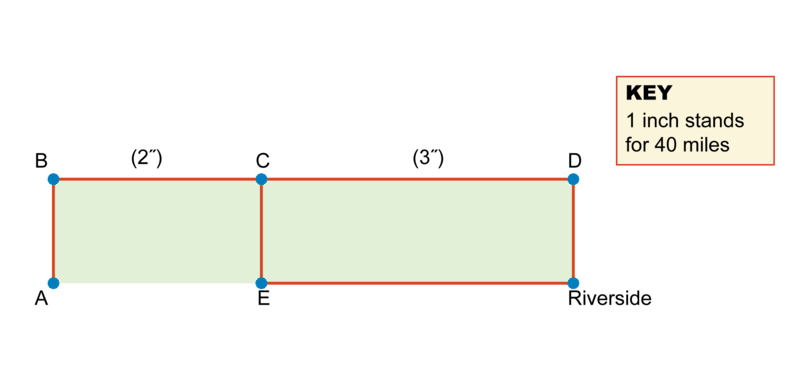

1.  Albion to Riverside is 40 miles.
2.  Felton is 120 miles from Riverside and 40 miles from Mentos.
3.  Taco to Mentos to Albion is 200 miles.
4.  Santa Casa is 40 miles from Taco.

A is \_\_\_\_\_\_\_\_\_\_

B is \_\_\_\_\_\_\_\_\_\_

C is \_\_\_\_\_\_\_\_\_\_

D is \_\_\_\_\_\_\_\_\_\_

E is \_\_\_\_\_\_\_\_\_\_

4. Use your ruler and the key. Figure out distances in miles between cities. Then use the facts to name the cities.

1.  Pontero to Bard is the same distance as Pontero to Fessler to Bradley.
2.  Pontero to Fessler is 60 miles.
3.  Bard to Petersburg is the same distance as Bard to Gilton.
4.  Gilton to Petersburg is 120 miles.

A is \_\_\_\_\_\_\_\_\_\_

B is \_\_\_\_\_\_\_\_\_\_

C is \_\_\_\_\_\_\_\_\_\_

D is \_\_\_\_\_\_\_\_\_\_

E is \_\_\_\_\_\_\_\_\_\_

5. Use your ruler and the key. Figure out distances in miles between cities. Then use the facts to name the cities.

1.  Bellview to Press is the same distance as Bellview to Tapestry Falls.
2.  Spiketon to Bellview is 50 miles.
3.  Tapestry Falls to Tinseltown is 50 miles.
4.  Tapestry Falls to Tinseltown to Paradise is 100 miles.

A is \_\_\_\_\_\_\_\_\_\_

B is \_\_\_\_\_\_\_\_\_\_

C is \_\_\_\_\_\_\_\_\_\_

D is \_\_\_\_\_\_\_\_\_\_

E is \_\_\_\_\_\_\_\_\_\_

</article>

### 6.8 Bar Graphs

<article>

Look at the bar graph and the list of FACTS below. Can you label the bar graph correctly by writing the grade levels on the lines under the bars? In this section, we will learn how to use bar graphs to correctly display information.

1.  There are twice as many grade 1 students as grade 4 students.
2.  There are 10 more grade 1 students than grade 3 students.
3.  There are half as many grade 5 students as grade 3 students.
4.  The total number of student in the 5 grades is 175.

### Bar Graphs 

In order to interpret and use bar graphs like the one above, use the problem solving steps to help you.

* First, **describe** what you see and what information you are given.
* Next, identify what **your job** is and what you are trying to solve. In these problems, your job will be to label the bar graph correctly, or correctly fill in missing bars.
* Third, make a **plan** for how you will solve.
* Fourth, **solve** the problem.
* Last, **check** your answer. Make sure your solution works with all of the facts.

#### Interpreting Bar Graphs 

1. Use the FACTS and the bar graph to figure out the names. Write the names on the lines under the bars.

1.  Ella read half as many books as Dora.
2.  Cal read twice as many books as Abe.
3.  Bea didn’t read the greatest number of books.
4.  Together, Bea and Cal read 21 books.

We can use problem solving steps to help.

**Describe:** The graph has 5 bars. The bars show numbers of books. The FACTS give information about the number of books each student has read.

**My Job:** Use the facts to figure out the student represented by each bar. Write the names under the bars.

**Plan:** Use the scale. Figure out the number of books for each bar. Find numbers that fit the FACTS. Label the bars with the students.

**Solve:** From left to right, the bars stand for 4, 6, 7, 9, and 12 books.

2. Use the FACTS and the bar graph to figure out the names. Write the names on the lines under the bars.

1.  Jack has half as many markers as Neil.
2.  Together, Jack and Mimi have the same number of markers as Leanne.
3.  Leanne has twice as many markers as Kent

We can use problem solving steps to help.

**Describe:** The graphs has 5 bars. The bars show numbers of markers. The FACTS give information about the number of markers that each student has.

**My Job:** Use the facts to figure out the student represented by each bar. Write the students under the bars.

**Plan:** Use the scale. Figure out the number of markers for each bar. Find numbers that fit the FACTS. Label the bars with the students.

**Solve:** From left to right, the bars stand for 15, 20, 25, 30, and 40 markers.

 and Mimi (25 markers) have the same number of markers as Leanne (40 markers). Leanne, who has 40 markers, has twice as many markers as Kent, who has 20 markers.")

3. Use the FACTS and the bar graph. Draw the missing bars.

1.  Lily has twice as many markers as Jan.
2.  Bob has 10 fewer markers than Kyle.
3.  Eric has half as many markers as Lily.

We can use problem solving steps to help.

**Describe:** The bar graph shows numbers of markers. Three bars are missing. FACTS give information about the missing bars.

**My Job:** Use the FACTS. Draw the missing bars.

**Plan:** Figure out the number of markers for Jan and Kyle. Then use the FACTS.

__1. Lily’s bar: Multiply Jan’s number of markers by 2. Draw Lily’s bar.__

3. Eric’s bar: Divide Lily’s number of markers by 2. Draw Eric’s bar.

**Solve:**

#### Earlier Problem Revisited

1.  There are twice as many grade 1 students as grade 4 students.
2.  There are 10 more grade 1 students than grade 3 students.
3.  There are half as many grade 5 students as grade 3 students.
4.  The total number of student in the 5 grades is 175.

We can use problem solving steps to help.

$$
\begin{align*}
& \mathbf{Describe:} && \text{The graph has} \ 5 \ \text{bars.}\!\\
&&& \text{The bars show numbers of students.}\!\\
&&& \text{The FACTS give information about the number of students in each grade.}\!\\
& \mathbf{My \ Job:} && \text{Use the facts to figure out the grade level represented by each bar.}\!\\
&&& \text{Write the grade levels under the bars.}\!\\
& \mathbf{Plan:} && \text{Use the scale. Figure out the number of students for each bar.}\!\\
&&& \text{Find numbers that fit the FACTS.}\!\\
&&& \text{Label the bars with the grades.}\!\\
& \mathbf{Solve:} && \text{From left to right, the bars stand for} \ 10, 25, 30, 50, \ \text{and} \ 60 \ \text{students.}\!\\
&&& \text{Fact} \ 2: \text{There are} \ 10 \ \text{more students in grade} \ 1 \ \text{than} \ 3.\!\\
&&& \qquad \qquad \text{The numbers} \ 50 \ \text{and} \ 60 \ \text{differ by} \ 10,\!\\
&&& \qquad \qquad \text{so grade} \ 1 \ \text{is} \ 60 \ \text{and grade} \ 3 \ \text{is} \ 50.\!\\
&&& \text{Fact} \ 3: 25 \ \text{is half of} \ 50 \ \text{and grade} \ 3 \ \text{is} \ 50. \ \text{So grade} \ 5 \ \text{is} \ 25.\!\\
&&& \text{Fact} \ 1: 60 \ \text{is twice} \ 30 \ \text{and grade} \ 1 \ \text{is} \ 60. \ \text{So grade} \ 4 \ \text{is} \ 30.\!\\
&&& \text{Fact} \ 4: \text{The only grade left is grade} \ 2, \ \text{so it must be} \ 10, \ \text{and} \ 10 \ \text{added to the total}\!\\
&&& \text{number of students in the other grades equals} \ 175.\!\\
&&& \qquad \qquad \text{Grade} \ 2 (10), \text{grade} \ 5 (25), \text{grade} \ 4 (30), \text{grade} \ 3 (50), \text{grade} \ 1 (60)\!\\
& \mathbf{Check:} && \text{Grade} \ 1 \ \text{is twice grade} \ 4: 2 \times 30 = 60.\!\\
&&& 10 \ \text{more students in grade} \ 1 \ \text{than grade} \ 3: 50 + 10 = 60.\!\\
&&& \text{Half as many in grade} \ 5 \ \text{than in grade} \ 3: 50 \div 2 = 25.\!\\
&&& \text{Total:} \ 10 + 25 + 30 + 50 + 60 = 175.
\end{align*}
$$

### Vocabulary

A **_bar graph_** is a way of representing information in which different amounts are shown by the height of their rectangles (bars).

### Examples

#### Example 1

Use the FACTS and the bar graph to figure out the names. Write the names on the lines under the bars.

1.  Grade 3 has 10 more pets than grade 1.
2.  Grade 5 has half as many pets as grade 4.
3.  Grade 2 has the same number of pets as grades 4 and 5 together.
4.  Grade 3 has the same number of pets as grades 1 and 5 together.

Use the FACTS and the bar graph to figure out the names. Write the names on the lines under the bars.

1.  There are half as many rooms in Earl’s house as in Fran’s house.
2.  Hal’s and Ian’s houses have a total of 12 rooms.
3.  Hal’s house has twice as many rooms as Ian’s house.
4.  There is one more room in Gina’s house than in Earl’s house.
5.  Gina’s house has 2 more rooms than Ian’s house.

Use the FACTS and the bar graph. Draw the bars.

1.  Ella has 2 more pens than Abe.
2.  Dora has twice as many pens as Bea.
3.  Cal has half as many pens as Abe.

1. Use the FACTS and the bar graph. Draw the bars.

1.  Mary has 10 more pencils than Neil.
2.  Lisa has half as many pencils as Mary.
3.  Owen and Patty have 45 pencils altogether.

2. Use the FACTS and the bar graph. Draw the bars.

1.  Edna has half as many sports cards as Frank.
2.  Helen has 3 more sports cards than George.
3.  George has twice as many sports cards as Iris.

3. Use the FACTS and the bar graph. Draw the bars.

1.  Fred has twice as many stickers as Henry.
2.  Gina has half as many stickers as Ida.
3.  Jenny has 30 fewer stickers than Ida.

4. Use the FACTS and the bar graph to figure out the names. Write the names on the lines under the bars.

1.  Jenny has won 4 more games than Dave.
2.  Jessie has won half as many games as Jenny.
3.  Mike and Lucy have won the same number of games.

5. Use the FACTS and the bar graph to figure out the grades. Write the grades on the lines under the bars.

1.  Grade 2 has the fewest number of homework problems per night.
2.  Grade 1 has twice as many homework problems as Grade 2.
3.  Grade 4 has 10 more homework problems per night than Grade 1.
4.  Grade 5 has 10 more homework problems per night than Grade 3.

</article>

## 7.0 CK-12 Algebra Explorations Concepts, Grade 5

<article>

Introduction
------------

In these concepts, you will continue to develop ten key concepts of algebra and will practice your problem solving skills. There are ten concepts, and each one focuses on a key algebraic thinking strategy. You will focus on describing, identifying your job, planning, solving, and checking your thinking.

</article>

### 7.1 Solve for the Unknown

<article>

Can you use the order of operations? What's the value of $a$? In this section, we will learn to use the order of operations.

$(3 + 5) \div 2 + 4 \times 6 = a$

### Solve for the Unknown 

The **order of operations** tells us the correct order of evaluating math expressions. We always do **_parenthesis first_**. Then we do **_multiplication and division (from left to right)_** and finally **_addition and subtraction (from left to right)_**.

In order to evaluate expressions using the order of operations, we can use the problem solving steps to help.

* First, **describe** what you see in the problem. What operations are there?
* Second, identify what **your job** is. In these problems, your job will be to solve for the unknown.
* Third, make a **plan**. In these problems, your plan should be to use the order of operations.
* Fourth, **solve**.
* Fifth, **check**.

#### Solving for Unknown Values 

1. Figure out the value of the variable. Follow the order of operations.

$8-(3-1)+6\times 2=e$

We can use the problem solving steps to help.

**Describe:** The equation has parenthesis, multiplication, addition and subtraction.

**My Job:** Do the operations to figure out the value of $e$.

**Plan:** Do the parenthesis first. Then do the multiplication. Finally, do the subtraction and addition from left to right.

**Solve:** First do the parenthesis: $8-(3-1)+6\times 2=8-2+6\times 2$

__Next do the multiplication: $8-2+6\times 2=8-2+12$__

$e=18$

**Check:** $8-(3-1)+6\times 2=8-2+6\times 2=8-2+12=6+12=18$

2. Figure out the value of the variable. Follow the order of operations.

$(4 + 6) \div 5 - 3 \div 3 = a$

We can use the problem solving steps to help.

**Describe:** The equation has parenthesis, division, addition and subtraction.

**My Job:** Do the operations to figure out the value of $a$.

**Plan:** Do the parenthesis first. Then do the division. Finally, do the subtraction and addition from left to right.

**Solve:** First do the parenthesis: $(4 + 6) \div 5 - 3 \div 3 =10\div 5-3 \div 3$

__Next do the division: $10\div 5-3 \div 3=2-1$__

$a=1$

**Check:** $(4 + 6) \div 5 - 3 \div 3 =10\div 5-3 \div 3=2-1=1$

3. Figure out the value of the variable. Follow the order of operations.

$6 \times 7 \div 6 + 8 = c$

We can use the problem solving steps to help.

**Describe:** The equation has multiplication, division and addition.

**My Job:** Do the operations to figure out the value of $c$.

**Plan:** Do the multiplication and division first from left to right. Then do the addition.

**Solve:** First do the multiplication and division: $6 \times 7 \div 6 + 8=42 \div 6+8=7+8$

__Last do the addition: $7+8=15$__

$c=15$

**Check:** $6 \times 7 \div 6 + 8=42 \div 6 +8=7+8=15$

#### Earlier Problem Revisited

$(3 + 5) \div 2 + 4 \times 6 = a$

We can use the problem solving steps to help.

**Describe:** The equation has parenthesis, division, multiplication and addition.

**My Job:** Do the operations to figure out the value of $a$.

**Plan:** Do the parenthesis first. Then, do the multiplication and division from left to right. Finally do the addition.

**Solve:** First do the parenthesis: $(3 + 5) \div 2 + 4 \times 6=8 \div 2 +4 \times 6$

__Next do the multiplication and division from left to right: $8 \div 2 +4 \times 6=4+24$__

$a=28$

**Check:** $(3 + 5) \div 2 + 4 \times 6=8 \div 2 +4 \times 6 = 4+24=28$

### Vocabulary

**_Order of operations_** tell us the correct order of evaluating math expressions. We always do **Parenthesis** first. Then we do **_multiplication and division (from left to right)_** and finally **_addition and subtraction (from left to right)_**.

### Examples

Figure out the value of the variables. Follow the order of operations.

#### Example 1

$(10 - 2) \div 2 + 5 \times 3 = b$

$b = 19$

#### Example 2

$4 + (9 + 6) \div 3 = d$

$d = 9$

#### Example 3

$12 + 2 \times 3 \div 6 + (7 - 4) = q$

$q = 16$

### Review 

Figure out the value of the variables. Follow the order of operations.

1.  $4 \times (6 - 2) \div 2 \times 3 = t$
2.  $2 \times (11 - 1) \div 2 = g$
3.  $3 \times (12 - 4) - (5 - 2) = m$
4.  $6 \times (7 + 3) \div 4 \times 2 = n$
5.  $3 \times (5-2) - (3 -2) = p$
6.  $2 \times (6+1) \div 2 \times 3 = q$
7.  $5 \times (4-1) + 3 \times 8 = r$
8.  $8 \times (5-4) \div 2 \times 5 = s$
9.  $7 \times (7 - 3) \div 2 + 1 = u$
10. $5 \times (3+4) + 2 \times 3 = w$

</article>

### 7.2 Distributive Property and Solving for Unknowns

<article>

Can you figure out the value of b in the equation below? Do you know how to use the distributive property and the order of operations? In this section, you will learn how to correctly use the distributive property and order of operations to solve for unknowns.

$3 \times (6 + b) = 30$

### The Distributive Property and Solving for Unknowns 

The **order of operations** tells us the correct order of evaluating math expressions. We always do **_parentheses first_**. Then we do **_multiplication and division (from left to right)_** and finally **_addition and subtraction (from left to right)_**. The **_distributive property_** allows us to remove parentheses when there is an unknown inside of them.

In order to evaluate expressions using the distributive property and the order of operations, we can use the problem solving steps to help.

* First, **describe** what you see in the problem. What operations are there?
* Second, identify what **your job** is. In these problems, your job will be to solve for the unknown.
* Third, make a **plan**. In these problems, your plan should be to use the distributive property and the order of operations.
* Fourth, **solve**.
* Fifth, **check**. Substitute your answer into the equation and make sure it works.

#### Using the Distributive Property and Order of Operations

1. Figure out the value of the variable. Show the steps.

$5 \times (a + 4) = 40$

We can use the problem solving steps to help.

**Describe:** The equation has parentheses, multiplication and addition.

**My Job:** Do the operations and use the distributive property to figure out the value of $a$.

**Plan:** Do the distributive property first. Then solve the equation for $a$.

**Solve:** First do the distributive property:

$$
\begin{align*}
5 \times (a + 4) &= 40. 5a+20 &=40
\end{align*}
$$

Next solve the equation:

$$
\begin{align*}
5a+20&=40 \\ 5a&=20. a&=4
\end{align*}
$$

**Check:**

$$
\begin{align*}
5 \times (4 + 4) &= 40. 5 \times 8 &= 40. 40&=40
\end{align*}
$$

2. Figure out the value of the variable. Show the steps.

$6 \times (c + 2) = 24$

We can use the problem solving steps to help.

**Describe:** The equation has parentheses, multiplication and addition.

**My Job:** Do the operations and use the distributive property to figure out the value of $a$.

**Plan:** Do the distributive property first. Then solve the equation for $c$.

**Solve:** First do the distributive property:

$$
\begin{align*}
6 \times (c + 2) &= 24. 6c+12 &=24
\end{align*}
$$

Next solve the equation:

$$
\begin{align*}
6c+12 &=24 \\ 6c&=12. c&=2
\end{align*}
$$

**Check:**

$$
\begin{align*}
6 \times (2 + 2) &= 24. 6 \times 4 &=24. 24&=24
\end{align*}
$$

3. Figure out the value of the variable. Show the steps.

$3 \times (3 + d) = 36$

We can use the problem solving steps to help.

**Describe:** The equation has parentheses, multiplication and addition.

**My Job:** Do the operations and use the distributive property to figure out the value of $a$.

**Plan:** Do the distributive property first. Then solve the equation for $d$.

**Solve:** First do the distributive property:

$$
\begin{align*}
3 \times (3 + d) &= 36. 9+3d &=36
\end{align*}
$$

Next solve the equation:

$$
\begin{align*}
9+3d &=36 \\ 3d&=27. d&=9
\end{align*}
$$

**Check:**

$$
\begin{align*}
3 \times (3 + 9) &= 36. 3 \times 12 &=36. 36&=36
\end{align*}
$$

#### Earlier Problem Revisited

$3 \times (6 + b) = 30$

We can use the problem solving steps to help.

**Describe:** The equation has parentheses, multiplication and addition.

**My Job:** Do the operations and use the distributive property to figure out the value of $a$.

**Plan:** Do the distributive property first. Then solve the equation for $b$.

**Solve:** First do the distributive property:

$$
\begin{align*}
3  \times (6 + b) &= 30. 18+3b &=30
\end{align*}
$$

Next solve the equation:

$$
\begin{align*}
18+3b &=30 \\ 3b&=12. b&=4
\end{align*}
$$

**Check:**

$$
\begin{align*}
3  \times (6 + 4) &= 30. 3 \times 10 &=30. 30&=30
\end{align*}
$$

### Vocabulary

**The order of operations** tells us the correct order of evaluating math expressions. We always do **_parentheses first_**. Then we do **_multiplication and division (from left to right)_** and finally **_addition and subtraction (from left to right)_**. The **_distributive property $([a \times (b + c) = a \times b + a \times c])$_** allows us to remove parentheses when there is an unknown inside of them.

### Examples

Figure out the value of each variable. Show the steps.

#### Example 1

$2 \times (4 + e) + 7 \times 4 = 46$

$$
\begin{align*}
2 \times (4 + e) + 7 \times 4 &= 46\\
8 + 2e + 28 &= 46\\
 36 + 2e &= 46\\
 2 e &= 10\\
e &= 5
\end{align*}
$$

#### Example 2

$6 \div 2 \div 3 \times (f + 2) = 11$

$$
\begin{align*}
6 \div 2 \div 3 \times (f + 2) &= 11\\
1 \times (f + 2) &= 11\\
f + 2 &= 11\\
f & = 9
\end{align*}
$$

#### Example 3

$37 = 3(m + 6) + 4(9-5)$

$$
\begin{align*}
37 &= 3(m + 6) + 4(9-5)\\
37 &= 3m + 18 + 4(9 - 5)\\
37 &= 3m + 18 + 4 \times 4\\
37 &= 3m + 18 + 16\\
37 &= 3m + 34\\
3 &= 3m\\
1 &= m
\end{align*}
$$

### Review 

Figure out the value of each variable. Show the steps.

1.  $(8 + 2) \div 5 \times (g + 4) = 32$
2.  $70 = 5 \times (9+ t) + 4 \times (t + 4)$
3.  $12 \div 6 \div 2 \times (x +9)=11$
4.  $(2+3) \div 5 \times (n+1)=8$
5.  $25=5\times (u+1)+3 \times (u+4)$

</article>

### 7.3 Circle Sums 5

<article>

Look at the picture below. The arrows point to the sum of each row or column. Can you figure out the value of each of the three letters? In this section, we will practice solving for unknowns in circles and arrows diagrams.

In order to solve the problem above, use the problem solving steps.

* Start by **describing** what you see in the diagram.
* Next, figure out what **your job** is in this problem. In all of these problems your job will be to figure out the value of the three letters in the diagram.
* Then, make a **plan** for how you will solve. There is usually more than one way to solve the problem. You will want to figure out one letter first and then the next letter. In some of these problems you might need to find the sum of two letters first in order to find the value of one letter.
* Next, **solve** the problem.
* Finally, **check** to make sure that the values you found work for all six of the arrows.

#### Finding Unknown Values 

1. The arrows point to the sum of each row or column. Figure out the value of each letter.

$$
\begin{align*}
& \mathbf{Describe} && \text{Rows and columns contain numbers or letters.}\\
&&& \text{Arrows point to sums.}\\
&&& \text{There are three different letters.}\\
&&& \text{Row 3 has only As.}\\
& \mathbf{My \ job} && \text{Figure out the value of each letter,} \ A, \ B, \ \text{and} \ C.\\
& \mathbf{Plan} && \text{Row} \ 3: \ 2+A+A=10. \ \text{Figure out the value of} \ A.\\
&&& \text{Replace} \ A \ \text{with its value to figure out the value of} \ B \ \text{and} \ C.\\ 
& \mathbf{Solve} && \text{Row} \ 3: \ 2+A+A=10. \ \text{So} \ 2A = 8, \ \text{and} \ A=4.\\
&&& \text{Column} \ 1: C+A+2=11. \ \text{Replace} \ A  \ \text{with} \ 4.\\
&&& \text{Then} \ C+4+2=11 \ \text{and} \ C = 11-6, \ \text{or} \ 5.\\
&&& \text{Column} \ 2: \ \text{Replace}\ C \ \text{with} \ 5. \ \text{Then} \ C+B+A=12, 5+B+4=12, \\ &&&\text{so} \ B+9=12 \ \text{and} \ B = 3.\\
&&& A = 4, B = 3, C = 5.\\
& \mathbf{Check} && \text{Replace letters with their values. Check with the sums.}\\
&&& \text{Rows top to bottom:} \ 5+5+4=14 \ \text{Columns left to right:} \ 5+4+2=11\\
&&& \qquad \qquad \qquad \qquad \quad \ 4+3+3=10 \qquad \qquad \qquad \qquad \qquad \quad 5+3+4=12\\
&&& \qquad \qquad \qquad \qquad \quad \ 2+4+4=10 \qquad \qquad \qquad \qquad \qquad \ 4+3+4=11
\end{align*}
$$

2. The arrows point to the sum of each row or column. Figure out the value of each letter.

We can use problem solving steps to help.

$$
\begin{align*}
& \mathbf{Describe} && \text{Rows and columns contain numbers or letters.}\\
&&& \text{Arrows point to sums.}\\
&&& \text{There are three different letters.}\\
&&& \text{No rows or columns contain only one type of letter.}\\
& \mathbf{My \ job} && \text{Figure out the value of each letter,} \ A, \ B, \ \text{and} \ C.\\
& \mathbf{Plan} && \text{Row} \ 2: \ A+B+5=15. \ \text{Figure out the value of} \ A + B.\\
&&& \text{Column} \ 1: A + A + B = 16.\\
&&& \text{Replace} \ A + B \ \text{with its sum to figure out the value of} \ A.\\ 
&&& \text{Then replace all A's with that number and solve for other letters.}\\
& \mathbf{Solve} && \text{Row} \ 2: \ A+B+5=15. \ \text{So} \ A+B= 15-5, \ \text{or} \ 10.\\
&&& \text{Column} \ 1: A+A+B=16. \ \text{Replace} \ A + B \ \text{with} \ 10.\\
&&& \text{Then} \ A+10 = 16 \ \text{and} \ A = 16 - 10, \ \text{or} \ 6.\\
&&& \text{Column} \ 3: \ \text{Replace}\ A \ \text{with} \ 6. \ \text{Then} \ C+5+6=19, C =19-11, \ \text{or} \ 8 \ \text{and} \ C = 8.\\
&&& \text{Column} \ 2: \ \text{Replace}\ C \ \text{with} \ 8. \ \text{Then} \ B+B+8=16, \text{and} \ 2B = 8, \ \text{so} \ B=4.\\
&&& A = 6, B = 4, C = 8.\\
& \mathbf{Check} && \text{Replace letters with their values. Check with the sums.}\\
&&& \text{Rows top to bottom:} \ 6+4+8=18 \ \text{Columns left to right:} \ 6+6+4=16\\
&&& \qquad \qquad \qquad \qquad \quad \ 6+4+5=15 \qquad \qquad \qquad \qquad \qquad \quad 4+4+8=16\\
&&& \qquad \qquad \qquad \qquad \quad \ 4+8+6=18 \qquad \qquad \qquad \qquad \qquad \ 8+5+6=19
\end{align*}
$$

3. The arrows point to the sum of each row or column. Figure out the value of each letter.

$$
\begin{align*}
& \mathbf{Describe} && \text{Rows and columns contain numbers or letters.}\\
&&& \text{Arrows point to sums.}\\
&&& \text{There are three different letters.}\\
&&& \text{No rows or columns contain only one type of letter.}\\
& \mathbf{My \ job} && \text{Figure out the value of each letter,} \ A, \ B, \ \text{and} \ C.\\
& \mathbf{Plan} && \text{Column} \ 3: \ B+4+A=15. \ \text{Figure out the value of} \ A + B.\\
&&& \text{Row} \ 1: A + A + B = 16.\\
&&& \text{Replace} \ A + B \ \text{with its sum to figure out the value of} \ A.\\ 
&&& \text{Then replace all A's with that number and solve for other letters.}\\
& \mathbf{Solve} && \text{Column} \ 3: \ B+4+A=15. \ \text{So} \ B + A = 15 - 4, \ \text{or} \ 11.\\
&&& \text{Row} \ 1: A + A + B = 16. \ \text{Replace} \ A + B \ \text{with} \ 11.\\
&&& \text{Then} \ A+11 = 16 \ \text{and} \ A = 16 - 11, \ \text{or} \ 5.\\
&&& \text{Column} \ 2: \ \text{Replace}\ A \ \text{with} \ 5. \ \text{Then} \ 5+B+B=17, 2B = 17-5, \ \text{or} \ 12 \ \text{and} \ B = 6.\\
&&& \text{Column} \ 1: \ \text{Replace}\ A \ \text{with} \ 5. \ \text{Then} \ 5+C+C=11, 2C=11-5 \ \text{or} \ 6 \ \text{and} \ C = 3.\\
&&& A = 5, B = 6, C = 3.\\
& \mathbf{Check} && \text{Replace letters with their values. Check with the sums.}\\
&&& \text{Rows top to bottom:} \ 5+5+6=16 \ \text{Columns left to right:} \ 5+3+3=11\\
&&& \qquad \qquad \qquad \qquad \quad \ 3+6+4=13 \qquad \qquad \qquad \qquad \qquad \quad 5+6+6=17\\
&&& \qquad \qquad \qquad \qquad \quad \ 3+6+5=14 \qquad \qquad \qquad \qquad \qquad \ 6+4+5=15
\end{align*}
$$

#### Earlier Problem Revisited

The arrows point to the sum of each row or column. Figure out the value of each letter.

$$
\begin{align*}
& \mathbf{Describe} && \text{Rows and columns contain numbers or letters.}\\
&&& \text{Arrows point to sums.}\\
&&& \text{There are three different letters.}\\
&&& \text{No rows or columns contain only one type of letter.}\\
& \mathbf{My \ job} && \text{Figure out the value of each letter,} \ A, \ B, \ \text{and} \ C.\\
& \mathbf{Plan} && \text{Row} \ 3: \ B + A + 4 = 16. \ \text{Figure out the value of} \ A + B.\\
&&& \text{Column} \ 1: A + A + B = 17.\\
&&& \text{Replace} \ A + B \ \text{with its sum to figure out the value of} \ A.\\ 
&&& \text{Then replace all A's with that number and solve for other letters.}\\
& \mathbf{Solve} && \text{Row} \ 3: \ B + A + 4 = 16. \ \text{So} \ B + A = 16 - 4, \ \text{or} \ 12.\\
&&& \text{Column} \ 1: A + A + B = 17. \ \text{Replace} \ A + B \ \text{with} \ 12.\\
&&& \text{Then} \ 12 + A = 17 \ \text{and} \ A = 17 - 12, \ \text{or} \ 5.\\
&&& \text{Column} \ 2: \ \text{Replace}\ A \ \text{with} \ 5. \ \text{Then} \ C + C + 5 = 9, 2C = 9 - 5, \ \text{or} \ 4 \ \text{and} \ C = 2.\\
&&& \text{Column} \ 3: \ \text{Replace}\ C \ \text{with} \ 2. \ \text{Then} \ B + 2 + 4 = 13, \text{and} \ B = 13 - 6, \ \text{or} \ 7.\\
&&& A = 5, B = 7, C = 2.\\
& \mathbf{Check} && \text{Replace letters with their values. Check with the sums.}\\
&&& \text{Rows top to bottom:} \ 5 + 2 + 7 = 14 \ \text{Columns left to right:} \ 5 + 5 + 7 = 17\\
&&& \qquad \qquad \qquad \qquad \quad \ 5 + 2 + 2 = 9 \qquad \qquad \qquad \qquad \qquad \quad 2 + 2 + 5 = 9\\
&&& \qquad \qquad \qquad \qquad \quad \ 7 + 5 + 4 = 16 \qquad \qquad \qquad \qquad \qquad \ 7 + 2 + 4 = 13
\end{align*}
$$

### Vocabulary

In math, an **_unknown_** is a letter that stands for a number that we do not yet know the value of. In this concept, when you figured out the value of the letters in the circles and arrows diagrams you were solving for **_unknowns._**

### Examples

The arrows point to the sum of each row or column. Figure out the value of each letter.

#### Example 1

#### Example 2

#### Example 3

### Review 

The arrows point to the sum of each row or column. Figure out the value of each letter.

1.  \[Figure 9\]
2.  \[Figure 10\]
3.  \[Figure 11\]
4.  \[Figure 12\]
5.  \[Figure 13\]

</article>

### 7.4 Hanging Scales 5

<article>

Look at the pictures of the scales below. Can you write equations to represent what you see on each scale? Can you figure out the value of each letter? In this section, we will practice working with equations that represent what we see on scales. We will then practice solving these systems of equations.

In order to solve the problem above, use the problem solving steps.

* Start by **describing** what information is given.
* Then, identify what **your job** is. In these problems, your job will be to figure out the value of each of the three variables.
* Next, make a **plan** for how you will solve. In these problems, write equations to represent the scales first. Then, solve the system of equations.
* Then, **solve** the problem.
* Finally, **check** your solution. Make sure that your solution causes each scale to have the correct weight.

#### Writing Equations and Finding Unknown Values 

1. Write equations. Figure out the weights of the blocks.

$$
\begin{align*}
& \mathbf{Describe} && \text{There are three scales with blocks.}\\
&&& A: \ \text{one} \ x \ \text{and} \ \text{one} \ z \ \text{block. They weigh} \ 10 \ \text{pounds.}\\
&&& B: \ \text{one} \ z \ \text{and} \ 2 \ x \ \text{blocks. They weigh} \ 13 \ \text{pounds.}\\
&&& C: \ \text{one} \ x \ \text{and} \ 2 \ y \ \text{blocks. They weigh} \ 15 \ \text{pounds.}\\
&&& \text{All blocks on} \ A \ \text{are also on} \ B.\\
& \mathbf{My \ Job} && \text{Use the scales as clues. Figure out the weights of the blocks.}\\
& \mathbf{Plan} && \text{Write equations, one for each scale.}\\
&&& A: x+z=10; \ B: x+x+z=13; \ C:  \ x+y+y=15.\\
&&& \text{Solve the equations.}\\
& \mathbf{Solve} && A: x+z=10\\
&&& B: x+(x +z) = 13. \ \text{Replace} \ (x + z ) \ \text{with} \ 10.\\
&&& x+10 = 13, \ \text{and}\\
&&& x = 13-10, \ \text{or} \ 3 \ \text{pounds.}\\
&&& A: \text{Replace} \ x \ \text{with} \ 3. \\
&&& 3 + z = 10, \ \text{and}\\
&&& z = 10 - 3, \ \text{or} \ 7 \ \text{pounds}\\
&&& C: x+y+y=15. \ \text{Replace} \ x \ \text{with} \ 3. \ \text{Then} \ 3 +y+y=15.\\
&&& y + y = 15 - 3, \ \text{or} \ 12.\\
&&& y = 12 \div 2, \ \text{or} \ 6 \ \text{pounds.}\\
& \mathbf{Check} && \text{Replace each block with its weight. Check that the total equals the}\\
&&& \text{number of pounds shown on the scales.}\\
&&& A: 3+7=10; \ B: 3+3+7=13; \ C: 3+6+6=15.
\end{align*}
$$

2. Write equations. Figure out the weights of the blocks.

$$
\begin{align*}
& \mathbf{Describe} && \text{There are three scales with blocks.}\\
&&& A: \ \text{one} \ y \ \text{and} \ 2 \ x \ \text{blocks. They weigh} \ 9 \ \text{pounds.}\\
&&& B: \ \text{two} \ x \ \text{blocks and} \ 2 \ y \ \text{blocks. They weigh} \ 14 \ \text{pounds.}\\
&&& C: \ 1 \ x \ \text{and} \ 1 \ y \ \text{and} \ 1 \ z \ \text{block. They weigh} \ 10 \ \text{pounds.}\\
&&& \text{All blocks on} \ A \ \text{are also on} \ B.\\
& \mathbf{My \ Job} && \text{Use the scales as clues. Figure out the weights of the blocks.}\\
& \mathbf{Plan} && \text{Write equations, one for each scale.}\\
&&& A: x+x+y=9; \ B: x+x+y+y=14; \ C:  \ x+y+z=10.\\
&&& \text{Solve the equations.}\\
& \mathbf{Solve} && A: x+x+y=9\\
&&& B: (x+x+y) + y = 14. \ \text{Replace} \ (x + x + y) \ \text{with} \ 9.\\
&&& 9 + y = 14, \ \text{and}\\
&&& y = 14 - 9, \ \text{or} \ 5 \ \text{pounds.}\\
&&& A: \text{Replace} \ y \ \text{with} \ 5.\\
&&& x+x+5=9, \ \text{so}\\
&&& x+x = 4, \ \text{and} \ x=2 \ \text{pounds}\\
&&& C: x+y+z=10. \ \text{Replace} \ x \ \text{with} \ 2 \ \text{and } \ y \ \text{with} \ 5. \ \text{Then} \ 2+5+z=10.\\
&&& z=10-7, \ \text{or} \ 3.\\
& \mathbf{Check} && \text{Replace each block with its weight. Check that the total equals the}\\
&&& \text{number of pounds shown on the scales.}\\
&&& A: 2+2+5=9; \ B: 2+2+5+5=14; \ C: 2+3+5=10.
\end{align*}
$$

3. Write equations. Figure out the weights of the blocks.

$$
\begin{align*}
& \mathbf{Describe} && \text{There are three scales with blocks.}\\
&&& A: \ \text{one} \ y \ \text{and} \ 1 \ z \ \text{block. They weigh} \ 11 \ \text{pounds.}\\
&&& B: \ \text{one} \ z \ \text{and} \ 2 \ y \ \text{blocks. They weigh} \ 14 \ \text{pounds.}\\
&&& C: \ \text{one} \ z \ \text{and} \ 2 \ x \ \text{blocks. They weigh} \ 16 \ \text{pounds.}\\
&&& \text{All blocks on} \ A \ \text{are also on} \ B.\\
& \mathbf{My \ Job} && \text{Use the scales as clues. Figure out the weights of the blocks.}\\
& \mathbf{Plan} && \text{Write equations, one for each scale.}\\
&&& A: z+y=11; \ B: z+y+y=14; \ C:  \ x+x+z=16.\\
&&& \text{Solve the equations.}\\
& \mathbf{Solve} && A: z+y=11\\
&&& B: (z+y) + y = 14. \ \text{Replace} \ (z+y) \ \text{with} \ 11.\\
&&& 11 + y = 14, \ \text{and}\\
&&& y = 14 - 11, \ \text{or} \ 3 \ \text{pounds.}\\
&&& A: \text{Replace} \ y \ \text{with} \ 3.\\
&&& z+3=11, \ \text{and}\\
&&& z = 11 - 3, \ \text{or} \ 8 \ \text{pounds}\\
&&& C: x+x+z=16. \ \text{Replace} \ z \ \text{with} \ 8. \ \text{Then} \ x+x+8=16.\\
&&& x + x = 16-8, \ \text{or} \ 8.\\
&&& x= 8 \div 2, \ \text{or} \ 4 \ \text{pounds.}\\
& \mathbf{Check} && \text{Replace each block with its weight. Check that the total equals the}\\
&&& \text{number of pounds shown on the scales.}\\
&&& A: 8+3=11; \ B: 8+3+3=14; \ C: 4+4+8=16.
\end{align*}
$$

#### Earlier Problem Revisited

$$
\begin{align*}
& \mathbf{Describe} && \text{There are three scales with blocks.}\\
&&& A: \ \text{one} \ x \ \text{and} \ 2 \ y \ \text{blocks. They weigh} \ 14 \ \text{pounds.}\\
&&& B: \ \text{one} \ x \ \text{and} \ 3 \ y \ \text{blocks. They weigh} \ 18 \ \text{pounds.}\\
&&& C: \ \text{one} \ y \ \text{and} \ 2 \ z \ \text{blocks. They weigh} \ 14 \ \text{pounds.}\\
&&& \text{All blocks on} \ A \ \text{are also on} \ B.\\
& \mathbf{My \ Job} && \text{Use the scales as clues. Figure out the weights of the blocks.}\\
& \mathbf{Plan} && \text{Write equations, one for each scale.}\\
&&& A: x + y + y = 14; \ B: x + y + y + y = 18; \ C:  \ y + z + z = 14.\\
&&& \text{Solve the equations.}\\
& \mathbf{Solve} && A: x + y + y = 14\\
&&& B: (x + y + y) + y = 18. \ \text{Replace} \ (x + y + y) \ \text{with} \ 14.\\
&&& 14 + y = 18, \ \text{and}\\
&&& y = 18 - 14, \ \text{or} \ 4 \ \text{pounds.}\\
&&& A: \text{Replace} \ y + y \ \text{with} \ 4 + 4, \ \text{or} \ 8.\\
&&& x + 8 = 14, \ \text{and}\\
&&& x = 14 - 8, \ \text{or} \ 6 \ \text{pounds}\\
&&& C: y + z + z = 14. \ \text{Replace} \ y \ \text{with} \ 4. \ \text{Then} \ 4 + z + z = 14.\\
&&& z + z = 14 - 4, \ \text{or} \ 10.\\
&&& z = 10 \div 2, \ \text{or} \ 5 \ \text{pounds.}\\
& \mathbf{Check} && \text{Replace each block with its weight. Check that the total equals the}\\
&&& \text{number of pounds shown on the scales.}\\
&&& A: 6 + 4 + 4 = 14; \ B: 6 + 4 + 4 + 4 = 18; \ C: 4 + 5 + 5 = 14.
\end{align*}
$$

### Vocabulary

In math, an **_unknown_** is a letter that stands for a number that we do not yet know the value of. In this concept, the blocks that we did not know the weights of were **_unknowns_**. An **_equation_** is a math sentence that tells us two quantities that are equal. In this concept, we wrote **_equations_** with unknowns to represent what we saw on the scales. A **_system of equations_** is a set of equations that represents a given problem. Since we wrote multiple equations for each problem in this concept, we wrote a **_system of equations_** for each problem.

### Examples 

Write equations. Figure out the weights of the blocks.

#### Example 1

$x = 3, y = 5, \ z = 8$

#### Example 2

$x = 7,  y = 6,  z = 8$

#### Example 3

__$x = 9,  y = 7,  z = 4$__

$x = 9,  y = 7,  z = 4$

### Review 

Write equations. Figure out the weights of the blocks.

1.  \[Figure 9\]
2.  \[Figure 10\]
3.  \[Figure 11\]
4.  \[Figure 12\]
5.  \[Figure 13\]
6.  \[Figure 14\]

</article>

### 7.5 XYZ

<article>

Look at the equations below. Eric wrote these equations to represent pictures of scales with blocks. This is called a system of equations. Can you figure out the values of the letters? In this section we will learn how to solve systems of equations.

$$
\begin{align*}
A&: x + y = 12\\
B&: x + x + y = 19 \\
C&: x + z = 10
\end{align*}
$$

### XYZ

In order to figure out the values of the letters from the equations above, see if you can use the information from one equation to rewrite another equation. Once you can solve for one letter, then try to solve for the second letter. Finally, solve for the last letter. Take a look at the examples to see how this might work.

#### Finding Unknown Values 

1. Eric wrote these equations to represent pictures of scales with blocks. Figure out the value of each unknown.

$$
\begin{align*}
A: y& + z + z = 19 \\
B: y& + z = 13 \\
C: x& + y + y = 19
\end{align*}
$$

We can use problem solving steps to help.

$$
\begin{align*}
& \mathbf{Describe} && \text{There are three equations. There are 3 unknowns.}\\
&&& \text{All equations have more than one unknown.}\\
& \mathbf{My \ Job} && \text{Figure out the values of} \ x, y, \ \text{and} \ z.\\
& \mathbf{Plan} && \text{All equations have more than one unknown.}\\
&&& \text{Equations} \ A \ \text{and} \ B \ \text{are related. In Equation} \ B, y+z=13\\
&&& \text{That same} \ y+z \ \text{can be replaced by its value} \ 13 \ \text{in Equation} \ A.\\
&&& \text{Replace} \ y+z \ \text{with} \ 13. \ \text{Figure out the value of the extra} \ z.\\
&&& \text{Replace all} \ z's \ \text{with that value in all equations and continue to solve for the}\\
&&& \text{other unknowns.}\\
& \mathbf{Solve} && B: y+z=13.\\
&&& A: \text{Replace} \ y+z\ \text{with} \ 13. \ 13+z=19.\\
&&& \text{So,} \ z = 19 - 13, \ \text{or} \ 6.\\
&&& \text{Replace all} \ z's \ \text{with} \ 6.\\
&&& B:  y+6=13, \ \text{so} \ y = 13 - 6, \ \text{or} \ 7.\\
&&& C: x+y+y=19, \ \text{so} \ x+7+7=19, \ \text{so} \ x = 19 - 14, \ \text{or} \ 5.\\ 
&&& \text{So} \ x = 5, \ y = 7, \ z = 6\\
& \mathbf{Check} && \text{Replace each variable with its value.}\\
&&& A: 7+6+6=19; \ B: 7+6=13; \ C: 5+7+7=19.
\end{align*}
$$

2. Eric wrote these equations to represent pictures of scales with blocks. Figure out the value of each unknown.

$$
\begin{align*}
A: x& + x + y = 20\\
B: y& + z + z = 26 \\
C: y& + z = 17
\end{align*}
$$

We can use problem solving steps to help.

$$
\begin{align*}
& \mathbf{Describe} && \text{There are three equations. There are 3 unknowns.}\\
&&& \text{All equations have more than one unknown.}\\
& \mathbf{My \ Job} && \text{Figure out the values of} \ x, y, \ \text{and} \ z.\\
& \mathbf{Plan} && \text{All equations have more than one unknown.}\\
&&& \text{Equations} \ B \ \text{and} \ C \ \text{are related. In Equation} \ C, y+z=17\\
&&& \text{That same} \ y+z \ \text{can be replaced by its value} \ 17 \ \text{in Equation} \ B.\\
&&& \text{Replace} \ y+z \ \text{with} \ 17. \ \text{Figure out the value of the extra} \ z.\\
&&& \text{Replace all} \ z's \ \text{with that value in all equations and continue to solve for the}\\
&&& \text{other unknowns.}\\
& \mathbf{Solve} && C: y+z=17.\\
&&& B: \text{Replace} \ y+z \ \text{with} \ 17. \ 17+z=26.\\
&&& \text{So,} \ z = 26- 17, \ \text{or} \ 9.\\
&&& \text{Replace all} \ x's \ \text{with} \ 7.\\
&&& C:  y+9=17, \ \text{so} \ y = 17 - 9, \ \text{or} \ 8.\\
&&& A: x+x+y=20, \ \text{so} \ x+x+8=20 \ \text{and} \ 2x = 12, \ \text{so} \ x=6.\\ 
&&& \text{So} \ x = 6, \ y = 8, \ z = 9\\
& \mathbf{Check} && \text{Replace each variable with its value.}\\
&&& A: 6+6+8=20; \ B: 8+9+9=26; \ C: 8+9=17.
\end{align*}
$$

3. Eric wrote these equations to represent pictures of scales with blocks. Figure out the value of each unknown.

$$
\begin{align*}
A: x& + z = 8 \\   
B: x& + z + z = 13 \\
C: x& + y + z = 14
\end{align*}
$$

We can use problem solving steps to help.

$$
\begin{align*}
& \mathbf{Describe} && \text{There are three equations. There are 3 unknowns.}\\
&&& \text{All equations have more than one unknown.}\\
& \mathbf{My \ Job} && \text{Figure out the values of} \ x, y, \ \text{and} \ z.\\
& \mathbf{Plan} && \text{All equations have more than one unknown.}\\
&&& \text{Equations} \ A \ \text{and} \ B \ \text{are related. In Equation} \ A, x+z=8\\
&&& \text{That same} \ x+z \ \text{can be replaced by its value} \ 8 \ \text{in Equation} \ B.\\
&&& \text{Replace} \ x + z \ \text{with} \ 8. \ \text{Figure out the value of the extra} \ z.\\
&&& \text{Replace all} \ z's \ \text{with that value in all equations and continue to solve for the}\\
&&& \text{other unknowns.}\\
& \mathbf{Solve} && A: x+z=8.\\
&&& B: \text{Replace} \ x + z \ \text{with} \ 8. \ 8+z=13.\\
&&& \text{So,} \ z = 13 - 8, \ \text{or} \ 5.\\
&&& \text{Replace all} \ z's \ \text{with} \ 5.\\
&&& A:  x+5=8, \ \text{so} \ x = 8-5, \ \text{or} \ 3.\\
&&& C: x+y+z=14, \ \text{so} \ 3+y+5=14, \ \text{and} \ y=6.\\ 
&&& \text{So} \ x =3, \ y = 6, \ z = 5\\
& \mathbf{Check} && \text{Replace each variable with its value.}\\
&&& A: 3+5=8; \ B: 3+5+5=13; \ C: 3+6+5=14.
\end{align*}
$$

#### Earlier Problem Revisited

Eric wrote these equations to represent pictures of scales with blocks. Figure out the value of each unknown.

$$
\begin{align*}
A&: x + y = 12\\
B&: x + x + y = 19 \\
C&: x + z = 10
\end{align*}
$$

We can use problem solving steps to help.

$$
\begin{align*}
& \mathbf{Describe} && \text{There are three equations. There are 3 unknowns.}\\
&&& \text{All equations have more than one unknown.}\\
& \mathbf{My \ Job} && \text{Figure out the values of} \ x, y, \ \text{and} \ z.\\
& \mathbf{Plan} && \text{All equations have more than one unknown.}\\
&&& \text{Equations} \ A \ \text{and} \ B \ \text{are related. In Equation} \ A, x + y = 12\\
&&& \text{That same} \ x + y \ \text{can be replaced by its value} \ 12 \ \text{in Equation} \ B.\\
&&& \text{Replace} \ x + y \ \text{with} \ 12. \ \text{Figure out the value of the extra} \ x.\\
&&& \text{Replace all} \ x's \ \text{with that value in all equations and continue to solve for the}\\
&&& \text{other unknowns.}\\
& \mathbf{Solve} && A: x + y = 12.\\
&&& B: \text{Replace} \ x + y \ \text{with} \ 12. \ x + 12 = 19.\\
&&& \text{So,} \ x = 19 - 12, \ \text{or} \ 7.\\
&&& \text{Replace all} \ x's \ \text{with} \ 7.\\
&&& C:  7 + z = 10, \ \text{so} \ z = 10 - 7, \ \text{or} \ 3.\\
&&& A: 7 + y = 12, \ \text{so} \ y = 12 - 7, \ \text{or} \ 5.\\ 
&&& \text{So} \ x = 7, \ y = 5, \ z = 3\\
& \mathbf{Check} && \text{Replace each variable with its value.}\\
&&& A: 7 + 5 = 12; \ B: 7 + 7 + 5 = 19; \ C: 7 + 3 = 10.
\end{align*}
$$

### Vocabulary

In math, an **_unknown_** is a letter that stands for a number that we do not yet know the value of. In this concept, the blocks that we did not know the weights of were **_unknowns_**. An **_equation_** is a math sentence that tells us two quantities that are equal. In this concept, we wrote **_equations_** with unknowns to represent what we saw on the scales. A **_system of equations_** is a set of equations that represents a given problem. Since we wrote multiple equations for each problem in this concept, we wrote a **_system of equations_** for each problem.

### Examples

For each problem: Eric wrote these equations to represent pictures of scales with blocks. Figure out the value of each unknown.

#### Example 1

$x + z + z = 19$

$y + y + z = 15$

$x + z = 12$

$x = 5, \ y = 4, \ z = 7$

#### Example 2

$x + y + z = 22$

$x + z = 17$

$y + z + z = 21$

$x = 9, \ y = 5, \ z = 8$

#### Example 3

$x + y + z = 25$

$y + z = 17$  
$x + x + z = 23$

$x = 8, \ y = 10, \ z = 7$

### Review

For each problem: Eric wrote these equations to represent pictures of scales with blocks. Figure out the value of each unknown.

1. $x + x + y = 33$

__$x + z + z = 34$__

$x + y = 21$

2. $y + y + z + z = 28$

__$x + x + y = 19$__

$x + x + y + y = 24$

3. $y + y +  z + z = 20$

__$x + x + y = 14$__

$x + x + y + z = 20$

4. $x + x + y + z = 25$

__$x + y + y = 23$__

$x + y + z = 20$

5. $x + y + z + z = 31$

__$x + y + z = 22$__

$x + z = 16$

6. $x + y + z = 21$

__$x + x + y + z = 29$__

$y + y + z = 20$

</article>

### 7.6 Rectangle Facts 5

<article>

Look at the facts below about Rectangle A. Can you figure out the length of Rectangle A? What about the width? What about the area? In this section, we will learn how to use information about the length, width and perimeter of a rectangle to figure out the dimension and area of a rectangle.

In order to solve the problem about the rectangle above, use the problem solving steps.

* Start by **describing** what information is given.
* Then, identify what **your job** is. In these problems, your job will be to figure out the dimensions and area of the rectangle.
* Next, make a **plan** for how you will solve. In these problems, draw a rectangle and label the sides with the information about length and width. Then write and solve an equation using the perimeter in order to figure out the dimensions of the rectangle. Once you have the dimensions, you can figure out the area of the rectangle by multiplying the dimensions.
* Then, **solve** the problem.
* Finally, **check** your solution. Verify that your solution works with the facts about the rectangle.

#### Finding the Length, Width, and Area 

1. Find the length, width, and area of the rectangle described below.

**Describe:** The length is 8 inches greater than its width. Its perimeter is 24 inches.

**My Job:** Use the facts about the rectangle. Figure out its length and width in inches. Then find the area of the rectangle.

**Plan:** Draw a rectangle and label the width as $w$ and the length as $w+8$ because the length is 8 inches greater than the width. Then, use the facts to figure out the values for the length and width. Finally, figure out the area.

**Solve:** Here is a picture of the rectangle:

\[Figure 3\]__The perimeter is 24 inches so $w+w+8+w+w+8=24$. This means $4w+16=24$ so $4w=8$ and $w=2$.__

The area is $2\times 10 = 20$ square inches.

**Check:** $P:2+10+2+10=24$. $A: 2\times 10 =20$.

2. Find the length, width, and area of the rectangle described below.

**Describe:** The width of the rectangle is 3 inches less than its length. Its perimeter is 26 inches.

**My Job:** Use the facts about the rectangle. Figure out its length and width in inches. Then find the area of the rectangle.

**Plan:** Draw a rectangle and label the length as $l$ and the width as $l-3$ because the width is 3 less than the length. Then, use the facts to figure out the values for the length and width. Finally, figure out the area.

**Solve:** Here is a picture of the rectangle:

\[Figure 5\]__The perimeter is 28 inches so $l+l-3+l+l-3=26$. This means $4l-6=26$ so $4l=32$ and $l=8$.__

The area is $8\times 5 = 40$ square inches.

**Check:** $P:8+5+8+5=26$. $A: 8\times 5 =40$.

3. Find the length, width, and area of the rectangle described below.

**Describe:** The width of the rectangle is 4 inches less than its length. Its perimeter is 28 inches.

**My Job:** Use the facts about the rectangle. Figure out its length and width in inches. Then find the area of the rectangle.

**Plan:** Draw a rectangle and label the length as $l$ and the width as $l-4$ because the width is 4 less than the length. Then, use the facts to figure out the values for the length and width. Finally, figure out the area.

**Solve:** Here is a picture of the rectangle:

\[Figure 7\]__The perimeter is 28 inches so $l+l-4+l+l-4=28$. This means $4l-8=28$ so $4l=36$ and $l=9$.__

The area is $9\times 5 = 45$ square inches.

**Check:** $P:9+5+9+5=28$. $A: 9\times 5 =45$.

#### Earlier Problem Revisited

**Describe:** The length is 5 inches greater than its width. Its perimeter is 26 inches.

**My Job:** Use the facts about the rectangle. Figure out its length and width in inches. Then find the area of the rectangle.

**Plan:** Draw a rectangle and label the width as $w$ and the length as $w+5$ because the length is 5 inches greater than the width. Then, use the facts to figure out the values for the length and width. Finally, figure out the area.

**Solve:** Here is a picture of the rectangle:

\[Figure 9\]__The perimeter is 24 inches so $w+w+5+w+w+5=26$. This means $4w+10=26$ so $4w=16$ and $w=4$.__

The area is $4\times 9 = 36$ square inches.

**Check:** $P:4+9+4+9=26$. $A: 4\times 9 =36$.

### Vocabulary

A **_rectangle_** is a 4-sided shape whose angles are all right angles. **_Perimeter_** is the distance around a shape. **_Area_** is the number of unit squares it takes to fill up a shape.

### Examples 

Find the lengths, widths, and areas of the rectangles described below.

#### Example 1

#### Example 2

#### Example 3

### Review 

Find the lengths, widths, and areas of the rectangles described below.

1.  \[Figure 13\]
2.  \[Figure 14\]
3.  \[Figure 15\]
4.  \[Figure 16\]
5.  \[Figure 17\]
6.  \[Figure 18\]

</article>

### 7.7 Growing Patterns

<article>

Look at the figures below. Can you describe the pattern you see? Can you answer the questions below the figures? In this section, we will practice analyzing patterns and creating rules that describe the pattern.

In order to answer the questions about the pattern above, use the problem solving steps.

* Start by **describing** what you see in the figures.
* Next, figure out what **your job** is in this problem. In all of these problems your job will be to write a rule that works for the pattern and answer additional questions about the pattern.
* Then, make a **plan** for how you will solve. Make a table for the information from the given figures. Look for a pattern and extend the table. Finally, write the rule.
* Next, **solve** the problem.
* Finally, **check** to make sure that your rule works with all of the given figures.

1. Look at the figures below and answer the questions.

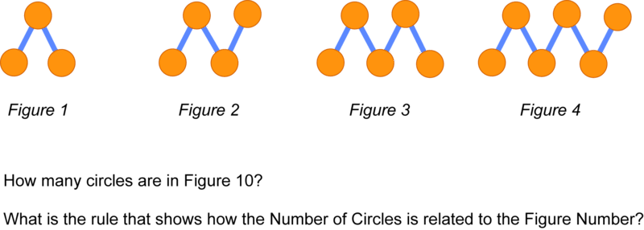

$$
\begin{align*}
& \mathbf{Describe:} && \text{Each figure is made of circle tiles.}\\
&&& \text{Figure} \ 1 \ \text{has} \ 3 \ \text{tiles.}\\
&&& \text{Figure} \ 2 \ \text{has} \ 4 \ \text{tiles.}\\
&&& \text{Figure} \ 3 \ \text{has} \ 5 \ \text{tiles.}\\
&&& \text{Figure} \ 4 \ \text{has} \ 6 \ \text{tiles.}\\
&&& \text{The number of circle tiles changes only on the right side of the figure.}\\
& \mathbf{My \ Job:} && \text{Determine the number of circles in Figure} \ 10. \ \text{Write the rule.}\\
& \mathbf{Plan:} && \text{Collect information in a table. Look for the relationship between the Figure}\\
&&& \text{Number and the Number of Circles.}\\
& \mathbf{Solve:}
\end{align*}
$$

\begin{align*}
\mathbf{Check:}\!\\
&&&\text{Figure} \ 1: \qquad 1 + 2 = 3 \ \text{tiles}\!\\
&&& \text{Figure} \ 2: \qquad 2 + 2 = 4 \ \text{tiles}\!\\
&&& \text{Figure} \ 3: \qquad 3 + 2 = 5 \ \text{tiles}\!\\
&&& \text{Figure} \ 10: \quad \ 10 + 2 = 12 \ \text{tiles}
\end{align*}
$$

Rule: Number of circles is 2 more than the Figure Number.

2. Look at the figures below and answer the questions.

$$
\begin{align*}
& \mathbf{Describe:} && \text{Each figure is made of square tiles.}\\
&&& \text{Figure} \ 1 \ \text{has} \ 5 \ \text{tiles.}\\
&&& \text{Figure} \ 2 \ \text{has} \ 6 \ \text{tiles.}\\
&&& \text{Figure} \ 3 \ \text{has} \ 7 \ \text{tiles.}\\
&&& \text{The number of square tiles changes only on the top of the figure.}\\
& \mathbf{My \ Job:} && \text{Determine the number of tiles in Figure} \ 10. \ \text{Write the rule.}\\
& \mathbf{Plan:} && \text{Collect information in a table. Look for the relationship between the Figure}\\
&&& \text{Number and the Number of Tiles.}\\
& \mathbf{Solve:}
\end{align*}
$$

\begin{align*}
\mathbf{Check:}\!\\
&&&\text{Figure} \ 1: \qquad 1 + 4 = 5 \ \text{tiles}\!\\
&&& \text{Figure} \ 2: \qquad 2 + 4 = 6 \ \text{tiles}\!\\
&&& \text{Figure} \ 3: \qquad 3 + 4 = 7 \ \text{tiles}\!\\
&&& \text{Figure} \ 10: \quad \ 10 + 4 = 14 \ \text{tiles}
\end{align*}
$$

Rule: Number of tiles is 4 more than the Figure Number.

3. Look at the figures below and answer the questions.

$$
\begin{align*}
& \mathbf{Describe:} && \text{Each figure is made of circle tiles.}\\
&&& \text{Figure} \ 1 \ \text{has} \ 2 \ \text{tiles.}\\
&&& \text{Figure} \ 2 \ \text{has} \ 3 \ \text{tiles.}\\
&&& \text{Figure} \ 3 \ \text{has} \ 4 \ \text{tiles.}\\
&&& \text{The number of circle tiles changes only on the right side of the figure.}\\
& \mathbf{My \ Job:} && \text{Determine the number of circles in Figure} \ 10. \ \text{Write the rule.}\\
& \mathbf{Plan:} && \text{Collect information in a table. Look for the relationship between the Figure}\\
&&& \text{Number and the Number of Circles}\\
& \mathbf{Solve:}
\end{align*}
$$

\begin{align*}
\mathbf{Check:}\!\\
&&&\text{Figure} \ 1: \qquad 1 + 1 = 2 \ \text{tiles}\!\\
&&& \text{Figure} \ 2: \qquad 2 + 1 = 3 \ \text{tiles}\!\\
&&& \text{Figure} \ 3: \qquad 3 + 1 = 4 \ \text{tiles}\!\\
&&& \text{Figure} \ 10: \quad \ 10 + 1 = 11 \ \text{tiles}
\end{align*}
$$

Rule: Number of circles is 1 more than the Figure Number.

#### Earlier Problem Revisited

$$
\begin{align*}
& \mathbf{Describe:} && \text{Each figure is made of square tiles.}\\
&&& \text{Figure} \ 1 \ \text{has} \ 8 \ \text{tiles.}\\
&&& \text{Figure} \ 2 \ \text{has} \ 9 \ \text{tiles.}\\
&&& \text{Figure} \ 3 \ \text{has} \ 10 \ \text{tiles.}\\
&&& \text{The number of square tiles changes only on the left side of the figure.}\\
& \mathbf{My \ Job:} && \text{Determine the number of tiles in Figure} \ 10. \ \text{Write the rule.}\\
& \mathbf{Plan:} && \text{Collect information in a table. Look for the relationship between the Figure}\\
&&& \text{Number and the Number of Tiles.}\\
& \mathbf{Solve:}
\end{align*}
$$

\begin{align*}
\mathbf{Check:}\!\\
&&&\text{Figure} \ 1: \qquad 1 + 7 = 8 \ \text{tiles}\!\\
&&& \text{Figure} \ 2: \qquad 2 + 7 = 9 \ \text{tiles}\!\\
&&& \text{Figure} \ 3: \qquad 3 + 7 = 10 \ \text{tiles}\!\\
&&& \text{Figure} \ 10: \quad \ 10 + 7 = 17 \ \text{tiles}
\end{align*}
$$

Rule: Number of tiles is 7 more than the Figure Number.

### Vocabulary

One type of **_pattern_** is when the number of a certain object increases, decreases, or stays the same in a consistent way. In this concept, we saw patterns of circles and squares where the numbers of circles and squares were increasing. With any pattern you should be able to describe the pattern and how to get from one step of the pattern to the next. A **_rule_** is an equation that can describe a pattern. In this concept, we wrote **_rules_** for patterns that related the figure number to the number of shapes.

### Examples 

For each problem, look at the figures below and answer the questions.

#### Example 1

Rule: Number of Trapezoids is 3 more than the Figure Number.

Rule: Number of Circles is the Figure Number plus the Figure Number, or 2 times the Figure Number.

\[Figure 13\] 

#### Example 3

Rule: Number of Purple Tiles is 3 times the Figure Number.

Rule: Number of Checkered Tiles is 2 times the Figure Number.

For each problem, look at the figures below and answer the questions.

1.  \[Figure 18\]
2.  \[Figure 19\]
3.  \[Figure 20\]
4.  \[Figure 21\]
5.  \[Figure 22\]
6.  \[Figure 23\]
7.  \[Figure 24\]
8.  \[Figure 25\]
9.  \[Figure 26\]

</article>

### 7.8 Smart Shopping

<article>

Look at the pictures below. Can you compare the prices of calendars between the stores? Which store has the better buy for calendars? In this section, we will learn how to compare prices between stores when we can not easily determine the unit prices for items.

In order to figure out which item is the better buy, like in the question above, we can use the problem solving steps to help.

* Start by **describing** what you see the pictures.
* Next, figure out what **your job** is in this problem. In all of these problems your job will be to figure out which item is the better buy.
* Then, make a **plan** for how you will solve. In these problems, you will want to figure out the least common multiple of the 2 quantities of items. Then, find the total price for that number of items for each store. Figure out which store is the better buy.
* Next, **solve** the problem.
* Finally, **check** to make sure that the price at the store you chose is lower.

#### Finding the Better Buy

1. What is the least common multiple of 3 and 4? Which store has the better buy? How did you figure it out?

$$
\begin{align*}
& \mathbf{Describe:} && \text{At Brown's Books,} \ 3 \ \text{bookmarks are} \ \$5. \ \text{At Noble Books,} \ 4 \ \text{bookmarks are} \ \$7.\\  
& \mathbf{Plan:} && \text{First, figure out the least common multiple of the number of bookmarks,} \ 3 \ \text{and} \ 4.\\
&&& \text{Second, figure out the price for that number of bookmarks at each store. Last,}\\
&&& \text{compare prices.}\\
& \mathbf{Solve:} && \text{The least common multiple of} \ 3 \ \text{and} \ 4 \ \text{is} \ 12.\\
&&& \text{Brown's:} \qquad \qquad \qquad \qquad \qquad \qquad \qquad \quad \text{Noble:}\\
&&& 3 \ \text{for} \ \$5 \ \text{is} \qquad \qquad \qquad \qquad \qquad \qquad \qquad 4 \ \text{for} \ \$7 \ \text{is}\\
&&& (4 \times 3) \ \text{for} \ (4 \times \$5), \ \text{or} \qquad \qquad \qquad \qquad \ (3 \times 4) \ \text{for} \ (3 \times \$7), \ \text{or}\\
&&& 12 \ \text{for} \ \$20 \qquad \qquad \qquad \qquad \qquad \qquad \qquad \quad 12 \ \text{for} \ \$21\\
&&& \$20 < \$21\\
&&& \text{Brown's has the better buy.}\\
& \mathbf{Check:} && \text{Brown:} \ 3 \ \text{for} \ \$5\ \text{is} \ \$5 + \$5 + \$5 + \$5 \ \text{or} \ \$20 \ \text{for} \ 12 \ \text{calendars}\\
&&& \text{Noble:} \ 4 \ \text{for} \ \$7 \ \text{is} \ \$7 + \$7 + \$7 \ \text{or} \ \$21 \ \text{for} \ 12 \ \text{calendars}\\
&&& \$20 < \$21
\end{align*}
$$

2. What is the least common multiple of 2 and 5? Which store has the better buy? How did you figure it out?

$$
\begin{align*}
& \mathbf{Describe:} && \text{At Brown's Books,} \ 2 \ \text{paperbacks are} \ \$11. \ \text{At Noble Books,} \ 5 \ \text{paperbacks are} \ \$31.\\  
& \mathbf{Plan:} && \text{First, figure out the least common multiple of the number of paperbacks,} \ 2 \ \text{and} \ 5.\\
&&& \text{Second, figure out the price for that number of paperbacks at each store. Last,}\\
&&& \text{compare prices.}\\
& \mathbf{Solve:} && \text{The least common multiple of} \ 2 \ \text{and} \ 5 \ \text{is} \ 10.\\
&&& \text{Brown's:} \qquad \qquad \qquad \qquad \qquad \qquad \qquad \quad \text{Noble:}\\
&&& 2 \ \text{for} \ \$11 \ \text{is} \qquad \qquad \qquad \qquad \qquad \qquad \qquad 5 \ \text{for} \ \$31 \ \text{is}\\
&&& (5 \times 2) \ \text{for} \ (5 \times \$11), \ \text{or} \qquad \qquad \qquad \qquad \ (2 \times 5) \ \text{for} \ (2 \times \$31), \ \text{or}\\
&&& 10 \ \text{for} \ \$55 \qquad \qquad \qquad \qquad \qquad \qquad \qquad \quad 10 \ \text{for} \ \$62\\
&&& \$55 < \$62\\
&&& \text{Brown's has the better buy.}\\
& \mathbf{Check:} && \text{Brown:} \ 2 \ \text{for} \ \$11\ \text{is} \ \$11 + \$11 + \$11 + \$11 +\$11 \ \text{or} \ \$55 \ \text{for} \ 10 \ \text{calendars}\\
&&& \text{Noble:} \ 5 \ \text{for} \ \$31 \ \text{is} \ \$31 + \$31 \ \text{or} \ \$62 \ \text{for} \ 10 \ \text{calendars}\\
&&& \$55 < \$62
\end{align*}
$$

3. What is the least common multiple of 5 and 3? Which store has the better buy? How did you figure it out?

$$
\begin{align*}
& \mathbf{Describe:} && \text{At Brown's Books,} \ 5 \ \text{cookbooks are} \ \$59. \ \text{At Noble Books,} \ 3 \ \text{cookbooks are} \ \$34.\\  
& \mathbf{Plan:} && \text{First, figure out the least common multiple of the number of cookbooks,} \ 5 \ \text{and} \ 3.\\
&&& \text{Second, figure out the price for that number of cookbooks at each store. Last,}\\
&&& \text{compare prices.}\\
& \mathbf{Solve:} && \text{The least common multiple of} \ 5 \ \text{and} \ 3 \ \text{is} \ 15.\\
&&& \text{Brown's:} \qquad \qquad \qquad \qquad \qquad \qquad \qquad \quad \text{Noble:}\\
&&& 5 \ \text{for} \ \$59 \ \text{is} \qquad \qquad \qquad \qquad \qquad \qquad \qquad 3 \ \text{for} \ \$34 \ \text{is}\\
&&& (3 \times 5) \ \text{for} \ (3 \times \$59), \ \text{or} \qquad \qquad \qquad \qquad \ (5 \times 3) \ \text{for} \ (5 \times \$34), \ \text{or}\\
&&& 15 \ \text{for} \ \$177 \qquad \qquad \qquad \qquad \qquad \qquad \qquad \quad 15 \ \text{for} \ \$170\\
&&& \$170 < \$177\\
&&& \text{Noble Books has the better buy.}\\
& \mathbf{Check:} && \text{Brown:} \ 5 \ \text{for} \ \$59\ \text{is} \ \$59 + \$59 + \$59 \ \text{or} \ \$177 \ \text{for} \ 15 \ \text{calendars}\\
&&& \text{Noble:} \ 3 \ \text{for} \ \$34 \ \text{is} \ \$34 + \$34 +\$34 +\$34 + \$34 \ \text{or} \ \$170 \ \text{for} \ 15 \ \text{calendars}\\
&&& \$170 < \$177
\end{align*}
$$

#### Earlier Problem Revisited

$$
\begin{align*}
& \mathbf{Describe:} && \text{At Brown's Books,} \ 2 \ \text{calendars are} \ \$17. \ \text{At Noble Books,} \ 3 \ \text{calendars are} \ \$23.\\  
& \mathbf{Plan:} && \text{First, figure out the least common multiple of the number of calendars,} \ 2 \ \text{and} \ 3.\\
&&& \text{Second, figure out the price for that number of calendars at each store. Last,}\\
&&& \text{compare prices.}\\
& \mathbf{Solve:} && \text{The least common multiple of} \ 2 \ \text{and} \ 3 \ \text{is} \ 6.\\
&&& \text{Brown's:} \qquad \qquad \qquad \qquad \qquad \qquad \qquad \quad \text{Noble:}\\
&&& 2 \ \text{for} \ \$17 \ \text{is} \qquad \qquad \qquad \qquad \qquad \qquad \qquad 3 \ \text{for} \ \$23 \ \text{is}\\
&&& (3 \times 2) \ \text{for} \ (3 \times \$17), \ \text{or} \qquad \qquad \qquad \qquad \ (2 \times 3) \ \text{for} \ (2 \times \$23), \ \text{or}\\
&&& 6 \ \text{for} \ \$51 \qquad \qquad \qquad \qquad \qquad \qquad \qquad \quad 6 \ \text{for} \ \$46\\
&&& \$46 < \$51\\
&&& \text{Noble Books has the better buy.}\\
& \mathbf{Check:} && \text{Brown:} \ 2 \ \text{for} \ \$17 \ \text{is} \ \$17 + \$17 + \$17 \ \text{or} \ \$51 \ \text{for} \ 6 \ \text{calendars}\\
&&& \text{Noble:} \ 3 \ \text{for} \ \$23 \ \text{is} \ \$23 + \$23 \ \text{or} \ \$46 \ \text{for} \ 6 \ \text{calendars}\\
&&& \$46 < \$51
\end{align*}
$$

### Vocabulary

The **_least common multiple_** of two numbers is the smallest number that is a multiple of two or more numbers. For example, the multiples of 4 are 4, 8, 12, 16, 20, 24... The multiples of 6 are 6, 12, 18, 24,... Both 12 and 24 are common multiples of 4 and 6; however, 12 is the **least** common multiple because it is the smallest multiple that they have in common.

### Examples 

#### Example 1

What is the least common multiple of 4 and 5? Which store has the better buy? How did you figure it out?

#### Example 2

What is the least common multiple of 2 and 4? Which store has the better buy? How did you figure it out?

#### Example 3

What is the least common multiple of 4 and 6? Which store has the better buy? How did you figure it out?

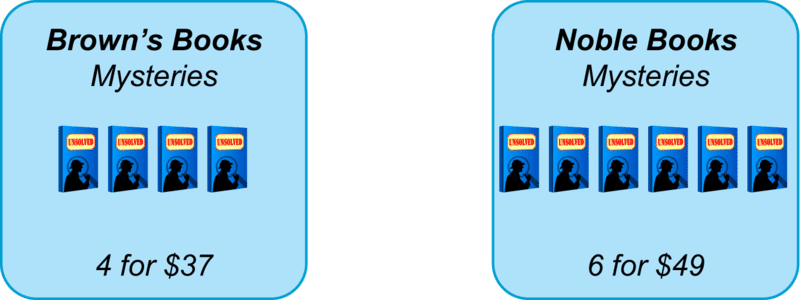

### Review 

For each problem below, prices for the same item at two different stores are shown. Which store has the better buy? How did you figure it out?

1.  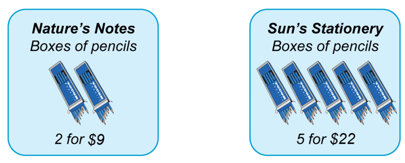\[Figure 9\]
2.  \[Figure 10\]
3.  \[Figure 11\]
4.  \[Figure 12\]
5.  \[Figure 13\]
6.  \[Figure 14\]

</article>

### 7.9 Save More

<article>

Look at the signs for the toothpaste below. How much would it cost to buy 2 tubes of toothpaste at each store? What if you use the coupon? Which store has the better buy? How much less is the cost at that store? In this section, we will learn how to compare prices at stores when we have a coupon to use.

In order to figure out which item is the better buy, like in the question above, we can use the problem solving steps to help.

* Start by **describing** what you see the pictures.
* Next, figure out what **your job** is in this problem. In all of these problems your job will be to figure out which item is the better buy and by how much.
* Then, make a **plan** for how you will solve. In these problems, you will want to figure out the original cost for the number of items you want to buy at each store. Then, calculate how much you will pay after using the coupon. Finally, figure out which store has the better buy and by how much.
* Next, **solve** the problem.
* Finally, **check** to make sure that all your calculations are correct.

#### Finding the Better Buy

1. Buy 1 comb. Use the coupon. Which store has the better buy? How much less is the cost at that store?

| Step | Description |
| --- | --- |
| Describe: | Two store signs show the cost for combs. The coupon gives 10% off the price. |
| My Job: | Figure out the store that has the better buy for 1 comb after using the coupon. Then figure out the difference in cost. |
| Solve: | ABC's: 5 combs are $15 so each comb is $3. Gem's: 6 combs are $12 so each comb is $2. Using the coupon at ABC's, 10% off means the cost after the coupon is 90% of $3.00, or 0.9 × 3 = $2.70. Using the coupon at Gem's, 10% off means the price after the coupon is 90% of $2.00 or 0.9 × 2 = $1.80. $2.70 − $1.80 = $0.90 The cost is $0.90 less at Gem's. |
| Check: | At ABC's 1 comb is $3.00 and 10% off of $3.00 is $0.30. The cost after using the coupon is ($3.00 - $0.30), or $2.70. At Gem's 1 comb is $2.00 and 10% off of $2.00 is $0.20. The cost after using the coupon is ($2.00 - $0.20), or $1.80. $2.70 − $1.80 = $0.90. |

2. Buy 4 boxes of band aids. Use the coupon. Which store has the better buy? How much less is the cost at that store?

$$
\begin{align*}
& \mathbf{Describe:} && \text{Two store signs show the cost for boxes of bandaids. The coupon gives}\\
&&& 30 \% \ \text{off the price.}\\
& \mathbf{My \ Job:} && \text{Figure out the store that has the better buy for 4 boxes of band aids after}\\
&&& \text{using the coupon. Then figure out the difference in cost.}\\
& \mathbf{Plan:} && \text{Figure out the cost of 4 boxes of tissue at ABC's. Do the same at Gem's.}\\
&&& \text{Take 30. off of each. Subtract to find the difference.}\\
& \mathbf{Solve:} && \text{ABC's:} \ 6 \ \text{boxes are} \ \$12 \ \text{so each box is} \ \$2 \ \text{and four boxes are} \ \$8.\\
&&& \text{Gem's:} \ 8 \ \text{boxes are} \ \$24 \ \text{so} \ 4 \ \text{boxes are} \ \frac{1}{2} \ \text{of} \ 24, \ \text{or} \ \$24 \div 2, \ \text{or} \ \$12.\\
&&& \text{Using the coupon at ABC's,} \ 30 \% \ \text{off means the cost after the coupon is}\\
&&& 70 \% \ \text{of} \ \$8.00, \ \text{or} \ 0.3 \times 8 = \$5.60.\\
&&& \text{Using the coupon at Gem's,} \ 20 \% \ \text{off means the price after the coupon is}\\
&&& 70 \% \ \text{of} \ \$12.00 \ \text{or} \ 0.3 \times 12 = \$8.40.\\
&&& \$8.40 - \$5.60 = \$2.80\\
&&& \text{The cost is} \ \$2.80 \ \text{less at ABC's.}\\
& \mathbf{Check:} && \text{At ABC's} \ 4 \ \text{boxes are} \ \$8.00 \ \text{and} \ 30 \% \ \text{off of} \ \$8.00 \ \text{is} \ \$2.40. \ \text{The cost after}\\
&&& \text{using the coupon is} \ \$8.00 - \$2.40, \ \text{or} \ \$5.60.\\
&&& \text{At Gem's} \ 4 \ \text{boxes are} \ \$12.00 \ \text{and} \ 30 \% \ \text{off of} \ \$12.00 \ \text{is} \ \$3.60. \ \text{The cost after}\\
&&& \text{using the coupon is} \ \$12.00 - \$3.60, \ \text{or} \ \$8.40. \ \$8.40 - \$5.60 = \$2.80.
\end{align*}
$$

3. Buy 2 boxes of tissue. Use the coupon. Which store has the better buy? How much less is the cost at that store?

$$
\begin{align*}
& \mathbf{Describe:} && \text{Two store signs show the cost for boxes of tissue. The coupon gives}\\
&&& 20 \% \ \text{off the price.}\\
& \mathbf{My \ Job:} && \text{Figure out the store that has the better buy for 2 boxes of tissue after}\\
&&& \text{using the coupon. Then figure out the difference in cost.}\\
& \mathbf{Plan:} && \text{Figure out the cost of 2 boxes of tissue at ABC's. Do the same at Gem's.}\\
&&& \text{Take 20. off of each. Subtract to find the difference.}\\
& \mathbf{Solve:} && \text{ABC's:} \ 4 \ \text{boxes are} \ \$12 \ \text{so} \ 2 \ \text{boxes are half the price or} \ \$6.\\
&&& \text{Gem's:} \ 6 \ \text{boxes are} \ \$24 \ \text{so} \ 2 \ \text{boxes are} \ \frac{1}{3} \ \text{of} \ 24, \ \text{or} \ \$24 \div 3, \ \text{or} \ \$8.\\
&&& \text{Using the coupon at ABC's,} \ 20 \% \ \text{off means the cost after the coupon is}\\
&&& 80 \% \ \text{of} \ \$6.00, \ \text{or} \ 0.8 \times 6 = \$4.80.\\
&&& \text{Using the coupon at Gem's,} \ 20 \% \ \text{off means the price after the coupon is}\\
&&& 80 \% \ \text{of} \ \$8.20 \ \text{or} \ 0.8 \times 8 = \$6.40.\\
&&& \$6.40 - \$4.80 = \$1.60\\
&&& \text{The cost is} \ \$1.60 \ \text{less at ABC's.}\\
& \mathbf{Check:} && \text{At ABC's} \ 2 \ \text{boxes are} \ \$6.00 \ \text{and} \ 20 \% \ \text{off of} \ \$6.00 \ \text{is} \ \$1.20. \ \text{The cost after}\\
&&& \text{using the coupon is} \ \$6.00 - \$1.20, \ \text{or} \ \$4.80.\\
&&& \text{At Gem's} \ 2 \ \text{boxes are} \ \$8.00 \ \text{and} \ 20 \% \ \text{off of} \ \$8.00 \ \text{is} \ \$1.60. \ \text{The cost after}\\
&&& \text{using the coupon is} \ \$8.00 - \$1.60, \ \text{or} \ \$6.40. \ \$6.50 - \$4.80 = \$1.60.
\end{align*}
$$

#### Earlier Problem Revisited

### Vocabulary

A **_discount_** is a savings on an item because of a sale or a coupon. In this concept, we used coupons that had discounts in the form of **_percents_** of. **_Percent_** means parts per 100. The symbol for **_percent_** is %. For example, 30% means 30 out of every 100. So, 30% of 100 would be 30. 30% of 50 would be 15. When working with percents, it is often helpful to convert them to decimals when doing calculations, as we did in this concept.

### Examples 

#### Example 1

Buy 2 toothbrushes. Use the coupon. Which store has the better buy? How much less is the cost at that store?

ABC's: 1 toothbrush is $\$5.25 \div 3$ or $1.75, so 2 toothbrushes are $3.50. With the coupon they are $0.5 \times \$3.50$, or $1.75.

Gems: 2 toothbrushes is half of $6.00, or $3.00. With the coupon they are $0.5 \times \$3.00$, or $1.50

#### Example 2

Buy 4 bars of soap. Use the coupon. Which store has the better buy? How much less is the cost at that store?

ABC's: 4 bars of soap are $\frac {1}{2}$ of $7.20, or $3.60. With the coupon, they are $0.7 \times \$3.60$, or $2.52.

Gem's: 10 bars for $10 is $1 for one bar and $4 for 4 bars. With the coupon they are $0.7 \times \$4.00$ or $2.80

#### Example 3

Buy 4 bottles of shampoo. Use the coupon. Which store has the better buy? How much less is the cost at that store?

ABC's: One bottle is $\$12.50 \div 5$ or $2.50, so 4 bottles is $4 \times \$2.50$ or $10. With the coupon, the bottles are $0.6 \times \$10$ or $6.00

Gem's: One bottle is $\$14.40 \div 6$ or $2.40, so 4 bottles is $4 \times \$2.40$ or $9.60. With the coupon, the bottles are $0.6 \times \$9.60$ or $5.76

$6.00=$5.76=$0.24

### Review

1. Buy 2 birdies. Use the coupon. Which store has the better buy? How much less is the cost at that store?

\[Figure 13\]

</article>

### 7.10 Map Quest 5

<article>

Look at the map and list of facts below. Can you figure out the distances in miles between the cities using a ruler? Can you name the cities using the facts? In this section we will learn how to read and work with maps.

* Fact 2: Time to North Shore by way of Hilton is 80 miles.

* Fact 3: Westway to North Shore is 20 miles less than Westway to Raleigh.

* Fact 4: Time to Pepper is 20 miles longer than Pepper to Edmonton.

* Fact 5: Edmonton is 80 miles from Raleigh.

### Map Quest 5

In order to solve the problem above, use the problem solving steps.

* Start by **describing** what information is given.
* Then, identify what **your job** is. In these problems, your job will be to figure out where each city is on the map.
* Next, make a **plan** for how you will solve. In these problems, measure distances with a ruler and use the facts to figure out which city is which.
* Then, **solve** the problem.
* Finally, **check** your solution. Verify that the measured distances between the cities work with the facts.

#### Measuring Distance 

1. Use your ruler and the key to figure out distances between cities. Use the facts to name the cities.

* Fact 2: Surrey is 300 miles from Ellsworth.

* Fact 3: Felton to Dayton is 50 miles less than Felton to Granada.

* Fact 4: Simpson to Dayton round trip is 200 miles.

We can use problem solving steps to help.

$$
\begin{align*}
& \mathbf{Describe:} && \text{The map shows 7 cities. One is Surrey. The key shows that one inch stands for}\\
&&& \text{100 miles. The facts give information about location and distances between cities.}\\
& \mathbf{My \ Job:} && \text{Use the facts. Name the cities.}\\
& \mathbf{Plan:} && \text{Measure distances in inches. Use the key to figure out actual distances. Use the}\\
&&& \text{facts to name the cities.}\\
& \mathbf{Solve:} && \text{Fact} \ 2: \ \ \text{B is Ellsworth}\\
&&& \text{Fact} \ 1: \ \ \text{A is Portland}\\
&&& \text{Fact} \ 3: \ \ \text{D is Felton, E is Dayton, C is Granada}\\
&&& \text{Fact} \ 4: \ \ \text{F is Simpson}\\
& \mathbf{Check:} && \text{Fact} \ 1: \ \ \text{Portland to Ellsworth by way of Surrey is} \ 5 \ \text{inches or} \ 500 \ \text{miles.}\\
&&& \text{Fact} \ 2: \ \ \text{Surrey to Ellsworth is } \ 3 \ \text{inches, or} \  3 \times 100, \ \text{or} \ 300 \ \text{miles.}\\
&&& \text{Fact} \ 3: \ \ \text{Felton to Dayton is} \ 1.5 \ \text{inches, or} \ 1.5 \times 100, \ \text{or} \ 150 \ \text{miles.}\\
&&& \qquad \qquad \ \text{Felton to Granada is} \ 2  \ \text{inches or,} \ 2 \  \times 100, \ \text{or} \ 200 \ \text{miles.}\\
&&& \qquad \qquad \ 200 - 150 = 50 \ \text{miles}\\
&&& \text{Fact} \ 4: \ \ \text{Simpson to Dayton roundtrip is} \ 2 \ \text{inches, or} \ 200 \ \text{miles.}
\end{align*}
$$

2. Use your ruler and the key to figure out distances between cities. Use the facts to name the cities.

* Fact 2: Sandford to Tulsa is the same distance as Eckard to Tulsa.

* Fact 3: Eckard to Adams is 35 miles more than Adams to Hoosier.

We can use problem solving steps to help.

$$
\begin{align*}
& \mathbf{Describe:} && \text{The map shows 7 cities. One is Regis. The key shows that one inch stands for}\\
&&& \text{70 miles. The facts give information about location and distances between cities.}\\
& \mathbf{My \ Job:} && \text{Use the facts. Name the cities.}\\
& \mathbf{Plan:} && \text{Measure distances in inches. Use the key to figure out actual distances. Use the}\\
&&& \text{facts to name the cities.}\\
& \mathbf{Solve:} && \text{Fact} \ 1: \ \ \text{F is Bandoff and E is Hoosier}\\
&&& \text{Fact} \ 2: \ \ \text{B is Tulsa}\\
&&& \text{Fact} \ 3: \ \ \text{A is Sanford, C is Eckard, D is Adams}\\
& \mathbf{Check:} && \text{Fact} \ 1: \ \ \text{Regis to Hoosier round trip is } \ 5 \ \text{inches or} \ 350 \ \text{miles.}\\
&&& \qquad \ \text{Regis to Bandoff round trip is } \ 4 \ \text{inches or} \ 280 \ \text{miles.}\\
&&& \text{Fact} \ 2: \ \ \text{Sandford to Tulsa and Eckard to Tulsa are both} \ 1 \ \text{inch, or} \  1 \times 70, \ \text{or} \ 70 \ \text{miles.}\\
&&& \text{Fact} \ 3: \ \ \text{Eckard to Adams is} \ 2.5 \ \text{inches, or} \ 2.5 \times 70, \ \text{or} \ 175 \ \text{miles.}\\
&&& \qquad \qquad \ \text{Adams to Hoosier is} \ 2 \ \text{inches or,} \ 2 \ \times 70, \ \text{or} \ 140 \ \text{miles.}\\
&&& \qquad \qquad \ 175 - 140 = 35
\end{align*}
$$

#### Earlier Problem Revisited

* Fact 2: Time to North Shore by way of Hilton is 80 miles.

* Fact 3: Westway to North Shore is 20 miles less than Westway to Raleigh.

* Fact 4: Time to Pepper is 20 miles longer than Pepper to Edmonton.

* Fact 5: Edmonton is 80 miles from Raleigh.

We can use problem solving steps to help.

$$
\begin{align*}
& \mathbf{Describe:} && \text{The map shows 7 cities. One is Hilton. The key shows that one inch stands for}\\
&&& \text{40 miles. The facts give information about location and distances between cities.}\\
& \mathbf{My \ Job:} && \text{Use the facts. Name the cities.}\\
& \mathbf{Plan:} && \text{Measure distances in inches. Use the key to figure out actual distances. Use the}\\
&&& \text{facts to name the cities.}\\
& \mathbf{Solve:} && \text{Fact} \ 1: \ \ \text{F is Time}\\
&&& \text{Fact} \ 2: \ \ \text{E is North Shore}\\
&&& \text{Fact} \ 3: \ \ \text{D is Westway}\\
&&& \text{Fact} \ 4: \ \ \text{A is Pepper and B is Edmonton}\\
&&& \text{Fact} \ 5: \ \ \text{C is Raleigh}\\
& \mathbf{Check:} && \text{Fact} \ 1: \ \ \text{Hilton to Time is} \ \frac{1}{2} \ \text{inch or} \ 20 \ \text{miles.}\\
&&& \text{Fact} \ 2: \ \ \text{Time to North Shore by way of Hilton is} \ 2 \ \text{inches, or} \  2 \times 40, \ \text{or} \ 80 \ \text{miles.}\\
&&& \text{Fact} \ 3: \ \ \text{Westway to North Shore is} \ 2 \ \text{inches, or} \ 2 \times 40, \ \text{or} \ 80 \ \text{miles.}\\
&&& \qquad \qquad \ \text{Westway to Raleigh is} \ 2 \ \frac{1}{2} \ \text{inches or,} \ 2 \ \frac{1}{2} \times 40, \ \text{or} \ 100 \ \text{miles.}\\
&&& \qquad \qquad \ 100 - 80 = 20 \ \text{miles}\\
&&& \text{Fact} \ 4: \ \ \text{Time to Pepper is} \ 1 \ \text{inch, or} \ 40 \ \text{miles.}\\
&&& \qquad \qquad \ \text{Pepper to Edmonton is} \ \frac{1}{2} \ \text{inch, or} \ 20 \ \text{miles.}\\
&&& \qquad \qquad \ 40 - 20 = 20 \ \text{miles}\\
&&& \text{Fact} \ \ 5: \ \text{Edmonton to Raleigh is} \ 2 \ \text{inches, or} \ 2 \times 40, \ \text{or} \ 80 \ \text{miles.}
\end{align*}
$$

### Vocabulary

A **_map_** is a picture that represents an area of land. A **_ruler_** is a device that **_measures_** and finds the **_distance_** between two points.

### Examples 

#### Example 1

Use your ruler and the key to figure out distances between cities. Use the facts to name the cities.

* Fact 2: Sample to Readville round trip is 100 miles.

* Fact 3: Readville is 60 miles from Antonville.

* Fact 4: Diablo to Carlton is 15 miles less than Diablo to Bedford.

* Fact 5: Bedford to Sample to Readville is 60 miles.

A is Bedford, B is Sample, C is Readville, D is Antonville, E is Carlton, F is DIablo.

#### Example 2

Use your ruler and the key to figure out distances between cities. Use the facts to name the cities.

* Fact 2: Yerba to Brio is the same distance as Yerba to Tempe.

* Fact 3: Superstition is 30 miles closer to Tempe than to Yerba.

* Fact 4: Brickyard to Danyo is 90 miles.

* Fact 5: Littleton is 30 miles from Danyo.

A is Tempe, B is Superstition, C is Yerba, D is Brio, E is Danyo, F is Littleton.

#### Example 3

Use your ruler and the key to figure out distances between cities. Use the facts to name the cities.

* Fact 2: Wentworth to Storrs is 20 miles.

* Fact 3: Storrs to Leopold round trip is 120 miles

* Fact 4: New Bertson to Leopold to Carlton is 70 miles.

* Fact 5: Halland to Leopold is 10 miles more than Leopold to Carlton.

A is Wentworth, B is Carlton, C is Leopold, D is Halland, E is New Bertson, F is Trenton

### Review 

1. Use your ruler and the key to figure out distances between cities. Use the facts to name the cities.

* Fact 2: Sienna to Riverwalk round trip is 270 miles.

* Fact 3: Hartman to Grinder is 180 miles.

* Fact 4: Snake City to Sienna is the same distance as Sienna to Briarwood.

* Fact 5: Ringville to Hartman is 45 miles.

2. Use your ruler and the key to figure out distances between cities. Use the facts to name the cities.

* Fact 2: Ballard roundtrip to Nicksville is 400 miles.

* Fact 3: Calder to Exeter is 40 miles more than Exeter to Reston.

* Fact 4: Reston to Franklin is 240 miles.

* Fact 5: Nicksville to Franklin is 120 miles.

3. Use your ruler and the key to figure out distances between cities. Use the facts to name the cities.

* Fact 2: Girard to Dallas is the same distance as Crowville to Browning.

* Fact 3: Houston to Coventry is 75 miles less than Browning to Girard.

* Fact 4: Coventry to Winston is 100 miles.

4. Use your ruler and the key to figure out distances between cities. Use the facts to name the cities.

* Fact 2: Mateo to Evergreen is the same distance as Evergreen to Longwood.

* Fact 3: Redwood to Berkview is 100 miles.

5. Use your ruler and the key to figure out distances between cities. Use the facts to name the cities.

* Fact 2: Venice to Albany is 90 miles.

* Fact 3: Albany to Sacrey is 240 miles.

* Fact 4: Sacrey to Denton is the same distance as Albany to Venice.

</article>

## 8.0 CK-12 Algebra Explorations Concepts, Grade 6

<article>

Introduction
------------

In these concepts, you will continue to develop ten key concepts of algebra and will practice your problem solving skills. There are ten concepts, and each one focuses on a key algebraic thinking strategy. You will focus on describing, identifying your job, planning, solving, and checking your thinking.

</article>

### 8.1 What's the Value

<article>

Look at the equation below. Can you figure out the value of $z$? In this section, we will learn how to use the order of operations to help us to solve equations.

$$
6 \times 3^2 \div 2 + z + 4(7 - 3) + 2^3 \div 4 = 3^2 \times 6 + 1
$$

### What's the Value 

The **order of operations** tells us the correct order of evaluating math expressions. We always do **_parentheses first_** and then **_exponents_**. Next we do **_multiplication and division (from left to right)_** and finally **_addition and subtraction (from left to right)_**.

In order to evaluate expressions using the order of operations, we can use the problem solving steps to help.

* First, **describe** what you see in the problem. What operations are there?
* Second, identify what **your job** is. In these problems, your job will be to solve for the unknown.
* Third, make a **plan**. In these problems, your plan should be to use the order of operations.
* Fourth, **solve**.
* Fifth, **check**. Substitute your answer into the equation and make sure it works.

#### Finding Unknown Values 

1. Follow the order of operations and show each step. What is the value of the variable?

$b + 2 \times 3 \times 2^2 \div 3 = 2(5 + 6) - 2$

We can use the problem solving steps to help us with the order of operations.

$$
\begin{align*}
& \mathbf{Describe:} && \text{The equation has parentheses, exponents, multiplication, division, subtraction and addition.}\\
&&& b \ \text{is the variable.}\\
\\
& \mathbf{My \ Job:} && \text{Apply the order of operations rule to figure out the value of}\ b.\\
\\
& \mathbf{Solve:} && b + 2 \times 3 \times 2^2 \div 3 = 2(5 + 6) - 2\\
&&& \mathbf{Parentheses} \qquad \qquad \quad b + 2 \times 3 \times 2^2 \div 3 = 2 \times 11 - 2\\
&&& \mathbf{Exponents} \qquad \qquad \quad \ b + 2 \times 3 \times 4 \div 3 = 2 \times 11 - 2\\
&&& \mathbf{Multiplication/} \qquad \quad b + 8 = 22 - 2\\
&&& \mathbf{Division}\\
&&& \mathbf{(left \ to \ right)}\\
&&& \mathbf{Addition/} \qquad \qquad \qquad \ b + 8 = 20\\
&&& \mathbf{Subtraction}\\
&&& \mathbf{(left \  to \ right)} \qquad \qquad \ b=20-8\\
&&& \qquad \qquad \qquad \qquad \qquad \quad b=12\\
\\
& \mathbf{Check:} && \text{Replace} \ b \ \text{with 12 in the equation. Check that the two expressions}\\
&&&\text{(to the right and to the left of the = symbol) name the same number.}\\
&&& 12 + 2 \times 3 \times 2^2 \div 3 = 2(5 + 6) - 2\\
&&& 12 + 2 \times 3 \times 2^2 \div 3 = 2\times 11 - 2\\
&&& 12 + 2 \times 3 \times 4 \div 3 = 2\times 11 - 2\\
&&& 12 + 8 = 22 - 2\\
&&& 20 = 20
\end{align*}
$$

2. Follow the order of operations and show each step. What is the value of the variable?

$10^2 - 6(4 + 6) - 3^2 - 3 \times 4 - 1 = d + 50 \div 5^2$

We can use the problem solving steps to help us with the order of operations.

$$
\begin{align*}
& \mathbf{Describe:} && \text{The equation has parentheses, exponents, multiplication, subtraction, and addition.}\\
&&& d \ \text{is the variable.}\\
\\
& \mathbf{My \ Job:} && \text{Apply the order of operations rule to figure out the value of}\ d.\\
\\
& \mathbf{Solve:} && 10^2 - 6(4 + 6) - 3^2 - 3 \times 4 - 1 = d + 50 \div 5^2\\
&&& \mathbf{Parentheses} \qquad \qquad \quad 10^2 - 6\times 10 - 3^2 - 3 \times 4 - 1 = d + 50 \div 5^2\\
&&& \mathbf{Exponents} \qquad \qquad \quad \ 100 - 6\times 10 - 9 - 3 \times 4 - 1 = d + 50 \div 25\\
&&& \mathbf{Multiplication/} \qquad \quad 100 - 60 - 9 - 12 - 1 = d + 2\\
&&& \mathbf{Division}\\
&&& \mathbf{(left \ to \ right)}\\
&&& \mathbf{Addition/} \qquad \qquad \qquad \ 18=d+2\\
&&& \mathbf{Subtraction}\\
&&& \mathbf{(left \  to \ right)} \qquad \qquad \ 18 -2= d\\
&&& \qquad \qquad \qquad \qquad \qquad \quad d = 16\\
\\
& \mathbf{Check:} && \text{Replace} \ d \ \text{with 16 in the equation. Check that the two expressions}\\
&&&\text{(to the right and to the left of the = symbol) name the same number.}\\
&&& 10^2 - 6(4 + 6) - 3^2 - 3 \times 4 - 1 = 16 + 50 \div 5^2\\
&&& 10^2 - 6\times 10 - 3^2 - 3 \times 4 - 1 = 16 + 50 \div 5^2\\
&&& 100 - 6\times 10 - 9 - 3 \times 4 - 1 = 16 + 50 \div 25\\
&&& 100 - 60 - 9 - 12 - 1 = 16 + 2\\
&&& 18 = 18
\end{align*}
$$

3. Follow the order of operations and show each step. What is the value of the variable?

$4(9 - 5) + h + 3^2 - 2^3 + 4^1 = 3^2 \times 3 - 2 \times 3$

We can use the problem solving steps to help us with the order of operations.

$$
\begin{align*}
& \mathbf{Describe:} && \text{The equation has parentheses, exponents, multiplication, subtraction, and addition.}\\
&&& h \ \text{is the variable.}\\
\\
& \mathbf{My \ Job:} && \text{Apply the order of operations rule to figure out the value of}\ h.\\
\\
& \mathbf{Solve:} && 4(9 - 5) + h + 3^2 - 2^3 + 4^1 = 3^2 \times 3 - 2 \times 3\\
&&& \mathbf{Parentheses} \qquad \qquad \quad 4 \times 4 + h + 3^2 - 2^3 + 4^1 = 3^2 \times 3 - 2 \times 3\\
&&& \mathbf{Exponents} \qquad \qquad \quad \ 4 \times 4 + h + 9 - 8 + 4 = 9 \times 3 - 2 \times 3\\
&&& \mathbf{Multiplication/} \qquad \quad 16 + h + 9 - 8 + 4 = 27 - 6\\
&&& \mathbf{Division}\\
&&& \mathbf{(left \ to \ right)}\\
&&& \mathbf{Addition/} \qquad \qquad \qquad \ h + 21 = 21\\
&&& \mathbf{Subtraction}\\
&&& \mathbf{(left \  to \ right)} \qquad \qquad \ h = 21 - 21\\
&&& \qquad \qquad \qquad \qquad \qquad \quad h = 0\\
\\
& \mathbf{Check:} && \text{Replace} \ h \ \text{with 0 in the equation. Check that the two expressions}\\
&&&\text{(to the right and to the left of the = symbol) name the same number.}\\
&&& 4(9 - 5) + 0 + 3^2 - 2^3 + 4^1 = 3^2 \times 3 - 2 \times 3\\
&&& 4\times 4 + 0 + 3^2 - 2^3 + 4^1 = 3^2 \times 3 - 2 \times 3\\
&&& 4\times 4 + 0 + 9 - 8 + 4 = 9 \times 3 - 2 \times 3\\
&&& 16 + 0 + 9 - 8 + 4 = 27 - 6\\
&&& 21 = 21
\end{align*}
$$

#### Earlier Problem Revisited

$$
6 \times 3^2 \div 2 + z + 4(7 - 3) + 2^3 \div 4 = 3^2 \times 6 + 1
$$

We can use the problem solving steps to help us with the order of operations.

$$
\begin{align*}
& \mathbf{Describe:} && \text{The equation has parentheses, exponents, multiplication, division, and addition.}\\
&&& z \ \text{is the variable.}\\
\\
& \mathbf{My \ Job:} && \text{Apply the order of operations rule to figure out the value of}\ z.\\
\\
& \mathbf{Solve:} && 6 \times 3^2 \div 2 + z + 4(7 - 3) + 2^3 \div 4 = 3^2 \times 6 + 1\\
&&& \mathbf{Parentheses} \qquad \qquad \quad 6 \times 3^2 \div 2 + z + 4 \times 4 + 2^3 \div 4 = 3^2 \times 6 + 1\\
&&& \mathbf{Exponents} \qquad \qquad \quad \ 6 \times 9 \div 2 + z + 4 \times 4 + 8 \div 4 = 9 \times 6 + 1\\
&&& \mathbf{Multiplication/} \qquad \quad 27 + z + 16 + 2 = 54 + 1\\
&&& \mathbf{Division}\\
&&& \mathbf{(left \ to \ right)}\\
&&& \mathbf{Addition} \qquad \qquad \qquad \ 45 + z = 55\\
&&& \mathbf{(left \  to \ right)} \qquad \qquad \ z = 55 - 45\\
&&& \qquad \qquad \qquad \qquad \qquad \quad z = 10\\
\\
& \mathbf{Check:} && \text{Replace} \ z \ \text{with 10 in the equation. Check that the two expressions}\\
&&&\text{(to the right and to the left of the = symbol) name the same number.}\\
&&& 6 \times 3^2 \div 2 + 10 + 4(7 - 3) + 2^3 \div 4 = 3^2 \times 6 + 1\\
&&& 6 \times 3^2 \div 2 + 10 + 4 \times 4 + 2^3 \div 4 = 3^2 \times 6 + 1\\
&&& 6 \times 9 \div 2 + 10 + 4 \times 4 + 8 \div 4 = 9 \times 6 + 1\\
&&& 27 + 10 + 16 + 2 = 54 + 1\\
&&& 55 = 55
\end{align*}
$$

### Vocabulary

The **_order of operations_** tells us the correct order of evaluating math expressions. We always do **_parentheses first_** and then **_exponents_**. Next we do **_multiplication and division (from left to right)_** and finally **_addition and subtraction (from left to right)_**.

### Examples

For each problem, follow the order of operations and show each step. What is the value of the variable?

#### Example 1

$2 + 5^2 \div 5 \times 1 + 0 \times 34 = 2y - 7(4 - 3)$

$$
\begin{align*}
2 + 5^2 \div 5 \times 1 + 0 \times 34 &= 2y - 7(4 - 3)\\
2 + 5^2 \div 5 \times 1 + 0 \times 34 &= 2y - 7 \times 1\\
2 + 25 \div 5 \times 1 + 0 \times 34 &= 2y - 7 \times 1\\
2 + 5 + 0 &= 2y - 7\\
7 &= 2y - 7\\
7 + 7 &= 2y\\
14 &= 2y\\
7 &= y
\end{align*}
$$

#### Example 2

$2a + 5(9 - 8) \times 2^2 = 2^2 \times 3^2 + 2$

$$
\begin{align*}
2a + 5(9 - 8) \times 2^2 &= 2^2 \times 3^2 + 2\\
2a + 5 \times 1 \times 2^2 &= 2^2 \times 3^2 + 2\\
2a + 5 \times 1 \times 4 &= 4 \times 9 + 2\\
2a + 20 &= 36 + 2\\
2a + 20 &= 38\\
2a &= 38 - 20\\
2a &= 18\\
a &= 9
\end{align*}
$$

#### Example 3

$9^2 - 8^2 - 16 + 4^3 + 2^2 = e(5 + 2) - 1$

$$
\begin{align*}
9^2 - 8^2 - 16 + 4^3 + 2^2 &= e(5 + 2) - 1\\
9^2 - 8^2 - 16 + 4^3 + 2^2 &= e \times 7 - 1\\
81 - 64 - 16 + 64 + 4&= 7e - 1\\
69 &= 7e - 1\\
69 + 1 &= 7e\\
70 &= 7e\\
10 &= e
\end{align*}
$$

### Review 

For each problem, follow the order of operations and show each step. What is the value of the variable?

1.  $2m + 3 \times 9 \div 3^3 + 4(8 - 3) = 7^2 - 3 \times 6$
2.  $7^2 \div 7 \times (5^2 - 17) - (2 \times 6) = 4l - 2^2 \times 5$
3.  $6+3^2 \div 3 \times 2 +1 \times 5 =3y-2(5-3)$
4.  $5m+2(7-6)\times 2^3 = 2^2 \times 4^2 +7$
5.  $3^2-2^2-15+3^3+2^3=f(2+1)-2$

</article>

### 8.2 Solve for Unknowns

<article>

Look at the equation below. Can you figure out the value of $a$? In this section, we will practice using the order of operations and the distributive property to solve equations.

$$
4 \times 1 + 6(a - 1) - 9 - 2^3 = 2 + 3^2
$$

### Solve for Unknowns 

The **order of operations** tells us the correct order of evaluating math expressions. We always do **_parentheses first_**. Then we do **_exponents_**. Next we do **_multiplication and division (from left to right)_** and finally **_addition and subtraction (from left to right)_**. The **_distributive property $(a \times (b + c) = a \times b + a \times c)$_** allows us to remove parentheses when there is an unknown inside of them.

In order to evaluate expressions using the distributive property and the order of operations, we can use the problem solving steps to help.

* First, **describe** what you see in the problem. What operations are there?
* Second, identify what **your job** is. In these problems, your job will be to solve for the unknown.
* Third, make a **plan**. In these problems, your plan should be to use the distributive property and the order of operations.
* Fourth, **solve**.
* Fifth, **check**. Substitute your answer into the equation and make sure it works.

#### Finding Unknown Values 

1. Solve for the unknown. Follow the order of operations and show each step.

$(3 + 5)^2 \div 2 - 2 = 2b + 4^2$

We can use the problem solving steps to help us with the order of operations.

$$
\begin{align*}
& \mathbf{Describe:} && \text{The} \ 3+5 \ \text{is in parentheses and has an exponent of 2. The 4 has an exponent of 2.}\\
&&&\text{The other operations shown are multiplication, division, subtraction and addition.}\\
& \mathbf{My \ Job:} && \text{Do the order of operations in order to solve for the value of} \ d.\\
& \mathbf{Solve:} && (3 + 5)^2 \div 2 - 2 = 2b + 4^2\\
&&& \mathbf{Parentheses} \qquad \qquad 8^2 \div 2 - 2 = 2b + 4^2\\
&&& \mathbf{Exponents} \qquad \qquad \quad 64 \div 2 - 2 = 2b + 16\\
&&& \mathbf{Multiplication/} \qquad \ \ 32 - 2 = 2b + 16\\
&&& \mathbf{Division}\\
&&& \mathbf{(left \ to \ right)}\\
&&& \mathbf{Addition} \qquad \qquad \qquad 30 = 2b + 16\\
&&& \mathbf{(left \ to \ right)} \qquad \qquad 2b= 30-16\\
&&& \qquad \qquad \qquad \qquad  \qquad \ \ 2b = 14\\
&&& \qquad \qquad \qquad \qquad  \qquad \ \ b = 7\\
& \mathbf{Check:} && \text{Replace} \ b \ \text{with 7 in the equation. Check that the two expressions (to the right and}\\
&&&\text{to the left of the = symbol) name the same number.}\\
&&& (3 + 5)^2 \div 2 - 2 = 2\times 7 + 4^2\\
&&& 8^2 \div 2 - 2 = 2\times 7 + 4^2\\
&&& 64 \div 2 - 2 = 2\times 7 +16\\
&&& 32 - 2 = 14 +16\\
&&& 30=30
\end{align*}
$$

2. Solve for the unknown. Follow the order of operations and show each step.

$4(c + 2) + 2 = 2 \times 5^2$

We can use the problem solving steps to help us with the order of operations.

$$
\begin{align*}
& \mathbf{Describe:} && \text{The} \ c+2 \ \text{is in parentheses and is multiplied by 4. The 5 has an exponent of 2.}\\
&&&\text{The other operations shown are multiplication and addition.}\\
& \mathbf{My \ Job:} && \text{Apply the distributive property and do the order of operations in order to solve for}\\
&&&\text{the value of} \ c.\\
& \mathbf{Solve:} && 4(c + 2) + 2 = 2 \times 5^2\\
&&& \mathbf{Distributive} \qquad \qquad 4\times c + 4\times 2 + 2 = 2 \times 5^2\\
&&& \mathbf{property}\\
&&& \mathbf{Exponents} \qquad \qquad \quad 4\times c + 4\times 2 + 2 = 2 \times 25\\
&&& \mathbf{Multiplication/} \qquad \ \ 4c + 8 + 2 = 50\\
&&& \mathbf{Division} \\
&&& \mathbf{(left \ to \ right)}\\
&&& \mathbf{Addition} \qquad \qquad \qquad 4c + 10 = 50\\
&&& \mathbf{(left \ to \ right)} \qquad \qquad 4c = 50-10\\
&&& \qquad \qquad \qquad \qquad  \qquad \ \ 4c = 40\\
&&& \qquad \qquad \qquad \qquad  \qquad \ \ c = 10\\
& \mathbf{Check:} && \text{Replace} \ c \ \text{with 10 in the equation. Check that the two expressions (to the right and}\\
&&&\text{to the left of the = symbol) name the same number.}\\
&&& 4(10 + 2) + 2 = 2 \times 5^2\\
&&& 4\times 12 + 2 = 2 \times 5^2\\
&&& 4\times 12 + 2 = 2 \times 25\\
&&& 48 + 2 = 20\\
&&& 50 = 50
\end{align*}
$$

3. Solve for the unknown. Follow the order of operations and show each step.

$2 + (16 - 4) \div 3 + d + 2d = 9^2 \div 9 \times 2$

We can use the problem solving steps to help us with the order of operations.

$$
\begin{align*}
& \mathbf{Describe:} && \text{The} \ 16-4 \ \text{is in parentheses. The 9 has an exponent of 2.}\\
&&&\text{The other operations shown are multiplication, division, and addition.}\\
& \mathbf{My \ Job:} && \text{Do the order of operations in order to solve for}\\
&&&\text{the value of} \ d.\\
& \mathbf{Solve:} && 2 + (16 - 4) \div 3 + d + 2d = 9^2 \div 9 \times 2\\
&&& \mathbf{Parentheses} \qquad \qquad 2 + 12 \div 3 + d + 2d = 9^2 \div 9 \times 2\\
&&& \mathbf{Exponents} \qquad \qquad \quad 2 + 12 \div 3 + d + 2d = 81 \div 9 \times 2\\
&&& \mathbf{Multiplication/} \qquad \ \ 2 + 4 + d + 2d = 9 \times 2\\
&&& \mathbf{Division} \qquad  \qquad \qquad \ \ 2 + 4 + d + 2d = 18\\
&&& \mathbf{(left \ to \ right)}\\
&&& \mathbf{Addition} \qquad \qquad \qquad 6 + 3d = 18\\
&&& \mathbf{(left \ to \ right)} \qquad \qquad 3d = 18-6\\
&&& \qquad \qquad \qquad \qquad  \qquad \ \ 3d = 12\\
&&& \qquad \qquad \qquad \qquad  \qquad \ \ d = 4\\
& \mathbf{Check:} && \text{Replace} \ d \ \text{with 4 in the equation. Check that the two expressions (to the right and}\\
&&&\text{to the left of the = symbol) name the same number.}\\
&&& 2 + (16 - 4) \div 3 + 4 + 2\times 4 = 9^2 \div 9 \times 2\\
&&& 2 + 12 \div 3 + 4 + 2\times 4 = 9^2 \div 9 \times 2\\
&&& 2 + 12 \div 3 + 4 + 2\times 4 = 81 \div 9 \times 2\\
&&& 2 + 4 + 4 + 8 = 18\\
&&& 18 = 18
\end{align*}
$$

#### Earlier Problem Revisited

$$
4 \times 1 + 6(a - 1) - 9 - 2^3 = 2 + 3^2
$$

We can use the problem solving steps to help us with the order of operations.

$$
\begin{align*}
& \mathbf{Describe:} && \text{The} \ a - 1 \ \text{is in parentheses and is multiplied by 6. The 2 has an exponent of 3, and}\\
&&&\text{the 3 has an exponent of 2. The other operations shown are multiplication,}\\
&&&\text{addition, and subtraction.}\\
& \mathbf{My \ Job:} && \text{Apply the distributive property and do the order of operations in order to solve for}\\
&&&\text{the value of} \ a.\\
& \mathbf{Solve:} && 4 \times 1 + 6(a - 1) - 9 - 2^3 = 2 + 3^2\\
&&& \mathbf{Distributive} \qquad \qquad 4 \times 1 + 6a - 6 - 9 - 2^3 = 2 + 3^2\\
&&& \mathbf{property}\\
&&& \mathbf{Exponents} \qquad \qquad \quad 4 \times 1 + 6a - 6 - 9 - 8 = 2 + 9\\
&&& \mathbf{Multiplication/} \qquad \ \ 4 + 6a - 6 - 9 - 8 = 2 + 9\\
&&& \mathbf{Division}\\
&&& \mathbf{(left \ to \ right)}\\
&&& \mathbf{Addition} \qquad \qquad \qquad 6a - 19 = 11\\
&&& \mathbf{(left \ to \ right)} \qquad \qquad 6a = 11 + 19\\
&&& \qquad \qquad \qquad \qquad  \qquad \ \ 6a = 30\\
&&& \qquad \qquad \qquad \qquad  \qquad \ \ a = 5\\
& \mathbf{Check:} && \text{Replace} \ a \ \text{with 5 in the equation. Check that the two expressions (to the right and}\\
&&&\text{to the left of the = symbol) name the same number.}\\
&&& 4 \times 1 + 6(a - 1) - 9 - 2^3 = 2 + 3^2\\
&&& 4 \times 1 + 6(5 - 1) - 9 - 2^3 = 2 + 3^2\\
&&& 4 \times 1 + 6 \times 4 - 9 - 2^3 = 2 + 3^2\\
&&& 4 \times 1 + 6 \times 4 - 9 - 8 = 2 + 9\\
&&& 4 + 24 - 9 - 8 = 2 + 9\\
&&& 11 = 11
\end{align*}
$$

### Vocabulary

The **_order of operations_** tells us the correct order of evaluating math expressions. We always do **_parentheses first_**. Then we do **_exponents_**. Next we do **_multiplication and division (from left to right)_** and finally **_addition and subtraction (from left to right)_**. The **_distributive property $(a \times (b + c) = a \times b + a \times c)$_** allows us to remove parentheses when there is an unknown inside of them.

### Examples

For each problem, solve for the unknown. Follow the order of operations and show each step.

#### Example 1

$61 - (9 - 6)^2 = 5 (2 + f) - 3^1$

$$
\begin{align*}
61 - (9 - 6)^2 &= 5(2 + f) - 3^1. 61 - 3^2 &= 5 \times 2 + 5f - 3^1\\
61 - 9 &= 5 \times 2 + 5f - 3\\
61 - 9 &= 10 + 5f - 3\\
52 &= 5f + 7\\
52 - 7 &= 5f\\
45 &= 5f\\
9 &= f
\end{align*}
$$

#### Example 2

$5h + 3(h - 2) + 2 = 2^2 \times 3$

$$
\begin{align*}
5h + 3(h - 2) + 2 &= 2^2 \times 3\\
5h + 3h - 6 + 2 &= 2^2 \times 3\\
5h + 3h - 6 + 2 &= 4 \times 3\\
5h + 3h - 6 + 2 &= 12\\
8h - 4 &= 12\\
8h &= 12 + 4\\
8h &= 16\\
h &= 2
\end{align*}
$$

#### Example 3

$10^2 - 5 \times 8 = 1 + 6(j + 4) + (5^2 + 5) \div 6$

$$
\begin{align*}
10^2 - 5 \times 8 &= 1 + 6 (j + 4) + (5^2 + 5) \div 6\\
10^2 - 5 \times 8 &= 1 + 6 j + 24 + (25 + 5) \div 6\\
10^2 - 5 \times 8 &= 1 + 6 j + 24 + 30 \div 6\\
100 - 5 \times 8 &= 1 + 6 j + 24 + 30 \div 6\\
100 - 40 &= 1 + 6 j + 24 + 5\\
60 &= 6 j + 30\\
60 - 30 &= 6 j\\
30 &= 6 j\\
5 &= j
\end{align*}
$$

### Review 

For each problem, solve for the unknown. Follow the order of operations and show each step.

1.  $k + 2(6 + k) + 3^2 = 2^3 \times 3 \times 2 - 3$
2.  $6^2 + 2^2 = 2(2m + 4m) - 4^2 \times 2$
3.  $27-(6-3)^2=17(2+g)-4^2$
4.  $6f+2(f-4)+8=2^4\times 4$
5.  $5^3-4\times 15 = 7 +6(k+3)+(4^2+4)\div 5$

</article>

### 8.3 Circle Sums 6

<article>

Look at the picture below. The arrows point to the sum of each row or column. Can you figure out the value of each of the four letters? In this section, we will practice solving for unknowns in circles and arrows diagrams.

In order to solve the problem above, use the problem solving steps.

* Start by **describing** what you see in the diagram.
* Next, figure out what **your job** is in this problem. In all of these problems your job will be to figure out the value of the four letters in the diagram.
* Then, make a **plan** for how you will solve. There is usually more than one way to solve the problem. In some of these problems you might need to find the sum of three letters first in order to find the value of one letter.
* Next, **solve** the problem.
* Finally, **check** to make sure that the values you found work for all seven of the arrows.

#### Finding Unknown Values 

1. The arrows point to the sum of each row or column. Figure out the value of each letter.

$$
\begin{align*}
& \mathbf{Describe:} && \text{There are rows and columns with numbers and letters.}\\
&&& \text{Arrows point to sums.}\\
&&& \text{There are four different letters.}\\
\\
& \mathbf{My \ Job:} && \text{Figure out the value of each letter,} \ A, \ B, \ C, \ \text{and} \ D.\\
\\
& \mathbf{Plan:} && \text{All of Column 1 is contained in Row 1.}\\
&&& \text{Replace} \ B, \ B, \ \text{and} \ D \ \text{in Row 1 with its value from Column 1. Find the value of} \ D.\\
&&& \text{Replace each} \ D \ \text{with its value to find the value of} \ B \ \text{in Column 1.}\\ 
&&& \text{Replace} \ B \ \text{with its value in Column 4 to find the value of} \ A.\\
&&& \text{Use Column 2 to find the value of} \ C. \\
\\
& \mathbf{Solve:} && \text{Column} \ 1: \ B+B+D=17.\\
&&& \text{Replace} \ B+B+D \ \text{with 17 in Row 1 to get} \ 17+D=24.\\
&&& D=7. \ \text{Replace each} \ D \ \text{with 7 everywhere it appears in the grid.}\\
&&& \text{Column} \ 1: \ B+B+7=17 \ \text{so} \ B=5.\ \text{Replace all B's with 5.}\\
&&& \text{Column} \ 4: \ 7+A+5=16 \ \text{so} \ A =4. \ \text{Replace all A's with 4.}\\
&&& \text{Column} \ 2: \ 5+C+4=17. \ \text{so} \ C = 8. \\
&&& \text{So} \ A =4, \ B =5, \ C = 8, \ \text{and} \ D =7.\\
\\
& \mathbf{Check:} && \text{Check rows and columns}\\
&&& \text{Row} \ 1: 5+5+7+7=24  \qquad \ \text{Column} \ 1: 5+5+7=17\\
&&& \text{Row} \ 2: 5+8+4+4=21 \qquad \ \text{Column} \ 2: 5+8+4=17\\
&&& \text{Row} \ 3: 7+4+4+5=20 \qquad \ \text{Column} \ 3: 7+4+4=15\\
&&& \qquad \qquad \qquad \qquad \qquad \qquad \qquad \text{Column} \ 4: 7+4+5=16
\end{align*}
$$

2. The arrows point to the sum of each row or column. Figure out the value of each letter.

$$
\begin{align*}
& \mathbf{Describe:} && \text{There are rows and columns with numbers and letters.}\\
&&& \text{Arrows point to sums.}\\
&&& \text{There are four different letters.}\\
\\
& \mathbf{My \ Job:} && \text{Figure out the value of each letter,} \ A, \ B, \ C, \ \text{and} \ D.\\
\\
& \mathbf{Plan:} && \text{All of Column 1 is contained in Row 1.}\\
&&& \text{Replace} \ C, \ C, \ \text{and} \ D \ \text{in Row 1 with its value from Column 1. Find the value of} \ D.\\
&&& \text{Replace each} \ D \ \text{with its value to find the value of} \ C \ \text{in Column 1.}\\ 
&&& \text{Replace} \ C \ \text{with its value in Column 2 to find the value of} \ A.\\
&&& \text{Use Column 3 to find the value of} \ B. \\
\\
& \mathbf{Solve:} && \text{Column} \ 1: \ C+C+D=17.\\
&&& \text{Replace} \ C+C+D \ \text{with 17 in Row 1 to get} \ 17+D=26.\\
&&& D=9. \ \text{Replace each} \ D \ \text{with 9 everywhere it appears in the grid.}\\
&&& \text{Column} \ 1: \ C+C+9=17 \ \text{so} \ C=4.\ \text{Replace all C's with 4.}\\
&&& \text{Column} \ 2: \ 4+9+A=19 \ \text{so} \ A =6. \ \text{Replace all A's with 6.}\\
&&& \text{Column} \ 3: \ 9+6+B=22. \ \text{so} \ B = 7. \\
&&& \text{So} \ A =6, \ B =7, \ C = 4, \ \text{and} \ D =9.\\
\\
& \mathbf{Check:} && \text{Check rows and columns}\\
&&& \text{Row} \ 1: 4+4+9+9=26  \qquad \ \text{Column} \ 1: 4+4+9=17\\
&&& \text{Row} \ 2: 4+9+6+6=25 \qquad \ \text{Column} \ 2: 4+9+6=19\\
&&& \text{Row} \ 3: 9+6+7+4=26 \qquad \ \text{Column} \ 3: 9+6+7=22\\
&&& \qquad \qquad \qquad \qquad \qquad \qquad \qquad \text{Column} \ 4: 9+6+4=19
\end{align*}
$$

3. The arrows point to the sum of each row or column. Figure out the value of each letter.

$$
\begin{align*}
& \mathbf{Describe:} && \text{There are rows and columns with numbers and letters.}\\
&&& \text{Arrows point to sums.}\\
&&& \text{There are four different letters.}\\
\\
& \mathbf{My \ Job:} && \text{Figure out the value of each letter,} \ A, \ B, \ C, \ \text{and} \ D.\\
\\
& \mathbf{Plan:} && \text{All of Column 3 is contained in Row 1.}\\
&&& \text{Replace} \ A, \ C, \ \text{and} \ C \ \text{in Row 1 with its value from Column 3. Find the value of} \ D.\\
&&& \text{Replace each} \ D \ \text{with its value to find the value of} \ A \ \text{in Column 2.}\\ 
&&& \text{Replace} \ A \ \text{with its value in Column 3 to find the value of} \ C.\\
&&& \text{Use Column 1 to find the value of} \ B. \\
\\
& \mathbf{Solve:} && \text{Column} \ 3: \ C+A+C =13.\\
&&& \text{Replace} \ A+C+C \ \text{with 13 in Row 1 to get} \ D+13 =19.\\
&&& D=6. \ \text{Replace each} \ D \ \text{with 6 everywhere it appears in the grid.}\\
&&& \text{Column} \ 2: \ A+6+6=19 \ \text{so} \ A=7.\ \text{Replace all A's with 7.}\\
&&& \text{Column} \ 3: \ C+7+C=13 \ \text{so} \ C =3. \ \text{Replace all C's with 3.}\\
&&& \text{Column} \ 1: \ 6+B+7=21. \ \text{so} \ B = 8. \\
&&& \text{So} \ A =7, \ B =8, \ C = 3, \ \text{and} \ D =6.\\
\\
& \mathbf{Check:} && \text{Check rows and columns}\\
&&& \text{Row} \ 1: 6+7+3+3=19  \qquad \ \text{Column} \ 1: 6+8+7=21\\
&&& \text{Row} \ 2: 8+6+7+7=28 \qquad \ \text{Column} \ 2: 7+6+6=19\\
&&& \text{Row} \ 3: 7+6+3+7=23 \qquad \ \text{Column} \ 3: 3+7+3=13\\
&&& \qquad \qquad \qquad \qquad \qquad \qquad \qquad \text{Column} \ 4: 3+7+7=17
\end{align*}
$$

#### Earlier Problem Revisited

$$
\begin{align*}
& \mathbf{Describe:} && \text{There are rows and columns with numbers and letters.}\\
&&& \text{Arrows point to sums.}\\
&&& \text{There are four different letters.}\\
\\
& \mathbf{My \ Job:} && \text{Figure out the value of each letter,} \ A, \ B, \ C, \ \text{and} \ D.\\
\\
& \mathbf{Plan:} && \text{All of Column 1 is contained in Row 1.}\\
&&& \text{Replace} \ A, \ B, \ \text{and} \ C \ \text{in Row 1 with its value from Column 1. Find the value of} \ C.\\
&&& \text{Replace each} \ C \ \text{with its value to find the value of} \ D \ \text{in Column 4, and} \ A \ \text{in}\\
&&& \text{Column 3. Replace} \ A \ \text{with its value in Column 2 to find the value of} \ B.\\
\\
& \mathbf{Solve:} && \text{Column} \ 1: \ A + B + C =14.\\
&&& \text{Replace} \ A + B + C \ \text{with 14 in Row 1 to get} \ 14 + C =19.\\
&&& C=5. \ \text{Replace each} \ C \ \text{with 5 everywhere it appears in the grid.}\\
&&& \text{Column} \ 4: \ 5 + 5 + D =1 \ \text{and} \ D =4.\ \text{Replace all D's with 4.}\\
&&& \text{Column} \ 3: \ 5 + 5 + A =13 \ \text{and} \ A =3. \ \text{Replace all A's with 3.}\\
&&& \text{Column} \ 2: \ B + B + 3 = 15. \ \text{Then} \ 2B = 12, \ \text{and} \ B =6.\\
&&& \text{So} \ A =3, \ B =6, \ C = 5, \ \text{and} \ D =4.\\
\\
& \mathbf{Check:} && \text{Check rows and columns}\\
&&& \text{Row} \ 1: 3 + 6 + 5 + 5 = 19  \qquad \ \text{Column} \ 1: 3 + 6 + 5 = 14\\
&&& \text{Row} \ 2: 6 + 6 + 5 + 5 = 22 \qquad \ \text{Column} \ 2: 6 + 6 + 3 = 15\\
&&& \text{Row} \ 3: 5 + 3 + 3 + 4 = 15 \qquad \ \text{Column} \ 3: 5 + 5 + 3 = 13\\
&&& \qquad \qquad \qquad \qquad \qquad \qquad \qquad \text{Column} \ 4: 5 + 5 + 4 = 14
\end{align*}
$$

### Vocabulary

In math, an **_unknown_** is a letter that stands for a number that we do not yet know the value of. In this concept, when you figured out the value of the letters in the circles and arrows diagrams you were solving for **_unknowns._**

### Examples

#### Example 1

The arrows point to the sum of each row or column. Figure out the value of each letter.

#### Example 2

The arrows point to the sum of each row or column. Figure out the value of each letter.

#### Example 3

The arrows point to the sum of each row or column. Figure out the value of each letter.

### Review 

For each problem, the arrows point to the sum of each row or column. Figure out the value of each letter.

1.  \[Figure 9\]
2.  \[Figure 10\]
3.  \[Figure 11\]
4.  \[Figure 12\]
5.  \[Figure 13\]

</article>

### 8.4 Hanging Scales 6

<article>

Look at the pictures of the scales below. Can you write equations to represent what you see on each scale? Can you figure out the value of each letter? In this sections, we will practice working with equations that represent what we see on scales. We will then practice solving these systems of equations.

In order to solve the problem above, use the problem solving steps.

* Start by **describing** what information is given.
* Then, identify what **your job** is. In these problems, your job will be to figure out the value of each of the three variables.
* Next, make a **plan** for how you will solve. In these problems, write equations to represent the scales first. Then, solve the system of equations.
* Then, **solve** the problem.
* Finally, **check** your solution. Make sure that your solution causes each scale to have the correct weight.

1. Write equations. Figure out the weights of the blocks.

$$
\begin{align*}
& \mathbf{Describe:} && \text{There are three scales with blocks.}\\
&&& \text{A: Two} \ x \ \text{and two} \ z \ \text{blocks. They weigh 20 pounds.}\\
&&& \text{B: One} \ x, \ \text{one} \ y, \ \text{and one} \ z \ \text{block. They weigh 15 pounds.}\\
&&& \text{C: One} \ x \ \text{and two} \ y \ \text{blocks. They weigh 14 pounds.}\\
& \mathbf{My \ Job:} && \text{Use the scales as clues. Figure out the weights of the blocks.}\\
& \mathbf{Plan:} && \text{Write equations, one for each scale.}\\
&&& A: z+x+z+x=20; \ B: x+y+z=15; \ C:x+y+y=14\\
&&& \text{Solve the equations.}\\
& \mathbf{Solve:} && A: z+x+z+x=20. \ \text{There are two of each block, so} \ z+x=10\\
&&& \text{B}: (z + x) +y = 15. \ \text{Replace} \ (z + x) \ \text{with} \ 10.\\
&&& \quad \quad 10 + y = 15, \ \text{and}\\
&&& \quad \quad y = 15 - 10, \ \text{or} \ 5 \ \text{pounds.}\\
&&& C: x+y+y=14. \ \text{Replace each} \ y \ \text{with} \ 5.\\
&&& \quad \quad x + 10 = 14, \ \text{and}\\
&&& \quad \quad x = 14 - 10, \text{or} \ 4 \ \text{pounds}\\
&&& A: z + x = 10. \ \text{Replace} \ x \ \text{with} \ 4. \ \text{Then}\ z + 4 = 10.\\
&&& \quad \quad z = 10 - 4, \ \text{or} \ 6 \ \text{pounds.}\\
& \mathbf{Check:} && \text{Replace each block with its weight. Check that the total equal the number of}\\
&&& \text{pounds shown on the scales.} \\
&&& A: 6+4+6+4=20; \ B: 4+5+6=15; \ C: 4+5+5=14.
\end{align*}
$$

2. Write equations. Figure out the weights of the blocks.

$$
\begin{align*}
& \mathbf{Describe:} && \text{There are three scales with blocks.}\\
&&& \text{D: One} \ x, \ \text{one} \ y, \ \text{and one} \ z \ \text{block. They weigh 19 pounds.}\\
&&& \text{E: Two} \ y \ \text{and two} \ z \ \text{blocks. They weigh 24 pounds.}\\
&&& \text{F: One} \ z \ \text{and two} \ x \ \text{blocks. They weigh 24 pounds.}\\
& \mathbf{My \ Job:} && \text{Use the scales as clues. Figure out the weights of the blocks.}\\
& \mathbf{Plan:} && \text{Write equations, one for each scale.}\\
&&& D: x+y+z=19; \ E: y+z+y+z=24; \ F:x+x+z=24\\
&&& \text{Solve the equations.}\\
& \mathbf{Solve:} && E: y+z+y+z=24. \ \text{There are two of each block, so} \ y+z=12\\
&&& \text{D}: x+(y+z) = 19. \ \text{Replace} \ (y+z) \ \text{with} \ 12.\\
&&& \quad \quad x+12=19, \ \text{and}\\
&&& \quad \quad x = 19 - 12, \ \text{or} \ 7 \ \text{pounds.}\\
&&& F: x+x+z=24. \ \text{Replace each} \ x \ \text{with} \ 7.\\
&&& \quad \quad 14 + z = 24, \ \text{and}\\
&&& \quad \quad z = 24 - 14, \text{or} \ 10 \ \text{pounds}\\
&&& E: y+z=12. \ \text{Replace} \ z \ \text{with} \ 10. \ \text{Then}\ y+10=12.\\
&&& \quad \quad y = 12 - 10, \ \text{or} \ 2 \ \text{pounds.}\\
& \mathbf{Check:} && \text{Replace each block with its weight. Check that the total equal the number of}\\
&&& \text{pounds shown on the scales.} \\
&&& D:7+2+10=19; \ E: 2+10+2+10=24; \ F: 7+7+10=24.
\end{align*}
$$

3. Write equations. Figure out the weights of the blocks.

$$
\begin{align*}
& \mathbf{Describe:} && \text{There are three scales with blocks.}\\
&&& \text{G: One} \ x, \ \text{one} \ y, \ \text{and one} \ z \ \text{block. They weigh 20 pounds.}\\
&&& \text{H: Two} \ x \ \text{and two} \ y \ \text{blocks. They weigh 26 pounds.}\\
&&& \text{I: One} \ y \ \text{and two} \ z \ \text{blocks. They weigh 22 pounds.}\\
& \mathbf{My \ Job:} && \text{Use the scales as clues. Figure out the weights of the blocks.}\\
& \mathbf{Plan:} && \text{Write equations, one for each scale.}\\
&&& G:x+y+z=20; \ H: y+x+y+x=26; \ I:y+z+z=22\\
&&& \text{Solve the equations.}\\
& \mathbf{Solve:} && H: y+x+y+x=26. \ \text{There are two of each block, so} \ y+x = 13\\
&&& \text{G}: (x+y) + z = 20. \ \text{Replace} \ (x + y) \ \text{with} \ 13.\\
&&& \quad \quad 13 + z = 20, \ \text{and}\\
&&& \quad \quad z = 20 - 13, \ \text{or} \ 7 \ \text{pounds.}\\
&&& I: y + z + z = 22. \ \text{Replace each} \ z \ \text{with} \ 7.\\
&&& \quad \quad y + 14 = 22, \ \text{and}\\
&&& \quad \quad y = 22 - 14, \text{or} \ 8 \ \text{pounds}\\
&&& H: y+x=13. \ \text{Replace} \ y \ \text{with} \ 8. \ \text{Then}\ 8 + x = 13.\\
&&& \quad \quad x = 13 - 8, \ \text{or} \ 5 \ \text{pounds.}\\
& \mathbf{Check:} && \text{Replace each block with its weight. Check that the total equal the number of}\\
&&& \text{pounds shown on the scales.} \\
&&& G: 5+7+8=20; \ H: 8+5+8+5=26; \ I: 8+7+7=22.
\end{align*}
$$

#### Earlier Problem Revisited

$$
\begin{align*}
& \mathbf{Describe:} && \text{There are three scales with blocks.}\\
&&& \text{A: Two} \ x \ \text{and two} \ y \ \text{blocks. They weigh 26 pounds.}\\
&&& \text{B: One} \ x, \ \text{one} \ y, \ \text{and one} \ z \ \text{block. They weigh 22 pounds.}\\
&&& \text{C: One} \ x \ \text{and two} \ z \ \text{blocks. They weigh 24 pounds.}\\
& \mathbf{My \ Job:} && \text{Use the scales as clues. Figure out the weights of the blocks.}\\
& \mathbf{Plan:} && \text{Write equations, one for each scale.}\\
&&& A: x + y + x + y = 26; \ B: x + y + z = 22; \ C:x + z + z = 24\\
&&& \text{Solve the equations.}\\
& \mathbf{Solve:} && A: x + y + x + y = 26. \ \text{There are two of each block, so} \ x + y = 13\\
&&& \text{B}: (x + y) + z = 22. \ \text{Replace} \ (x + y) \ \text{with} \ 13.\\
&&& \quad \quad 13 + z = 22, \ \text{and}\\
&&& \quad \quad z = 22 - 13, \ \text{or} \ 9 \ \text{pounds.}\\
&&& C: x + z + z = 24. \ \text{Replace each} \ z \ \text{with} \ 9.\\
&&& \quad \quad x + 18 = 24, \ \text{and}\\
&&& \quad \quad x = 24 - 18, \text{or} \ 6 \ \text{pounds}\\
&&& A: x + y = 13. \ \text{Replace} \ x \ \text{with} \ 6. \ \text{Then}\ 6 + y = 13.\\
&&& \quad \quad y = 13 - 6, \ \text{or} \ 7 \ \text{pounds.}\\
& \mathbf{Check:} && \text{Replace each block with its weight. Check that the total equal the number of}\\
&&& \text{pounds shown on the scales.} \\
&&& A: 6 + 7 + 6 + 7 = 26; \ B: 6 + 7 + 9 = 23; \ C: 6 + 9+ 9 = 24.
\end{align*}
$$

### Vocabulary

In math, an **_unknown_** is a letter that stands for a number that we do not yet know the value of. In this concept, the blocks that we did not know the weights of were **_unknowns_**. An **_equation_** is a math sentence that tells us two quantities that are equal. In this concept, we wrote **_equations_** with unknowns to represent what we saw on the scales. A **_system of equations_** is a set of equations that represents a given problem. Since we wrote multiple equations for each problem in this concept, we wrote a **_system of equations_** for each problem.

### Examples 

Write equations. Figure out the weights of the blocks.

#### Example 1

$x= 8, \  y = 9, \ z = 5$

#### Example 2

$x= 10, \ y = 6, \ z = 9$

#### Example 3

__$x= 11, \ y = 10, \ z = 7$__

$x= 11, \ y = 10, \ z = 7$

### Review

Write equations. Figure out the weights of the blocks.

1.  \[Figure 9\]
2.  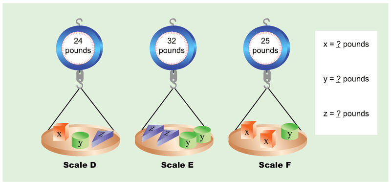\[Figure 10\]
3.  \[Figure 11\]
4.  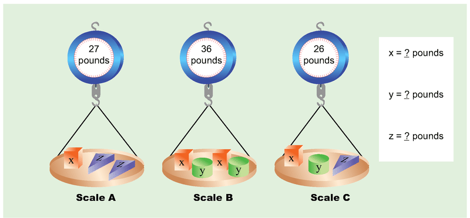\[Figure 12\]
5.  \[Figure 13\]
6.  \[Figure 14\]

</article>

### 8.5 Equal Costs

<article>

Carla and Dan went to the store. Carla bought 3 notebooks and a $2 pen. Dan bought 2 notebooks and an $8 stapler. All notebooks cost the same. They spent the same amount of money. Can you figure out the cost of one notebook? In this section, we will learn how to use equations to solve problems having to do with equal costs.

### Equal Costs 6

In order to answer questions about equal costs like the one above, we can use the problem solving steps to help.

* First, **describe** what you know. What did each person buy?
* Second, identify what **your job** is. In these problems, your job will be to solve for the price of an item.
* Third, make a **plan**. In these problems, your plan should be to write an expression for what each person spent. Then, set those expressions equal to each other since each person spent the same amount. Finally, solve the equation.
* Fourth, **solve**. Implement your plan.
* Fifth, **check**. Substitute your answer into the original problem and make sure it works.

#### Finding the Cost 

1. Al bought 2 sandwiches. Bob bought one sandwich and a $4 large soda. All sandwiches cost the same. They spent the same amount of money. What is the cost of one sandwich?

* Use $b$ to stand for the cost of one sandwich.

* Write an equation to represent the costs of the two people.

* Solve for the value of $b$.

* Show your work.

We can use problem solving steps to help us with this problem.

$$
\begin{align*}
& \mathbf{Describe:} && \text{Al:} \ 2 \ \text{sandwiches}\\
&&& \text{Bob:} \ 1 \ \text{sandwich and a} \ \$4 \ \text{large soda}\\
&&& 2 \ \text{sandwiches} \ \text{cost the same as} \ 1 \ \text{sandwich and} \ \$4\\
\\
& \mathbf{My \ job:} && \text{Figure out the cost of one sandwich.}\\
\\
& \mathbf{Plan:} && \text{Use} \ b \ \text{to stand for the cost of one sandwich.}\\
&&& \text{Write an expression showing the money spent by each person.}\\
&&& \text{Since they spent the same amount of money, the two expressions are equal.}\\
&&& \text{Write the equation.}\\
&&& \text{Solve for} \ b.\\
\\
& \mathbf{Solve:} && \text{Al's cost:} \ 2b\\
&&& \text{Bob's cost:} \ b+4.\\
&&& \text{The costs are the same so} \ 2b=b+4. \ \text{Solve the equation.}\\
&&& \qquad \qquad \qquad \qquad \qquad \qquad \qquad \qquad 2b=b+4\\
&&& \text{Subtract} \ b \ \text{from each side.} \qquad \qquad 2b-b=b+4-b\\
&&& \qquad \qquad \qquad \qquad \qquad \qquad \qquad \qquad \ b=4\\
&&& \text{One sandwich is} \ \$4\\
\\
& \mathbf{Check:} && \text{Al:} \ 2 \ \text{sandwiches is} \ 2 \times \$4, \ \text{or} \ \$8.\\
&&& \text{Bob:} \ 1 \ \text{sandwich and a} \ \$4 \ \text{large soda is} \ 1 \times \$4+\$4, \ \text{or} \ \$8.\\
&&& \$8= \$8
\end{align*}
$$

2. Camilla bought 4 small sodas and a $2 cookie. Darla bought 3 small sodas and a $5 dessert. All small sodas cost the same. They spent the same amount of money. What is the cost of one small soda?

* Use $c$ to stand for the cost of one small soda.

* Write an equation to represent the costs of the two people.

* Solve for the value of $c$.

* Show your work.

We can use problem solving steps to help us with this problem.

$$
\begin{align*}
& \mathbf{Describe:} && \text{Camilla:} \ 4 \ \text{small sodas and a } \ \$2 \ \text{cookie}\\
&&& \text{Dana:} \ 3 \ \text{small sodas and a } \ \$5 \ \text{dessert}\\
&&& 4 \ \text{small sodas and } \ \$2 \ \text{costs the same as} \ 3 \ \text{notebooks and} \ \$5\\
\\
& \mathbf{My \ job:} && \text{Figure out the cost of one small soda.}\\
\\
& \mathbf{Plan:} && \text{Use} \ c \ \text{to stand for the cost of one small soda.}\\
&&& \text{Write an expression showing the money spent by each person.}\\
&&& \text{Since they spent the same amount of money, the two expressions are equal.}\\
&&& \text{Write the equation.}\\
&&& \text{Solve for} \ c.\\
\\
& \mathbf{Solve:} && \text{Camilla's cost:} \ 4c+2\\
&&& \text{Dana's cost:} \ 3c+5.\\
&&& \text{The costs are the same so} \ 4c+2=3c+5. \ \text{Solve the equation.}\\
&&& \qquad \qquad \qquad \qquad \qquad \qquad \qquad \qquad 4c+2=3c+5\\
&&& \text{Subtract} \ 3c \ \text{from each side.} \qquad \qquad 4c+2-3c=3c+5-3c\\
&&& \qquad \qquad \qquad \qquad \qquad \qquad \qquad \qquad \ c+2=5\\
&&& \text{Subtract} \ 2 \ \text{from each side.} \qquad \qquad \ \ c=3\\
&&& \text{One small soda is} \ \$3\\
\\
& \mathbf{Check:} && \text{Camilla:} \ 4 \ \text{small sodas and a} \ \$2 \ \text{cookie is} \ 4 \times \$3+\$2, \ \text{or} \ \$14.\\
&&& \text{Dana:} \ 3 \ \text{small sodas and a} \ \$5 \ \text{dessert is} \ 3 \times \$3+\$5, \ \text{or} \ \$14.\\
&&& \$14= \$14
\end{align*}
$$

3. Erin bought 6 muffins Fred bought 4 muffins and a $3 drink. All muffins cost the same. They spent the same amount of money. What is the cost of one muffin?

* Use $d$ to stand for the cost of one muffin.

* Write an equation to represent the costs of the two people.

* Solve for the value of $d$.

* Show your work. 

We can use problem solving steps to help us with this problem.

$$
\begin{align*}
& \mathbf{Describe:} && \text{Erin:} \ 6 \ \text{muffins}\\
&&& \text{Fred:} \ 4 \ \text{muffins and a} \ \$3 \ \text{drink}\\
&&& 6 \ \text{muffins} \ \text{costs the same as} \ 4 \ \text{notebooks and} \ \$3\\
\\
& \mathbf{My \ job:} && \text{Figure out the cost of one muffin.}\\
\\
& \mathbf{Plan:} && \text{Use} \ d \ \text{to stand for the cost of one muffin.}\\
&&& \text{Write an expression showing the money spent by each person.}\\
&&& \text{Since they spent the same amount of money, the two expressions are equal.}\\
&&& \text{Write the equation.}\\
&&& \text{Solve for} \ d.\\
\\
& \mathbf{Solve:} && \text{Erin's cost:} \ 6d\\
&&& \text{Fred's cost:} \ 4d+3.\\
&&& \text{The costs are the same so} \ 6d=4d+3. \ \text{Solve the equation.}\\
&&& \qquad \qquad \qquad \qquad \qquad \qquad \qquad \qquad 6d=4d+3\\
&&& \text{Subtract} \ 4d \ \text{from each side.} \qquad \qquad 6d-4d=4d+3-4d\\
&&& \qquad \qquad \qquad \qquad \qquad \qquad \qquad \qquad \ 2d=3\\
&&& \text{Divide each side by} \ 2.  \qquad \qquad \ \ d=1.5\\
&&& \text{One muffin is} \ \$1.50\\
\\
& \mathbf{Check:} && \text{Erin:} \ 6 \ \text{muffins is} \ 6 \times \$1.50, \ \text{or} \ \$9.\\
&&& \text{Fred:} \ 4 \ \text{muffins and a} \ \$3 \ \text{drink is} \ 4 \times \$1.50+\$3, \ \text{or} \ \$9.\\
&&& \$9= \$9
\end{align*}
$$

#### Earlier Problem Revisited

Remember the problem about Carla and Dan? Carla bought 3 notebooks and a $2 pen. Dan bought 2 notebooks and an $8 stapler. All notebooks cost the same. They spent the same amount of money. What is the cost of one notebook?

We can use problem solving steps to help us with this problem.

$$
\begin{align*}
& \mathbf{Describe:} && \text{Carla:} \ 3 \ \text{notebooks and a} \ \$2 \ \text{pen}\\
&&& \text{Dan:} \ 2 \ \text{notebooks and an} \ \$8 \ \text{stapler}\\
&&& 3 \ \text{notebooks and} \ \$2 \ \text{costs the same as} \ 2 \ \text{notebooks and} \ \$8\\
\\
& \mathbf{My \ job:} && \text{Figure out the cost of one notebook.}\\
\\
& \mathbf{Plan:} && \text{Use} \ a \ \text{to stand for the cost of one notebook.}\\
&&& \text{Write an expression showing the money spent by each person.}\\
&&& \text{Since they spent the same amount of money, the two expressions are equal.}\\
&&& \text{Write the equation.}\\
&&& \text{Solve for} \ a.\\
\\
& \mathbf{Solve:} && \text{Carla's cost:} \ 3a+2\\
&&& \text{Dan's cost:} \ 2a+8.\\
&&& \text{The costs are the same so} \ 3a+2=2a+8. \ \text{Solve the equation.}\\
&&& \qquad \qquad \qquad \qquad \qquad \qquad \qquad \qquad 3a+2=2a+8\\
&&& \text{Subtract} \ 2a \ \text{from each side.} \qquad \qquad 3a+2-2a=2a+8-2a\\
&&& \qquad \qquad \qquad \qquad \qquad \qquad \qquad \qquad \ a+2=8\\
&&& \text{Subtract} \ 2 \ \text{from each side.} \qquad \qquad \ \ a+2-2=8-2\\
&&& \qquad \qquad \qquad \qquad \qquad \qquad \qquad \qquad \ a=6\\
&&& \text{One notebook is} \ \$6.\\
\\
& \mathbf{Check:} && \text{Carla:} \ 3 \ \text{notebooks and} \ \$2 \ \text{pen is} \ 3 \times \$6+\$2, \ \text{or} \ \$20.\\
&&& \text{Dan:} \ 2 \ \text{notebooks and} \ \$8 \ \text{stapler is} \ 2 \times \$6+\$8, \ \text{or} \ \$20.\\
&&& \$20 = \$20
\end{align*}
$$

### Vocabulary

In math, an **_expression_** is a phrase that can contain numbers, operations, and variables without an equal's sign. An **_equation_** is a statement that two **_expressions_** are equal. An **_equation_** is two **_expressions_** combined with an equals sign. To **_solve_** an equation means to figure out the value(s) for the variable(s) that make the equation true.

### Examples 

#### Example 1

Gary bought 5 CDs and a $5 CD case. Helen bought 3 CDs and a set of $29 earphones. All CDs cost the same. They spent the same amount of money. What is the cost of one CD?

* Use $f$ to stand for the cost of one CD.

* Write an equation to represent the costs of the two people.

* Solve for the value of $f$.

* Show your work.

One CD costs $12. Here is the equation you should have written and the steps to solve:

$$
\begin{align*}
5f + 5 &= 3f + 29\\
5f + 5 - 3f &= 3f + 29 - 3f\\ 
2f + 5 &= 29\\
2f + 5 - 5 &= 29 - 5. 
2f &= 24. 
f &= 12
\end{align*}
$$

#### Example 2

Ina bought 4 movie tickets and a $2 soda. Jen bought 2 movie tickets, a $4 bag of popcorn, a $3 drinks, and a $5 bag of candy. All movie tickets cost the same. They spent the same amount of money. What is the cost of one movie ticket?

* Use $g$ to stand for the cost of one movie ticket.

* Write an equation to represent the costs of the two people.

* Solve for the value of $g$.

* Show your work.

One movie ticket costs $5. Here is the equation you should have written and the steps to solve:

$$
\begin{align*}
4g + 2 &= 2g + 4 + 3 + 5. 4g + 2 &= 2g + 12. 4g + 2 - 2g &= 2g + 12 - 2g\\ 2g + 2 &= 12. 2g + 2 - 2 &= 12 - 2. 2g &= 10. g &= 5
\end{align*}
$$

 

#### Example 3

Ken bought 10 pounds of apples. Larry bought 5 pounds of apples and a $10 jar of honey. Each pound of apples cost the same. They spent the same amount of money. What is the cost of one pound of apples?

* Use $j$ to stand for the cost of one pound of apples.

* Write an equation to represent the costs of the two people.

* Solve for the value of $j$.

* Show your work.

One pound of apples costs $2. Here is the equation you should have written and the steps to solve:

$$
\begin{align*}
10j &= 5j + 10. 10j - 5j &= 5j + 10 - 5j\\ 5j &= 10. j &= 2
\end{align*}
$$

### Review

1. Hal bought 2 bagels and a large hot chocolate for $2.50. Jon bought 4 bagels and a $1.00 cream cheese. All bagels cost the same. They spent the same amount of money. What is the cost of one bagel?

* Use $a$ to stand for the cost of one bagel.

* Write an equation to represent the costs of the two people.

* Solve for the value of $a$.

* Show your work.

2. Kaelyn bought 5 pads of paper and a $1.50 box of binder clips. Lexa bought 2 pads of paper and a $6.00 box of pens. All pads of paper cost the same. They spent the same amount of money. What is the cost of one pad of paper?

* Use $b$ to stand for the cost of one pad of paper.

* Write an equation to represent the costs of the two people.

* Solve for the value of $b$.

* Show your work.

3. Mary bought 4 decks of cards and a $2.00 crossword puzzle book. Nina bought 2 decks of cards and 2 boxes of dominoes for $3.50 each. All card decks cost the same. They spent the same amount of money. What is the cost of one deck of cards?

* Use $c$ to stand for the cost of one deck of cards.

* Write an equation to represent the costs of the two people.

* Solve for the value of $c$.

* Show your work.

4. Mark bought 5 sandwiches and a $2 bag of chips. Dave bought 3 sandwiches and a $10 pie. All sandwiches cost the same and they spent the same amount of money. What is the cost of one sandwich?

* Use $d$ to stand for the cost of one sandwich.

* Write an equation to represent the costs of the two people.

* Solve for the value of $d$.

* Show your work.

5. Jess bought 2 boxes of paper clips and a $1 notepad. John bought one box of paper clips and a $1.75 pen. They spent the same amount of money. What is the cost of one box of paper clips?

* Use $e$ to stand for the cost of one box of paper clips.

* Write an equation to represent the costs of the two people.

* Solve for the value of $e$.

* Show your work.

6. Sarah bought 7 binders and a $4.50 pack of pens. Ben bought 8 binders. They spent the same amount of money. What is the cost of one binder?

* Use $f$ to stand for the cost of one binder.

* Write an equation to represent the costs of the two people.

* Solve for the value of $f$.

* Show your work.

7. Bob bought 2 t-shirts and a $22.75 pair of pants. Jeff bought 3 t-shirts and a $12.50 hat. All t-shirts cost the same. They spent the same amount of money. What is the cost of one t-shirt?

* Use $g$ to stand for the cost of one t-shirt.

* Write an equation to represent the costs of the two people.

* Solve for the value of $g$.

* Show your work.

</article>

### 8.6 Rectangle Facts 6

<article>

Look at Rectangle $ABCD$ below. Notice that it has been divided into 4 smaller rectangles. Given the area of three of the smaller rectangles, can you figure out the area of the fourth? In this concept, we will practice working with the dimensions of rectangles and area of rectangles.

In order to solve the problem about the rectangle above, use the problem solving steps.

* Start by **describing** what information is given.
* Then, identify what **your job** is. In these problems, your job will be to figure out the area of the fourth rectangle.
* Next, make a **plan** for how you will solve. In these problems, figure out the dimensions of the square first. Then figure out the dimensions of the other rectangles. Finally, find the area of the missing rectangle.
* Then, **solve** the problem. Implement your plan.
* Finally, **check** your solution. Verify the dimensions and area of each rectangle.

#### Example A

Rectangle $EFGH$ is separated into 4 smaller rectangles.

We can use problem solving steps to help.

$$
\begin{align*}
& \mathbf{Describe:} && \text{The large rectangle contains} \ 4 \ \text{smaller rectangles. The areas of three of the}\\
&&& \text{rectangles are given.} \ G \ \text{is a square. All dimensions are whole numbers.}\\
\\
& \mathbf{My \ Job:} && \text{Use the given areas. Figure out the area of Rectangle} \ E.\\
\\
& \mathbf{Plan:} && \text{Find common factors of the areas.} \ G \ \text{is a square, so the dimensions can be easily}\\
&&& \text{determined. Figure out the dimensions of Rectangles} \ F \ \text{and} \ H. \ \text{This will give the}\\
&&& \text{dimensions for Rectangle} \ E. \ \text{Use the area formula to figure out the area of}\\
&&& \text{Rectangle} \ E.\\
\\
& \mathbf{Solve:} && G \ \text{is a square, so the dimensions are} \ 3 \ \text{in. by} \ 3 \ \text{in. That means that one of the}\\
&&& \text{dimensions of Rectangle} \ F \ \text{is} \ 3 \ \text{inches. The area is} \ 12 \ \text{square inches, so the other}\\
&&& \text{dimension must be} \ 12 \div 3, \ \text{or} \ 4 \ \text{inches. Likewise, one of the dimensions of}\\
&&& \text{Rectangle} \ H \ \text{is} \ 3, \ \text{so the other is} \ 15 \div 3, \ \text{or} \ 5 \ \text{inches. The dimensions of Rectangle}\\
&&& E \ \text{are} \ 4 \ \text{inches from the shared side with Rectangle} \ F \ \text{and} \ 5 \ \text{inches form the}\\
&&& \text{shared side with Rectangle} \ H. \ \text{The area of} \ E \ \text{is} \ 4 \times 5, \ \text{or} \ 20 \ \text{square inches.}\\
\\
& \mathbf{Check:} && G: 3 \ \text{by} \ 3 \ \text{inches with an area of} \ 9 \ \text{sq in.}\\
&&& F: 3 \ \text{by} \ 4 \ \text{inches with an area of} \ 12 \ \text{sq in.}\\
&&& H: 5 \ \text{by} \ 3 \ \text{inches with an area of} \ 15 \ \text{sq in.}\\
&&& E: 5 \ \text{by} \ 4 \ \text{inches with an area of} \ 20 \ \text{sq in.}
\end{align*}
$$

#### Example B

Rectangle $JKLM$ is separated into 4 smaller rectangles.

We can use problem solving steps to help.

$$
\begin{align*}
& \mathbf{Describe:} && \text{The large rectangle contains} \ 4 \ \text{smaller rectangles. The areas of three of the}\\
&&& \text{rectangles are given.} \ M \ \text{is a square. All dimensions are whole numbers.}\\
\\
& \mathbf{My \ Job:} && \text{Use the given areas. Figure out the area of Rectangle} \ K.\\
\\
& \mathbf{Plan:} && \text{Find common factors of the areas.} \ M \ \text{is a square, so the dimensions can be easily}\\
&&& \text{determined. Figure out the dimensions of Rectangles} \ L \ \text{and} \ J. \ \text{This will give the}\\
&&& \text{dimensions for Rectangle} \ K. \ \text{Use the area formula to figure out the area of}\\
&&& \text{Rectangle} \ K.\\
\\
& \mathbf{Solve:} && M \ \text{is a square, so the dimensions are} \ 5 \ \text{in. by} \ 5 \ \text{in. That means that one of the}\\
&&& \text{dimensions of Rectangle} \ L \ \text{is} \ 5 \ \text{inches. The area is} \ 40 \ \text{square inches, so the other}\\
&&& \text{dimension must be} \ 40 \div 5, \ \text{or} \ 8 \ \text{inches. Likewise, one of the dimensions of}\\
&&& \text{Rectangle} \ J \ \text{is} \ 5, \ \text{so the other is} \ 20 \div 5, \ \text{or} \ 4 \ \text{inches. The dimensions of Rectangle}\\
&&& K \ \text{are} \ 4 \ \text{inches from the shared side with Rectangle} \ J \ \text{and} \ 8 \ \text{inches form the}\\
&&& \text{shared side with Rectangle} \ L. \ \text{The area of} \ K \ \text{is} \ 4 \times 8, \ \text{or} \ 32 \ \text{square inches.}\\
\\
& \mathbf{Check:} && J: 4 \ \text{by} \ 5 \ \text{inches with an area of} \ 20 \ \text{sq in.}\\
&&& K: 4 \ \text{by} \ 8 \ \text{inches with an area of} \ 32 \ \text{sq in.}\\
&&& L: 5 \ \text{by} \ 8 \ \text{inches with an area of} \ 40 \ \text{sq in.}\\
&&& M: 5 \ \text{by} \ 5 \ \text{inches with an area of} \ 25 \ \text{sq in.}
\end{align*}
$$

#### Example C

Rectangle $NPQR$ is separated into 4 smaller rectangles.

We can use problem solving steps to help.

$$
\begin{align*}
& \mathbf{Describe:} && \text{The large rectangle contains} \ 4 \ \text{smaller rectangles. The areas of three of the}\\
&&& \text{rectangles are given.} \ P \ \text{is a square. All dimensions are whole numbers.}\\
\\
& \mathbf{My \ Job:} && \text{Use the given areas. Figure out the area of Rectangle} \ R.\\
\\
& \mathbf{Plan:} && \text{Find common factors of the areas.} \ P \ \text{is a square, so the dimensions can be easily}\\
&&& \text{determined. Figure out the dimensions of Rectangles} \ N \ \text{and} \ Q. \ \text{This will give the}\\
&&& \text{dimensions for Rectangle} \ R. \ \text{Use the area formula to figure out the area of}\\
&&& \text{Rectangle} \ R.\\
\\
& \mathbf{Solve:} && P \ \text{is a square, so the dimensions are} \ 6 \ \text{in. by} \ 6 \ \text{in. That means that one of the}\\
&&& \text{dimensions of Rectangle} \ N \ \text{is} \ 6 \ \text{inches. The area is} \ 48 \ \text{square inches, so the other}\\
&&& \text{dimension must be} \ 48 \div 6, \ \text{or} \ 8 \ \text{inches. Likewise, one of the dimensions of}\\
&&& \text{Rectangle} \ Q \ \text{is} \ 6, \ \text{so the other is} \ 24 \div 6, \ \text{or} \ 4 \ \text{inches. The dimensions of Rectangle}\\
&&& R \ \text{are} \ 8 \ \text{inches from the shared side with Rectangle} \ N \ \text{and} \  4 \ \text{inches form the}\\
&&& \text{shared side with Rectangle} \ Q. \ \text{The area of} \ R \ \text{is} \ 8 \times 4, \ \text{or} \ 32 \ \text{square inches.}\\
\\
& \mathbf{Check:} && N: 8 \ \text{by} \ 6 \ \text{inches with an area of} \ 48 \ \text{sq in.}\\
&&& P: 6 \ \text{by} \ 6 \ \text{inches with an area of} \ 36 \ \text{sq in.}\\
&&& Q: 6 \ \text{by} \ 4 \ \text{inches with an area of} \ 24 \ \text{sq in.}\\
&&& R: 8 \ \text{by} \ 4 \ \text{inches with an area of} \ 32 \ \text{sq in.}
\end{align*}
$$

#### Concept Problem Revisited

$$
\begin{align*}
& \mathbf{Describe:} && \text{The large rectangle contains} \ 4 \ \text{smaller rectangles. The areas of three of the}\\
&&& \text{rectangles are given.} \ A \ \text{is a square. All dimensions are whole numbers.}\\
\\
& \mathbf{My \ Job:} && \text{Use the given areas. Figure out the area of Rectangle} \ C.\\
\\
& \mathbf{Plan:} && \text{Find common factors of the areas.} \ A \ \text{is a square, so the dimensions can be easily}\\
&&& \text{determined. Figure out the dimensions of Rectangles} \ B \ \text{and} \ D. \ \text{This will give the}\\
&&& \text{dimensions for Rectangle} \ C. \ \text{Use the area formula to figure out the area of}\\
&&& \text{Rectangle} \ C.\\
\\
& \mathbf{Solve:} && A \ \text{is a square, so the dimensions are} \ 4 \ \text{in. by} \ 4 \ \text{in. That means that one of the}\\
&&& \text{dimensions of Rectangle} \ B \ \text{is} \ 4 \ \text{inches. The area is} \ 24 \ \text{square inches, so the other}\\
&&& \text{dimension must be} \ 24 \div 4, \ \text{or} \ 6 \ \text{inches. Likewise, one of the dimensions of}\\
&&& \text{Rectangle} \ D \ \text{is} \ 4, \ \text{so the other is} \ 20 \div 4, \ \text{or} \ 5 \ \text{inches. The dimensions of Rectangle}\\
&&& C \ \text{are} \ 6 \ \text{inches from the shared side with Rectangle} \ B \ \text{and} \ 5 \ \text{inches form the}\\
&&& \text{shared side with Rectangle} \ D. \ \text{The area of} \ C \ \text{is} \ 6 \times 5, \ \text{or} \ 30 \ \text{square inches.}\\
\\
& \mathbf{Check:} && A: 4 \ \text{by} \ 4 \ \text{inches with an area of} \ 16 \ \text{sq in.}\\
&&& B: 4 \ \text{by} \ 6 \ \text{inches with an area of} \ 24 \ \text{sq in.}\\
&&& C: 5 \ \text{by} \ 5 \ \text{inches with an area of} \ 30 \ \text{sq in.}\\
&&& D: 4 \ \text{by} \ 5 \ \text{inches with an area of} \ 20 \ \text{sq in.}
\end{align*}
$$

### Vocabulary

A **_rectangle_** is a 4-sided shape whose angles are all right angles. The **_dimensions_** of a rectangle are the lengths of its sides (usually called the **_length_** and **_width_**). In general, **_area_** is a calculation of the number of unit squares it takes to fill up a shape.

### Guided Practice

1. Rectangle $EFGH$ is separated into 4 smaller rectangles.

1. 6 square inches

2. 56 square inches

3. 8 square inches

### Explore More

For each problem below, the large rectangle has been separated into 4 smaller rectangles.

1.  \[Figure 9\]
2.  \[Figure 10\]
3.  \[Figure 11\]
4.  \[Figure 12\]
5.  \[Figure 13\]
6.  \[Figure 14\]

</article>

### 8.7 Two-Step Patterns

<article>

Look at the pictures below. Do you notice a pattern? Can you answer the questions? In this section, we will practice writing rules to describe patterns.

In order to answer the questions about the pattern above, use the problem solving steps.

* Start by **describing** what you see in the figures.
* Next, figure out what **your job** is in this problem. In all of these problems your job will be to write a rule that works for the pattern and answer additional questions about the pattern.
* Then, make a **plan** for how you will solve. Describe the number of tiles in each figure in words. Look for a pattern in the shape of each figure. Finally, write the rule.
* Next, **solve** the problem.
* Finally, **check** to make sure that your rule works with all of the given figures.

1. Look at the figures below and answer the questions.

$$
\begin{align*}
& \mathbf{Describe:} && \text{Each figure is made of square tiles.}\\
&&& \text{Figure} \ 1 \ \text{has} \ 5 \ \text{tiles.}\\
&&& \text{Figure} \ 2 \ \text{has} \ 8 \ \text{tiles.}\\
&&& \text{Figure} \ 3 \ \text{has} \ 11 \ \text{tiles.}\\
&&& \text{Figure} \ 4 \ \text{has} \ 14 \ \text{tiles.}\\
\\
& \mathbf{My \ job:} && \text{Determine the number of tiles in Figure} \ 10.\\
&&& \text{Write the rule relating the Number of Tiles to the Figure Number.}\\
\\
& \mathbf{Plan:} && \text{Use the diagrams to figure out the relationship between the Figure Number and}\\
&&& \text{the Number of Tiles.}\\
\\
& \mathbf{Solve:} && \text{Figure} \ 1 \ \text{has} \ 1 \ \text{row of} \ 3 \ \text{tiles with two tiles on top. That is} \ 3 \times 1+2, \ \text{or} \ 5 \ \text{tiles.}\\
&&& \text{Figure} \ 2 \ \text{has} \ 2 \ \text{rows of} \ 3 \ \text{tiles with two tiles on top. That is} \ 3 \times 2+2, \ \text{or} \ 8 \ \text{tiles.}\\
&&& \text{Figure} \ 3 \ \text{has} \ 3 \ \text{rows of} \ 3 \ \text{tiles with two tiles on top. That is} \ 3 \times 3+2, \ \text{or} \ 11 \ \text{tiles.}\\
&&& \text{Figure} \ 4 \ \text{has} \ 4 \ \text{rows of} \ 3 \ \text{tiles with two tiles on top. That is} \ 3 \times 4+2, \ \text{or} \ 14 \ \text{tiles.}\\
&&& \text{Figure} \ 10 \ \text{will have} \ 10 \ \text{rows of} \ 3 \ \text{tiles with two on top. That is} \ 3 \times 10+2, \ \text{or} \ 32 \ \text{tiles.}\\
&&& \text{Figure} \ n \ \text{will have} \ n \ \text{rows of} \ 3 \ \text{tiles with two on top. That is} \ 3 \times n+2, \ \text{or} \ 3n+2 \ \text{tiles.}\\
&&& \text{The rule is} \ y=3n+2\\
\\
& \mathbf{Check:} && \text{Figure} \ 1: 3 \times 1+2=5\\
&&& \text{Figure} \ 2: 3 \times 2+2=8\\
&&& \text{Figure} \ 3: 3 \times 3+2=11\\
&&& \text{Figure} \ 4: 3 \times 4+2=14
\end{align*}
$$

2. Look at the figures below and answer the questions.

$$
\begin{align*}
& \mathbf{Describe:} && \text{Each figure is made of triangle tiles.}\\
&&& \text{Figure} \ 1 \ \text{has} \ 4 \ \text{tiles.}\\
&&& \text{Figure} \ 2 \ \text{has} \ 7 \ \text{tiles.}\\
&&& \text{Figure} \ 3 \ \text{has} \ 10 \ \text{tiles.}\\
&&& \text{Figure} \ 4 \ \text{has} \ 13 \ \text{tiles.}\\
\\
& \mathbf{My \ job:} && \text{Determine the number of tiles in Figure} \ 10.\\
&&& \text{Write the rule relating the Number of Tiles to the Figure Number.}\\
\\
& \mathbf{Plan:} && \text{Use the diagrams to figure out the relationship between the Figure Number and}\\
&&& \text{the Number of Tiles.}\\
\\
& \mathbf{Solve:} && \text{Figure} \ 1 \ \text{has} \ 1 \ \text{row of} \ 3 \ \text{tiles with one tile on top. That is} \ 3 \times 1+1, \ \text{or} \ 4 \ \text{tiles.}\\
&&& \text{Figure} \ 2 \ \text{has} \ 2 \ \text{rows of} \ 3 \ \text{tiles with one tile on top. That is} \ 3 \times 2+1, \ \text{or} \ 7 \ \text{tiles.}\\
&&& \text{Figure} \ 3 \ \text{has} \ 3 \ \text{rows of} \ 3 \ \text{tiles with one tile on top. That is} \ 3 \times 3+1, \ \text{or} \ 10 \ \text{tiles.}\\
&&& \text{Figure} \ 4 \ \text{has} \ 4 \ \text{rows of} \ 3 \ \text{tiles with one tile on top. That is} \ 3 \times 4+1, \ \text{or} \ 13 \ \text{tiles.}\\
&&& \text{Figure} \ 10 \ \text{will have} \ 10 \ \text{rows of} \ 3 \ \text{tiles with one on top. That is} \ 3 \times 10+1, \ \text{or} \ 31 \ \text{tiles.}\\
&&& \text{Figure} \ n \ \text{will have} \ n \ \text{rows of} \ 3 \ \text{tiles with one on top. That is} \ 3 \times n+1, \ \text{or} \ 3n+1 \ \text{tiles.}\\
&&& \text{The rule is} \ y=3n+1\\
\\
& \mathbf{Check:} && \text{Figure} \ 1: 3 \times 1+1=4\\
&&& \text{Figure} \ 2: 3 \times 2+1=7\\
&&& \text{Figure} \ 3: 3 \times 3+1=10\\
&&& \text{Figure} \ 4: 3 \times 4+1=13
\end{align*}
$$

3. Look at the figures below and answer the questions.

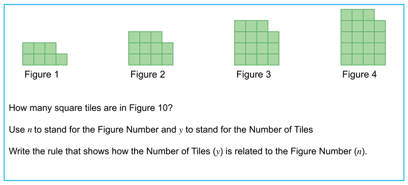

$$
\begin{align*}
& \mathbf{Describe:} && \text{Each figure is made of square tiles.}\\
&&& \text{Figure} \ 1 \ \text{has} \ 7 \ \text{tiles.}\\
&&& \text{Figure} \ 2 \ \text{has} \ 11 \ \text{tiles.}\\
&&& \text{Figure} \ 3 \ \text{has} \ 15 \ \text{tiles.}\\
&&& \text{Figure} \ 4 \ \text{has} \ 19 \ \text{tiles.}\\
\\
& \mathbf{My \ job:} && \text{Determine the number of tiles in Figure} \ 10.\\
&&& \text{Write the rule relating the Number of Tiles to the Figure Number.}\\
\\
& \mathbf{Plan:} && \text{Use the diagrams to figure out the relationship between the Figure Number and}\\
&&& \text{the Number of Tiles.}\\
\\
& \mathbf{Solve:} && \text{Figure} \ 1 \ \text{has} \ 1 \ \text{row of} \ 4 \ \text{tiles with three tiles on top. That is} \ 4 \times 1+3, \ \text{or} \ 7 \ \text{tiles.}\\
&&& \text{Figure} \ 2 \ \text{has} \ 2 \ \text{rows of} \ 4 \ \text{tiles with three tiles on top. That is} \ 4 \times 2+3, \ \text{or} \ 5 \ \text{tiles.}\\
&&& \text{Figure} \ 3 \ \text{has} \ 3 \ \text{rows of} \ 4 \ \text{tiles with three tiles on top. That is} \ 4 \times 3+3, \ \text{or} \ 7 \ \text{tiles.}\\
&&& \text{Figure} \ 4 \ \text{has} \ 4 \ \text{rows of} \ 4 \ \text{tiles with three tiles on top. That is} \ 4 \times 4+3, \ \text{or} \ 9 \ \text{tiles.}\\
&&& \text{Figure} \ 10 \ \text{will have} \ 10 \ \text{rows of} \ 4 \ \text{tiles with three on top. That is} \ 4 \times 10+3, \ \text{or} \ 21 \ \text{tiles.}\\
&&& \text{Figure} \ n \ \text{will have} \ n \ \text{rows of} \ 4 \ \text{tiles with three on top. That is} \ 4 \times n+3, \ \text{or} \ 4n+3 \ \text{tiles.}\\
&&& \text{The rule is} \ y=4n+3\\
\\
& \mathbf{Check:} && \text{Figure} \ 1: 4 \times 1+3=7\\
&&& \text{Figure} \ 2: 4 \times 2+3=11\\
&&& \text{Figure} \ 3: 4 \times 3+3=15\\
&&& \text{Figure} \ 4: 4 \times 4+3=19
\end{align*}
$$

#### Earlier Problem Revisited

$$
\begin{align*}
& \mathbf{Describe:} && \text{Each figure is made of square tiles.}\\
&&& \text{Figure} \ 1 \ \text{has} \ 3 \ \text{tiles.}\\
&&& \text{Figure} \ 2 \ \text{has} \ 5 \ \text{tiles.}\\
&&& \text{Figure} \ 3 \ \text{has} \ 7 \ \text{tiles.}\\
&&& \text{Figure} \ 4 \ \text{has} \ 9 \ \text{tiles.}\\
\\
& \mathbf{My \ job:} && \text{Determine the number of tiles in Figure} \ 10.\\
&&& \text{Write the rule relating the Number of Tiles to the Figure Number.}\\
\\
& \mathbf{Plan:} && \text{Use the diagrams to figure out the relationship between the Figure Number and}\\
&&& \text{the Number of Tiles.}\\
\\
& \mathbf{Solve:} && \text{Figure} \ 1 \ \text{has} \ 1 \ \text{row of} \ 2 \ \text{tiles with one tile on top. That is} \ 2 \times 1+1, \ \text{or} \ 3 \ \text{tiles.}\\
&&& \text{Figure} \ 2 \ \text{has} \ 2 \ \text{rows of} \ 2 \ \text{tiles with one tile on top. That is} \ 2 \times 2+1, \ \text{or} \ 5 \ \text{tiles.}\\
&&& \text{Figure} \ 3 \ \text{has} \ 3 \ \text{rows of} \ 2 \ \text{tiles with one tile on top. That is} \ 2 \times 3+1, \ \text{or} \ 7 \ \text{tiles.}\\
&&& \text{Figure} \ 4 \ \text{has} \ 4 \ \text{rows of} \ 2 \ \text{tiles with one tile on top. That is} \ 2 \times 4+1, \ \text{or} \ 9 \ \text{tiles.}\\
&&& \text{Figure} \ 10 \ \text{will have} \ 10 \ \text{rows of} \ 2 \ \text{tiles with one on top. That is} \ 2 \times 10+1, \ \text{or} \ 21 \ \text{tiles.}\\
&&& \text{Figure} \ n \ \text{will have} \ n \ \text{rows of} \ 2 \ \text{tiles with one on top. That is} \ 2 \times n+1, \ \text{or} \ 2n+1 \ \text{tiles.}\\
&&& \text{The rule is} \ y=2n+1\\
\\
& \mathbf{Check:} && \text{Figure} \ 1: 2 \times 1+1=3\\
&&& \text{Figure} \ 2: 2 \times 2+1=5\\
&&& \text{Figure} \ 3: 2 \times 3+1=7\\
&&& \text{Figure} \ 4: 2 \times 4+1=9
\end{align*}
$$

### Vocabulary

One type of **_pattern_** is when the number of a certain object increases, decreases, or stays the same in a consistent way. In this concept, we saw patterns of tiles where the numbers of tiles were increasing. With any pattern you should be able to describe the pattern and how to get from one step of the pattern to the next. A **_rule_** is an equation that can describe a pattern. In this concept, we wrote **_rules_** for patterns that related the figure number to the number of tiles.

### Examples

For each problem below, look at the figures and answer the questions.

#### Example 1

#### Example 2

#### Example 3

### Review 

For each problem below, look at the figures and answer the questions.

1.  \[Figure 9\]
2.  \[Figure 10\]
3.  \[Figure 11\]
4.  \[Figure 12\]
5.  \[Figure 13\]

</article>

### 8.8 Coin Stumpers

<article>

The weight of a pile of pennies and dimes is 142 grams. The total weight of the pennies is 50 grams. How many pennies and dimes are in the pile? In this section, we will learn how to reason proportionally to answer questions about coins.

### Coin Stumpers 

In order to answer the questions about coins like the one above, use the problem solving steps.

* Start by **describing** what you know from the information given.
* Next, figure out what **your job** is in this problem. In all of these problems your job will be to answer a question about the coins.
* Then, make a **plan** for how you will solve. Think about what other information you know about the weight of the coins. See if you can figure out the weight and number of each type of coin in the pile.
* Next, **solve** the problem.
* Finally, **check** to make sure that your answer works with the original information given.

#### Weighing Coins

1. A pile of 100 pennies weighs 250 grams. A nickel weighs twice as much as a penny. What is the weight of a pile of 300 coins, half pennies and half nickels?

We can use problem solving steps to help.

$$
\begin{align*}
& \mathbf{Describe:} && 100 \ \text{pennies weigh} \ 250 \ \text{grams.}\\
&&& \text{A nickel weighs twice as much as a penny.}\\
&&& \text{A new pile has} \ 300 \ \text{coins. Half of the} \ 300 \ \text{are pennies and half are nickels.}\\
\\
& \mathbf{My \ job:} && \text{Figure out the weight of the pile of} \ 300 \ \text{coins, half pennies and half nickels.}\\
\\
& \mathbf{Plan:} && \text{Compute the weight of a penny and a nickel. Then, use those weights to figure out}\\ &&& \text{the weight of the pile of} \ 300 \ \text{coins, half pennies and half nickels.}\\
\\
& \mathbf{Solve:} && 100 \ \text{pennies are} \ 250 \ \text{grams.}\\
&&& \text{So, one penny is} \ \frac{250}{100}, \ \text{or} \ 2.5 \ \text{grams.}\\
&&& \text{One nickel is} \ 2 \times 2.5, \ \text{or} \ 5 \ \text{grams.}\\
&&& 150 \times 2.5 = 375 \ \text{grams}\\
&&& 150 \times 5.0 = 750 \ \text{grams}\\
&&& \text{The pile of} \ 300 \ \text{coins is} \ 1125 \ \text{grams.}\\
\\
& \mathbf{Check:} && 100 \ \text{pennies are} \ 250 \ \text{grams. Using a proportion, the weight of} \ 150 \ \text{pennies is} \ 1.5\\
&&& \text{times} \ 250, \ \text{or} \ 375 \ \text{grams.}\\
&&& \text{Since} \ 100 \ \text{pennies are} \ 250 \ \text{grams}, \ 100 \ \text{nickels are} \ 2 \times 250 \ \text{or} \ 500 \ \text{grams. So}, \ 150\\
&&& \text{nickels are} \ 1.5 \times 500, \ \text{or} \ 750 \ \text{grams.}\\
&&& 375 + 750 = 1125 \ \text{grams}
\end{align*}
$$

We have already figured out the numbers of grams for a penny and a nickel. Next we will find the number of grams for a dime in Example B. Then we will use those weights to help with all of the other problems in this concept.

2. The weight of a pile of nickels and dimes is 273 grams. There are 60 coins in the pile. Fifty of the coins are nickels. What is the weight of a dime? Record that number in the list below.

\[Figure 1\] 

We can use problem solving steps to help.

**Describe:** 60 coins weigh 273 grams. 50 of the coins are nickels. The rest of the coins are dimes.

**My Job:** Figure out the weight of a dime and record it in the list.

**Plan:** I know the weight of a nickel is 5 grams. Figure out the weight of 50 nickels. Subtract that from the weight of 273 grams to find the weight of 10 dimes. Then, find the weight of one dime.

**Solve:** One nickel is 5 grams, so 50 nickels is $50 \times 5$ grams or 250 grams.

__Since the pile of 60 coins weighs 273 grams. $273-250=23$ grams is how much the 10 dimes weigh.__

One dime is $\frac{23 \ \text{grams}}{10}=2.3 \ \text{grams}$.

**Check:** 50 nickels: $5 \ \text{grams} \times 50=250 \ \text{grams}$

__10 dimes: $2.3  \ \text{grams} \times 10=23 \ \text{grams}$__

$250+23=273$

3. The weight of a pile of pennies and nickels is 300 grams. There are 20 nickels. How many pennies are there?

**Solution:**

We can use problem solving steps to help.

**Describe:** There is a pile of pennies and nickels that weighs 300 grams. There are 20 nickels.

**My Job:** Figure out how many pennies there are.

**Plan:** I know that a penny weighs 2.5 grams and a nickel weighs 5 grams. Find the weight of 20 nickels. Subtract that from 300 grams to find the weight of the pennies. Divide the weight of the pennies by 2.5 grams to find out how many pennies there are.

**Solve:** One nickel weighs 5 grams so 20 nickels weighs $20\times 5 \ \text{grams}=100 \ \text{grams}$.

__The pile is 300 grams, so that means that the pennies weigh $300  \ \text{grams}-100 \ \text{grams}=200 \ \text{grams}$.__

One penny weighs 2.5 grams. $\frac{200 \ \text{grams}}{2.5 \ \text{grams}}=80$ so 80 pennies weigh 200 grams. There are 80 pennies in the pile.

**Check:** 20 nickels: $5 \ \text{grams} \times 20=100 \ \text{grams}$

__80 pennies: $2.5  \ \text{grams} \times 80=200 \ \text{grams}$__

$100+200=300$

#### Earlier Problem Revisited

The weight of a pile of pennies and dimes is 142 grams. The total weight of the pennies is 50 grams. How many pennies and dimes are in the pile?

We can use the information from the examples and problem solving steps to help us solve this problem.

**Describe:** There is a pile of pennies and dimes that weighs 142 grams. The pennies weigh 50 grams.

**My Job:** Figure out how many pennies and dimes are in the pile.

**Plan:** Use the fact that the whole pile is 142 grams and the pennies are 50 grams to find the weight of the dimes. I know that a penny weighs 2.5 grams and a dime weighs 2.3 grams. Use this information to find out how many pennies and dimes there are.

**Solve:** $142 \ \text{grams}-50 \ \text{grams}=92 \ \text{grams}$ so the dimes weigh 92 grams.

__One penny weighs 2.5 grams. $\frac{50 \ \text{grams}}{2.5 \ \text{grams}}=20$ so there are 20 pennies.__

One dime weighs 2.3 grams. $\frac{92 \ \text{grams}}{2.3 \ \text{grams}}=40$ so there are 40 dimes.

**Check:** 20 pennies: $2.5 \ \text{grams} \times 20=50 \ \text{grams}$

__40 dimes: $2.3  \ \text{grams} \times 40=92 \ \text{grams}$__

$50+92=142$

### Vocabulary

In this concept we used **_proportional reasoning_** when we used what we knew about a pile of coins to figure out information about one coin. Any time there is a constant ratio between two quantities (such as the number of pennies in a pile and the weight of the pile) we can use **_proportional reasoning_** to solve.

### Examples 

#### Example 1

The total weight of a pile of pennies, nickels, and dimes is 191.4 grams. There are 20 pennies in the pile. There are 2 fewer dimes than pennies. How many coins are nickels?

20 nickels

20 pennies are $20 \times 2.5$ grams $= 50$ grams; 18 dimes are $18 \times 2.3$ grams $= 41.4$ grams. $191.4 - 91.4 = 100$ grams 

$\frac{100}{5} = 20$ nickels.

#### Example 2

The total weight of a pile of pennies and dimes is 96 grams. There are 20 dimes in the pile. What is the total value of the coins?

$2.20

20 dimes is $20 \times 2.3$ grams, or 46 grams

$96 - 46 = 50$ grams

$\frac{50}{2.5} = 20$ pennies 

20 dimes is $2.00

20 pennies is $0.20

$\$2 + \$0.20 = \$2.20$

#### Example 3

The total weight of a pile of nickels and pennies is 3000 grams. The total value of the nickels is $25. How many pennies are in the pile?

200 pennies

$\$25 \times 20$ nickels/dollar $= 500$ nickels  
$500 \times 5$ grams $= 2500$ grams of nickels

$3000 - 2500 = 500$ grams of pennies

$\frac{500}{2.5} = 200$ pennies

### Review 

1.  A pile of pennies, nickels and dimes weighs 146 grams. There are 30 pennies in the pile. There are 10 less dimes than pennies. What is the total value of the nickels in the pile?
2.  A pile of pennies, nickels and dimes weighs 195.5 grams. There are 15 pennies in the pile. There are 12 more nickels than pennies. What is the total value of the coins in the pile?
3.  The total weight of a pile of pennies, nickels, and dimes is 84.6 grams. There are 22 pennies in the pile. There are 20 fewer dimes than pennies. How many coins are nickels?
4.  The total weight of a pile of pennies and nickels is 142.5 grams. There are 15 nickels in the pile. What is the total value of the coins?
5.  The total weight of a pile of nickels and dimes is 1273.1 grams. The total value of the nickels is $10.50. How many dimes are in the pile?

</article>

### 8.9 Trip Functions

<article>

Read the facts below and look at the table. Can you complete the table to show changes in Ms. Wilson's odometer? Can you write a rule that shows the relationship between the number of hours and the odometer reading? In this section, we will learn to write rules for information given about trips.

**Facts:** Before the start of the cross-country trip, the odometer in Mrs. Wilson’s car showed 4,100 miles. On the trip, she averaged 50 miles per hour.

In order to make a table and write a rule for situations like the one above, we can use the problem solving steps to help.

* First, **describe** what you know. What did the odometer say at the beginning? How much is it changing each hour?
* Second, identify what **your job** is. In these problems, your job will be to make a table and write a rule.
* Third, make a **plan**. In these problems, your plan should be to use the facts to fill in the table. Then, look for a pattern to help you write the rule.
* Fourth, **solve**. Implement your plan.
* Fifth, **check**. Make sure your rule works with the facts.

**1. Facts:** Before he left on his trip, Mr. Patterson’s truck odometer showed 23,500 miles. He averaged 40 miles per hour on his drive from Sacramento to San Diego.

_____First:_ Complete the table to show changes in Mr. Patterson’s truck odometer for the first 6 hours.__

_First:_ Complete the table to show changes in Mr. Patterson’s truck odometer for the first 6 hours.__

___Rule:_ \_\_\_\_\_\_\_\_\_\_\_\_\_\_\_\_\_\_\_\_\_\_\_\_\_\_\_\_\_\_\_\_\_\_\_\_\_\_\_\_\_\_\_\_\_\_\_\_\_\_\_\_\_\_\___

_Rule:_ \_\_\_\_\_\_\_\_\_\_\_\_\_\_\_\_\_\_\_\_\_\_\_\_\_\_\_\_\_\_\_\_\_\_\_\_\_\_\_\_\_\_\_\_\_\_\_\_\_\_\_\_\_\_\_

We can use problem solving steps and the facts above to solve this problem.

$$
\begin{align*}
& \mathbf{Describe:} && \text{Before the start of the trip, Mr. Patterson's truck odometer showed} \ 23,500\\
&&& \text{miles. On the trip, he drove an average of} \ 40 \ \text{miles each hour.}\\
\\
& \mathbf{My \ Job:} && \text{Use the facts to complete the table. Write a rule that shows how the}\\
&&& \text{number of miles on the odometer is related to the number of hours of}\\
&&& \text{travel on the trip.}\\
\\
& \mathbf{Plan:} && \text{Start with the table. Put 23,500 at 0 hours. Add} \ 40 \ \text{to} \ 23,500 \\
&&&  \text{for each new hour. Then write the rule.}
\end{align*}
$$

\begin{align*}
& \mathbf{Solve:} && \text{Rule: Number of miles is the sum of} \ 23,500 \ \text{and the product of number of}\\
&&& \text{hours and} \ 40 \ \text{mph.}\\
\\
& \mathbf{Check:} && \text{Use the rule and to verify the facts.}\\
&&& 23,500 + 1 \times 40=23,540\\
&&& 23,500 + 2 \times 40=23,580\\
&&& 23,500 + 3 \times 40=23,620\\
&&& 23,500 + 4 \times 40=23,660\\
&&& 23,500 + 5 \times 40=23,700\\
&&& 23,500 + 6 \times 40=23,740
\end{align*}
$$

**2. Facts:** The Karene City School Bus averaged 30 miles per hour on its trip to the state basketball competition. At the start of the trip, the bus’s odometer showed 72,160 miles.

_____First:_ Complete the table to show changes in the bus’s odometer for the first 6 hours.__

_First:_ Complete the table to show changes in the bus’s odometer for the first 6 hours.__

___Rule:_ \_\_\_\_\_\_\_\_\_\_\_\_\_\_\_\_\_\_\_\_\_\_\_\_\_\_\_\_\_\_\_\_\_\_\_\_\_\_\_\_\_\_\_\_\_\_\_\_\_\_\_\_\_\_\___

_Rule:_ \_\_\_\_\_\_\_\_\_\_\_\_\_\_\_\_\_\_\_\_\_\_\_\_\_\_\_\_\_\_\_\_\_\_\_\_\_\_\_\_\_\_\_\_\_\_\_\_\_\_\_\_\_\_\_

We can use problem solving steps and the facts above to solve this problem.

$$
\begin{align*}
& \mathbf{Describe:} && \text{Before the start of the trip, the Karene City School Bus odometer showed} \ 72,160\\
&&& \text{miles. On the trip, they drove an average of} \ 30 \ \text{miles each hour.}\\
\\
& \mathbf{My \ Job:} && \text{Use the facts to complete the table. Write a rule that shows how the}\\
&&& \text{number of miles on the odometer is related to the number of hours of}\\
&&& \text{travel on the trip.}\\
\\
& \mathbf{Plan:} && \text{Start with the table. Put 72,160 at 0 hours. Add} \ 30 \ \text{to} \ 72,160 \\
&&&  \text{for each new hour. Then write the rule.}
\end{align*}
$$

\begin{align*}
& \mathbf{Solve:} && \text{Rule: Number of miles is the sum of} \ 72,160 \ \text{and the product of number of}\\
&&& \text{hours and} \ 30 \ \text{mph.}\\
\\
& \mathbf{Check:} && \text{Use the rule and to verify the facts.}\\
&&& 72,160 + 1 \times 30=72,190\\
&&& 72,160 + 2 \times 30=72,220\\
&&& 72,160 + 3 \times 30=72,250\\
&&& 72,160 + 4 \times 30=72,280\\
&&& 72,160 + 5 \times 30=72,310\\
&&& 72,160 + 6 \times 30=72,340
\end{align*}
$$

#### Earlier Problem Revisited

**Facts:** Before the start of the cross-country trip, the odometer in Mrs. Wilson’s car showed 4,100 miles. On the trip, she averaged 50 miles per hour.

We can use problem solving steps and the facts above to solve this problem.

$$
\begin{align*}
& \mathbf{Describe:} && \text{Before the start of the trip, Ms. Wilson's car odameter showed} \ 4,100\\
&&& \text{miles. On the trip, she drove an average of} \ 50 \ \text{miles each hour. The table}\\
&&& \text{shows} \ 4,100 \ \text{miles at} \ 0 \ \text{hours.}\\
\\
& \mathbf{My \ Job:} && \text{Use the facts to complete the table. Write a rule that shows how the}\\
&&& \text{number of miles on the odometer is related to the number of hours of}\\
&&& \text{travel on the trip.}\\
\\
& \mathbf{Plan:} && \text{Start with the table. Add} \ 50 \ \text{to} \ 4,100 \ \text{for each new hour. Then write the}\\
&&& \text{rule.}
\end{align*}
$$

\begin{align*}
& \mathbf{Solve:} && \text{Rule: Number of miles is the sum of} \ 4,100 \ \text{and the product of number of}\\
&&& \text{hours and} \ 50 \ \text{mph.}\\
\\
& \mathbf{Check:} && \text{Use the rule and to verify the facts.}\\
&&& 4,100 + 1 \times 50=4,150\\
&&& 4,100 + 2 \times 50=4,200\\
&&& 4,100 + 3 \times 50=4,250\\
&&& 4,100 + 4 \times 50=4,300\\
&&& 4,100 + 5 \times 50=4,350\\
&&& 4,100 + 6 \times 50=4,400
\end{align*}
$$

### Vocabulary

One type of **_table_** shows a relationship between an **_input_** and an **_output_**. In this concept, the inputs of our tables were _number of hours_ and the outputs of our tables were _odometer: number of miles._ A **_rule_** is an equation that can describe the relationship between the inputs and the outputs of a table. In this concept, we wrote **_rules_** that showed the relationship between the number of hours and the odometer or pedometer reading.

### Examples

#### **Example 1**

**Facts:** Charlie’s pedometer is on his belt. It registers the number of miles walked. Before the hike, the pedometer showed 27 miles. Charlie hiked for several days and averaged 3 miles per hour.

__**First:** Complete the table to show changes in Charlie’s pedometer for the first 6 hours.__

**Second:** Write a rule that describes how the number of hours traveled is related to what the pedometer shows.

\[Figure 7\]__Rule: \_\_\_\_\_\_\_\_\_\_\_\_\_\_\_\_\_\_\_\_\_\_\_\_\_\_\_\_\_\_\_\_\_\_\_\_\_\_\_\_\_\_\_\_\_\_\_\_\_\_\_\_\_\_\___

Rule: \_\_\_\_\_\_\_\_\_\_\_\_\_\_\_\_\_\_\_\_\_\_\_\_\_\_\_\_\_\_\_\_\_\_\_\_\_\_\_\_\_\_\_\_\_\_\_\_\_\_\_\_\_\_\_

Rule: Number of miles is the sum of 27 and the product of number of hours and 3 mph.

**Facts:** Before Brent left on his bike hike, his bike’s odometer showed 62 miles. Brent averaged 8 miles per hour.

__**First:** Complete the table to show changes in Brent’s bike odometer for the first 6 hours.__

**Second:** Write a rule that describes how the number of hours traveled is related to what the bike odometer shows.

\[Figure 9\]__Rule: \_\_\_\_\_\_\_\_\_\_\_\_\_\_\_\_\_\_\_\_\_\_\_\_\_\_\_\_\_\_\_\_\_\_\_\_\_\_\_\_\_\_\_\_\_\_\_\_\_\_\_\_\_\_\___

Rule: \_\_\_\_\_\_\_\_\_\_\_\_\_\_\_\_\_\_\_\_\_\_\_\_\_\_\_\_\_\_\_\_\_\_\_\_\_\_\_\_\_\_\_\_\_\_\_\_\_\_\_\_\_\_\_

Rule: Number of miles is the sum of 62 and the product of number of hours and 8 mph.

1. **Facts:** David’s pedometer is on his belt. It registers the number of miles walked. Before the hike, the pedometer showed 15 miles. David walked for several days and averaged 2 miles per hour.

__**First:** Complete the table to show changes in David’s pedometer for the first 6 hours.__

**Second:** Write a rule that describes how the number of hours traveled is related to what the pedometer shows.

\[Figure 11\]__Rule: \_\_\_\_\_\_\_\_\_\_\_\_\_\_\_\_\_\_\_\_\_\_\_\_\_\_\_\_\_\_\_\_\_\_\_\_\_\_\_\_\_\_\_\_\_\_\_\_\_\_\_\_\_\_\___

Rule: \_\_\_\_\_\_\_\_\_\_\_\_\_\_\_\_\_\_\_\_\_\_\_\_\_\_\_\_\_\_\_\_\_\_\_\_\_\_\_\_\_\_\_\_\_\_\_\_\_\_\_\_\_\_\_

2. **Facts:** Before Jason left on his bike, his bike’s odometer showed 27 miles. Jason averaged 10 miles per hour.

__**First:** Complete the table to show changes in Jason’s bike odometer for the first 6 hours.__

**Second:** Write a rule that describes how the number of hours traveled is related to what the bike odometer shows.

\[Figure 12\]__Rule: \_\_\_\_\_\_\_\_\_\_\_\_\_\_\_\_\_\_\_\_\_\_\_\_\_\_\_\_\_\_\_\_\_\_\_\_\_\_\_\_\_\_\_\_\_\_\_\_\_\_\_\_\_\_\___

Rule: \_\_\_\_\_\_\_\_\_\_\_\_\_\_\_\_\_\_\_\_\_\_\_\_\_\_\_\_\_\_\_\_\_\_\_\_\_\_\_\_\_\_\_\_\_\_\_\_\_\_\_\_\_\_\_

3. **Facts:** Anne got a new pedometer that tells her how many miles she has walked. One day the pedometer says 5 miles. Anne then does a long walk-a-thon where she averages 3 miles per hour.

__**First:** Complete the table to show changes in Anne’s pedometer for the first 6 hours.__

**Second:** Write a rule that describes how the number of hours traveled is related to what the pedometer shows.

\[Figure 13\]__Rule: \_\_\_\_\_\_\_\_\_\_\_\_\_\_\_\_\_\_\_\_\_\_\_\_\_\_\_\_\_\_\_\_\_\_\_\_\_\_\_\_\_\_\_\_\_\_\_\_\_\_\_\_\_\_\___

Rule: \_\_\_\_\_\_\_\_\_\_\_\_\_\_\_\_\_\_\_\_\_\_\_\_\_\_\_\_\_\_\_\_\_\_\_\_\_\_\_\_\_\_\_\_\_\_\_\_\_\_\_\_\_\_\_

4. **Facts:** Katie's car odometer shows 31,570 before a long car trip. She then goes on a trip where she averages 55 miles per hour.

__**First:** Complete the table to show changes in Katie's car odometer for the first 6 hours.__

**Second:** Write a rule that describes how the number of hours traveled is related to what the bike odometer shows.

\[Figure 14\]__Rule: \_\_\_\_\_\_\_\_\_\_\_\_\_\_\_\_\_\_\_\_\_\_\_\_\_\_\_\_\_\_\_\_\_\_\_\_\_\_\_\_\_\_\_\_\_\_\_\_\_\_\_\_\_\_\___

Rule: \_\_\_\_\_\_\_\_\_\_\_\_\_\_\_\_\_\_\_\_\_\_\_\_\_\_\_\_\_\_\_\_\_\_\_\_\_\_\_\_\_\_\_\_\_\_\_\_\_\_\_\_\_\_\_

5. **Facts:** Bob is a bus driver for the city. The odometer on the bus shows 65,490 when he starts driving one day. He averages 15 miles per hour throughout the day.

__**First:** Complete the table to show changes in Bob's bus odometer for the first 6 hours.__

**Second:** Write a rule that describes how the number of hours traveled is related to what the bike odometer shows.

\[Figure 15\]__Rule: \_\_\_\_\_\_\_\_\_\_\_\_\_\_\_\_\_\_\_\_\_\_\_\_\_\_\_\_\_\_\_\_\_\_\_\_\_\_\_\_\_\_\_\_\_\_\_\_\_\_\_\_\_\_\___

Rule: \_\_\_\_\_\_\_\_\_\_\_\_\_\_\_\_\_\_\_\_\_\_\_\_\_\_\_\_\_\_\_\_\_\_\_\_\_\_\_\_\_\_\_\_\_\_\_\_\_\_\_\_\_\_\_

</article>

### 8.10 Drive Away

<article>

Look at the fact and graph below. Can you figure out what Bush's speed was in miles per hour? Can you complete a table to show the total number of miles traveled by Bush at that speed? Can you write a rule to show how the number of miles is related to the number of hours? In this section, we will learn how to interpret graphs and write rules to match what we see on graphs.

Fact: The graph shows the speeds of drivers, Axel and Bush, on city roads. Bush is traveling faster than Axel.

In order to make a table and write a rule for situations like the one above, we can use the problem solving steps to help.

* First, **describe** what you know. What information do we see in the graph?
* Second, identify what **your job** is. In these problems, your job will be to make a table and write a rule.
* Third, make a **plan**. In these problems, your plan should be to use the graph to fill in the table. Then, look for a pattern to help you write the rule.
* Fourth, **solve**. Implement your plan.
* Fifth, **check**. Make sure your rule works with the graph.

1. Fact: The graph shows the speeds of drivers, Harold and French. Harold didn’t travel as fast as French.

2.  Complete a table to show total number of miles traveled by Harold at that speed.
3.  Let $t$ represent number of hours and $D$ represent distance in number of miles. Write a rule to show how the number of miles $(D)$ is related to number of hours $(t)$.

We can use problem solving steps to help us to interpret the graph and answer the questions.

$$
\begin{align*}
& \mathbf{Describe:} && \text{The graph shows time in number of hours along the horizontal axis.}\\
&&& \text{Distance in number of miles is shown along the vertical axis. The two}\\
&&& \text{lines on the graph represent the speeds of Harold and French. The Fact}\\
&&& \text{indicates that Harold didn't travel as fast as French.}\\
\\
& \mathbf{My \ Job:} && \text{Use the Fact to figure out which line represents Harold. Complete the table}\\
&&& \text{for Harold. Write a rule to describe how the number of miles traveled is}\\
&&& \text{related to the number of hours of driving time.}\\
\\
& \mathbf{Plan:} && \text{Compare the lines with the Fact and decide which line represents Harold. }\\
&&& \text{Determine his average speed. Use that data to complete the table.}\\
&&& \text{Generalize from the data in the table. Construct the rule.}\\
\\
& \mathbf{Solve:} && \text{Harold is line Q.}\\
&&& 1. \ \text{He was driving at a speed of} \ 15 \ \text{mph.}\\
&&& 2. \ \text{Complete the table using that speed to figure out the distances.}
\end{align*}
$$

\begin{align*}
& 3. \ D=15 \ t\;\;\;\;\;\;\;\;\;\;\;\;\;\;\;\;\;\;\;\;\;\;\;\;\;\;\;\;\;\;\;\;\;\;\;\;\;\;\;\;\;\;\;\;\;\;\;\;\;\;\;\;\;\;\;\;\;\;\;\;\;\;\;\;\;\;\;\;\;\;\;\;
\end{align*}
$$

$$
\begin{align*}
& \mathbf{Check:} && \text{Use the rule to verify the data in the table.} \;\;\;\;\;\;\;\;\;\;\;\;\;\;\;\;\;\;\;\;\;\;\;\;\;\;\;\;\;\;\;\;\;\;\;\;\;\;\;\;\;\;\;\;\;\;\;\;\;\; \\
&&& D=15 \times 1=15\\
&&& D=15 \times 2=30\\
&&& D=15 \times 3=45\\
&&& D=15 \times 4=60\\
&&& D=15 \times 5=75\\
&&& D=15 \times 6=90
\end{align*}
$$

2. Fact: The graph shows the speeds of drivers, Roberts and Clark. Roberts drove 10 mph slower than Clark.

2.  Complete a table to show total number of miles traveled by Clark at that speed.
3.  Let $t$ represent number of hours and $D$ represent distance in number of miles. Write a rule to show how the number of miles $(D)$ is related to number of hours $(t)$.

We can use problem solving steps to help us to interpret the graph and answer the questions.

$$
\begin{align*}
& \mathbf{Describe:} && \text{The graph shows time in number of hours along the horizontal axis.}\\
&&& \text{Distance in number of miles is shown along the vertical axis. The two}\\
&&& \text{lines on the graph represent the speeds of Roberts and Clark. The Fact}\\
&&& \text{indicates that Roberts drove 10 mph slower than Clark.}\\
\\
& \mathbf{My \ Job:} && \text{Use the Fact to figure out which line represents Clark. Complete the table}\\
&&& \text{for Clark. Write a rule to describe how the number of miles traveled is}\\
&&& \text{related to the number of hours of driving time.}\\
\\
& \mathbf{Plan:} && \text{Compare the lines with the Fact and decide which line represents Clark. }\\
&&& \text{Determine his average speed. Use that data to complete the table.}\\
&&& \text{Generalize from the data in the table. Construct the rule.}\\
\\
& \mathbf{Solve:} && \text{Clark is line S.}\\
&&& 1. \ \text{He was driving at a speed of} \ 20 \ \text{mph.}\\
&&& 2. \ \text{Complete the table using that speed to figure out the distances.}
\end{align*}
$$

\begin{align*}
& 3. \ D=20 \ t\;\;\;\;\;\;\;\;\;\;\;\;\;\;\;\;\;\;\;\;\;\;\;\;\;\;\;\;\;\;\;\;\;\;\;\;\;\;\;\;\;\;\;\;\;\;\;\;\;\;\;\;\;\;\;\;\;\;\;\;\;\;\;\;\;\;\;\;\;\;\;\;
\end{align*}
$$

$$
\begin{align*}
& \mathbf{Check:} && \text{Use the rule to verify the data in the table.} \;\;\;\;\;\;\;\;\;\;\;\;\;\;\;\;\;\;\;\;\;\;\;\;\;\;\;\;\;\;\;\;\;\;\;\;\;\;\;\;\;\;\;\;\;\;\;\;\;\; \\
&&& D=20 \times 1=20\\
&&& D=20 \times 2=40\\
&&& D=20 \times 3=60\\
&&& D=20 \times 4=80\\
&&& D=20 \times 5=100\\
&&& D=20 \times 6=120
\end{align*}
$$

#### Earlier Problem Revisited

Fact: The graph shows the speeds of drivers, Axel and Bush, on city roads. Bush is traveling faster than Axel.

2.  Complete a table to show total number of miles traveled by Bush at that speed.
3.  Let $t$ represent number of hours and $D$ represent distance in number of miles. Write a rule to show how the number of miles $(D)$ is related to number of hours $(t)$.

We can use problem solving steps to help us to interpret the graph and answer the questions.

$$
\begin{align*}
& \mathbf{Describe:} && \text{The graph shows time in number of hours along the horizontal axis.}\\
&&& \text{Distance in number of miles is shown along the vertical axis. The two}\\
&&& \text{lines on the graph represent the speeds of Axel and Bush. The Fact}\\
&&& \text{indicates that Bush is traveling faster than Axel.}\\
\\
& \mathbf{My \ Job:} && \text{Use the Fact to figure out which line represents Bush. Complete the table}\\
&&& \text{for Bush. Write a rule to describe how the number of miles traveled is}\\
&&& \text{related to the number of hours of driving time.}\\
\\
& \mathbf{Plan:} && \text{Compare the lines with the Fact and decide which line represents Bush. }\\
&&& \text{Determine his average speed. Use that data to complete the table.}\\
&&& \text{Generalize from the data in the table. Construct the rule.}\\
\\
& \mathbf{Solve:} && \text{Bush is line S.}\\
&&& 1. \ \text{He was driving at a speed of} \ 30 \ \text{mph.}\\
&&& 2. \ \text{Complete the table using that speed to figure out the distances.}
\end{align*}
$$

\begin{align*}
& 3. \ D=30 \ t\;\;\;\;\;\;\;\;\;\;\;\;\;\;\;\;\;\;\;\;\;\;\;\;\;\;\;\;\;\;\;\;\;\;\;\;\;\;\;\;\;\;\;\;\;\;\;\;\;\;\;\;\;\;\;\;\;\;\;\;\;\;\;\;\;\;\;\;\;\;\;\;
\end{align*}
$$

$$
\begin{align*}
& \mathbf{Check:} && \text{Use the rule to verify the data in the table.} \;\;\;\;\;\;\;\;\;\;\;\;\;\;\;\;\;\;\;\;\;\;\;\;\;\;\;\;\;\;\;\;\;\;\;\;\;\;\;\;\;\;\;\;\;\;\;\;\;\; \\
&&& D=30 \times 1=30\\
&&& D=30 \times 2=60\\
&&& D=30 \times 3=90\\
&&& D=30 \times 4=120\\
&&& D=30 \times 5=150\\
&&& D=30 \times 6=180
\end{align*}
$$

### Vocabulary

A **_graph_** is one way to show the relationship between two variables. In this concept, we looked at graphs that showed the relationship between distance and time. A **_table_** is another way to show a relationship between two variables (often thought of as the **_input_** and the **_output_**). In this concept, the inputs of our tables were _number of hours_ and the outputs of our tables were _number of miles._ A **_rule_** is an equation that can describe the relationship between the variables in a graph or a table. In this concept, we wrote **_rules_** that showed the relationship between the number of hours and the number of miles.

### Examples

#### Example 1

Fact: The graph shows the speeds of drivers, Marx and Stevens. Marx drove 5 mph faster than Stevens.

\[Figure 8\]__a. What was Marx’s speed in miles per hour?__

$D = 25 \ t$

#### Example 2

Fact: The graph shows the speeds of drivers, Ellsworth and Stewart. The speed limit on Highway 999 is 55 mph. Ellsworth obeyed the speed limit. Stuart did not.

\[Figure 10\]__a. What was Ellsworth’s speed in miles per hour?__

__\[Figure 11\]__

$D = 50 \ t$

### Review 

Fact: The graph below shows the speeds of drivers, Stacey and Kimmy. Kimmy drove 5 mph faster than Stacey.

2.  Complete a table to show total number of miles traveled by Kimmy at that speed.
3.  Let $t$ represent number of hours and $D$ represent distance in number of miles. Write a rule to show how the number of miles $(D)$ is related to number of hours $(t)$.
4.  What was Stacey’s speed in miles per hour?
5.  Complete a table to show total number of miles traveled by Stacey at that speed.
6.  Let $t$ represent number of hours and $D$ represent distance in number of miles. Write a rule to show how the number of miles $(D)$ is related to number of hours $(t)$.

Fact: The graph below shows the speeds of drivers, Wayne and Mike. Wayne drove 25 mph faster than Mike.

8.  Complete a table to show total number of miles traveled by Wayne at that speed.
9.  Let $t$ represent number of hours and $D$ represent distance in number of miles. Write a rule to show how the number of miles $(D)$ is related to number of hours $(t)$.
10. What was Mike’s speed in miles per hour?
11. Complete a table to show total number of miles traveled by Mike at that speed.
12. Let $t$ represent number of hours and $D$ represent distance in number of miles. Write a rule to show how the number of miles $(D)$ is related to number of hours $(t)$.

</article>

## 9.0 CK-12 Algebra Explorations Concepts, Grade 7

<article>

Introduction
------------

In these concepts, you will continue to develop eight key concepts of algebra and will practice your problem solving skills. There are eight concepts, and each one focuses on a key algebraic thinking strategy. You will focus on describing, identifying your job, planning, solving, and checking your thinking.

</article>

### 9.1 X for Unknown

<article>

Look at the equation below. Can you figure out the value of $x$? In this section, you will learn how to solve equations using the order of operations, distributive property, and square roots.

$$
2(x + 8) + 2x = x(x + 2^2) + 3^2 - 9
$$

### X for Unknown 

The **order of operations** tells us the correct order of evaluating math expressions. We always do **_parentheses first_**. Then we do **_exponents_**. Next we do **_multiplication and division (from left to right)_** and finally **_addition and subtraction (from left to right)_**. The **_distributive property $(a \times (b + c) = a \times b + a \times c)$_** allows us to remove parentheses when there is an unknown inside of them.

In order to evaluate expressions using the distributive property and the order of operations, we can use the problem solving steps to help.

* First, **describe** what you see in the problem. What operations are there?
* Second, identify what **your job** is. In these problems, your job will be to solve for the unknown.
* Third, make a **plan**. In these problems, your plan should be to use the distributive property and the order of operations to get the $x^2$ by itself. At the end, you will use a square root.
* Fourth, **solve**.
* Fifth, **check**. Substitute your answer into the equation and make sure it works.

#### Solving for Unknown Values 

1. Solve for the positive value of $x$. Show all steps.

$x^2 + 4(3 + x) - 3 = 2(2x + 9)$

We can use problem solving steps to help us to solve this equation.

$$
\begin{align*}
&\mathbf{Describe:} && \text{The equation has one unknown}, \ x. \ \text{There are two sets of parentheses.}\\
\\
&\mathbf{My \ Job:} && \text{Do the computations to figure out the value of} \ x.\\
\\
&\mathbf{Plan :} && \text{Follow the order of operations to simplify the equation. Then solve for the value}\\
&&& \text{of} \ x. \ \text{Order of operations: Parentheses first. Apply the distributive property.}\\
&&& \text{Then do all computations inside of the parentheses next, following the rule for the}\\
&&& \text{order of operations.}\\
&&& \qquad \text{Parentheses}\\
&&& \qquad \text{Exponents}\\
&&& \qquad \text{Multiplication and Division, left to right}\\
&&& \qquad \text{Addition and Subtraction, left to right}\\
\\
&\mathbf{Solve:} && \qquad \qquad \qquad \qquad \qquad x^2 + 4(3 + x) - 3 = 2(2x + 9)\\
&&& \mathbf{Parentheses} \qquad \qquad \quad x^2 + 12+4x - 3 = 4x+18\\
\\
&&& \mathbf{Combine \ like \ terms} \qquad \qquad \quad x^2 + 9+4x  = 4x+18\\
\\
&&& \mathbf{Add } \ 4x \ \mathbf{to \ each \ side} \qquad x^2 + 9+4x-4x  = 4x+18-4x\\
\\
&&& \mathbf{Add/Subtract} \qquad \qquad \qquad \qquad \quad x^2+9=18\\
&&& \qquad \qquad \qquad \qquad \qquad \qquad \qquad \qquad x^2 = 9\\
&&& \qquad \qquad \qquad \qquad \qquad \qquad \qquad \qquad x = 3
\end{align*}
$$

$$
\begin{align*}
&\mathbf{Check :} && \text{Replace} \ x \ \text{with} \ 3 \ \text{in the equation. Check for equality.}\\
&&& \qquad 3^2 + 4(3 + 3) - 3 = 2(2 \times 3 + 9)\\
&&& \qquad 3^2 + 4 \times 6 - 3 = 2(6 + 9)\\
&&& \qquad 3^2 + 4 \times 6 - 3 = 2 \times 15\\
&&& \qquad 9+ 4 \times 6 - 3 = 2 \times 15\\
&&& \qquad 9+ 24 - 3 = 30\\
&&& \qquad 30=30
\end{align*}
$$

2. Solve for the positive value of $x$. Show all steps.

$4(3 - x) + 9^2 = x(x - 4) + 7^2 - 5$

We can use problem solving steps to help us to solve this equation.

$$
\begin{align*}
&\mathbf{Describe:} && \text{The equation has one unknown}, \ x. \ \text{There are two sets of parentheses.}\\
\\
&\mathbf{My \ Job:} && \text{Do the computations to figure out the value of} \ x.\\
\\
&\mathbf{Plan :} && \text{Follow the order of operations to simplify the equation. Then solve for the value}\\
&&& \text{of} \ x. \ \text{Order of operations: Parentheses first. Apply the distributive property.}\\
&&& \text{Then do all computations inside of the parentheses next, following the rule for the}\\
&&& \text{order of operations.}\\
&&& \qquad \text{Parentheses}\\
&&& \qquad \text{Exponents}\\
&&& \qquad \text{Multiplication and Division, left to right}\\
&&& \qquad \text{Addition and Subtraction, left to right}\\
\\
&\mathbf{Solve:} && \qquad \qquad \qquad \qquad \qquad  \qquad 4(3 - x) + 9^2 = x(x - 4) + 7^2 - 5\\
&&& \mathbf{Parentheses} \qquad \qquad \quad 12-4x + 9^2 = x^2-4x + 7^2 - 5\\
\\
&&& \mathbf{Exponents} \qquad  \qquad \qquad \qquad \ \ 12-4x + 81 = x^2-4x + 49 - 5\\
\\
&&& \mathbf{Combine \ like \ terms}   \qquad \qquad \quad 93-4x = x^2-4x + 44\\
\\
&&& \mathbf{Add} \ 4x \ \mathbf{to \ each \ side} \qquad 93-4x+4x = x^2-4x+4x + 44\\
\\
&&& \mathbf{Add/Subtract} \qquad \qquad \qquad \qquad \quad 93 = x^2 + 44\\
&&& \qquad \qquad \qquad \qquad \qquad \qquad \qquad \qquad 49 = x^2\\
&&& \qquad \qquad \qquad \qquad \qquad \qquad \qquad \qquad 7 = x
\end{align*}
$$

$$
\begin{align*}
&\mathbf{Check :} && \text{Replace} \ x \ \text{with} \ 7 \ \text{in the equation. Check for equality.}\\
&&& \qquad 4(3 - 7) + 9^2 = 7(7 - 4) + 7^2 - 5\\
&&& \qquad 4 \times -4 + 9^2 = 7 \times 3 + 7^2 - 5\\
&&& \qquad 4 \times -4 + 81 = 7 \times 3 + 49 - 5\\
&&& \qquad -16 + 81 = 21 + 49 - 5\\
&&& \qquad 65=65
\end{align*}
$$

3. Solve for the positive value of $x$. Show all steps.

$5(x + 8) + 8^2 - (5^2 + 3 \times 13) = x(x+5) + (9-7)^2$

We can use problem solving steps to help us to solve this equation.

$$
\begin{align*}
&\mathbf{Describe:} && \text{The equation has one unknown}, \ x. \ \text{There are two sets of parentheses.}\\
\\
&\mathbf{My \ Job:} && \text{Do the computations to figure out the value of} \ x.\\
\\
&\mathbf{Plan :} && \text{Follow the order of operations to simplify the equation. Then solve for the value}\\
&&& \text{of} \ x. \ \text{Order of operations: Parentheses first. Apply the distributive property.}\\
&&& \text{Then do all computations inside of the parentheses next, following the rule for the}\\
&&& \text{order of operations.}\\
&&& \qquad \text{Parentheses}\\
&&& \qquad \text{Exponents}\\
&&& \qquad \text{Multiplication and Division, left to right}\\
&&& \qquad \text{Addition and Subtraction, left to right}\\
\\
&\mathbf{Solve:} &&  \qquad \qquad \qquad \qquad \qquad 5(x + 8) + 8^2 - (5^2 + 3 \times 13) = x(x+5) + (9-7)^2\\
&&& \mathbf{Parentheses} \qquad \qquad \quad 5x+40 + 8^2 - (25+39) = x^2+5x + 2^2\\
\\
&&& \mathbf{More \ Parentheses} \qquad \qquad \quad 5x+40 + 8^2 - 64 = x^2+5x + 2^2\\
\\
&&& \mathbf{Exponents} \qquad \qquad \qquad \qquad \qquad \ \ 5x+40 + 64 - 64 = x^2+5x + 4\\
\\
&&& \mathbf{Combine \ like \ terms} \qquad \qquad \qquad \qquad \quad 5x+40 = x^2+5x + 4\\
\\
&&& \mathbf{Subtract} \ 5x \ \mathbf{from \ each \ side} \qquad 5x+40 -5x= x^2+5x + 4-5x\\
\\
&&& \mathbf{Add/Subtract} \qquad \qquad \qquad \qquad \quad 40 = x^2 + 4\\
&&& \qquad \qquad \qquad \qquad \qquad \qquad \qquad \qquad 36 = x^2\\
&&& \qquad \qquad \qquad \qquad \qquad \qquad \qquad \qquad 6 = x
\end{align*}
$$

$$
\begin{align*}
&\mathbf{Check :} && \text{Replace} \ x \ \text{with} \ 6 \ \text{in the equation. Check for equality.}\\
&&& \qquad 5(6 + 8) + 8^2 - (5^2 + 3 \times 13) = 6(6+5) + (9-7)^2\\
&&& \qquad 5 \times 14 + 8^2 - (25+39) = 6 \times 11 + 2^2\\
&&& \qquad 5 \times 14 + 8^2 - 64 = 6 \times 11 + 2^2\\
&&& \qquad 5 \times 14 +64-64=6 \times 11 +4\\
&&& \qquad 70 +64-64=66 +4\\
&&& \qquad 70 = 70
\end{align*}
$$

#### Earlier Problem Revisited

$$
2(x + 8) + 2x = x(x + 2^2) + 3^2 - 9
$$

We can use problem solving steps to help us to solve this equation.

$$
\begin{align*}
&\mathbf{Describe:} && \text{The equation has one unknown}, \ x. \ \text{There are two sets of parentheses.}\\
\\
&\mathbf{My \ Job:} && \text{Do the computations to figure out the value of} \ x.\\
\\
&\mathbf{Plan :} && \text{Follow the order of operations to simplify the equation. Then solve for the value}\\
&&& \text{of} \ x. \ \text{Order of operations: Parentheses first. Apply the distributive property.}\\
&&& \text{Then do all computations inside of the parentheses next, following the rule for the}\\
&&& \text{order of operations.}\\
&&& \qquad \text{Parentheses}\\
&&& \qquad \text{Exponents}\\
&&& \qquad \text{Multiplication and Division, left to right}\\
&&& \qquad \text{Addition and Subtraction, left to right}\\
\\
&\mathbf{Solve:} && \qquad \qquad \qquad \qquad \qquad \qquad \qquad \qquad 2( x  +  8)  +  2x  =  x(x + 2^2) +  3^2 - 9\\
&&& \mathbf{Distributive \ Property} \qquad \qquad \quad 2x + 16 + 2x = x^2 + 4x + 3^2 - 9\\
\\
&&& \mathbf{Exponents} \qquad \qquad \qquad \qquad \qquad \ \ 2x + 16 + 2x = x^2 + 4x + 9 - 9\\
\\
&&& \mathbf{Add \ variables} \qquad \qquad \qquad \qquad \quad 4x + 16 = x^2 + 4x + 9 - 9\\
\\
&&& \mathbf{Subtract} \ 4x \ \mathbf{from \ each \ side} \qquad 4x + 16 - 4x = x^2 + 4x + 9 - 9 - 4x\\
\\
&&& \mathbf{Add/Subtract} \qquad \qquad \qquad \qquad \quad 16 = x^2 + 9 - 9\\
&&& \qquad \qquad \qquad \qquad \qquad \qquad \qquad \qquad 16 = x^2\\
&&& \qquad \qquad \qquad \qquad \qquad \qquad \qquad \qquad 4 = x
\end{align*}
$$

$$
\begin{align*}
&\mathbf{Check :} && \text{Replace} \ x \ \text{with} \ 4 \ \text{in the equation. Check for equality.}\\
&&& \qquad 2(4 + 8) + 2 \times 4 = 4(4 + 2^2) + 3^2 - 9\\
&&& \qquad 2 \times 12 + 2 \times 4 = 4 \times (4 + 4) + 9 - 9\\
&&& \qquad 24 + 8 = 32 + 9 - 9\\
&&& \qquad 32 = 32
\end{align*}
$$

### Vocabulary

The **_order of operations_** tells us the correct order of evaluating math expressions. We always do **_parentheses first_**. Then we do **_exponents_**. Next we do **_multiplication and division (from left to right)_** and finally **_addition and subtraction (from left to right)_**. The **_distributive property $(a \times (b + c) = a \times b + a \times c)$_** allows us to remove parentheses when there is an unknown inside of them. The **_square root_** of a number is a value that, when multiplied by itself, gives the original number.

### Examples

Solve for the positive value of $x$. Show all steps.

#### Example 1

$x^2 + 6(x - 1) = 2(3x - 2) + 2^2 - 2$

$x=2$. Here are the steps to solve: 

$$
\ \quad x^2 + 6(x - 1) = 2(3x - 2) + 2^2 - 2\!\\
{\;} \qquad x^2 + 6x - 6 = 6x - 4 + 2^2 - 2\!\\
{\;} \qquad x^2 + 6x - 6 = 6x - 4 + 4 - 2\!\\ 
{\;} \qquad x^2 + 6x - 6 - 6x = 6x - 4 + 4 - 2 - 6x\!\\
{\;} \qquad x^2 + -6 = - 4 + 4 - 2\!\\ 
{\;} \qquad x^2 + -6 = - 2\!\\ 
{\;} \qquad x^2 + -6 + 6 = - 2 + 6\!\\
{\;} \qquad x^2 = 4\!\\
{\;} \qquad x = 2
$$

#### Example 2

$x^2 + 4(x + 1) = 2(2x +  3^2) + 11$

$x=5$. Here are the steps to solve:  

$$
\quad \  x^2 + 4(x + 1) = 2(2x + 3^2) + 11\!\\
{\;} \qquad x^2 + 4x + 4 = 4x + 2 \times 9 + 11\!\\
{\;} \qquad x^2 + 4x + 4 - 4x = 4x + 2 \times 9 + 11 - 4x \!\\
{\;} \qquad x^2 + 4 = 2 \times 9 + 11\!\\
{\;} \qquad x^2 + 4  = 18 + 11\!\\ 
{\;} \qquad x^2 + 4 - 4 = 18 + 11 - 4\!\\
{\;} \qquad x^2 = 25\!\\
{\;} \qquad x = 5
$$

#### Example 3

$3(x + 10) - 1 - 2^2 =  3x + x^2 + 2(3 + 5)$

$x=3$. Here are the steps to solve:

$$
\quad \  3(x + 10) - 1 - 2^2 = 3x + x^2 + 2(3 + 5)\!\\ 
{\;} \qquad 3x + 30 - 1 - 2^2 = 3x + x^2 + 2 \times 8\!\\ 
{\;} \qquad 3x + 30 - 1 - 4 = 3x + x^2 + 2 \times 8\!\\ 
{\;} \qquad 3x + 30 - 1 - 4 - 3x = 3x + x^2 + 2 \times 8 - 3x \!\\
{\;} \qquad 30 - 1 - 4 = x^2 + 2 \times 8\!\\  
{\;} \qquad 30 - 1 - 4 = x^2 + 16\!\\  
{\;} \qquad 25 = x^2 + 16\!\\
{\;} \qquad 25 - 16 = x^2 + 16 - 16\!\\   
{\;} \qquad 9 = x^2\!\\
{\;} \qquad 3 = x
$$

### Review 

Solve for the positive value of $x$. Show all steps.

1.  $x^2-4(x-3)=4(2x-1)+3^2-1-4x$
2.  $2x^2+7(x-5)=3x+4(x-9)+2^2+x^2+1$
3.  $x^2+5(2x+1)=2(5x+2^2)+22$
4.  $6(x-5)+13+3^2=6x+x^2-4(1+2)$
5.  $x^2-4(2x+6)=1-8x$
6.  $2(4x-3)+4^2-12=10x+x^2-2(1+x)$
7.  $3x^2+4(x-3)=2(2x+x^2)+24$
8.  $2(x-5)+16-2^3=x^2-7x+9(x-3)$

</article>

### 9.2 Letter Grids

<article>

Look at the picture below. The arrows point to the sum of each row or column. Can you figure out the value of each of the five letters? In this section, we will practice solving for unknowns in circles and arrows diagrams.

In order to solve the problem above, use the problem solving steps.

* Start by **describing** what you see in the diagram.
* Next, figure out what **your job** is in this problem. In all of these problems your job will be to figure out the value of the four letters in the diagram.
* Then, make a **plan** for how you will solve. There is usually more than one way to solve the problem. In some of these problems you might need to find the sum of three letters first in order to find the value of one letter.
* Next, **solve** the problem.
* Finally, **check** to make sure that the values you found work for the rows or the columns.

#### Finding Unknown Values 

1. Letters stand for numbers. Same letters are same numbers. Numbers in squares are row and column sums. Arrows point to the sums.

**What are the values?** $\mathbf{M} = \underline{\;\;\;\;\;\;\;\;} \ \mathbf{P} = \underline{\;\;\;\;\;\;\;\;} \ \mathbf{Q} = \underline{\;\;\;\;\;\;\;\;} \ \mathbf{T} = \underline{\;\;\;\;\;\;\;\;} \ \mathbf{W} = \underline{\;\;\;\;\;\;\;\;}$

$$
\begin{align*}
&\mathbf{Describe} && \text{There are three rows and four columns.}\\
&&& \text{Circles have letters or numbers.}\\
&&& \text{Sums of rows and columns are in the squares.}\\
&&& \text{Arrows point to sums.}\\
\\
& \mathbf{My \ Job} && \text{Figure out values of letters,} \ M, P, Q, T, \ \text{and} \ W.\\
\\
&\mathbf{Plan} && \text{Look for a column that contains all letters shown in a row. Replace the group of}\\
&&& \text{same letters with its value and continue.}\\
\\
&\mathbf{Solve} && \text{All of Column} \ 1 \ \text{is contained in Row} \ 2. \ \text{Replace} \ TWQ \ \text{in Row} \ 2 \ \text{with} \ 28. \ \text{Then} \ 28+M=41,\\
&&& \text{and} \ M = 13. \ \text{Replace all} \ M' \text{s in the grid with} \ 13.\\
&&& \text{Column} \ 2: P+13+13=36. \ \text{So}, \ P=10. \ \text{Replace all} \ P' \text{s with} \ 10.\\
&&& \text{Row} \ 1: W+10+4+W=18. \ \text{So}, \ 2W=4 \ \text{and} \ W=2 \ \text{Replace} \ W' \text{s with} \ 2.\\
&&& \text{Row} \ 3: Q+13+Q+10=63. \ \text{So}, \ 2Q=40 \ \text{and} \ Q = 20. \ \text{Replace} \ Q'\text{s with} \ 20.\\
&&& \text{Column} \ 1: 2+T+20=28. \ \text{So}, \ T+22=28, \ \text{and} \ T=6. \ \text{Replace} \ T \ \text{with} \ 6.\\
\\
&\mathbf{Check} && \text{Check rows or columns}\\
&&& \text{Row} \ 1: 2+10+4+2=18\\
&&& \text{Row} \ 2: 6+13+2+20=41\\
&&& \text{Row} \ 3: 20+13+20+10=63
\end{align*}
$$

2. Letters stand for numbers. Same letters are same numbers. Numbers in squares are row and column sums. Arrows point to the sums.

**What are the values?** $\mathbf{C} = \underline{\;\;\;\;\;\;\;\;} \ \mathbf{D} = \underline{\;\;\;\;\;\;\;\;} \ \mathbf{E} = \underline{\;\;\;\;\;\;\;\;} \ \mathbf{F} = \underline{\;\;\;\;\;\;\;\;} \ \mathbf{G} = \underline{\;\;\;\;\;\;\;\;}$

$$
\begin{align*}
&\mathbf{Describe} && \text{There are three rows and four columns.}\\
&&& \text{Circles have letters or numbers.}\\
&&& \text{Sums of rows and columns are in the squares.}\\
&&& \text{Arrows point to sums.}\\
\\
& \mathbf{My \ Job} && \text{Figure out values of letters,} \ C, D, E, F, \ \text{and} \ G.\\
\\
&\mathbf{Plan} && \text{Look for a column that contains all letters shown in a row. Replace the group of}\\
&&& \text{same letters with its value and continue.}\\
\\
&\mathbf{Solve} && \text{All of Column} \ 3 \ \text{is contained in Row} \ 3. \ \text{Replace} \ GDE \ \text{in Row} \ 3 \ \text{with} \ 17. \ \text{Then} \ 17+F=22,\\
&&& \text{and} \ F = 5. \ \text{Replace all} \ F' \text{s in the grid with} \ 5.\\
&&& \text{Column} \ 4: D+D+5=13. \ \text{So}, \ 2D = 8 \ \text{and} \ D = 4. \ \text{Replace all} \ D' \text{s with} \ 4.\\
&&& \text{Row} \ 1: C+C+4+4=12. \ \text{So}, \ 2C=4 \ \text{and} \ C=2 \ \text{Replace} \ C' \text{s with} \ 2.\\
&&& \text{Row} \ 3: G+4+7+5=22. \ \text{So}, \ G+16=22 \ \text{and} \ G = 6. \ \text{Replace} \ G'\text{s with} \ 6.\\
&&& \text{Column} \ 1: 2+E+6=15. \ \text{So}, \ E+8=15, \ \text{and} \ E=7. \ \text{Replace} \ E \ \text{with} \ 7.\\
\\
&\mathbf{Check} && \text{Check rows or columns}\\
&&& \text{Row} \ 1: 2+2+4+4=12\\
&&& \text{Row} \ 2: 7+8+6+4=25\\
&&& \text{Row} \ 3: 6+4+7+5=22
\end{align*}
$$

3. Letters stand for numbers. Same letters are same numbers. Numbers in squares are row and column sums. Arrows point to the sums.

**What are the values?** $\mathbf{A} = \underline{\;\;\;\;\;\;\;\;} \ \mathbf{B} = \underline{\;\;\;\;\;\;\;\;} \ \mathbf{X} = \underline{\;\;\;\;\;\;\;\;} \ \mathbf{Y} = \underline{\;\;\;\;\;\;\;\;} \ \mathbf{Z}= \underline{\;\;\;\;\;\;\;\;}$

$$
\begin{align*}
&\mathbf{Describe} && \text{There are three rows and four columns.}\\
&&& \text{Circles have letters or numbers.}\\
&&& \text{Sums of rows and columns are in the squares.}\\
&&& \text{Arrows point to sums.}\\
\\
& \mathbf{My \ Job} && \text{Figure out values of letters,} \ A, B, X, Y, \ \text{and} \ Z.\\
\\
&\mathbf{Plan} && \text{Look for a column that contains all letters shown in a row. Replace the group of}\\
&&& \text{same letters with its value and continue.}\\
\\
&\mathbf{Solve} && \text{All of Column} \ 1 \ \text{is contained in Row} \ 1. \ \text{Replace} \ YZX \ \text{in Row} \ 1 \ \text{with} \ 27. \ \text{Then} \ 27+Y=39,\\
&&& \text{and} \ Y = 12. \ \text{Replace all} \ Y' \text{s in the grid with} \ 12.\\
&&& \text{Column} \ 4: 12+Z+Z=20. \ \text{So}, \ 2Z = 8 \ \text{and} \ Z = 4. \ \text{Replace all} \ Z' \text{s with} \ 4.\\
&&& \text{Column} \ 1: 12+4+X = 27. \ \text{So}, \ 16+X = 27 \ \text{so} \ X = 11 \ \text{Replace} \ X' \text{s with} \ 11.\\
&&& \text{Row} \ 3: 11+B+12+4=30. \ \text{So}, \ B + 27 = 30 \ \text{and} \ B = 3. \ \text{Replace} \ B'\text{s with} \ 3.\\
&&& \text{Column} \ 2: 4+A+3=8. \ \text{So}, \ A + 7 = 8, \ \text{and} \ A = 1. \ \text{Replace} \ A \ \text{with} \ 1.\\
\\
&\mathbf{Check} && \text{Check rows or columns}\\
&&& \text{Row} \ 1: 12+4+11+12=39\\
&&& \text{Row} \ 2: 4+1+3+4=12\\
&&& \text{Row} \ 3: 11+3+12+4=30
\end{align*}
$$

#### Earlier Problem Revisited

$$
\begin{align*}
&\mathbf{Describe} && \text{There are three rows and four columns.}\\
&&& \text{Circles have letters or numbers.}\\
&&& \text{Sums of rows and columns are in the squares.}\\
&&& \text{Arrows point to sums.}\\
\\
& \mathbf{My \ Job} && \text{Figure out values of letters,} \ A, B, C, D, \ \text{and} \ E.\\
\\
&\mathbf{Plan} && \text{Look for a column that contains all letters shown in a row. Replace the group of}\\
&&& \text{same letters with its value and continue.}\\
\\
&\mathbf{Solve} && \text{All of Column} \ 4 \ \text{is contained in Row} \ 3. \ \text{Replace} \ ABC \ \text{in Row} \ 3 \ \text{with} \ 18. \ \text{Then} \ 18 + C = 22,\\
&&& \text{and} \ C = 4. \ \text{Replace all} \ C' \text{s in the grid with} \ 4.\\
&&& \text{Column} \ 3: D + D + 4 = 22. \ \text{So}, \ 2D = 18 \ \text{and} \ D = 9. \ \text{Replace all} \ D' \text{s with} \ 9.\\
&&& \text{Row} \ 1: 2 + A + 9 + A = 27. \ \text{So}, \ 2A + 11 = 27 \ \text{and} \ 2A = 16 \ \text{and} \ A = 8. \ \text{Replace} \ A' \text{s with} \ 8.\\
&&& \text{Column} \ 4: 8 + B + 4 = 18. \ \text{So}, \ B + 12 = 18 \ \text{and} \ B = 6. \ \text{Replace} \ B'\text{s with} \ 6.\\
&&& \text{Column} \ 1: 2 + E + 8 = 11. \ \text{So}, \ E + 10 = 11, \ \text{and} \ E = 1. \ \text{Replace} \ E \ \text{with} \ 1.\\
\\
&\mathbf{Check} && \text{Check rows or columns}\\
&&& \text{Row} \ 1: 2 + 8 + 9 + 8 = 27\\
&&& \text{Row} \ 2: 1 + 8 + 9 + 6 = 24\\
&&& \text{Row} \ 3: 8 + 6 + 4 + 4 = 22
\end{align*}
$$

### Vocabulary

In math, an **_unknown_** is a letter that stands for a number that we do not yet know the value of. In this concept, when you figured out the value of the letters in the circles and arrows diagrams you were solving for **_unknowns._**

### Examples

In all problems, letters stand for numbers, same letters are same numbers, numbers in squares are row and column sums, arrows point to the sums. Find the values of the five letters.

#### Example 1

#### Example 2

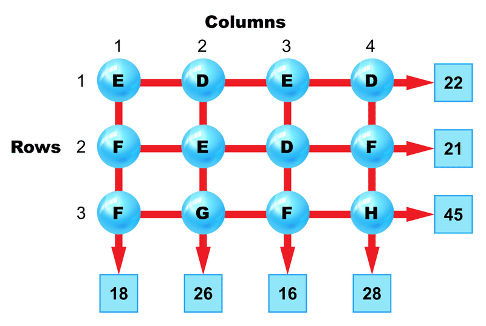

#### Example 3

### Review 

In all problems, letters stand for numbers, same letters are same numbers, numbers in squares are row and column sums, arrows point to the sums. Find the values of the five letters.

1.  \[Figure 9\]
2.  \[Figure 10\]
3.  \[Figure 11\]
4.  \[Figure 12\]
5.  \[Figure 13\]

</article>

### 9.3 Hanging Scales 7

<article>

Look at the pictures of the scales below. Can you write equations to represent what you see on each scale? Can you figure out the value of each letter? In this section, we will practice working with equations that represent what we see on scales. We will then practice solving these systems of equations.

In order to solve the problem above, use the problem solving steps.

* Start by **describing** what information is given.
* Then, identify what **your job** is. In these problems, your job will be to figure out the value of each of the four variables.
* Next, make a **plan** for how you will solve. In these problems, write equations to represent the scales first. Then, solve the system of equations.
* Then, **solve** the problem.
* Finally, **check** your solution. Make sure that your solution causes each scale to have the correct weight.

#### Writing Equations and Finding Unknown Values 

1. Write equations. Figure out the weights of the blocks. Same blocks weigh the same.

$$
\begin{align*}
& \mathbf{Describe}&& \text{There are four scales with blocks}.\\
&&& A: \ w, x, y, z  \ \text{blocks weigh} \ 14 \ \text{pounds}.\\
&&& B: \ w, w, x \ \text{blocks weigh} \ 10 \ \text{pounds}.\\
&&& C: \ w, x, y \ \text{blocks weigh} \ 9 \ \text{pounds}.\\
&&& D: \ w, y, w, y \ \text{blocks weigh} \ 10 \ \text{pounds}.\\
\\
&\mathbf{My \ Job}&& \text{Use the scales as clues. Figure out the weights of the blocks}.\\
\\
&\mathbf{Plan} && \text{Write equations, one for each scale}.\\
&&& A: w+x+y+z=14; \ B: w+w+x=10;\\
&&& C: w+x+y=9; \ D: w+y+w+y=10.\\
&&& \text{Look for equations that are related}.\\
\\
&\mathbf{Solve}&& D: w+y+w+y=10. \ \text{There are two of each block, so} \ w+y=5\\
&&& C: w+x+y=9. \ \text{Replace} \ w+y \ \text{with}\ 5.\\
&&& \qquad 5+x=9, \ \text{and}\\
&&& \qquad x =9-5, \  \text{or} \ 4 \ pounds.\\
&&& B: w+w+x=10. \ \text{Replace} \ x \ \text{with} \ 4.\\
&&& \qquad w+w+4=10, \ 2w=6, \ \text{so} \ w=3 \ pounds.\\
&&& C: w+x+y=9. \ \text{Replace} \ x \ \text{and} \ w \ \text{with their values}. \ \text{Then} \ 3+4+y=9.\\
&&& \qquad y=9-7, \ \text{or} \ 2 \ pounds.\\
&&& A: w+x+y+z=14. \ \text{Replace known letters with their values} \\
&&& \qquad 3+4+2+z=14, \ \text{and} \ z=14-9, \ \text{or} \ 5 \ pounds.\\
\\
&\mathbf{Check} && \text{Replace each block with its weight. Check that the totals equal the number}\\
&&&\text{of pounds shown on the scales.}\\
&&& A: 3+4+2+5=14; \ B: 3+3+4=10; \ C: 3+4+2=9;\\
&&& D: 3+2+3+2=10.
\end{align*}
$$

2. Write equations. Figure out the weights of the blocks. Same blocks weigh the same.

$$
\begin{align*}
& \mathbf{Describe}&& \text{There are four scales with blocks}.\\
&&& A: \ w, x, y \ \text{blocks weigh} \ 16 \ \text{pounds}.\\
&&& B: \ w, x, y, z \ \text{blocks weigh} \ 24 \ \text{pounds}.\\
&&& C: \ w, x, w, x \ \text{blocks weigh} \ 24 \ \text{pounds}.\\
&&& D: \ x, z, z \ \text{blocks weigh} \ 21 \ \text{pounds}.\\
\\
&\mathbf{My \ Job}&& \text{Use the scales as clues. Figure out the weights of the blocks}.\\
\\
&\mathbf{Plan} && \text{Write equations, one for each scale}.\\
&&& A: w+x+y=16; \ B: w + x + y + z = 24;\\
&&& C: w + x + w + x = 24; \ D: x + z + z = 21.\\
&&& \text{Look for equations that are related}.\\
\\
&\mathbf{Solve}&& C: w+x+w+x=24. \ \text{There are two of each block, so} \ w+x=12\\
&&& A: w+x+y=16. \ \text{Replace} \ w+x \ \text{with}\ 12.\\
&&& \qquad 12+y=16, \ \text{and}\\
&&& \qquad y =16-12, \  \text{or} \ 4 \ pounds.\\
&&& B: w+x+y+z=24. \ \text{Replace} \ w+x \ \text{with} \ 12 \ \text{and replace} \ y \ \text{with}\ 4.\\
&&& \qquad 12+4+z=24, \ z+16=24, \ \text{so} \ z=8 \ pounds.\\
&&& D: x+z+z=21. \ \text{Replace} \ z \ \text{with}\ 8. \ \text{Then} \ x+8+8=21.\\
&&& \qquad x=21-16, \ \text{or} \ 5 \ pounds.\\
&&& A: w+x+y=16. \ \text{Replace} \ y \ \text{with} \ 4 \ \text{and replace} \ x \ \text{with} \ 75;\\
&&& \qquad w+5+4=16, \ \text{and} \ w=16-9, \ \text{or} \ 7 \ pounds.\\
\\
&\mathbf{Check} && \text{Replace each block with its weight. Check that the totals equal the number}\\
&&&\text{of pounds shown on the scales.}\\
&&& A: 7+5+4=16; \ B: 7+5+4+8=24; \ C: 7+5+7+5=24;\\
&&& D: 5+8+8=21.
\end{align*}
$$

3. Write equations. Figure out the weights of the blocks. Same blocks weigh the same.

$$
\begin{align*}
& \mathbf{Describe}&& \text{There are four scales with blocks}.\\
&&& A: \ y, z, y, z \ \text{blocks weigh} \ 28 \ \text{pounds}.\\
&&& B: \ x, y, z \ \text{blocks weigh} \ 21 \ \text{pounds}.\\
&&& C: \ w, w, y \ \text{blocks weigh} \ 18 \ \text{pounds}.\\
&&& D: \ w, x, y, z \ \text{blocks weigh} \ 26 \ \text{pounds}.\\
\\
&\mathbf{My \ Job}&& \text{Use the scales as clues. Figure out the weights of the blocks}.\\
\\
&\mathbf{Plan} && \text{Write equations, one for each scale}.\\
&&& A: y+z+y+z=28; \ B: x+y+z=21;\\
&&& C: w+w+y=18; \ D: w+x+y+z.\\
&&& \text{Look for equations that are related}.\\
\\
&\mathbf{Solve}&& A: y+z+y+z=28. \ \text{There are two of each block, so} \ y+z=14\\
&&& B: x+ y+ z = 21. \ \text{Replace} \ y+ z \ \text{with}\ 14.\\
&&& \qquad x+14=21, \ \text{and}\\
&&& \qquad x =21 - 14, \  \text{or} \ 7 \ pounds.\\
&&& D: w+x+y+z=26. \ \text{Replace} \ x \ \text{with} \ 7 \ \text{and replace} \ y+ z \ \text{with}\ 14.\\
&&& \qquad w+7+14=26, \ w+21=26, \ \text{so} \ w=5 \ pounds.\\
&&& C: w+w+y=18. \ \text{Replace} \ w \ \text{with}\ 5. \ \text{Then} \ 5+5+y=18.\\
&&& \qquad y=18-10, \ \text{or} \ 8 \ pounds.\\
&&& B: x+y+z=21. \ \text{Replace} \ y \ \text{with} \ 8 \ \text{and replace} \ x \ \text{with} \ 7;\\
&&& \qquad 7+8+z=21, \ \text{and} \ z=21-15, \ \text{or} \ 6 \ pounds.\\
\\
&\mathbf{Check} && \text{Replace each block with its weight. Check that the totals equal the number}\\
&&&\text{of pounds shown on the scales.}\\
&&& A: 8+6+8+6=28; \ B: 7+8+6=21; \ C: 5+5+8=18;\\
&&& D: 7+5+8+6=26.
\end{align*}
$$

#### Earlier Problem Revisited

$$
\begin{align*}
& \mathbf{Describe}&& \text{There are four scales with blocks}.\\
&&& A: \ y, x, y, x \ \text{blocks weigh} \ 28 \ \text{pounds}.\\
&&& B: \ x, y, z \ \text{blocks weigh} \ 23 \ \text{pounds}.\\
&&& C: \ w, x, y, z \ \text{blocks weigh} \ 28 \ \text{pounds}.\\
&&& D: \ x, x, z \ \text{blocks weigh} \ 25 \ \text{pounds}.\\
\\
&\mathbf{My \ Job}&& \text{Use the scales as clues. Figure out the weights of the blocks}.\\
\\
&\mathbf{Plan} && \text{Write equations, one for each scale}.\\
&&& A: y+ x+ y+ x= 28; \ B: x+ y+ z= 23;\\
&&& C: w+ x+ y + z = 28; \ D: x+x+z=25.\\
&&& \text{Look for equations that are related}.\\
\\
&\mathbf{Solve}&& A: y+x+y+x=28. \ \text{There are two of each block, so} \ y+x=14\\
&&& B: x+ y+ z = 23. \ \text{Replace} \ x+ y \ \text{with}\ 14.\\
&&& \qquad 14 +z=23, \ \text{and}\\
&&& \qquad z =23 - 14, \  \text{or} \ 9 \ pounds.\\
&&& D: x+ x+ z = 25. \ \text{Replace} \ z \ \text{with} \ 9.\\
&&& \qquad x+x+9=25, \ 2x=25-9, \ \text{or} \ 16, \ \text{and}\\
&&& \qquad x =16 \div 2, \ \text{or}\ 8 \ pounds.\\
&&& A: x+ y= 14. \ \text{Replace} \ x \ \text{with}\ 8. \ \text{Then} \ 8+y=14.\\
&&& \qquad y=14-8, \ \text{or} \ 6 \ pounds.\\
&&& C: w+x+ y+ z = 28. \ \text{From} \ B, \ x+y+z=23. \ \text{Replace} \ x+ y+z \ \text{with} \ 23;\\
&&& \qquad w +23=28, \ \text{and} \ w=28-23, \ \text{or} \ 5 \ pounds.\\
\\
&\mathbf{Check} && \text{Replace each block with its weight. Check that the totals equal the number}\\
&&&\text{of pounds shown on the scales.}\\
&&& A: 6 + 8 + 6 + 8 =28; \ B: 8 + 6 + 9 =23; \ C: 5 + 8 + 6+9 =28;\\
&&& D: 8+8+9=25.
\end{align*}
$$

### Vocabulary

In math, an **_unknown_** is a letter that stands for a number that we do not yet know the value of. In this concept, the blocks that we did not know the weights of were **_unknowns_**. An **_equation_** is a math sentence that tells us two quantities that are equal. In this concept, we wrote **_equations_** with unknowns to represent what we saw on the scales. A **_system of equations_** is a set of equations that represent a given problem. Since we wrote multiple equations for each problem in this concept, we wrote a **_system of equations_** for each problem.

### Examples

Write equations. Figure out the weights of the blocks.

#### Example 1

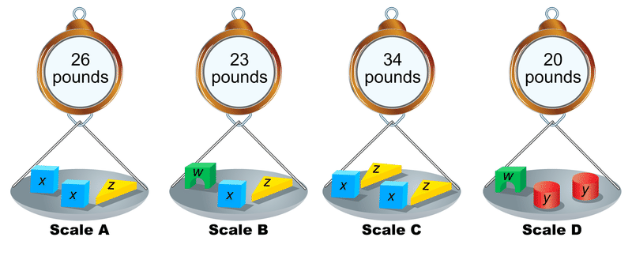

$w = 6$ pounds, $x = 9$ pounds, $y = 7$ pounds, $z = 8$ pounds 

#### Example 2

$w = 4$ pounds, $x = 8$ pounds, $y = 5$ pounds, $z = 9$ pounds

#### Example 1

__$w = 8$ pounds, $x = 6$ pounds, $y = 9$ pounds, $z = 5$ pounds.__

$w = 8$ pounds, $x = 6$ pounds, $y = 9$ pounds, $z = 5$ pounds.

### Review 

Write equations. Figure out the weights of the blocks. Same blocks weigh the same.

1.  \[Figure 9\]
2.  \[Figure 10\]
3.  \[Figure 11\]
4.  \[Figure 12\]
5.  \[Figure 13\]
6.  \[Figure 14\]

</article>

### 9.4 Speedo

<article>

Do you know the formula $D=rt$? Could you use it to solve the problem below? In this section, we will learn how and when to use the distance-rate-time formula.

The average speed of the winner in the 30-minute bicycle race was 52 feet per second. To the nearest tenth of a mile, how many miles was the race?

### Speedo 

In order to solve the problem above, use the problem solving steps along with the formula $D=rt$.

* Start by **describing** what information is given.
* Then, identify what **your job** is. In these problems, your job will be to figure out either the speed, distance, or time.
* Next, make a **plan** for how you will solve. In these problems, you will use the given information and the formula $D=rt$ to solve for the missing information.
* Then, **solve** the problem.
* Finally, **check** your solution. Make sure that your solution works with $D=rt$.

#### Solving Distance Problems 

1. Use the $\textbf{D = \textit{rt}}$ formula to solve the problem. Show your steps.

_The fastest moving ball in any game is the pelota in the game of Jai-Alai. In one game the pelota was clocked at 264 feet per second. At that speed, how far will the pelota travel in 0.5 seconds?_

We can use problem solving steps and the $\textbf{D = \textit{rt}}$ formula to solve the problem.

$$
\begin{align*}
&\mathbf{Describe:}&& \text{Speed is 264 feet per second}.\\
&&& \text{Time is 0.5 seconds}.\\
\\ 
&\mathbf{My \ Job:}&& \text{Figure out how far the pelota will travel}.\\
\\
&\mathbf{Plan:} && \text{Speed is another name for rate. Replace} \ r \ \text{and} \ t \ \text{with their values in the formula,} \ D = rt. \ \text{Solve}\\
&&&\text{for} \ D \ \text{in feet. } \\
\\
&\mathbf{Solve:}&&  D = rt\\
&&& D = 264 ft/sec \ \times 0.5 \ sec\\
&&& D = 132 \ feet\\
&&& \text{It would travel} \ 132 \ feet.\\
\\
&\mathbf{Check:} && 264 \ ft/sec \ \text{for} \ 0.5 \ seconds \ is \ 264 \times 0.5 = 132 \ feet.\\
&&&\text{The pelota will travel} \ 132 \ feet.
\end{align*}
$$

2. Use the $\textbf{D = \textit{rt}}$ formula to solve the problem. Show your steps.

A sky diver in free fall sometimes reaches a speed of 200 feet per second. At that speed, how long would it take a sky diver to descend 5000 feet?**:**

We can use problem solving steps and the $\textbf{D = \textit{rt}}$ formula to solve the problem.

$$
\begin{align*}
&\mathbf{Describe:}&& \text{Speed is 200 feet per second}.\\
&&& \text{Distance is 5000 feet}.\\
\\ 
&\mathbf{My \ Job:}&& \text{Figure out how long it would take}.\\
\\
&\mathbf{Plan:} && \text{Speed is another name for rate. Replace} \ r \ \text{and} \ D \ \text{with their values in the formula,} \ D = rt. \ \text{Solve}\\
&&&\text{for} \ t \ \text{in seconds. } \\
\\
&\mathbf{Solve:}&&  D = rt\\
&&& 5000 \ feet = 200 ft/sec \times t \ sec\\
&&& 25 \ sec = t\\
&&& t = 25 \ sec\\
&&& \text{It would take} \ 25 \ seconds.\\
\\
&\mathbf{Check:} && 200 \ ft/sec \ \text{for} \ 25 \ seconds \ is \ 200 \times 25 = 5000 \ feet.\\
&&&\text{It will take the sky diver} \ 25 \ seconds.
\end{align*}
$$

3. Use the $\textbf{D = \textit{rt}}$ formula to solve the problem. Show your steps.

One of the record speeds for a roller skater is 37.9 feet per second. At this speed, about how many minutes would it take to skate half a mile?

We can use problem solving steps and the $\textbf{D = \textit{rt}}$ formula to solve the problem.

$$
\begin{align*}
&\mathbf{Describe:}&& \text{Speed is 37.9 feet per second}.\\
&&& \text{Distance is half a mile}.\\
\\ 
&\mathbf{My \ Job:}&& \text{Figure out how long it would take in minutes}.\\
\\
&\mathbf{Plan:} && \text{Speed is another name for rate. Replace} \ r \ \text{and} \ D \ \text{with their values in the formula,} \ D = rt. \ \text{Solve}\\
&&&\text{for} \ t \ \text{in seconds. Divide the number of seconds by} \ 60 \ \text{to get the number of minutes}.\\
\\
&\mathbf{Solve:}&& \text{Distance:} \ 0.5 \ miles \ \text{is} \ 0.5 \times 5280 \ feet/mile, \ \text{or} \ 2640 \ feet.\\
&&& D = rt\\
&&& 2640 = 37.9 ft/sec \times t \ sec\\
&&& 69.7 \ sec = t\\
&&& t = 69.7 \ sec\\
&&& \text{it would take about} \ 1 \ minute .\\
\\
&\mathbf{Check:} && 37.9 \ ft/sec \ \text{is} \ 37.9 \times 60, \ \text{or} \ 2274 \ ft/min\\
&&&\text{In a little over} \ 1 \ minute, \ \text{the roller skater will cover} \ 2640 \ \text{feet or half a mile.}
\end{align*}
$$

#### Earlier Problem Revisited

_The average speed of the winner in the 30-minute bicycle race was 52 feet per second. To the nearest tenth of a mile, how many miles was the race?_

We can use problem solving steps and the $\textbf{D = \textit{rt}}$ formula to solve the problem.

$$
\begin{align*}
&\mathbf{Describe:}&& \text{Speed is 52 feet per second}.\\
&&& \text{Time is 30 minutes}.\\
\\ 
&\mathbf{My \ Job:}&& \text{Figure out the length of the race in miles}.\\
\\
&\mathbf{Plan:} && \text{Speed is another name for rate. Since time is in minutes, figure out the rate}\\
&&& \text{in minutes. Replace} \ t \ \text{and} \ r \ \text{with their values in the formula,} \ D = rt. \ \text{Solve}\\
&&&\text{for} \ D \ \text{in feet. Divide the number of feet by} \ 5280 \ \text{to get the number of}\\
&&&\text{miles}.\\
\\
&\mathbf{Solve:}&& \text{Rate:} \ 52 \ feet/second \ \text{is} \ 52 \times 60 \ seconds/minute, \ \text{or} \ 3120 \ feet/minute.\\
&&& D = rt\\
&&& D = 3120 \ ft/min \times 30 \ min, \ \text{or} \ 93,600 \ ft\\
&&& D = \frac{93,600}{5280 \ ft/mile}\\
&&& D = 17.7 \ miles\\
&&& \text{The race was} \ 17.7 \ miles \ \text{long.}\\
\\
&\mathbf{Check:} && 3120 \ ft/min \ \text{is} \ \frac{3120}{5280}, \ \text{or} \ 0.59 \ miles/min\\
&&&\text{In} \ 30 \ minutes, \ \text{the biker will cover} \ 30 \times 0.59 \ miles, \ \text{or} \ 17.7 \ miles.
\end{align*}
$$

### Vocabulary

**_Rate_** is another word for the speed of an object. **_Rate_** tells us the distance that an object is traveling in a given amount of time. The formula **_$D=rt$_** shows the relationship between **_Distance, rate_**, and **_time_**.

### Examples

Use the $\textbf{D= \textit{rt}}$ formula to solve these problems. Show your steps.

#### Example 1

One of the fastest swimmers swam 100 yards at the rate of 6.65 feet per second. How long did it take the swimmer to swim the 100 yards?

About 45 seconds. 

$$
\begin{align*}
D&= rt\\
100 \ yards &= 300 \ ft\\
300 \ ft &= 6.65 \ ft/sec \times \textbf{\textit{t}}\\
\frac{300 \ ft}{6.65 \ ft/sec} &= \textbf{\textit{t}}\\
45.11 \ sec &= t
\end{align*}
$$

#### Example 2

A hard hit table tennis ball can travel the length of the 9 foot table in 0.075 second. At that speed, how far would the table tennis ball travel in one second?

120 ft/sec

$$
\begin{align*}
D&= rt\\
9 \ ft &= \textbf{\textit{r}} \times 0.075 \ sec\\
\frac{9 \ ft}{0.075 \ sec} & = \textbf{\textit{r}}\\
120 \ ft/sec &= \textbf{\textit{r}}
\end{align*}
$$

#### Example 3

In 0.3 second, a well hit volley ball can travel 59 feet, the length of a volley ball court. How far could a hard hit volleyball travel in one second?

196.7 ft/sec

$$
\begin{align*}
D&= rt\\
59 \ ft &= \textbf{\textit{r}} \times 0.3 \ sec\\
\frac{59 \ ft}{0.3 \ sec} &= \textbf{\textit{r}}\\
196.7 \ ft/sec &= \textbf{\textit{r}}
\end{align*}
$$

### Review 

Use the $\textbf{D= \textit{rt}}$ formula to solve these problems. Show your steps.

1.  A swimmer swims 150 yards at the rate of 2.8 feet per second. How long did it take the swimmer to swim the 150 yards?
2.  A baseball travels 80 mph. At that speed, how far would it travel in three seconds? Determine your answer in feet.
3.  In 3.3 seconds, a volleyball travels 100 feet. At that rate, how far did it travel in 1 second?
4.  A plane travels at 550mph. How long does it take to go 3300 miles?
5.  A biker rides 25 miles in 200 minutes. What is his speed in miles per hour?

</article>

### 9.5 Lines of Numbers

<article>

Look at the pattern below. How would you describe it? Can you answer the questions about the pattern? In this section, we will practice working with number patterns.

In order to examine patterns and answer questions about patterns like the ones above, we can use the problem solving steps to help.

* First, **describe** what you see in the pattern. What numbers are there? When does it start repeating?
* Second, identify what **your job** is. In these problems, your job will be to answer the questions.
* Third, make a **plan**. In these problems, your plan should be to figure out how many times the pattern repeats before reaching the given number.
* Fourth, **solve**. Answer the questions.
* Fifth, **check**. Make sure that your answers are correct.

1. Look at the pattern below and answer the questions.

**Describe:** The number pattern keeps repeating the numbers 1, 2 3, 4.

**My Job:** Figure out the 25_th_ and 75_th_ numbers and the sum of the first 75 numbers.

**Plan:** The numbers are in sets of four: 1, 2, 3, and 4. Find how many sets of four numbers there are and how many numbers are left over to find the 25_th_ and 75_th_ numbers. To find the sum of the first 75 numbers, multiply the number of sets of four numbers by the sum of the four numbers. Then add in the left over numbers.

**Solve:** a. $25 \div 4$ is 6 with 1 left over and $4 \times 6 =24$. So, the 24_th_ number will be 4 (the last number in the set). Therefore, the 25_th_ number will be 1.

____b. $75 \div 4$ is 18 with 3 left over and $4 \times 18=72$. So, the 72_nd_ number will be 4, the 73_rd_ number will be 1, the 74_th_ number will be 2, and the 75_th_ number will be 3.__

b. $75 \div 4$ is 18 with 3 left over and $4 \times 18=72$. So, the 72_nd_ number will be 4, the 73_rd_ number will be 1, the 74_th_ number will be 2, and the 75_th_ number will be 3.__

__c. 10 is the sum of one set of 1, 2, 3, 4. There are 18 sets of four numbers ending with 72. $10 \times 18=180$ is the sum of the first 72 numbers. $1+2+3=6$ is the sum of the three left over numbers. So, $180+6=186$ is the sum of the first 75 numbers in the pattern.__

c. 10 is the sum of one set of 1, 2, 3, 4. There are 18 sets of four numbers ending with 72. $10 \times 18=180$ is the sum of the first 72 numbers. $1+2+3=6$ is the sum of the three left over numbers. So, $180+6=186$ is the sum of the first 75 numbers in the pattern.

**Check:** a. The 1_st_, 5_th_, 9_th_, and so forth numbers are 1s. All positions one more than a multiple of 4 are 1s. So the 25_th_ number is 1.

____b. 73 is one more than a multiple of 4, so the 73_rd_ number is 1, the 74_th_ number is 2, and the 75_th_ number is 3.__

b. 73 is one more than a multiple of 4, so the 73_rd_ number is 1, the 74_th_ number is 2, and the 75_th_ number is 3.__

__c. There are 18 sets of 4 in 75, with three left over. The sum of the first 18 sets of four numbers is $10\times 18=180$ and the sum of the three extra numbers is 6, so the total sum is 186.__

c. There are 18 sets of 4 in 75, with three left over. The sum of the first 18 sets of four numbers is $10\times 18=180$ and the sum of the three extra numbers is 6, so the total sum is 186.

2. Look at the pattern below and answer the questions.

We can use problem solving steps to help us answer the questions about the pattern.

**Describe:** The number pattern keeps repeating the numbers 2, 3, 4.

**My Job:** Figure out the 40_th_ and 110_th_ numbers and the sum of the first 110 numbers.

**Plan:** The numbers are in sets of three: 2, 3, and 4. Find how many sets of three numbers there are and how many numbers are left over to find the 40_th_ and 110_th_ numbers. To find the sum of the first 110 numbers, multiply the number of sets of three numbers by the sum of the three numbers. Then add in the left over numbers.

**Solve:** a. $40 \div 3$ is 13 with 1 left over and $3 \times 13 =39$. So, the 39_th_ number will be 4 (the last number in the set). Therefore, the 40_th_ number will be 2.

____b. $110 \div 3$ is 36 with 2 left over and $3 \times 36=108$. So, the 108_th_ number will be 4. The 109_th_ number will be 2, and the 110_th_ number will be 3.__

b. $110 \div 3$ is 36 with 2 left over and $3 \times 36=108$. So, the 108_th_ number will be 4. The 109_th_ number will be 2, and the 110_th_ number will be 3.__

__c. 9 is the sum of one set of 2, 3, 4. There are 36 sets of three numbers ending with 108. $9 \times 36=324$ is the sum of the first 108 numbers. $2+3=5$ is the sum of the two left over numbers. So, $324+5=329$ is the sum of the first 110 numbers in the pattern.__

c. 9 is the sum of one set of 2, 3, 4. There are 36 sets of three numbers ending with 108. $9 \times 36=324$ is the sum of the first 108 numbers. $2+3=5$ is the sum of the two left over numbers. So, $324+5=329$ is the sum of the first 110 numbers in the pattern.

**Check:** a. The 1_st_, 4_th_, 7_th_, and so forth numbers are 2s. All positions one more than a multiple of 3 are 2s. So the 40_th_ number is 2.

____b. 109 is one more than a multiple of 3, so the 109_th_ number is 2 and the 110_th_ number is 3.__

b. 109 is one more than a multiple of 3, so the 109_th_ number is 2 and the 110_th_ number is 3.__

__c. There are 36 sets of 3 in 110, with two left over. The sum of the first 36 sets of three numbers is $9\times 36=324$ and the sum of the two extra numbers is 5, so the total sum is 329.__

c. There are 36 sets of 3 in 110, with two left over. The sum of the first 36 sets of three numbers is $9\times 36=324$ and the sum of the two extra numbers is 5, so the total sum is 329.

3. Look at the pattern below and answer the questions.

**Describe:** The number pattern keeps repeating the numbers 1, 3, 5, 7.

**My Job:** Figure out the 70_th_ and 175_th_ numbers and the sum of the first 175 numbers.

**Plan:** The numbers are in sets of four: 1, 3, 5, and 7. Find how many sets of four numbers there are and how many numbers are left over to find the 70_th_ and 175_th_ numbers. To find the sum of the first 175 numbers, multiply the number of sets of four numbers by the sum of the four numbers. Then add in the left over numbers.

**Solve:** a. $70 \div 4$ is 17 with 2 left over and $4 \times 17 =68$. So, the 68_th_ number will be 7 (the last number in the set). Therefore, the 69_th_ number will be 1, and the 70_th_ number will be 3.

____b. $175 \div 4$ is 43 with 3 left over and $4 \times 43=172$. So, the 172_nd_ number will be 7, the 173_rd_ number will be 1, the 174_th_ number will be 3, and the 175_th_ number will be 5.__

b. $175 \div 4$ is 43 with 3 left over and $4 \times 43=172$. So, the 172_nd_ number will be 7, the 173_rd_ number will be 1, the 174_th_ number will be 3, and the 175_th_ number will be 5.__

__c. 16 is the sum of one set of 1, 3, 5, 7. There are 43 sets of four numbers ending with 172. $16 \times 43=688$ is the sum of the first 172 numbers. $1+3+5=9$ is the sum of the three left over numbers. So, $688+9=697$ is the sum of the first 175 numbers in the pattern.__

c. 16 is the sum of one set of 1, 3, 5, 7. There are 43 sets of four numbers ending with 172. $16 \times 43=688$ is the sum of the first 172 numbers. $1+3+5=9$ is the sum of the three left over numbers. So, $688+9=697$ is the sum of the first 175 numbers in the pattern.

**Check:** a. The 1_st_, 5_th_, 9_th_, and so forth numbers are 1s. All positions one more than a multiple of 4 are 1s. So the 69_th_ number is 1 and the 70_th_ number is 3.

____b. 173 is one more than a multiple of 4, so the 173_rd_ number is 1, the 174_th_ number is 3, and the 175_th_ number is 5.__

b. 173 is one more than a multiple of 4, so the 173_rd_ number is 1, the 174_th_ number is 3, and the 175_th_ number is 5.__

__c. There are 43 sets of 4 in 175, with three left over. The sum of the first 43 sets of four numbers is $16\times 43=688$ and the sum of the three extra numbers is 9, so the total sum is 697.__

c. There are 43 sets of 4 in 175, with three left over. The sum of the first 43 sets of four numbers is $16\times 43=688$ and the sum of the three extra numbers is 9, so the total sum is 697.

#### Earlier Problem Revisited

**Describe:** The number pattern keeps repeating the numbers 3, 4, and 4.

**My Job:** Figure out the 50_th_ and 200_th_ numbers and the sum of the first 200 numbers.

**Plan:** The numbers are in sets of three: 3, 4, and 4. Find how many sets of three numbers there are and how many numbers are left over to find the 50_th_ and 200_th_ numbers. To find the sum of the first 200 numbers, multiply the number of sets of three numbers by the sum of the three numbers. Then add in the left over numbers.

**Solve:** a. $50 \div 3$ is 16 with 2 left over and $3 \times 16 =48$. So, the 48_th_ number will be 4 (the last number in the set). Therefore, the 49_th_ number will be 3, and the 50_th_ number will be 4.

____b. $200 \div 3$ is 66 with 2 left over and $3 \times 66=198$. So, the 198_th_ number will be 4. The 199_th_ number will be 3, and the 200_th_ number will be 4.__

b. $200 \div 3$ is 66 with 2 left over and $3 \times 66=198$. So, the 198_th_ number will be 4. The 199_th_ number will be 3, and the 200_th_ number will be 4.__

__c. 11 is the sum of one set of 3, 4, 4. There are 66 sets of three numbers ending with 198. $11 \times 66=726$ is the sum of the first 198 numbers. $3+4=7$ is the sum of the two left over numbers. So, $726+7=733$ is the sum of the first 200 numbers in the pattern.__

c. 11 is the sum of one set of 3, 4, 4. There are 66 sets of three numbers ending with 198. $11 \times 66=726$ is the sum of the first 198 numbers. $3+4=7$ is the sum of the two left over numbers. So, $726+7=733$ is the sum of the first 200 numbers in the pattern.

**Check:** a. The 1_st_, 4_th_, 7_th_, and so forth numbers are 3s. All positions one more than a multiple of 3 are 3s. So the 49_th_ number is 3 and the 50_th_ number is 4.

____b. 199 is one more than a multiple of 3, so the 199_th_ number is 3 and the 200_th_ number is 4.__

b. 199 is one more than a multiple of 3, so the 199_th_ number is 3 and the 200_th_ number is 4.__

__c. There are 66 sets of 3 in 200, with two left over. The sum of the first 66 sets of three numbers is $11\times 6=726$ and the sum of the two extra numbers is 7, so the total sum is 733.__

c. There are 66 sets of 3 in 200, with two left over. The sum of the first 66 sets of three numbers is $11\times 6=726$ and the sum of the two extra numbers is 7, so the total sum is 733.

### Vocabulary

One type of **_pattern_** is when a set of objects repeats over and over. In this concept, we saw patterns of numbers where sets of numbers repeated to form a pattern. With any pattern you should be able to describe the pattern and how to get from one step of the pattern to the next.

### Examples

Look at each pattern and answer the questions.

#### Example 1

b. The 100th number is 7. $100 \div 3$ is 33 with 1 left over. So, the 99th number is 9 and the 100th number is 7.

c. The sum of the first 100 numbers is 809. The sum of one set of 7, 8, 9 is 24. From the answer to question b, we know that 33 sets of three numbers ends with 99. The sum of the first 99 numbers is $33\times 24=802$. The 100th number is 7, so the sum of the first 100 numbers in the pattern is $802+7=809$. 

#### Example 2

b. The 78th number is 4. $78 \div 4$ is 19 with 2 left over. So, the 76th number is 8, the 77th number is 4, and the 78th number is 4.

c. The sum of the first 78 numbers is 426. The sum of one set of 4, 4, 6 and 8 is 22. From the answer to question b, we know that 19 sets of four numbers ends with 76. The sum of the first 76 numbers is $19\times 22=418$. The two left over numbers are 4 and 4, and their sum is 8. So the sum of the first 78 numbers in the pattern is $19\times 22=418$.  

#### Example 3

b. The 72nd number is 7. $72 \div 4$ is 18 with none left over. So, so 72nd number is 7.

c. The sum of the first 72 numbers is 288. The sum of one set of 1, 3, 5, 7 is 16. From the answer to question b, we know that 18 sets of four numbers ends with 72. The sum of the first 72 numbers is $16 \times 18=288$.

### Review 

Look at each pattern and answer the questions.

1.  \[Figure 9\]
2.  \[Figure 10\]
3.  \[Figure 11\]
4.  \[Figure 12\]
5.  \[Figure 13\]
6.  \[Figure 14\]

</article>

### 9.6 Fruit Confusion

<article>

Look at the picture of the bananas and the information about the price of bananas below. Can you figure out how much just one banana would cost? In this section, we will use proportions and logical reasoning to determine the cost of individual items given information about multiples of those items.

In order to answer a question about the cost of an item like the one above, we can use the problem solving steps to help.

* First, **describe** what you know. What do we know about the weight of the fruit? What do we know about the cost of the fruit?
* Second, identify what **your job** is. In these problems, your job will be to figure out the cost or weight of one piece/pound of fruit. Or, it might be to figure out how many pieces of fruit are in a closed box.
* Third, make a **plan**. In these problems, your plan should be to write a proportion that relates the weight of the fruit to the cost. Solve the proportion and use logical reasoning to answer the question that was asked.
* Fourth, **solve**. Implement your plan.
* Fifth, **check**. Check your answer by verifying that it works with all of the original information.

1. Look at the pictures below and answer the question.

$$
\begin{align*}
& \mathbf{Describe:} && \text{There are}\ 6\ \text{oranges in a box weighing a total of}\ 1.2\ \text{pounds. A sign shows that}\\
& && 1\ \text{pound of oranges cost}\ \$0.69. \\
\\
& \mathbf{My \ Job:} && \text{Figure out the cost of one orange. Assume oranges weigh the same.} \\
\\
& \mathbf{Plan:} && \text{Use a proportion to figure out the cost of}\ 1.2\ \text{pounds of oranges}. \\ 
& && \text{Then divide that cost by 6 to get the cost of one orange}. \\
\\
& \mathbf{Solve:} && \frac{1\ pounds}{\$ 0.69} = \frac{1.2\ pounds}{x \ dollars}; 1x = \$0.69 \times 1.2.\ \text{So},\ x \approx \$0.83.\\
& && \text{One orange costs about}\ \$0.83 \div 6,\ \text{or}\ \$0.14. \\
\\
& \mathbf{Check:} && \text{One orange weighs}\ 1.2 \div 6,\ \text{or}\ 0.2\ \text{pounds and costs}\ \$0.14. \\
& && 6\ \text{oranges} \times 0.2\ \text{pounds/orange} = 1.2\ \text{pounds}. \\
& && 6\ \text{oranges} \times \$0.14/\text{orange} = \$0.84
\end{align*}
$$

2. Look at the pictures below and answer the question.

$$
\begin{align*}
& \mathbf{Describe:} && \text{There are}\ 9\ \text{avocados in a box weighing a total of}\ 1.5\ \text{pounds. A sign shows that}\\
& && 4\ \text{avocados cost}\ \$2.40. \\
\\
& \mathbf{My \ Job:} && \text{Figure out the cost of one pound of avocados. Assume avocados weigh the same.} \\
\\
& \mathbf{Plan:} && \text{Use a proportion to figure out the cost of}\ 9\ \text{avocados}. \\ 
& && \text{Then divide that by 1.5 to get the cost of one pound}. \\
\\
& \mathbf{Solve:} && \frac{9 \ avocados}{x \ dollars} = \frac{4 \ avocados}{\$ 2.40}; 4x = \$2.40 \times 9.\ \text{So},\ 4x = \$21.60,\ \text{and}\ \$21.60 \div 4 =  \$5.40. \\
& && \text{1 pound of avocados costs}\ \$5.40 \div 1.5,\ \text{or}\ \$3.60. \\
\\
& \mathbf{Check:} && \text{One avocado weighs}\ 1.5 \div 9,\ \text{or}\ 0.167\ \text{pounds and costs}\ \$0.60. \\
& && 9 \ \text{avocados} \times 0.167\ \text{pounds/avocado} = 1.5\ \text{pounds}. \\
& && 9\ \text{avocados} \times \$0.60/\text{avocado} = \$5.40
\end{align*}
$$

3. Look at the pictures below and answer the question.

$$
\begin{align*}
& \mathbf{Describe:} && \text{There are}\ 6\ \text{grapefruits in a box costing a total of}\ \$2.10.\ \text{A sign shows that}\\
& && 2\ \text{pounds of grapefruits cost}\ \$1.00. \\
\\
& \mathbf{My \ Job:} && \text{Figure out the weight of one grapefruit. Assume grapefruits weigh the same.} \\
\\
& \mathbf{Plan:} && \text{Use a proportion to figure out the weight of}\ \$2.10\ \text{worth of grapefruits}. \\ 
& && \text{Then divide that weight by 6 to get the weight of one grapefruit}. \\
\\
& \mathbf{Solve:} && \frac{2\ pounds}{\$ 1.00} = \frac{x\ pounds}{\$2.10}; 1x = \$2.10 \times 2.\ \text{So},\ x = 4.2 \ \text{pounds.} \\
& && \text{One grapefruit weighs}\ 4.2 \div 6,\ \text{or}\ 0.7 \ \text{pounds.} \\
\\
& \mathbf{Check:} && \text{One grapefruit costs}\ \$2.10 \div 6,\ \text{or}\ \$0.35\ \text{and weighs}\ 0.7 \ \text{pounds.} \\
& && 6\ \text{grapefruits} \times 0.7\ \text{pounds/grapefruit} = 4.2\ \text{pounds}. \\
& && 6\ \text{grapefruits} \times \$0.35/\text{grapefruit} = \$2.10
\end{align*}
$$

#### Earlier Problem Revisited

$$
\begin{align*}
& \mathbf{Describe:} && \text{There are}\ 8\ \text{bananas in a box weighing a total of}\ 3.2\ \text{pounds. A sign shows that}\\
& && 4\ \text{pounds of bananas cost}\ \$2.00. \\
\\
& \mathbf{My \ Job:} && \text{Figure out the cost of one banana. Assume bananas weigh the same.} \\
\\
& \mathbf{Plan:} && \text{Use a proportion to figure out the cost of}\ 3.2\ \text{pounds of bananas}. \\ 
& && \text{Then divide that cost by 8 to get the cost of one banana}. \\
\\
& \mathbf{Solve:} && \frac{4\ pounds}{\$ 2.00} = \frac{3.2\ pounds}{x \ dollars}; 4x = \$2.00 \times 3.2.\ \text{So},\ 4x = \$6.40,\ \text{and}\ \$6.40 \div 4 =  \$1.60. \\
& && \text{One banana costs}\ \$1.60 \div 8,\ \text{or}\ \$0.20. \\
\\
& \mathbf{Check:} && \text{One banana weighs}\ 3.2 \div 8,\ \text{or}\ 0.4\ \text{pounds and costs}\ \$0.20. \\
& && 10\ \text{bananas} \times 0.4\ \text{pounds/banana} = 4\ \text{pounds}. \\
& && 10\ \text{bananas} \times \$0.20/\text{banana} = \$2.00
\end{align*}
$$

### Vocabulary

A **_proportion_** is an equation that states that two ratios are equal. In this concept, we can use **_proportions_** because the ratio of weight to cost is constant for each type of fruit. As long as we know the cost of fruit for a particular weight of that fruit, we can find the cost of that fruit for any weight of that fruit using **_proportions._**

### Examples

#### Example 1

#### Example 2

#### Example 3

### Review 

1.  \[Figure 9\]
2.  \[Figure 10\]
3.  \[Figure 11\]
4.  \[Figure 12\]
5.  \[Figure 13\]

</article>

### 9.7 Yummy Yogurt

<article>

Yummy’s sells yogurt desserts. Can you use the information in the sign to complete the table? Can you write a rule to represent the relationship between number of scoops and total cost? In this section, we will practice making tables and writing rules to match given information.

In order to make a table and write a rule for situations like the one above, we can use the problem solving steps to help.

* First, **describe** what you know. What does each scoop cost? What does the other part of the yogurt dessert cost?
* Second, identify what **your job** is. In these problems, your job will be to make a table and write a rule.
* Third, make a **plan**. In these problems, your plan should be to use the facts on the sign to fill in the table. Then, look for a pattern to help you write the rule.
* Fourth, **solve**. Implement your plan.
* Fifth, **check**. Make sure your rule works with the facts on the sign.

1. Celeste’s sells yogurt sundaes.

We can use problem solving steps to help us to fill in the table and write the rule.

$$
\begin{align*}
& \mathbf{Describe:} && \text{The sign shows the cost of a scoop and the cost of fruit topping}. \\
& && \text{The table has two columns, one for number of scoops and the other for total cost}. \\
\\
& \mathbf{My \ Job:} && \text{Complete the table for}\ 1\ \text{through}\ 4\ \text{scoops of yogurt. Write a function rule} \\
& && \text{to show how total cost is related to number of scoops and the cost of the cone}. \\
\\
& \mathbf{Plan:} && \text{Start with the table. Remember to include the cost of the fruit topping in the total} \\
& && \text{cost. Then write the rule}. \\
\\
& \mathbf{Solve:}
\end{align*}
$$

| **Number of Scoops** | **Total Cost** |
| --- | --- |
| 1   | $\$2.50$ |
| 2   | $\$4.00$ |
| 3   | $\$5.50$ |
| 4   | $\$7.00$ |

$$
\text{Rule}: \textbf{\textit{T}} \textbf{ \ = \$1.50}\textbf{\textit{s}} \textbf{\ + \$1.00} \;\;\;\;\;\;\;\;\;\;\;\;\;\;\;\;\;\;\;\;\;\;\;\;\;\;\;\;\;\;\;\;\;\;\;\;\;\;\;\;\;\;\;\;\;\;\;\;\;\;\;\;\;\;\;\;\;\;\;\;\;\;\;\;\;\;\;\;\;\;\;\;
$$

$$
\begin{align*}
& \mathbf{Check:} && \text{Use the rule to verify the table.} \;\;\;\;\;\;\;\;\;\;\;\;\;\;\;\;\;\;\;\;\;\;\;\;\;\;\;\;\;\;\;\;\;\;\;\;\;\;\;\;\;\;\;\;\;\;\;\;\;\;\;\;\;\;\;\;\;\;\;\;\;\;\;\;\;\;\;\;\;\;\;\;\;\;\;\;\;\;\;\;\;\; \\
\\
& && \$1.50 \times 1 + \$1.00 = \$2.50 \\
& && \$1.50 \times 2 + \$1.00 = \$4.00 \\
& && \$1.50 \times 3 + \$1.00 = \$5.50 \\
& && \$1.50 \times 4 + \$1.00 = \$7.00
\end{align*}
$$

2. Delicioso’s sells yogurt banana splits.

We can use problem solving steps to help us to fill in the table and write the rule.

$$
\begin{align*}
& \mathbf{Describe:} && \text{The sign shows the cost of a scoop and the cost of a banana and syrup.} \\
& && \text{The table has two columns, one for number of scoops and the other for total cost}. \\
\\
& \mathbf{My \ Job:} && \text{Complete the table for}\ 1\ \text{through}\ 4\ \text{scoops of yogurt. Write a function rule} \\
& && \text{to show how total cost is related to number of scoops and the cost of the cone}. \\
\\
& \mathbf{Plan:} && \text{Start with the table. Remember to include the cost of the banana and syrup in the total} \\
& && \text{cost. Then write the rule}. \\
\\
& \mathbf{Solve:}
\end{align*}
$$

| **Number of Scoops** | **Total Cost** |
| --- | --- |
| 1   | $\$5.75$ |
| 2   | $\$8.75$ |
| 3   | $\$11.75$ |
| 4   | $\$14.75$ |

$$
\text{Rule}: \textbf{\textit{M}} \textbf{ \ = \$3.00}\textbf{\textit{p}} \textbf{\ + \$2.75} \;\;\;\;\;\;\;\;\;\;\;\;\;\;\;\;\;\;\;\;\;\;\;\;\;\;\;\;\;\;\;\;\;\;\;\;\;\;\;\;\;\;\;\;\;\;\;\;\;\;\;\;\;\;\;\;\;\;\;\;\;\;\;\;\;\;\;\;\;\;\;\;
$$

$$
\begin{align*}
& \mathbf{Check:} && \text{Use the rule to verify the table.} \;\;\;\;\;\;\;\;\;\;\;\;\;\;\;\;\;\;\;\;\;\;\;\;\;\;\;\;\;\;\;\;\;\;\;\;\;\;\;\;\;\;\;\;\;\;\;\;\;\;\;\;\;\;\;\;\;\;\;\;\;\;\;\;\;\;\;\;\;\;\;\;\;\;\;\;\;\;\;\;\;\; \\
\\
& && \$3.00 \times 1 + \$2.75 = \$5.75 \\
& && \$3.00 \times 2 + \$2.75 = \$8.75 \\
& && \$3.00 \times 3 + \$2.75 = \$11.75 \\
& && \$3.00 \times 4 + \$2.75 = \$14.75
\end{align*}
$$

3. Flavor’s sells yogurt floats.

We can use problem solving steps to help us to fill in the table and write the rule.

$$
\begin{align*}
& \mathbf{Describe:} && \text{The sign shows the cost of a scoop and the cost of root beer}. \\
& && \text{The table has two columns, one for number of scoops and the other for total cost}. \\
\\
& \mathbf{My \ Job:} && \text{Complete the table for}\ 1\ \text{through}\ 4\ \text{scoops of yogurt. Write a function rule} \\
& && \text{to show how total cost is related to number of scoops and the cost of the cone}. \\
\\
& \mathbf{Plan:} && \text{Start with the table. Remember to include the cost of the root beer in the total} \\
& && \text{cost. Then write the rule}. \\
\\
& \mathbf{Solve:}
\end{align*}
$$

| **Number of Scoops** | **Total Cost** |
| --- | --- |
| 1   | $\$3.50$ |
| 2   | $\$5.50$ |
| 3   | $\$7.50$ |
| 4   | $\$9.50$ |

$$
\text{Rule}: \textbf{\textit{L}} \textbf{ \ = \$2.00}\textbf{\textit{n}} \textbf{\ + \$1.50} \;\;\;\;\;\;\;\;\;\;\;\;\;\;\;\;\;\;\;\;\;\;\;\;\;\;\;\;\;\;\;\;\;\;\;\;\;\;\;\;\;\;\;\;\;\;\;\;\;\;\;\;\;\;\;\;\;\;\;\;\;\;\;\;\;\;\;\;\;\;\;\;
$$

$$
\begin{align*}
& \mathbf{Check:} && \text{Use the rule to verify the table.} \;\;\;\;\;\;\;\;\;\;\;\;\;\;\;\;\;\;\;\;\;\;\;\;\;\;\;\;\;\;\;\;\;\;\;\;\;\;\;\;\;\;\;\;\;\;\;\;\;\;\;\;\;\;\;\;\;\;\;\;\;\;\;\;\;\;\;\;\;\;\;\;\;\;\;\;\;\;\;\;\;\; \\
\\
& && \$2.00 \times 1 + \$1.50 = \$3.50 \\
& && \$2.00 \times 2 + \$1.50 = \$5.50 \\
& && \$2.00 \times 3 + \$1.50 = \$7.50 \\
& && \$2.00 \times 4 + \$1.50 = \$9.50
\end{align*}
$$

#### Earlier Problem Revisited

We can use problem solving steps to help us to fill in the table and write the rule.

$$
\begin{align*}
& \mathbf{Describe:} && \text{The sign shows the cost of a cone and the cost of one scoop of yogurt}. \\
& && \text{The table has two columns, one for number of scoops and the other for total cost}. \\
\\
& \mathbf{My \ Job:} && \text{Complete the table for}\ 1\ \text{through}\ 4\ \text{scoops of yogurt. Write a function rule} \\
& && \text{to show how total cost is related to number of scoops and the cost of the cone}. \\
\\
& \mathbf{Plan:} && \text{Start with the table. Remember to include the cost of the cone in the total} \\
& && \text{cost. Then write the rule}. \\
\\
& \mathbf{Solve:}
\end{align*}
$$

| **Number of Scoops** | **Total Cost** |
| --- | --- |
| 1   | $\$3.00$ |
| 2   | $\$5.00$ |
| 3   | $\$7.00$ |
| 4   | $\$9.00$ |

$$
\text{Rule}: \textbf{\textit{T}} \textbf{ \ = \$2.00}\textbf{\textit{n}} \textbf{\ + \$1.00} \;\;\;\;\;\;\;\;\;\;\;\;\;\;\;\;\;\;\;\;\;\;\;\;\;\;\;\;\;\;\;\;\;\;\;\;\;\;\;\;\;\;\;\;\;\;\;\;\;\;\;\;\;\;\;\;\;\;\;\;\;\;\;\;\;\;\;\;\;\;\;\;
$$

$$
\begin{align*}
& \mathbf{Check:} && \text{Use the rule to verify the table.} \;\;\;\;\;\;\;\;\;\;\;\;\;\;\;\;\;\;\;\;\;\;\;\;\;\;\;\;\;\;\;\;\;\;\;\;\;\;\;\;\;\;\;\;\;\;\;\;\;\;\;\;\;\;\;\;\;\;\;\;\;\;\;\;\;\;\;\;\;\;\;\;\;\;\;\;\;\;\;\;\;\; \\
\\
& && \$2.00 \times 1 + \$1.00 = \$3.00 \\
& && \$2.00 \times 2 + \$1.00 = \$5.00 \\
& && \$2.00 \times 3 + \$1.00 = \$7.00 \\
& && \$2.00 \times 4 + \$1.00 = \$9.00
\end{align*}
$$

### Vocabulary

One type of **_table_** shows a relationship between an **_input_** and an **_output_**. In this concept, the inputs of our tables were _number of scoops_ and the outputs of our tables were _total cost._ A **_rule_** is an equation that can describe the relationship between the inputs and the outputs of a table. In this concept, we wrote **_rules_** that showed the relationship between the number of scoops and the total cost.

### Examples

#### Example 1

Yaley's sells yogurt chocolate cups.

\[Figure 6\]__a. Use the information in the sign. Complete the table to show how total cost is related to number of scoops.__

#### Example 2

Mixer’s sells yogurt slushes

\[Figure 7\]__a. Use the information in the sign. Complete the table to show how total cost is related to number of scoops.__

#### Example 3

Fabulous’s sells yogurt sandwiches.

\[Figure 8\]__a. Use the information in the sign. Complete the table to show how total cost is related to number of scoops.__

b. Write a rule to represent the relationship between number of scoops and total cost. Use $\textbf{\textit{q}}$ for number of scoops and $\textbf{\textit{V}}$ for total cost.

Rule: $\textbf{\textit{V}} = \$1.25\textbf{\textit{q}} + \$2.75$

### Review 

Yummy's sells rocky road yogurt.

2.  Write a rule to represent the relationship between number of scoops and total cost. Use $\textbf{\textit{n}}$ for number of scoops and $\textbf{\textit{C}}$ for total cost.

Yummy's sells apple pie yogurt.

4.  Write a rule to represent the relationship between number of scoops and total cost. Use $\textbf{\textit{n}}$ for number of scoops and $\textbf{\textit{C}}$ for total cost.

Yummy's sells cheesecake yogurt.

6.  Write a rule to represent the relationship between number of scoops and total cost. Use $\textbf{\textit{n}}$ for number of scoops and $\textbf{\textit{C}}$ for total cost.

Yummy's sells s'mores yogurt.

8.  Write a rule to represent the relationship between number of scoops and total cost. Use $\textbf{\textit{n}}$ for number of scoops and $\textbf{\textit{C}}$ for total cost.

**Number of Scoops**

</article>

### 9.8 Pedal Power

<article>

Read the fact and analyze the graph below. Can you complete a table for each biker showing the distance they traveled? Can you write a function to show the relationship between the number of miles traveled $(D)$ and number of hours $(t)$ traveled for each biker? In this section, we will practice writing functions from graphs.

Fact: Judson left on the bike hike one hour after Connor and biked at a faster speed than Connor.

\[Figure 1\]\[Figure 2\]

### Pedal Power 

In order to make a table and write a function for situations like the one above, we can use the problem solving steps to help.

* First, **describe** what you know. What information do we see in the graph?
* Second, identify what **your job** is. In these problems, your job will be to make a table and write a function.
* Third, make a **plan**. In these problems, your plan should be to use the graph to fill in the table. Then, look for a pattern to help you write the function.
* Fourth, **solve**. Implement your plan.
* Fifth, **check**. Make sure your function works with the graph.

1. Fact: Spiro left 1 hour after Hendricks and biked at a slower speed.

\[Figure 3\]\[Figure 4\]

Use the Fact and the graph. Complete the table for each biker showing distance traveled. Write a function to show the relationship between number of miles traveled $(D)$ and number of hours $(t)$ traveled for each biker. 

We can use problem solving steps to help us to analyze the graph, fill in the table, and write a function.

$$
\begin{align*}
& \mathbf{Describe:} && \text{The graph is a Distance-Time graph and shows two lines. One line is} \\
& && \text{steeper than the other. One line starts where}\ t = 0.\ \text{The other line starts} \\
& && \text{where}\ t = 1.\ \text{The Fact identifies two bikers, Spiro and Hendricks}. \\
& && \text{Spiro left 1 hour after Hendricks and biked at a slower speed.} \\
\\
& \mathbf{My \ Job:} && \text{Use the graph and the Fact to figure out which line represents each biker}. \\
& && \text{Use the graph data to complete the table for each biker. Write the function} \\
& && \text{that shows the relationship between Distance and Time for each biker}. \\
\\
& \mathbf{Plan:} && \text{Use the Fact and graph to identify the line that represents Spiro} \\
& && \text{Complete the table for Spiro using points on the line. Write the} \\
& && \text{function rule. Do the same for Hendricks}. \\
\\
& \mathbf{Solve:} && \text{Since Spiro leaves later than Hendricks, the green line represents Spiro. Spiro's} \\
& && \text{number of hours is one less than the number of hours Hendricks bikes}. \\
& && \text{Hendricks' line is steeper. This means that Hendricks is biking faster than Spiro}.
\end{align*}
$$

| **Time (Number of hours)** | **Spiro Distance (Number of miles)** | **Hendricks Distance (Number of miles)** |
| --- | --- | --- |
| 0   | 0   | 0   |
| 1   | 0   | 6   |
| 2   | 3   | 12  |
| 3   | 6   | 18  |
| 4   | 9   | 24  |
| 5   | 12  | 30  |

$$
\begin{align*}
& && \text{Spiro}:\ D = 3(t - 1) \\
& && \text{Hendricks}:\ D = 6t
\end{align*}
$$

$$
\begin{align*}
& \mathbf{Check:} && \text{Replace variables in the functions with their values. Check results}\\
& &&\text{with data in the table}.
\end{align*}
$$

|     | **Spiro** $D = 3(t - 1)$ | **Hendricks** $D = 6t$ |
| --- | --- | --- |
| For $t = 1$ | $0=3(1-1)$ | $6 = 6 \times 1$ |
| For $t = 2$ | $3 = 3(2 - 1)$ | $12 = 6 \times 2$ |
| For $t = 3$ | $6 = 3(3 - 1)$ | $18 = 6 \times 3$ |
| For $t = 4$ | $9 = 3(4 - 1)$ | $24 = 6 \times 4$ |
| For $t = 5$ | $12 = 3(5 - 1)$ | $30 = 6 \times 5$ |

2. Fact: Kelly left 2 hours after Finley and biked at a faster speed.

\[Figure 5\]\[Figure 6\]

Use the Fact and the graph. Complete the table for each biker showing distance traveled. Write a function to show the relationship between number of miles traveled $(D)$ and number of hours $(t)$ traveled for each biker.

We can use problem solving steps to help us to analyze the graph, fill in the table, and write a function.

$$
\begin{align*}
& \mathbf{Describe:} && \text{The graph is a Distance-Time graph and shows two lines. One line is} \\
& && \text{steeper than the other. One line starts where}\ t = 0.\ \text{The other line starts} \\
& && \text{where}\ t = 2.\ \text{The Fact identifies two bikers, Kelly and Finley}. \\
& && \text{Kelly left 2 hours after Finley and biked at a faster speed}. \\
\\
& \mathbf{My \ Job:} && \text{Use the graph and the Fact to figure out which line represents each biker}. \\
& && \text{Use the graph data to complete the table for each biker. Write the function} \\
& && \text{that shows the relationship between Distance and Time for each biker}. \\
\\
& \mathbf{Plan:} && \text{Use the Fact and graph to identify the line that represents Kelly} \\
& && \text{Complete the table for Kelly using points on the line. Write the} \\
& && \text{function rule. Do the same for Finley}. \\
\\
& \mathbf{Solve:} && \text{Since Kelly leaves later than Finley, the green line represents Kelly. Kelly's} \\
& && \text{number of hours is two less than the number of hours Finley bikes}. \\
& && \text{Kelly's line is steeper. This means that Kelly is biking faster than Finley}.
\end{align*}
$$

| **Time (Number of hours)** | **Kelly Distance (Number of miles)** | **Finley Distance (Number of miles)** |
| --- | --- | --- |
| 0   | 0   | 0   |
| 1   | 0   | 6   |
| 2   | 0   | 12  |
| 3   | 8   | 18  |
| 4   | 16  | 24  |
| 5   | 24  | 30  |

$$
\begin{align*}
& && \text{Kelly}:\ D = 8(t - 2) \\
& && \text{Finley}:\ D = 6t
\end{align*}
$$

$$
\begin{align*}
& \mathbf{Check:} && \text{Replace variables in the functions with their values. Check results}\\
& &&\text{with data in the table}.
\end{align*}
$$

|     | **Kelly** $D = 8(t - 2)$ | **Finley** $D = 6t$ |
| --- | --- | --- |
| For $t = 1$ |     | $6 = 6 \times 1$ |
| For $t = 2$ | $0 = 8(2 - 2)$ | $12 = 6 \times 2$ |
| For $t = 3$ | $8 = 8(3 - 2)$ | $18 = 6 \times 3$ |
| For $t = 4$ | $16 = 8(4 - 2)$ | $24 = 6 \times 4$ |
| For $t = 5$ | $24 = 8(5 - 2)$ | $30 = 6 \times 5$ |

3. Fact: Robinson left 1 hour after Cranston and biked at half of Cranston’s speed.

\[Figure 7\]\[Figure 8\]

Use the Fact and the graph. Complete the table for each biker showing distance traveled. Write a function to show the relationship between number of miles traveled $(D)$ and number of hours $(t)$ traveled for each biker.

We can use problem solving steps to help us to analyze the graph, fill in the table, and write a function.

$$
\begin{align*}
& \mathbf{Describe:} && \text{The graph is a Distance-Time graph and shows two lines. One line is} \\
& && \text{steeper than the other. One line starts where}\ t = 0.\ \text{The other line starts} \\
& && \text{where}\ t = 1.\ \text{The Fact identifies two bikers, Robinson and Cranston}. \\
& && \text{Robinson left 1 hour after Cranston and biked at half of Cranston's speed}. \\
\\
& \mathbf{My \ Job:} && \text{Use the graph and the Fact to figure out which line represents each biker}. \\
& && \text{Use the graph data to complete the table for each biker. Write the function} \\
& && \text{that shows the relationship between Distance and Time for each biker}. \\
\\
& \mathbf{Plan:} && \text{Use the Fact and graph to identify the line that represents Robinson} \\
& && \text{Complete the table for Robinson using points on the line. Write the} \\
& && \text{function rule. Do the same for Cranston}. \\
\\
& \mathbf{Solve:} && \text{Since Robinson leaves later than Cranston, the green line represents Robinson. Robinson's} \\
& && \text{number of hours is one less than the number of hours Cranston bikes}. \\
& && \text{Cranston's line is steeper. This means that Cranston is biking faster than Connors}.
\end{align*}
$$

| **Time (Number of hours)** | **Robinson Distance (Number of miles)** | **Cranston Distance (Number of miles)** |
| --- | --- | --- |
| 0   | 0   | 0   |
| 1   | 0   | 10  |
| 2   | 5   | 20  |
| 3   | 10  | 30  |
| 4   | 15  | 40  |
| 5   | 20  | 50  |

$$
\begin{align*}
& && \text{Robinson}:\ D = 5(t - 1) \\
& && \text{Cranston}:\ D = 10t
\end{align*}
$$

$$
\begin{align*}
& \mathbf{Check:} && \text{Replace variables in the functions with their values. Check results}\\
& &&\text{with data in the table}.
\end{align*}
$$

|     | **Robinson** $D = 5(t - 1)$ | **Cranston** $D = 10t$ |
| --- | --- | --- |
| For $t = 1$ | $0 = 5(1 - 1)$ | $10 = 10 \times 1$ |
| For $t = 2$ | $5 = 5(2 - 1)$ | $20 = 10 \times 2$ |
| For $t = 3$ | $10 = 5(3 - 1)$ | $30 = 10 \times 3$ |
| For $t = 4$ | $15 = 5(4 - 1)$ | $40 = 10 \times 4$ |
| For $t = 5$ | $20 = 5(5 - 1)$ | $50 = 10 \times 5$ |

#### Earlier Problem Revisited

Fact: Judson left on the bike hike one hour after Connor and biked at a faster speed than Connor.

$$
\begin{align*}
& \mathbf{Describe:} && \text{The graph is a Distance-Time graph and shows two lines. One line is} \\
& && \text{steeper than the other. One line starts where}\ t = 0.\ \text{The other line starts} \\
& && \text{where}\ t = 1.\ \text{The Fact identifies two bikers, Judson and Connors}. \\
& && \text{Judson left one hour after Connors and rode faster than Connors}. \\
\\
& \mathbf{My \ Job:} && \text{Use the graph and the Fact to figure out which line represents each biker}. \\
& && \text{Use the graph data to complete the table for each biker. Write the function} \\
& && \text{that shows the relationship between Distance and Time for each biker}. \\
\\
& \mathbf{Plan:} && \text{Use the Fact and graph to identify the line that represents Judson} \\
& && \text{Complete the table for Judson using points on the line. Write the} \\
& && \text{function rule. Do the same for Connors}. \\
\\
& \mathbf{Solve:} && \text{Since Judson leaves later than Connors,}\ \mathbf{line\ b}\ \text{represents Judson. Judson's} \\
& && \text{number of hours is one less than the number of hours Connors bikes}. \\
& && \text{Judson's line is steeper. This means that Judson is biking faster than Connors}.
\end{align*}
$$

| **Time (Number of hours)** | **Judson Distance (Number of miles)** | **Connors Distance (Number of miles)** |
| --- | --- | --- |
| 0   | 0   | 0   |
| 1   | 0   | 5   |
| 2   | 10  | 10  |
| 3   | 20  | 15  |
| 4   | 30  | 20  |
| 5   | 40  | 25  |

$$
\begin{align*}
& && \text{Judson}:\ D = 10(t - 1) \\
& && \text{Connors}:\ D = 5t
\end{align*}
$$

$$
\begin{align*}
& \mathbf{Check:} && \text{Replace variables in the functions with their values. Check results}\\
& &&\text{with data in the table}.
\end{align*}
$$

|     | **Judson** $D = 10(t - 1)$ | **Connors** $D = 5t$ |
| --- | --- | --- |
| For $t = 1$ | $0 = 10(1 - 1)$ | $5 = 5 \times 1$ |
| For $t = 2$ | $10 = 10(2 - 1)$ | $10 = 5 \times 2$ |
| For $t = 3$ | $20 = 10(3 - 1)$ | $15 = 5 \times 3$ |
| For $t = 4$ | $30 = 10(4 - 1)$ | $20 = 5 \times 4$ |
| For $t = 5$ | $40 = 10(5 - 1)$ | $25 = 5 \times 5$ |

### Vocabulary

A **_graph_** is one way to show the relationship between two variables. In this concept, we looked at graphs that showed the relationship between distance and time. A **_table_** is another way to show a relationship between two variables (often thought of as the **_input_** and the **_output_**). In this concept, the inputs of our tables were _number of hours_ and the outputs of our tables were _number of miles._ A **_rule_** or **_function_** is an equation that can describe the relationship between the variables in a graph or a table. In this concept, we wrote **_functions_** that showed the relationship between the number of hours and the number of miles.

### Examples

Fact: Landis left 3 hours after Bricknell and biked twice as fast as Bricknell.

\[Figure 10\]\[Figure 11\]__Use the Fact and the graph. Complete the table for each biker showing distance traveled. Write a function to show the relationship between number of miles traveled $(D)$ and number of hours $(t)$ traveled for each biker.__

Use the Fact and the graph. Complete the table for each biker showing distance traveled. Write a function to show the relationship between number of miles traveled $(D)$ and number of hours $(t)$ traveled for each biker.

Landis: $D = 8(t-3)$; Bricknell: $D = 4t$

| **Time (Number of hours)** | **Landis Distance (Number of miles)** | **Bricknell Distance (Number of miles)** |
| --- | --- | --- |
| **0** | **0** | **0** |
| **1** | **0** | **4** |
| **2** | **0** | **8** |
| **3** | **0** | **12** |
| **4** | **8** | **16** |
| **5** | **16** | **20** |

#### Example 2

Fact: Jefferson biked one-third Richards speed. Jefferson left 2 hours before Richards.

\[Figure 12\]\[Figure 13\]__Use the Fact and the graph. Complete the table for each biker showing distance traveled. Write a function to show the relationship between number of miles traveled $(D)$ and number of hours $(t)$ traveled for each biker.__

Use the Fact and the graph. Complete the table for each biker showing distance traveled. Write a function to show the relationship between number of miles traveled $(D)$ and number of hours $(t)$ traveled for each biker.

Jefferson: $D = 6t$; Richards: $D = 18(t - 2)$

| **Time (Number of hours)** | **Jefferson Distance (Number of miles)** | **Richards Distance (Number of miles)** |
| --- | --- | --- |
| **0** | **0** | **0** |
| **1** | **6** | **0** |
| **2** | **12** | **0** |
| **3** | **18** | **18** |
| **4** | **24** | **36** |
| **5** | **30** | **54** |

#### Example 3

Fact: Prentiss biked twice as fast as Jerome and left 2 hours after Jerome.

\[Figure 14\]\[Figure 15\]__Use the Fact and the graph. Complete the table for each biker showing distance traveled. Write a function to show the relationship between number of miles traveled $(D)$ and number of hours $(t)$ traveled for each biker.__

Use the Fact and the graph. Complete the table for each biker showing distance traveled. Write a function to show the relationship between number of miles traveled $(D)$ and number of hours $(t)$ traveled for each biker.

Prentiss: $D = 16(t - 2)$; Jerome: $D = 8t$

| **Time (Number of hours)** | **Prentiss Distance (Number of miles)** | **Jerome Distance (Number of miles)** |
| --- | --- | --- |
| **0** | **0** | **0** |
| **1** | **0** | **8** |
| **2** | **0** | **16** |
| **3** | **16** | **24** |
| **4** | **32** | **32** |
| **5** | **48** | **40** |

### Review 

**Fact:** Evan biked three times as fast as Jake, but left 2 hours later.

2.  Write a function to show the relationship between number of miles traveled $(D)$ and number of hours $(t)$ traveled for each biker.

**Fact:** Josh left before Sam, but biked half as fast as Sam.

4.  Write a function to show the relationship between number of miles traveled $(D)$ and number of hours $(t)$ traveled for each biker.

**Fact:** Katie biked one third as fast as Beth, but left before her.

6.  Write a function to show the relationship between number of miles traveled $(D)$ and number of hours $(t)$ traveled for each biker.

**Fact:** Whitney left one hour after Jack.

8.  Write a function to show the relationship between number of miles traveled $(D)$ and number of hours $(t)$ traveled for each biker.
9.  Lindsey bikes twice as fast as Thomas, but leaves 2 hours after him. Thomas bikes 8 miles per hour. Create a graph that matches this situation.
10. Amy bikes one third as fast as Mark, but leaves 3 hours before him. Mark bikes 15 miles per hour. Create a graph that matches this situation.

</article>

